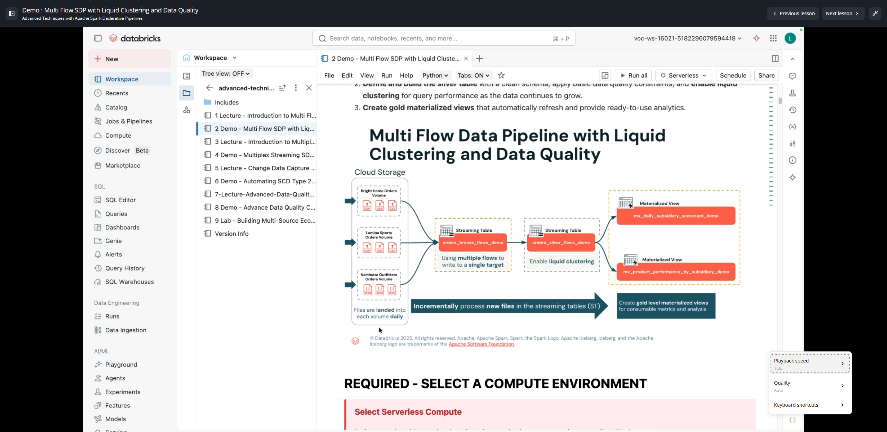
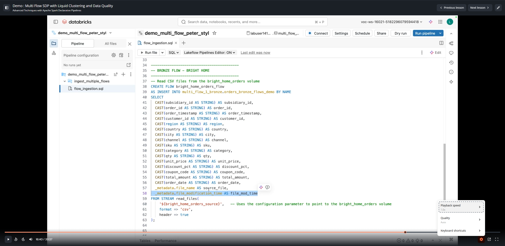

# Lesson 3: Demo : Multi Flow SDP with Liquid Clustering and Data Quality

**Course:** Advanced Techniques with Apache Spark Declarative Pipelines  
**Type:** Video Demonstration (~20 mins)  
**Artifacts & Capturas:**
- `capturas/03_multi_flow_sdp_architecture.png`
- `capturas/03_bronze_streaming_table_definition.png`
- `capturas/03_create_flow_syntax.png`

---

## 1. Architectural Overview & Motivation

In enterprise data engineering architectures, organizations often ingest streaming or micro-batch data from multiple business units, subsidiaries, or external partner feeds that share a common entity structure (such as retail orders). 

Prior to Apache Spark Declarative Pipelines (Lakeflow / DLT Multi-Flow), ingesting multiple distinct sources into a single unified bronze table required complex orchestration or multiple separate pipelines merging downstream.

With **Multi Flow in Spark Declarative Pipelines (SDP)**:
- Multiple separate ingestion flows can target the **exact same bronze streaming table**.
- Each flow reads from its independent directory or streaming source using `read_files()`.
- Data is appended concurrently and deterministically using `CREATE FLOW ... AS INSERT INTO ... BY NAME`.



---

## 2. Bronze Streaming Table Definition

The target bronze table is defined once as a streaming table. Note the schema definition, comments, and critical table properties:

```sql
CREATE OR REPLACE STREAMING TABLE ${catalog}.${schema}.orders_bronze_flows_demo (
  order_id STRING COMMENT "Unique identifier for the order",
  customer_id STRING COMMENT "Unique identifier for the customer",
  order_date TIMESTAMP COMMENT "Timestamp when the order was placed",
  product_id STRING COMMENT "Unique identifier for the product ordered",
  quantity INT COMMENT "Number of units ordered",
  total_amount DOUBLE COMMENT "Total monetary value of the order",
  source_file STRING COMMENT "Metadata file name of the incoming source file",
  file_mod_time TIMESTAMP COMMENT "Metadata timestamp of file modification"
)
COMMENT "Creates a single bronze streaming table with orders from all subsidiaries using multiple flows."
TBLPROPERTIES (
  'pipelines.reset.allowed' = false
);
```

### Key Considerations:
1. **`pipelines.reset.allowed = false`**:
   - Setting this property ensures that if someone triggers a full pipeline reset, this table is protected from being accidentally dropped and recomputed from scratch, preserving historical raw events.
2. **Schema Uniformity**:
   - All columns and types are explicitly declared, establishing a clear contract for all incoming subsidiary flows.

---

## 3. Creating Multi Flows with `INSERT INTO ... BY NAME`

To feed data from each subsidiary into the single streaming table, individual flows are defined using `CREATE FLOW`:

```sql
-- Flow 1: Bright Home Orders Ingestion Flow
CREATE FLOW bright_home_orders_flow
AS INSERT INTO ${catalog}.${schema}.orders_bronze_flows_demo BY NAME
SELECT
  order_id,
  customer_id,
  order_date,
  product_id,
  quantity,
  total_amount,
  _metadata.file_name AS source_file,
  _metadata.file_modification_time AS file_mod_time
FROM STREAM read_files(
  '${bright_home_orders_source}',
  format => 'csv',
  header => true
);

-- Flow 2: Pro Cook Orders Ingestion Flow
CREATE FLOW pro_cook_orders_flow
AS INSERT INTO ${catalog}.${schema}.orders_bronze_flows_demo BY NAME
SELECT
  order_id,
  customer_id,
  order_date,
  product_id,
  quantity,
  total_amount,
  _metadata.file_name AS source_file,
  _metadata.file_modification_time AS file_mod_time
FROM STREAM read_files(
  '${pro_cook_orders_source}',
  format => 'csv',
  header => true
);

-- Flow 3: Clear View Orders Ingestion Flow
CREATE FLOW clear_view_orders_flow
AS INSERT INTO ${catalog}.${schema}.orders_bronze_flows_demo BY NAME
SELECT
  order_id,
  customer_id,
  order_date,
  product_id,
  quantity,
  total_amount,
  _metadata.file_name AS source_file,
  _metadata.file_modification_time AS file_mod_time
FROM STREAM read_files(
  '${clear_view_orders_source}',
  format => 'csv',
  header => true
);
```



### Key Syntax Elements:
- `CREATE FLOW <flow_name>`: Uniquely identifies each ingestion pipeline branch in the pipeline DAG.
- `INSERT INTO <target_table> BY NAME`: Allows columns to be matched by column name rather than positional order, preventing column transposition bugs if source schemas diverge.
- `_metadata.file_name` & `_metadata.file_modification_time`: Built-in hidden file metadata columns provided by Cloud Files / Auto Loader `read_files()`.

---

## 4. Pipeline Parameters & Lakeflow Pipeline Execution

In the Databricks Lakeflow Pipelines UI:
- Input path parameters (`${bright_home_orders_source}`, `${pro_cook_orders_source}`, `${clear_view_orders_source}`) are passed via pipeline configuration settings as key-value pairs.
- Target catalog and schema (`${catalog}`, `${schema}`) are parameterized for multi-environment deployment (dev/staging/prod).
- The pipeline DAG displays three separate flow source boxes converging into the single `orders_bronze_flows_demo` streaming table node.
