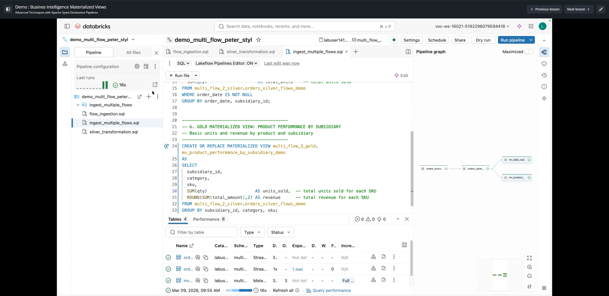

# Lesson 5: Demo : Business Intelligence Materialized Views

**Course:** Advanced Techniques with Apache Spark Declarative Pipelines  
**Type:** Video Demonstration (~4 mins)  
**Artifacts & Capturas:**
- `capturas/05_gold_mv_60s.png`
- `capturas/05_gold_mv_120s.png`
- `capturas/05_gold_mv_180s.png`

---

## 1. Objectives & Role of Gold Materialized Views (MVs)

The Gold layer transforms clean Silver events into business-level aggregates, dimensional models, and curated reporting datasets ready for Business Intelligence (BI) tools (such as Databricks AI/BI Dashboards, Power BI, or Tableau).

In Spark Declarative Pipelines (SDP / Lakeflow):
- **Streaming Tables vs Materialized Views:**
  - Streaming tables (`CREATE STREAMING TABLE`) process append-only streaming inputs incrementally using structured streaming.
  - Materialized views (`CREATE MATERIALIZED VIEW`) execute complex SQL (e.g. `GROUP BY`, `DISTINCT`, window functions, joins) and are refreshed either incrementally or via full recompute based on query semantics and upstream updates.
- **Incrementalization:**
  - Materialized views compute incrementally whenever possible. On initial creation or schema evolution, Databricks performs a `Full recompute`. Subsequent refreshes with new data apply incremental changes.

---

## 2. Complete SQL Implementation (`gold_mvs.sql`)

```sql
-- a. GOLD MATERIALIZED VIEW: DAILY SUBSIDIARY SCORECARD
-- Simple daily summary by subsidiary with order metrics
CREATE OR REPLACE MATERIALIZED VIEW ${catalog}.multi_flow_3_gold.mv_daily_subsidiary_scorecard_demo
AS
SELECT
  order_date,
  subsidiary_id,
  COUNT(DISTINCT order_id)    AS order_count,  -- how many unique orders occurred
  ROUND(SUM(total_amount), 2) AS total_revenue, -- total revenue for the day
  SUM(qty)                    AS total_units   -- total units sold
FROM ${catalog}.multi_flow_2_silver.orders_silver_flows_demo
WHERE order_date IS NOT NULL
GROUP BY order_date, subsidiary_id;

-- b. GOLD MATERIALIZED VIEW: PRODUCT PERFORMANCE BY SUBSIDIARY
-- Basic units and revenue by product category, SKU, and subsidiary
CREATE OR REPLACE MATERIALIZED VIEW ${catalog}.multi_flow_3_gold.mv_product_performance_by_subsidiary_demo
AS
SELECT
  subsidiary_id,
  category,
  sku,
  SUM(qty)                    AS units_sold,   -- total units sold for each SKU
  ROUND(SUM(total_amount), 2) AS revenue       -- total revenue for each SKU
FROM ${catalog}.multi_flow_2_silver.orders_silver_flows_demo
GROUP BY subsidiary_id, category, sku;
```

---

## 3. Pipeline DAG & Execution Behavior



1. **DAG Representation:**
   - In the Lakeflow Pipeline visual editor, `orders_bronze_flows_demo` streams into `orders_silver_flows_demo`, which fans out concurrently into both Gold Materialized Views:
     - `mv_daily_subsidiary_scorecard_demo`
     - `mv_product_performance_by_subsidiary_demo`
2. **Inspection via Tables Tab:**
   - Under the pipeline **Tables** pane, users can customize visible columns using the **Show and hide columns** icon.
   - Enabling the **Incrementalization** column reveals whether each dataset executed via:
     - `Incremental`
     - `Full recompute` (standard on initial table/view creation)
