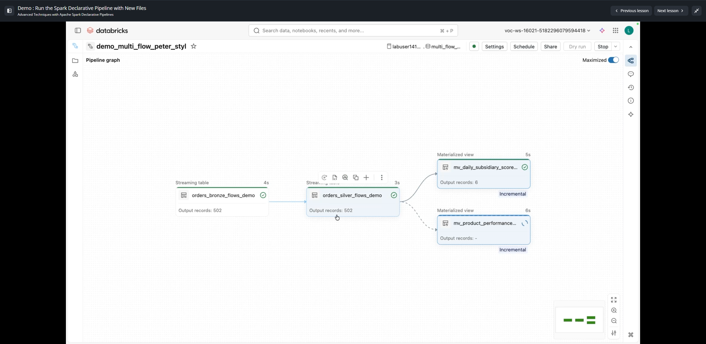

# Lesson 6: Demo : Run the Spark Declarative Pipeline with New Files

**Course:** Advanced Techniques with Apache Spark Declarative Pipelines  
**Type:** Video Demonstration (~5.4 mins)  
**Artifacts & Capturas:**
- `capturas/06_new_files_60s.png`
- `capturas/06_new_files_150s.png`
- `capturas/06_new_files_250s.png`

---

## 1. Objectives & Incremental Processing Demonstration

This demonstration proves the end-to-end incremental behavior of Apache Spark Declarative Pipelines across all three Medallion tiers when new raw data files arrive in object storage (Unity Catalog Volumes):
1. Detecting new raw drops across multiple distinct subsidiary directories.
2. Ingesting only newly arrived records without reprocessing historical files.
3. Automatically propagating updates through Bronze streaming tables, Silver streaming tables, and incrementally updating downstream Gold Materialized Views.

---

## 2. Ingestion of New Daily Drops

Three new daily batch files (`2025-11-02`) arrive in the respective subsidiary volumes:

| Subsidiary Volume | Inbound File Name | Format | New Records |
|---|---|---|---|
| `bright_home_orders` | `bsh_orders_2025-11-02.csv` | CSV | 191 |
| `lumina_sports_orders` | `lms_orders_2025-11-02.csv` | CSV | 170 |
| `northstar_outfitters_orders` | `nso_orders_2025-11-02.json` | JSON | 141 |
| **TOTAL NEW RECORDS** | | | **502** |

---

## 3. Pipeline Execution & Incremental Propagation



When clicking **Run pipeline**:
1. **Bronze Tier (`orders_bronze_flows_demo`):**
   - Each flow (`bright_home_orders_flow`, `pro_cook_orders_flow`, `clear_view_orders_flow`) checks its source directory checkpoint.
   - Only the new files are picked up. Exactly **502 output records** are appended into the Bronze streaming table.
2. **Silver Tier (`orders_silver_flows_demo`):**
   - Read via structured streaming (`FROM STREAM ...`).
   - Processes the 502 new records, validates data quality expectations (`qty >= 0`, `total_amount >= 0`, `order_timestamp IS NOT NULL`), and appends 502 clean rows.
3. **Gold Tier (`mv_daily_subsidiary_scorecard_demo` & `mv_product_performance_by_subsidiary_demo`):**
   - Both Materialized Views display the **`Incremental`** execution badge.
   - Rather than re-reading the entire table, Databricks leverages the Delta Change Data Feed / change metadata to calculate delta aggregates, updating the daily summaries in seconds.

---

## 4. Verification Queries

```sql
-- Verify raw ingestion breakdown across source files in Bronze
SELECT source_file, count(*) AS TotalRows
FROM ${catalog}.multi_flow_1_bronze.orders_bronze_flows_demo
GROUP BY source_file
ORDER BY source_file;
```

This confirms exactly which batch files contributed to the Bronze table and guarantees end-to-end auditability from raw storage to final analytics.
