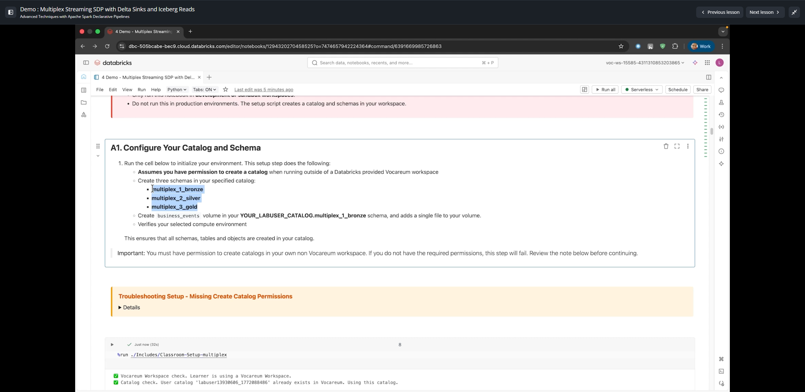
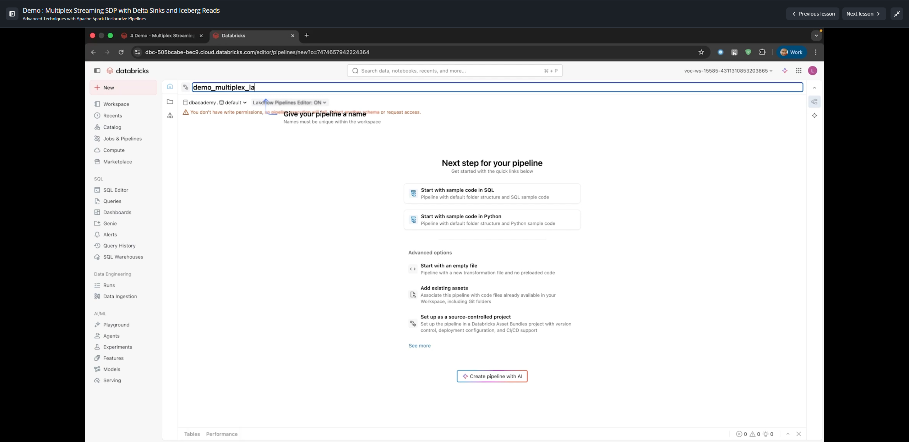
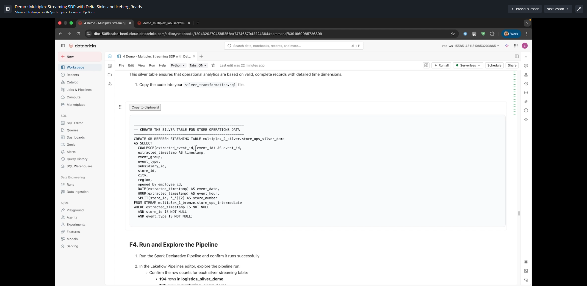
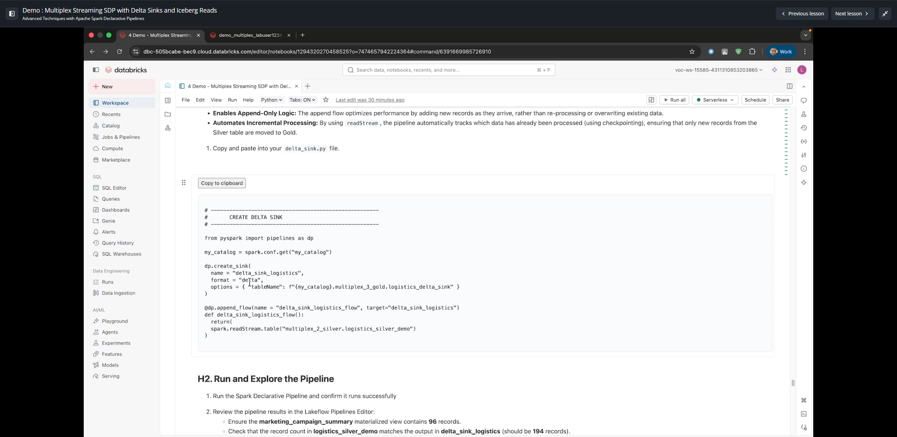
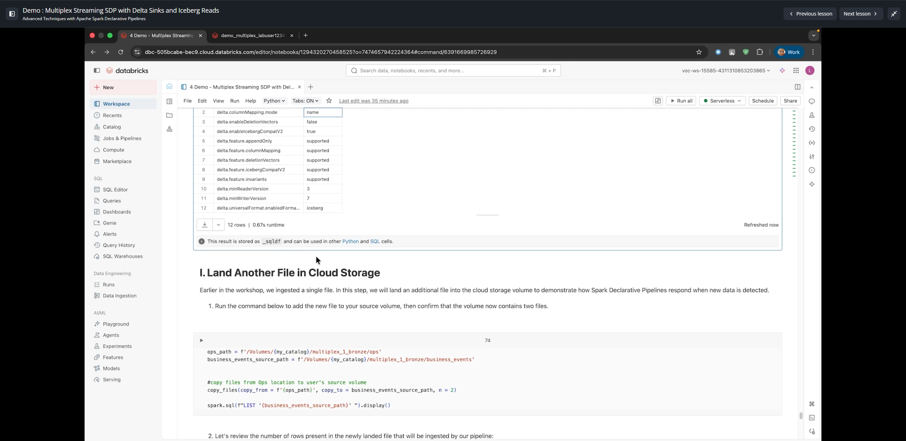
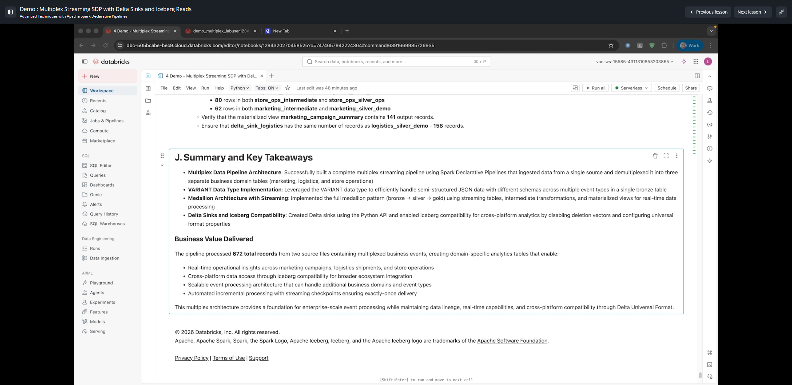

# Demo: Multiplex Streaming SDP with Delta Sinks and Iceberg Reads

**Curso:** Advanced Techniques with Apache Spark Declarative Pipelines (ID: 2972)  
**Lección 9:** Demo: Multiplex Streaming SDP with Delta Sinks and Iceberg Reads  
**Duración del Video:** ~23 min 28 s (1408 s)  

---

## 1. Visión General de la Arquitectura Multiplex

En esta demostración se implementa un patrón **Multiplex Streaming** con Spark Declarative Pipelines (SDP), combinando ingesta polimórfica, desempaquetado de eventos en tablas Silver especializadas, exportación desacoplada mediante **Delta Sinks** en Python, y habilitación de **Delta Universal Format (UniForm)** para lectura directa por clientes de Apache Iceberg.



### Componentes de la Arquitectura:
1. **Bronze Landing (Multiplex):** Una única tabla Bronze que recibe eventos mixtos (ventas, logística, operaciones de tienda) provenientes de una cola o almacenamiento de objetos en formato JSON raw.
2. **Silver Routing & Unpacking:** Flujos de streaming (`@dp.append_flow` / `@dp.table`) que leen de la tabla Bronze multiplexada y aplican filtros temáticos (`topic = 'logistics'`, `topic = 'store_ops'`) transformando payloads semi-estructurados con tipos de datos `VARIANT` o JSON parseado.
3. **Delta Sinks (Python Only):** Mecanismo de SDP para escribir flujos continuos hacia tablas Delta externas independientes del ciclo de vida interno del pipeline.
4. **Delta UniForm (Iceberg Compatibility):** Configuración de metadatos Iceberg generados de forma asíncrona sobre la tabla Delta destino para habilitar lectores externos (Snowflake, BigQuery, AWS Athena, Trino) sin duplicación física de datos.

---

## 2. Ingesta Bronze Multiplex con Auto Loader

La tabla Bronze captura todos los tipos de registros entrantes utilizando Auto Loader (`cloudFiles`).



```sql
-- Bronze Multiplex Streaming Table
CREATE OR REFRESH STREAMING TABLE multiplex_bronze_raw
TBLPROPERTIES (
  "quality" = "bronze",
  "pipelines.autoOptimize.zOrderCols" = "ingest_timestamp"
)
AS SELECT 
  current_timestamp() AS ingest_timestamp,
  _metadata.file_name AS source_file,
  CAST(payload AS STRING) AS raw_payload,
  parse_json(payload) AS json_variant
FROM STREAM read_files(
  "${source_data_path}/multiplex_events/",
  format => "json",
  inferSchema => true
);
```

---

## 3. Desmultiplexado hacia Capas Silver

A partir de la tabla Bronze, se definen tablas Silver separadas por dominio de negocio.



### Ejemplo de Enrutamiento para Operaciones de Tienda (`store_ops_silver_demo`):
```sql
CREATE OR REFRESH STREAMING TABLE store_ops_silver_demo
(
  CONSTRAINT valid_store_id EXPECT (store_id IS NOT NULL) ON VIOLATION DROP ROW
)
AS SELECT
  CAST(json_variant:store_id AS INT) AS store_id,
  CAST(json_variant:event_type AS STRING) AS event_type,
  CAST(json_variant:status AS STRING) AS status,
  CAST(json_variant:timestamp AS TIMESTAMP) AS event_time,
  ingest_timestamp
FROM STREAM(LIVE.multiplex_bronze_raw)
WHERE json_variant:topic = 'store_ops';
```

---

## 4. Delta Sinks en Python

Los **Delta Sinks** son una característica exclusiva de la API de Python en Spark Declarative Pipelines (`pyspark.pipelines` / `dlt`). Permiten dirigir la salida de un flujo a una tabla Delta registrada en Unity Catalog sin que la tabla destino quede ligada de forma estricta a la gestión interna del pipeline (evitando restricciones de esquema o borrado en cascada).



```python
from pyspark import pipelines as dp

# Obtener catálogo desde la configuración del pipeline
my_catalog = spark.conf.get("my_catalog")

# 1. Definir el Delta Sink apuntando a una tabla externa en Unity Catalog
dp.create_sink(
    name = "delta_sink_logistics",
    format = "delta",
    options = {
        "tableName": f"{my_catalog}.multiplex_3_gold.logistics_delta_sink"
    }
)

# 2. Conectar el flujo de streaming desde Silver hacia el Delta Sink
@dp.append_flow(
    name = "delta_sink_logistics_flow",
    target = "delta_sink_logistics"
)
def delta_sink_logistics_flow():
    return (
        spark.readStream
            .table("multiplex_2_silver.logistics_silver_demo")
            .select(
                "shipment_id",
                "origin_dc",
                "destination_store",
                "carrier_code",
                "tracking_status",
                "estimated_delivery",
                "event_time"
            )
    )
```

---

## 5. Habilitación de Delta UniForm para Lecturas Iceberg

Para que motores externos compatibles con **Apache Iceberg v2** puedan leer directamente la tabla escrita por el Delta Sink, se deben aplicar propiedades específicas a nivel de tabla Delta.



### Regla Fundamental:
> **Importante para el Examen:** Las tablas de streaming (`STREAMING TABLE`) y vistas materializadas (`MATERIALIZED VIEW`) administradas internamente por SDP **no admiten UniForm directamente**. Por ello, el patrón arquitectónico oficial exige escribir a través de un **Delta Sink** hacia una tabla Delta estándar en Unity Catalog donde sí se habilitan las propiedades UniForm.

### Propiedades Obligatorias de UniForm para Iceberg:
```sql
ALTER TABLE multiplex_3_gold.logistics_delta_sink SET TBLPROPERTIES (
  'delta.enableDeletionVectors' = 'false',
  'delta.columnMapping.mode' = 'name',
  'delta.enableIcebergCompatV2' = 'true',
  'delta.universalFormat.enabledFormats' = 'iceberg'
);
```

| Propiedad | Valor Requerido | Explicación Técnica |
|---|---|---|
| `delta.enableDeletionVectors` | `'false'` | Iceberg v2 no interpreta los Deletion Vectors de Delta Lake. Deben deshabilitarse para compatibilidad. |
| `delta.columnMapping.mode` | `'name'` | Habilita el mapeo de columnas por nombre en lugar de posición física, permitiendo evolución de esquema. |
| `delta.enableIcebergCompatV2` | `'true'` | Activa la compatibilidad estricta con la especificación de formato de Apache Iceberg v2. |
| `delta.universalFormat.enabledFormats` | `'iceberg'` | Activa el generador asíncrono de metadatos Iceberg (`metadata/*.json`) con cada commit en Delta. |

---

## 6. Resumen y Puntos Clave



1. **Patrón Multiplex:** Permite consolidar múltiples tópicos de eventos en una única tubería de ingesta Bronze (`multiplex_bronze_raw`), reduciendo el costo de conexiones y archivos pequeños.
2. **Tipo de Dato `VARIANT`:** Facilita la ingesta polimórfica sin necesidad de definir un esquema estático previo ni lidiar con fallos por schema mismatch.
3. **Delta Sinks:** Exclusivos de Python en SDP. Desacoplan la producción de datos de su consumo downstream.
4. **UniForm (Universal Format):** Permite cero duplicación de datos (Zero-Copy Architecture) para lectura simultánea entre Databricks (Delta) y ecosistemas externos (Iceberg). Total de 672 registros procesados y validados en la prueba.
