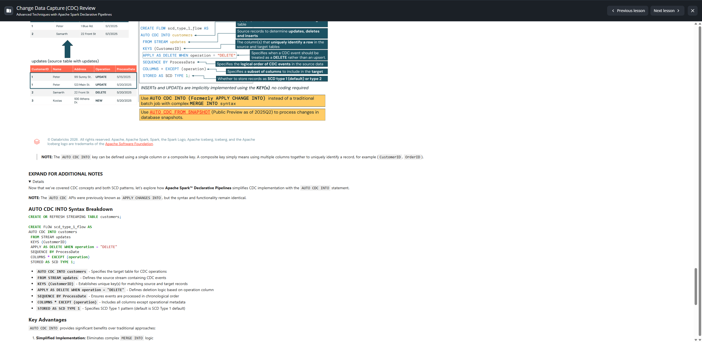

# Lecture: Change Data Capture (CDC) Review

**Curso:** Advanced Techniques with Apache Spark Declarative Pipelines (ID: 2972)  
**Lección 10:** Change Data Capture (CDC) Review  
**Tipo de Contenido:** SCORM / Interactive Lecture  

---

## Visión General y Objetivos de Aprendizaje

Esta lección proporciona una revisión exhaustiva de los conceptos y patrones de implementación de **Change Data Capture (CDC)** en el Lakehouse. Se analiza cómo CDC permite la sincronización de datos en tiempo real y los diferentes enfoques para manejar datos cambiantes.



### Objetivos de Aprendizaje:
Al finalizar esta lección, serás capaz de:
- **Definir** Change Data Capture (CDC) y explicar su rol en la sincronización de datos.
- **Distinguir** entre los patrones SCD Tipo 1 (SCD Type 1) y SCD Tipo 2 (SCD Type 2) y sus casos de uso.
- **Analizar** cómo SCD Tipo 1 sobrescribe los datos existentes mientras que SCD Tipo 2 preserva el historial completo.
- **Identificar** cuándo utilizar cada tipo de SCD con base en los requerimientos del negocio.
- **Reconocer** cómo `AUTO CDC INTO` simplifica la implementación de CDC en Apache Spark Declarative Pipelines (SDP / Lakeflow).

---

## A. ¿Qué es Change Data Capture (CDC)?

Change Data Capture (CDC) es una técnica utilizada para rastrear y capturar cambios en fuentes de datos (bases de datos relacionales, Lakehouses, data warehouses) y luego aplicar dichos cambios a una tabla destino para garantizar que refleje el estado más reciente de la fuente.

### Slowly Changing Dimensions (SCDs)
CDC está estrechamente ligado al concepto de **Dimensiones de Cambio Lento (Slowly Changing Dimensions - SCDs)**, que describen cómo se gestionan los cambios históricos en el sistema de destino.
- **SCD Tipo 1:** Sobrescribe los datos existentes con nuevos valores (sin seguimiento de historial).
- **SCD Tipo 2:** Preserva el historial almacenando versiones previas de los registros con columnas de validez temporal.

### Ejemplo en el Mundo Real:
En una tabla de `clientes`, se agregan nuevos clientes, se actualiza la información de clientes existentes (como dirección o teléfono) o se eliminan clientes. CDC asegura que esos cambios fluyan hacia la tabla destino utilizando la lógica adecuada de SCD Tipo 1 o Tipo 2.

---

## B. Slowly Changing Dimensions (SCD) Tipo 1

### B1. SCD Tipo 1 - Concepto General
SCD Tipo 1 actualiza la tabla destino **sobrescribiendo las filas existentes** con los valores más recientes. No se mantiene ningún historial de versiones: únicamente importa el estado actual.

#### Características Clave:
- **Actualizaciones (Updates):** Cuando un registro se actualiza por su(s) clave(s), la fila existente se reemplaza con los nuevos valores.
- **Eliminaciones (Deletes):** Cuando un registro se elimina por su(s) clave(s), se remueve de la tabla destino.
- **Solo Estado Actual:** Se almacena únicamente la versión más reciente de cada registro.
- **Sin Historial:** Los cambios previos y versiones históricas se pierden.

#### Escenario de Ejemplo:
- **Tabla Destino (`customers`):**
  | CustomerID | Name | Address | ProcessDate |
  |---|---|---|---|
  | 1 | Peter | 1 Blue Rd. | 5/1/2025 |
  | 2 | Samarth | 22 Front St | 5/1/2025 |

- **Actualizaciones Entrantes (Source Updates):**
  - **Update:** Peter tiene dos actualizaciones de dirección (5/15 y 5/20) para `customer_id = 1`.
  - **Delete:** Samarth solicita eliminación de cuenta (`customer_id = 2`).
  - **Insert:** Nuevo cliente Kostas se une (`customer_id = 3`).

### B2. SCD Tipo 1 - Implementación y Reglas de Ingesta
Al aplicar SCD Tipo 1:
1. **Peter (CustomerID 1):** De las actualizaciones del 5/15 y 5/20, solo se aplica la última (5/20 con dirección `123 Main St.`). El historial anterior se sobrescribe.
2. **Samarth (CustomerID 2):** Se elimina toda la fila de la tabla destino. No queda rastro del cliente.
3. **Kostas (CustomerID 3):** Se inserta como una nueva fila.

> **NOTA CRÍTICA PARA EL EXAMEN:**  
> Al ingerir una fila `DELETE` usando `AUTO CDC INTO` (o `APPLY CHANGES INTO`), las columnas que no forman parte de la clave pueden contener valores `NULL`. Las columnas de clave requeridas (`KEYS`) **siempre deben estar pobladas**, ya que se utilizan para identificar la fila a eliminar.

#### Cuándo usar SCD Tipo 1:
- Solo se necesita el estado actual de los datos.
- Se prioriza la eficiencia de almacenamiento.
- El cumplimiento regulatorio no exige pistas de auditoría histórica.

---

## C. Slowly Changing Dimensions (SCD) Tipo 2

### C1. Principios Fundamentales
SCD Tipo 2 introduce **seguimiento histórico y versionado** de registros, preservando una pista de auditoría completa de todos los cambios a lo largo del tiempo.

- **Preservación Histórica:** El registro antiguo se conserva con columnas de metadatos que indican su período de validez.
- **Creación de Nueva Versión:** Se inserta un nuevo registro con la información actualizada.
- **Soft Deletes (Borrado Lógico):** Los registros eliminados permanecen en la tabla pero se marcan como inactivos.

### Columnas de Metadatos Añadidas Automáticamente:
- `__START_AT`: Marca temporal (timestamp) en la que la fila se volvió activa.
- `__END_AT`: Marca temporal en la que la fila dejó de estar activa.
  - Valor `NULL`: Registro actualmente activo y vigente.
  - Valor no `NULL`: Registro histórico / inactivo.

### Desglose del Ejemplo con SCD Tipo 2:
1. **Peter (CustomerID 1):** Existen dos registros en la tabla final:
   - Registro Activo: Dirección actual con `__END_AT = NULL`.
   - Registro Histórico: Dirección anterior con `__END_AT` poblado con la fecha del cambio.
2. **Samarth (CustomerID 2):**
   - El borrado se procesa como un *soft delete*.
   - El registro original permanece en la tabla, pero su columna `__END_AT` se llena con la marca temporal de eliminación.
   - No se crea una fila nueva.
3. **Kostas (CustomerID 3):**
   - Inserción de nuevo cliente: crea un registro activo con `__START_AT` con su fecha de alta y `__END_AT = NULL`.

#### Valor de Negocio:
Permite análisis punto en el tiempo (*point-in-time analysis*), reconstrucción exacta de dimensiones pasadas y auditoría regulatoria estricta.

---

## D. Implementación de CDC con `AUTO CDC INTO` en Spark Declarative Pipelines

> **NOTA HISTÓRICA Y DE SINTAXIS:**  
> Las APIs de `AUTO CDC` se conocían anteriormente como `APPLY CHANGES INTO`. La sintaxis y funcionalidad son idénticas y totalmente retrocompatibles.

### Sintaxis Completa en SQL:
```sql
-- 1. Declarar la tabla destino de streaming
CREATE OR REFRESH STREAMING TABLE customers;

-- 2. Declarar el flujo de CDC
CREATE FLOW scd_type_1_flow AS
AUTO CDC INTO customers
FROM STREAM updates
KEYS (CustomerID)
APPLY AS DELETE WHEN operation = "DELETE"
SEQUENCE BY ProcessDate
COLUMNS * EXCEPT (operation)
STORED AS SCD TYPE 1;
```

### Desglose de Cláusulas:
- `AUTO CDC INTO customers`: Especifica la tabla destino sobre la cual se aplicarán los cambios.
- `FROM STREAM updates`: Define el flujo/stream de origen con los eventos CDC.
- `KEYS (CustomerID)`: Establece la columna o columnas clave (puede ser clave simple o compuesta como `(CustomerID, OrderID)`).
- `APPLY AS DELETE WHEN operation = "DELETE"`: Condición que activa la eliminación de la fila.
- `SEQUENCE BY ProcessDate`: Columna que garantiza el orden cronológico de procesamiento, resolviendo llegadas fuera de orden (*out-of-order events*).
- `COLUMNS * EXCEPT (operation)`: Proyecta todas las columnas hacia la tabla destino, excluyendo metadatos operacionales que no deben persistirse.
- `STORED AS SCD TYPE 1` (o `STORED AS SCD TYPE 2`): Define el patrón dimensional. Si se omite, el valor predeterminado es `SCD TYPE 1`.

---

## E. Cuadro Comparativo y Marco de Decisión

| Criterio | SCD Tipo 1 | SCD Tipo 2 |
|---|---|---|
| **Estrategia** | Sobrescribe datos existentes | Inserta nuevas versiones |
| **Historial** | No conserva historial (solo estado actual) | Auditoría e historial completo |
| **Almacenamiento** | Mínimo y compacto | Crece proporcionalmente al volumen de cambios |
| **Manejo de Deletes** | Eliminación física (Hard delete) | Eliminación lógica con `__END_AT` (Soft delete) |
| **Columnas de Control** | Ninguna adicional requerida | `__START_AT`, `__END_AT` generadas automáticamente |
| **Uso Ideal** | Corrección de errores, atributos donde el pasado no importa (ej. teléfono actual) | Dimensiones críticas de negocio, cumplimiento normativo, reportes temporales |

---

## F. Recursos y Próximos Pasos
- [The AUTO CDC APIs: Simplify change data capture with Apache Spark Declarative Pipelines](https://docs.databricks.com/aws/en/ldp/cdc)
- [AUTO CDC INTO (Apache Spark Declarative Pipelines SQL Reference)](https://docs.databricks.com/aws/en/ldp/developer/ldp-sql-ref-apply-changes-into)
- **Siguiente Lección:** *Demo - Automating SCD Type 2 with AUTO CDC in Apache Spark Declarative Pipelines part 1*.
