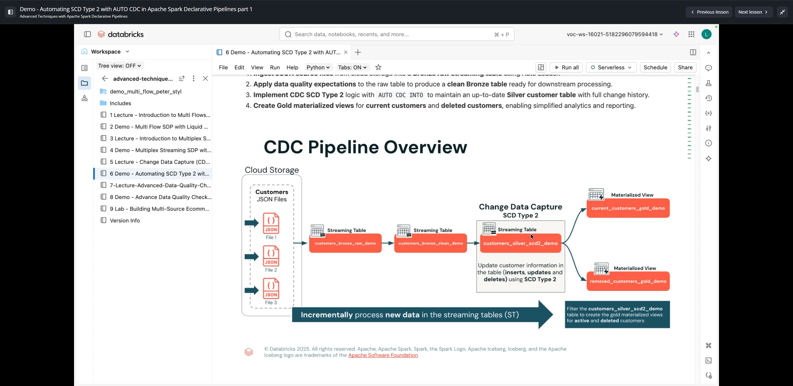
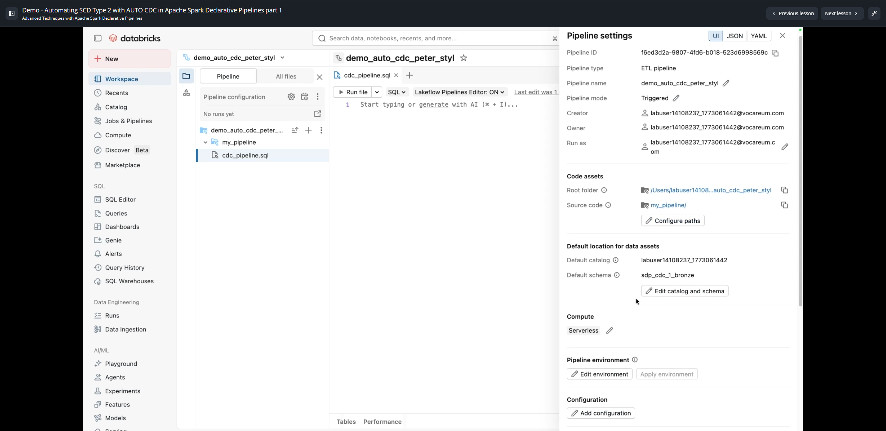
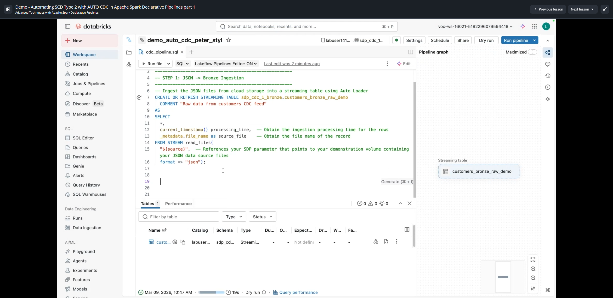
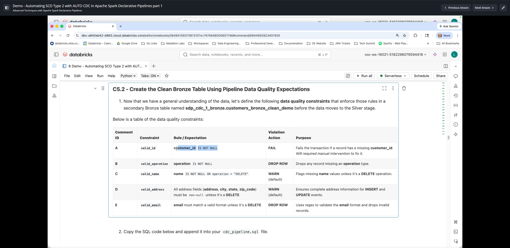
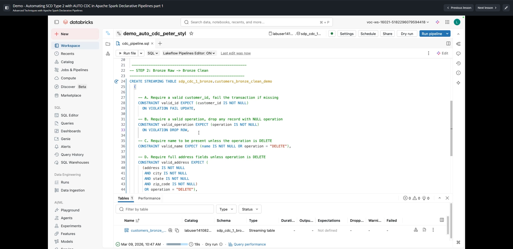
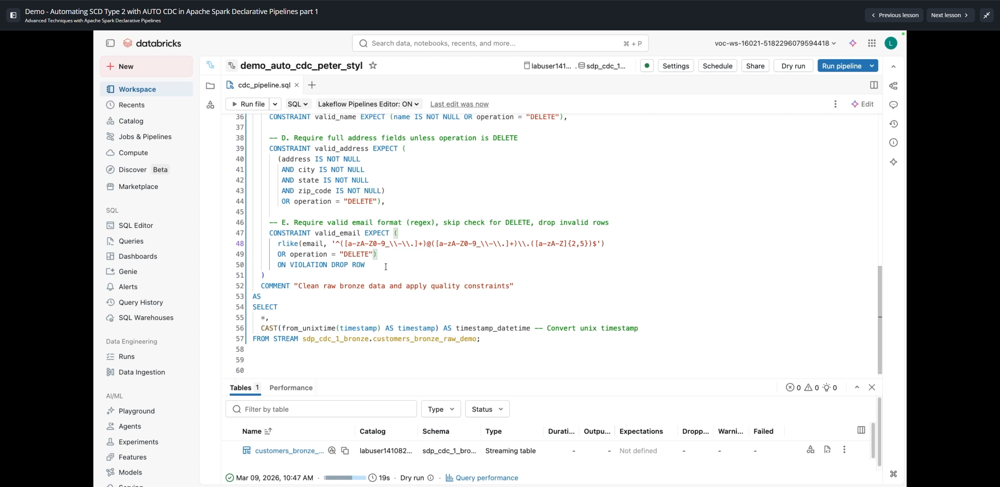

# Demo: Automating SCD Type 2 with AUTO CDC in Apache Spark Declarative Pipelines (Part 1)

**Curso:** Advanced Techniques with Apache Spark Declarative Pipelines (ID: 2972)  
**Lección 11:** Demo - Automating SCD Type 2 with AUTO CDC in Apache Spark Declarative Pipelines part 1  
**Duración del Video:** ~14 min 22 s (862 s)  

---

## 1. Visión General de la Arquitectura del Pipeline CDC

En esta primera parte de la demostración, se diseña un pipeline integral de Change Data Capture (CDC) en Databricks utilizando **Lakeflow Pipelines Editor** y **Spark Declarative Pipelines (SDP)**.



### Flujo de Datos Arquitectónico:
1. **Cloud Storage (Archivos JSON de Clientes):** Archivos incrementales con operaciones de inserción, actualización y eliminación (`File 1`, `File 2`, `File 3`).
2. **Bronze Raw Streaming Table (`customers_bronze_raw_demo`):** Ingesta continua mediante Auto Loader (`read_files` con formato JSON).
3. **Bronze Clean Streaming Table (`customers_bronze_clean_demo`):** Aplicación de expectativas de calidad de datos (Data Quality Expectations) con distintas acciones ante violaciones (`FAIL UPDATE`, `DROP ROW`, advertencias por omisión).
4. **Silver SCD Type 2 Streaming Table (`customers_silver_scd2_demo`):** Procesamiento de cambios con `AUTO CDC INTO ... STORED AS SCD TYPE 2` (se profundiza en la Parte 2).
5. **Gold Materialized Views:**
   - `current_customers_gold_demo`: Vista materializada con los clientes actualmente activos (`__END_AT IS NULL`).
   - `removed_customers_gold_demo`: Vista materializada de clientes que solicitaron baja/eliminación.

---

## 2. Configuración en Lakeflow Pipelines Editor

Para construir el pipeline de forma visual y declarativa:
1. Desde la barra de navegación de Databricks, acceder a **Jobs & Pipelines** -> **Create -> ETL Pipeline**.
2. Habilitar **Lakeflow Pipelines Editor**.
3. Configuración inicial del pipeline:
   - **Pipeline Name:** `demo_auto_cdc_pipeline_<nombre>`
   - **Default Catalog:** Catálogo asignado (ej. `labuser_xxx`)
   - **Default Schema:** `sdp_cdc_1_bronze`
   - **Pipeline Mode:** Triggered (o Continuous según el caso de uso)
   - **Compute:** Serverless
4. Creación de la estructura de archivos en el workspace:
   - Directorio de código fuente: `my_pipeline/`
   - Archivo SQL declarativo: `cdc_pipeline.sql`



---

## 3. Paso 1: Ingesta Bronze Raw (`customers_bronze_raw_demo`)

Se ingieren los archivos JSON en streaming utilizando Auto Loader hacia una tabla Bronze raw, extrayendo metadatos del archivo de origen y la marca de tiempo de procesamiento.



```sql
-------------------------------------------------------------------------
-- STEP 1: JSON -> Bronze Ingestion
-------------------------------------------------------------------------

-- Ingest the JSON files from cloud storage into a streaming table using Auto Loader
CREATE OR REFRESH STREAMING TABLE sdp_cdc_1_bronze.customers_bronze_raw_demo
COMMENT "Raw data from customers CDC feed"
AS
SELECT
  *,
  current_timestamp() AS processing_time, -- Ingestion processing time for the rows
  _metadata.file_name AS source_file      -- File name of the source record
FROM STREAM read_files(
  "${source}",                            -- SDP parameter pointing to volume with JSON files
  format => "json"
);
```

---

## 4. Paso 2: Limpieza y Reglas de Calidad en Bronze Clean (`customers_bronze_clean_demo`)

Antes de enviar los datos al proceso CDC Silver, se filtran y validan los eventos en una tabla Bronze secundaria (`customers_bronze_clean_demo`).



### Matriz de Expectativas de Calidad de Datos:

| ID | Restricción (Constraint) | Regla / Expectativa SQL | Acción ante Violación | Justificación Técnica |
|---|---|---|---|---|
| **A** | `valid_id` | `customer_id IS NOT NULL` | **FAIL UPDATE** | Falla la transacción entera si falta la clave primaria. Requiere intervención manual antes de continuar. |
| **B** | `valid_operation` | `operation IS NOT NULL` | **DROP ROW** | Descarta cualquier registro que no especifique el tipo de operación (`INSERT`, `UPDATE`, `DELETE`). |
| **C** | `valid_name` | `name IS NOT NULL OR operation = "DELETE"` | **WARN** (Default) | Advierte sobre nombres nulos, pero permite que un evento `DELETE` no contenga nombre. |
| **D** | `valid_address` | `(address IS NOT NULL AND city IS NOT NULL AND state IS NOT NULL AND zip_code IS NOT NULL) OR operation = "DELETE"` | **WARN** (Default) | Garantiza dirección completa para `INSERT` y `UPDATE`. |
| **E** | `valid_email` | `rlike(email, '^[a-zA-Z0-9_\\-\\.]+)@([a-zA-Z0-9_\\-\\.]+)\\.([a-zA-Z]{2,5})$') OR operation = "DELETE"` | **DROP ROW** | Valida el formato mediante expresión regular y descarta registros mal formados, excepto si es `DELETE`. |




```sql
-------------------------------------------------------------------------
-- STEP 2: Bronze Raw -> Bronze Clean
-------------------------------------------------------------------------

CREATE STREAMING TABLE sdp_cdc_1_bronze.customers_bronze_clean_demo
(
  -- A. Require a valid customer_id, fail the transaction if missing
  CONSTRAINT valid_id EXPECT (customer_id IS NOT NULL)
  ON VIOLATION FAIL UPDATE,

  -- B. Require a valid operation, drop any record with NULL operation
  CONSTRAINT valid_operation EXPECT (operation IS NOT NULL)
  ON VIOLATION DROP ROW,

  -- C. Require name to be present unless the operation is DELETE
  CONSTRAINT valid_name EXPECT (name IS NOT NULL OR operation = "DELETE"),

  -- D. Require full address fields unless operation is DELETE
  CONSTRAINT valid_address EXPECT (
    (address IS NOT NULL
     AND city IS NOT NULL
     AND state IS NOT NULL
     AND zip_code IS NOT NULL)
    OR operation = "DELETE"
  ),

  -- E. Require valid email format (regex), skip check for DELETE, drop invalid rows
  CONSTRAINT valid_email EXPECT (
    rlike(email, '^[a-zA-Z0-9_\\-\\.]+)@([a-zA-Z0-9_\\-\\.]+)\\.([a-zA-Z]{2,5})$')
    OR operation = "DELETE"
  )
  ON VIOLATION DROP ROW
)
COMMENT "Clean raw bronze data and apply quality constraints"
AS
SELECT
  *,
  CAST(from_unixtime(timestamp) AS timestamp) AS timestamp_datetime -- Convert unix timestamp to TIMESTAMP
FROM STREAM sdp_cdc_1_bronze.customers_bronze_raw_demo;
```

---

## 5. Puntos Clave de la Lección
1. **Manejo Especial de Operaciones `DELETE` en Expectativas:** Las restricciones de calidad que validan atributos de payload (nombre, email, dirección) **deben incluir la excepción `OR operation = "DELETE"`**, dado que los emisores de CDC típicamente envían solo la clave primaria y el código de operación al solicitar una baja, enviando el resto de columnas como `NULL`.
2. **Nivel de Severidad según Impacto:**
   - Clave faltante -> `FAIL UPDATE` (detiene el pipeline para prevenir corrupción de datos en SCD).
   - Datos mal formados descartables -> `DROP ROW` (evita propagar basura a Silver).
   - Inconsistencias menores -> `WARN` (registra métricas sin detener el flujo).
3. **Transición a la Parte 2:** Con la tabla `customers_bronze_clean_demo` validada y limpia, la Parte 2 implementa el flujo `AUTO CDC INTO` con versionado histórico SCD Tipo 2.
