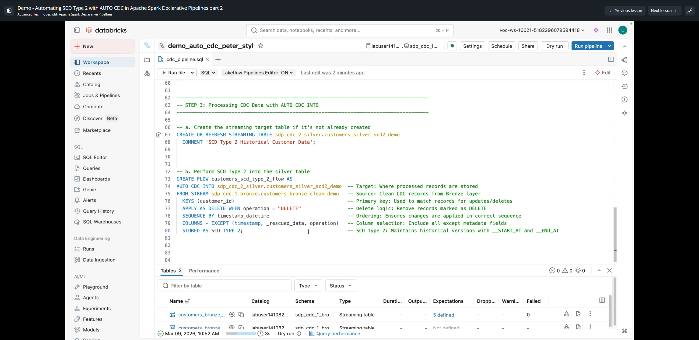
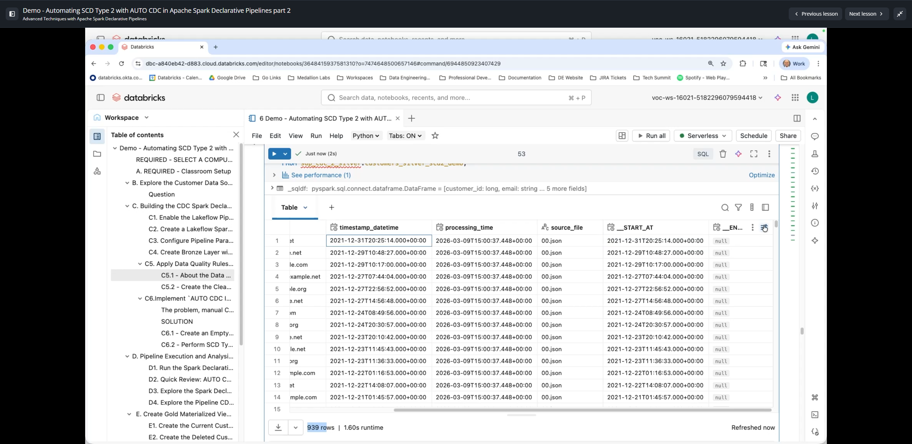
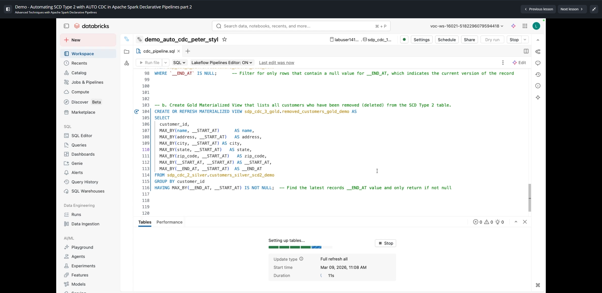
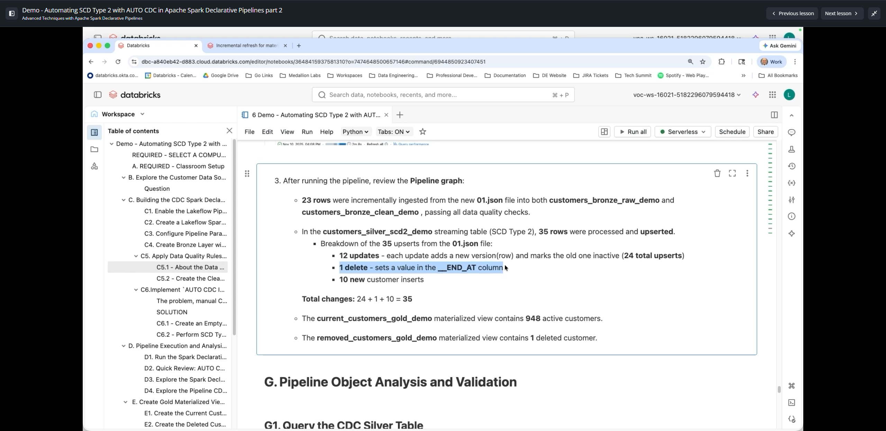
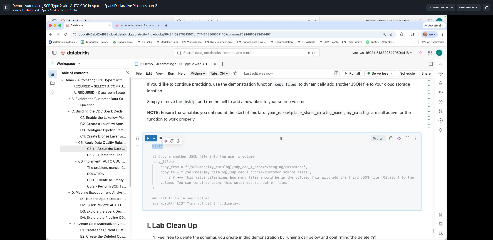

# Demo: Automating SCD Type 2 with AUTO CDC in Apache Spark Declarative Pipelines (Part 2)

**Curso:** Advanced Techniques with Apache Spark Declarative Pipelines (ID: 2972)  
**Lección 12:** Demo - Automating SCD Type 2 with AUTO CDC in Apache Spark Declarative Pipelines part 2  
**Duración del Video:** ~27 min (1620 s)  

---

## 1. Visión General de la Implementación SCD Tipo 2

En esta segunda parte, se implementa el motor de **Change Data Capture (CDC)** con seguimiento histórico (**SCD Tipo 2**) sobre la tabla Silver, y se construyen las vistas materializadas Gold para consumo analítico de clientes activos y eliminados.



---

## 2. Paso 3: Procesamiento CDC con `AUTO CDC INTO ... STORED AS SCD TYPE 2`

Para implementar SCD Tipo 2 en Spark Declarative Pipelines (SDP), se requieren dos elementos declarativos:
1. **La tabla destino de streaming:** Se declara mediante `CREATE OR REFRESH STREAMING TABLE`.
2. **El flujo de CDC:** Se declara mediante `CREATE FLOW <nombre_flujo> AS AUTO CDC INTO ... STORED AS SCD TYPE 2`.

```sql
-------------------------------------------------------------------------
-- STEP 3: Processing CDC Data with AUTO CDC INTO
-------------------------------------------------------------------------

-- a. Create the streaming target table if it's not already created
CREATE OR REFRESH STREAMING TABLE sdp_cdc_2_silver.customers_silver_scd2_demo
COMMENT 'SCD Type 2 Historical Customer Data';

-- b. Perform SCD Type 2 into the silver table
CREATE FLOW customers_scd_type_2_flow AS
AUTO CDC INTO sdp_cdc_2_silver.customers_silver_scd2_demo -- Target: Where processed records are stored
FROM STREAM sdp_cdc_1_bronze.customers_bronze_clean_demo   -- Source: Clean CDC records from Bronze layer
KEYS (customer_id)                                        -- Primary key: Used to match records for updates/deletes
APPLY AS DELETE WHEN operation = "DELETE"                 -- Delete logic: Soft delete records marked as DELETE
SEQUENCE BY timestamp_datetime                           -- Ordering: Ensures changes are applied in chronological sequence
COLUMNS * EXCEPT (timestamp, _rescued_data, operation)    -- Column selection: Exclude technical ingestion metadata
STORED AS SCD TYPE 2;                                     -- SCD Type 2: Maintains historical versions with __START_AT and __END_AT
```

### Comportamiento Automático de Columnas en SCD Tipo 2:
- Databricks añade automáticamente dos columnas de control temporal:
  - `__START_AT`: Marca temporal (`timestamp`) en la que la versión del registro entra en vigencia.
  - `__END_AT`: Marca temporal en la que la versión expira (`NULL` si es la versión actualmente vigente).
- Cuando llega un `UPDATE`: la fila anterior actualiza su `__END_AT` con la fecha del cambio, y se inserta una fila nueva con `__START_AT` igual a la fecha del cambio y `__END_AT = NULL`.
- Cuando llega un `DELETE`: la fila vigente actualiza su `__END_AT` con la fecha del evento de eliminación (**Soft Delete**). No se inserta ninguna fila nueva.



---

## 3. Paso 4: Capa Gold para Consumo Analítico

Para facilitar el consumo por analistas de BI y dashboards sin que tengan que lidiar con la complejidad de las columnas `__START_AT` y `__END_AT`, se definen dos **Materialized Views**:



### 4.1 Vista de Clientes Activos (`current_customers_gold_demo`)
Filtra únicamente las versiones vigentes (`__END_AT IS NULL`):
```sql
CREATE OR REFRESH MATERIALIZED VIEW sdp_cdc_3_gold.current_customers_gold_demo AS
SELECT *
FROM sdp_cdc_2_silver.customers_silver_scd2_demo
WHERE `__END_AT` IS NULL; -- Filter for only rows indicating the current active version
```

### 4.2 Vista de Clientes Eliminados con `MAX_BY` (`removed_customers_gold_demo`)
Recupera los clientes dados de baja y reconstruye sus atributos más recientes utilizando la función de agregación `MAX_BY`:

```sql
CREATE OR REFRESH MATERIALIZED VIEW sdp_cdc_3_gold.removed_customers_gold_demo AS
SELECT
  customer_id,
  MAX_BY(name, __START_AT) AS name,
  MAX_BY(address, __START_AT) AS address,
  MAX_BY(city, __START_AT) AS city,
  MAX_BY(state, __START_AT) AS state,
  MAX_BY(zip_code, __START_AT) AS zip_code,
  MAX_BY(__START_AT, __START_AT) AS __START_AT,
  MAX_BY(__END_AT, __START_AT) AS __END_AT
FROM sdp_cdc_2_silver.customers_silver_scd2_demo
GROUP BY customer_id
HAVING MAX_BY(__END_AT, __START_AT) IS NOT NULL; -- Find the latest record's __END_AT value and only return if deleted
```

> **PATRÓN DE EXAMEN (MAX_BY):**  
> En operaciones `DELETE` de CDC, los sistemas fuente frecuentemente envían únicamente la clave primaria (`customer_id`) y el indicador de operación, dejando en `NULL` el resto de atributos. Al usar `MAX_BY(address, __START_AT)` con `GROUP BY customer_id`, se rescata el último valor conocido no nulo correspondiente a la versión inmediatamente anterior a la baja.

---

## 4. Validación Incremental con Nuevos Archivos (`01.json`)

Al depositar el archivo incremental `01.json` en el volumen de origen:



- **23 registros entrantes en `01.json`:**
  - **12 actualizaciones (`UPDATE`):** Cada actualización genera 2 operaciones en la tabla SCD Tipo 2 (cerrar la versión previa actualizando `__END_AT` + insertar la nueva versión activa) -> **24 upserts**.
  - **1 eliminación (`DELETE`):** Cliente `23617` -> actualiza `__END_AT` de su fila activa -> **1 upsert**.
  - **10 nuevos clientes (`NEW`/`INSERT`):** Inserta nuevas filas con `__END_AT = NULL` -> **10 upserts**.
  - **Total de operaciones en Silver:** `24 + 1 + 10 = 35 upserts`.

### Verificación de Métricas Finales:
- **`customers_silver_scd2_demo`:** Mantiene el histórico completo con registros activos y cerrados.
- **`current_customers_gold_demo`:** Contiene **948 clientes activos**.
- **`removed_customers_gold_demo`:** Contiene exactamente **1 cliente eliminado**.



---

## 5. Resumen de Conceptos Clave para la Certificación
1. **Separación de Declaración de Tabla y Flujo:** `CREATE STREAMING TABLE` define la estructura física; `CREATE FLOW ... AUTO CDC INTO` define la lógica de mutación.
2. **Resolución de Llegada Fuera de Orden:** La cláusula `SEQUENCE BY timestamp_datetime` resuelve automáticamente eventos que lleguen desordenados por latencias de red.
3. **Manejo de Metadatos con `COLUMNS * EXCEPT (...)`:** Permite evitar la contaminación de la tabla Silver con columnas temporales de ingesta como `timestamp`, `_rescued_data` u `operation`.
4. **Arquitectura Medallion con SCD2:** Bronze almacena el historial append-only crudo; Silver aplica la lógica SCD Tipo 2; Gold expone vistas materializadas simplificadas para consultas analíticas rápidas.
