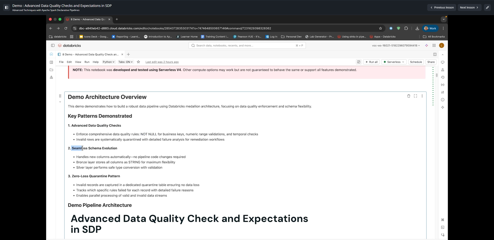
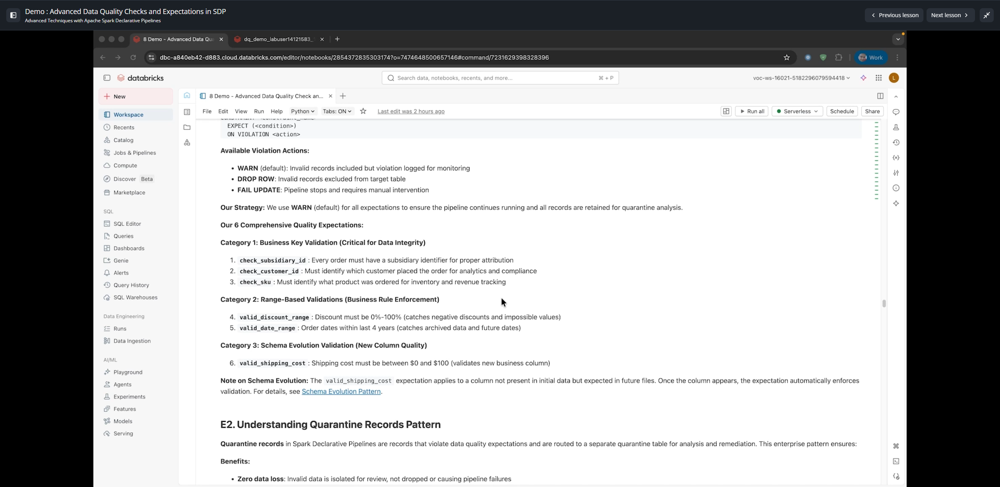
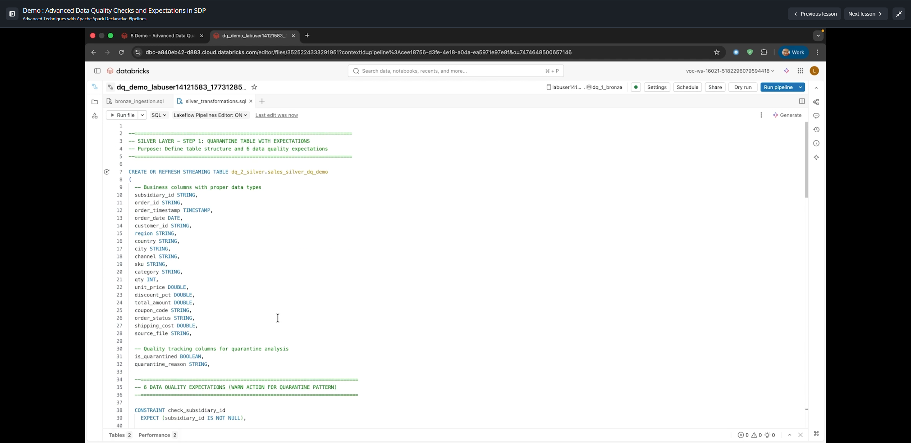
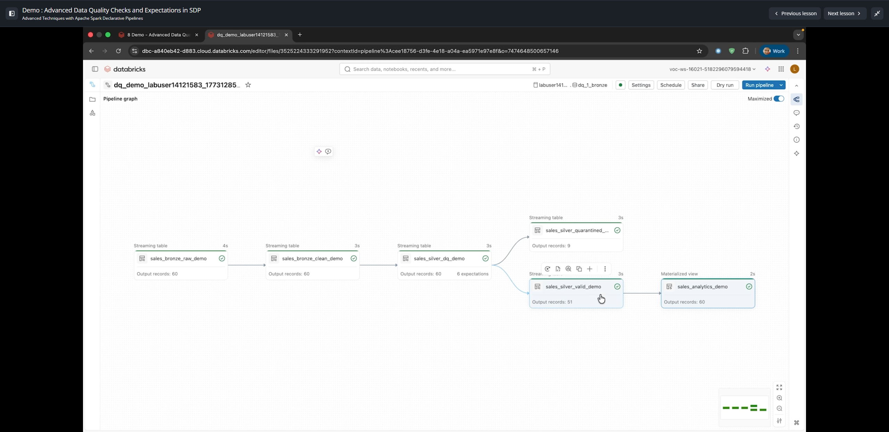
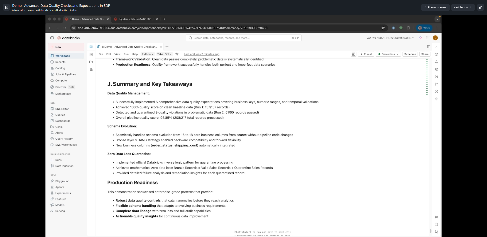

# Demo: Advanced Data Quality Checks and Expectations in SDP

**Curso:** Advanced Techniques with Apache Spark Declarative Pipelines (ID: 2972)  
**Lección 13:** Demo - Advanced Data Quality Checks and Expectations in SDP  
**Duración del Video:** ~29 min 10 s (1750 s)  

---

## 1. Visión General de la Arquitectura de Calidad de Datos

Esta lección demuestra la implementación de un marco empresarial de **calidad de datos avanzada** y **evolución de esquema sin fricción** bajo la arquitectura Medallion en Databricks, utilizando el patrón **Zero Data Loss Quarantine** (Cuarentena con Cero Pérdida de Datos).



### Patrones Clave Demostrados:
1. **Reglas de Calidad Avanzadas:** Validación de claves de negocio (`NOT NULL`), rangos numéricos y consistencia temporal.
2. **Evolución Transparente de Esquema (Schema Evolution):** Incorporación automática de nuevas columnas de negocio (`order_status`, `shipping_cost`) de 16 a 18 columnas sin modificar el código del pipeline.
3. **Patrón de Cuarentena con Cero Pérdida:** Los registros inválidos no se descartan a ciegas ni detienen el pipeline; se aíslan en una tabla de cuarentena (`sales_silver_quarantined_demo`) con el detalle de las reglas que fallaron, mientras los registros válidos continúan hacia la capa Gold (`sales_analytics_demo`).

---

## 2. Las 6 Expectativas de Calidad Empresariales

Las expectativas se organizan en tres categorías críticas de negocio:



### Categoría 1: Validación de Claves de Negocio (Integridad Referencial)
1. `check_subsidiary_id`: Toda orden debe tener un identificador de subsidiaria para correcta atribución contable (`subsidiary_id IS NOT NULL`).
2. `check_customer_id`: Debe identificar qué cliente realizó la orden para analítica y cumplimiento (`customer_id IS NOT NULL`).
3. `check_sku`: Debe identificar el producto ordenado para inventario y revenue (`sku IS NOT NULL`).

### Categoría 2: Validaciones Basadas en Rangos (Reglas de Negocio)
4. `valid_discount_range`: El descuento debe situarse entre 0% y 100% (`discount_pct >= 0 AND discount_pct <= 1.0`).
5. `valid_date_range`: Fechas de orden dentro de un período operativo admisible (últimos 4 años).

### Categoría 3: Validación con Evolución de Esquema
6. `valid_shipping_cost`: Si la nueva columna de costo de envío está presente, debe oscilar entre $0 y $100 (`shipping_cost IS NULL OR (shipping_cost >= 0 AND shipping_cost <= 100)`).

---

## 3. Implementación del Patrón de Cuarentena (Zero Data Loss)



Para evitar la pérdida de datos cuando una expectativa falla, Databricks recomienda usar la acción `WARN` en las expectativas de la tabla intermedia y derivar dos flujos mediante lógica inversa:

```sql
-------------------------------------------------------------------------
-- SILVER LAYER - STEP 1: TABLA CON EXPECTATIVAS Y COLUMNAS DE AUDITORÍA
-------------------------------------------------------------------------

CREATE OR REFRESH STREAMING TABLE dq_2_silver.sales_silver_dq_demo
(
  -- Columnas de negocio
  subsidiary_id STRING,
  order_id STRING,
  order_timestamp TIMESTAMP,
  order_date DATE,
  customer_id STRING,
  region STRING,
  country STRING,
  city STRING,
  channel STRING,
  sku STRING,
  category STRING,
  qty INT,
  unit_price DOUBLE,
  discount_pct DOUBLE,
  total_amount DOUBLE,
  coupon_code STRING,
  order_status STRING,
  shipping_cost DOUBLE,
  source_file STRING,

  -- Columnas de seguimiento de calidad
  is_quarantined BOOLEAN,
  quarantine_reason STRING,

  -- 6 Expectativas de Calidad (con WARN para monitoreo en Event Log)
  CONSTRAINT check_subsidiary_id EXPECT (subsidiary_id IS NOT NULL),
  CONSTRAINT check_customer_id   EXPECT (customer_id IS NOT NULL),
  CONSTRAINT check_sku           EXPECT (sku IS NOT NULL),
  CONSTRAINT valid_discount_range EXPECT (discount_pct >= 0 AND discount_pct <= 1.0),
  CONSTRAINT valid_date_range    EXPECT (order_date >= '2022-01-01' AND order_date <= current_date()),
  CONSTRAINT valid_shipping_cost EXPECT (shipping_cost IS NULL OR (shipping_cost >= 0 AND shipping_cost <= 100))
)
AS
SELECT
  *,
  -- Lógica de detección de violación
  CASE 
    WHEN subsidiary_id IS NULL THEN TRUE
    WHEN customer_id IS NULL THEN TRUE
    WHEN sku IS NULL THEN TRUE
    WHEN discount_pct < 0 OR discount_pct > 1.0 THEN TRUE
    WHEN shipping_cost < 0 OR shipping_cost > 100 THEN TRUE
    ELSE FALSE
  END AS is_quarantined,
  CASE
    WHEN subsidiary_id IS NULL THEN 'Missing subsidiary_id'
    WHEN customer_id IS NULL THEN 'Missing customer_id'
    WHEN sku IS NULL THEN 'Missing sku'
    WHEN discount_pct < 0 OR discount_pct > 1.0 THEN 'Invalid discount range'
    WHEN shipping_cost < 0 OR shipping_cost > 100 THEN 'Invalid shipping cost'
    ELSE NULL
  END AS quarantine_reason
FROM STREAM dq_1_bronze.sales_bronze_clean_demo;

-------------------------------------------------------------------------
-- SILVER LAYER - STEP 2: DIVISIÓN EN FLUJOS VÁLIDO Y CUARENTENA
-------------------------------------------------------------------------

-- 1. Tabla Silver de Registros Válidos (Lista para analítica)
CREATE OR REFRESH STREAMING TABLE dq_2_silver.sales_silver_valid_demo
AS
SELECT * EXCEPT (is_quarantined, quarantine_reason)
FROM STREAM(dq_2_silver.sales_silver_dq_demo)
WHERE is_quarantined = FALSE;

-- 2. Tabla Silver de Cuarentena (Para remediación y análisis de causa raíz)
CREATE OR REFRESH STREAMING TABLE dq_2_silver.sales_silver_quarantined_demo
AS
SELECT *
FROM STREAM(dq_2_silver.sales_silver_dq_demo)
WHERE is_quarantined = TRUE;
```

---

## 4. Ejecución del Pipeline y Métricas del Grafo DAG



Al ejecutar el pipeline sobre un lote de datos que incluye registros intencionalmente erróneos:
- **`sales_bronze_raw_demo`:** Procesa **60 registros**.
- **`sales_bronze_clean_demo`:** Procesa **60 registros**.
- **`sales_silver_dq_demo`:** Evalúa las 6 expectativas sobre los **60 registros**.
- **Bifurcación:**
  - **`sales_silver_valid_demo`:** Recibe **51 registros válidos**.
  - **`sales_silver_quarantined_demo`:** Captura **9 registros en cuarentena**.
  - **Validación matemática:** `51 + 9 = 60 registros` (100% de datos contabilizados, 0 pérdidas).
- **Capa Gold (`sales_analytics_demo`):** Genera agregaciones sobre los 51 registros limpios garantizando reportes libres de anomalías.

---

## 5. Resumen Ejecutivo y Conclusiones



1. **Gestión de Calidad de Datos:**
   - Implementación de 6 reglas de calidad cubriendo claves primarias, rangos y temporalidad.
   - Puntuación de calidad del 100% en la corrida de referencia limpia (157/157 registros).
   - Detección y aislamiento de 9 violaciones en el conjunto de prueba (51/60 registros pasaron).
   - Tasa global de calidad del pipeline: **95.85%** (208 registros válidos de 217 totales).
2. **Evolución de Esquema sin Código Adicional:**
   - La ingesta Bronze almacena inicialmente datos raw con tipo `STRING` o Auto Loader `schemaEvolutionMode`, lo que permite que nuevas columnas (`order_status`, `shipping_cost`) se incorporen de 16 a 18 columnas sin quebrar el pipeline.
3. **Zero-Loss Quarantine:**
   - Garantiza que auditorías y equipos de operaciones puedan remediar manualmente o reprocesar datos erróneos sin perder traza ni frenar los dashboards corporativos.
