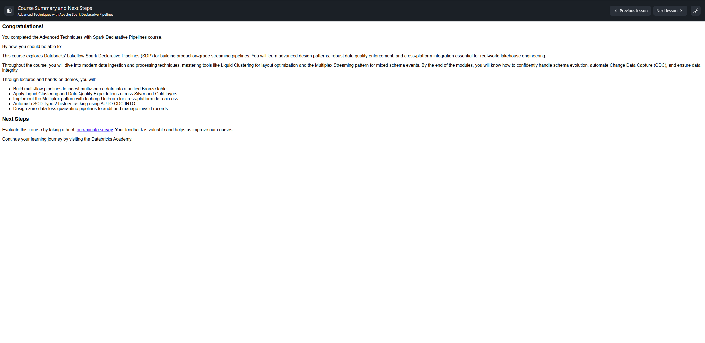

# Course Summary and Next Steps

**Curso:** Advanced Techniques with Apache Spark Declarative Pipelines (ID: 2972)  
**Lección 14:** Course Summary and Next Steps  
**Tipo de Contenido:** HTML Summary  

---

## ¡Felicitaciones!

Has completado el curso **Advanced Techniques with Spark Declarative Pipelines**.

### Competencias Clave Adquiridas:
Este curso profundizó en los **Spark Declarative Pipelines (SDP)** de Databricks Lakeflow para la construcción de canalizaciones de streaming de grado de producción. Se cubrieron patrones de diseño avanzados, aseguramiento robusto de calidad de datos e integración multiplataforma esenciales para la ingeniería moderna en el Lakehouse.

A lo largo del curso se dominaron herramientas de vanguardia como **Liquid Clustering** para la optimización física de datos y el patrón **Multiplex Streaming** para eventos con esquemas mixtos. Ahora eres capaz de manejar con confianza la evolución de esquemas, automatizar Change Data Capture (CDC) y garantizar la integridad de los datos.

A través de clases magistrales y demostraciones prácticas paso a paso, has aprendido a:
1. **Construir pipelines multiflujo (Multi-Flow):** Ingerir datos de múltiples orígenes y tipos hacia una tabla Bronze unificada.
2. **Aplicar Liquid Clustering y Data Quality Expectations:** Optimizar el rendimiento y gobernar las expectativas a lo largo de las capas Bronze, Silver y Gold.
3. **Implementar el patrón Multiplex con Iceberg UniForm:** Exportar flujos mediante Delta Sinks (Python) hacia tablas Delta con metadatos Iceberg para acceso multiplataforma de lectura universal.
4. **Automatizar el seguimiento histórico SCD Tipo 2:** Emplear `AUTO CDC INTO ... STORED AS SCD TYPE 2` para gestionar inserciones, actualizaciones y bajas lógicas (*soft deletes*) sin lógica manual compleja.
5. **Diseñar pipelines de cuarentena con cero pérdida de datos (Zero-Data-Loss Quarantine):** Aislar, auditar y remediar registros inválidos sin quebrar el pipeline ni descartar información crítica.

---

## Próximos Pasos
- Completar el **Quiz final del curso** (Lección 15) para validar los conocimientos y registrar la acreditación.
- Continuar con el siguiente curso de la ruta hacia la certificación **Databricks Certified Professional Data Engineer**: **Databricks Data Privacy (ID: 3767)**.
