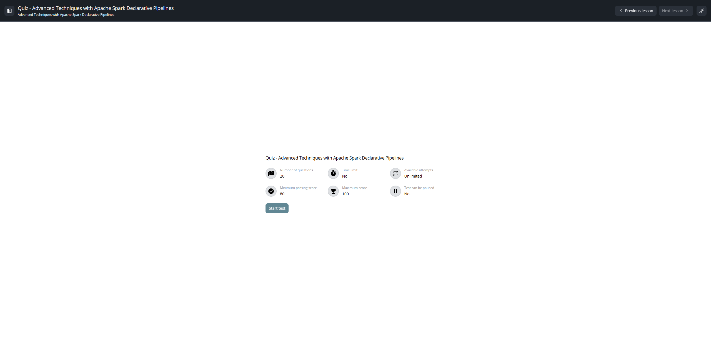
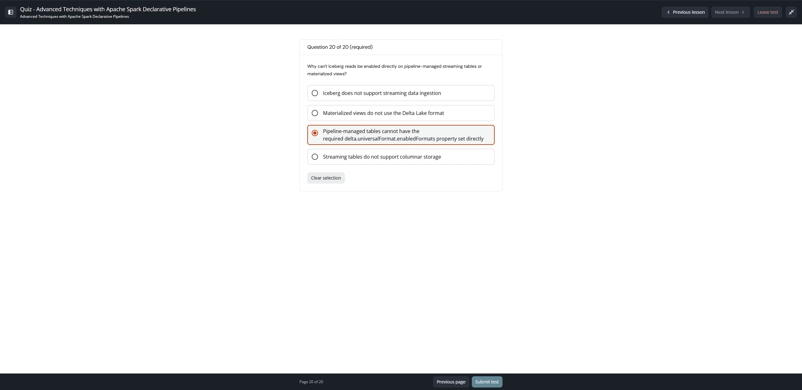
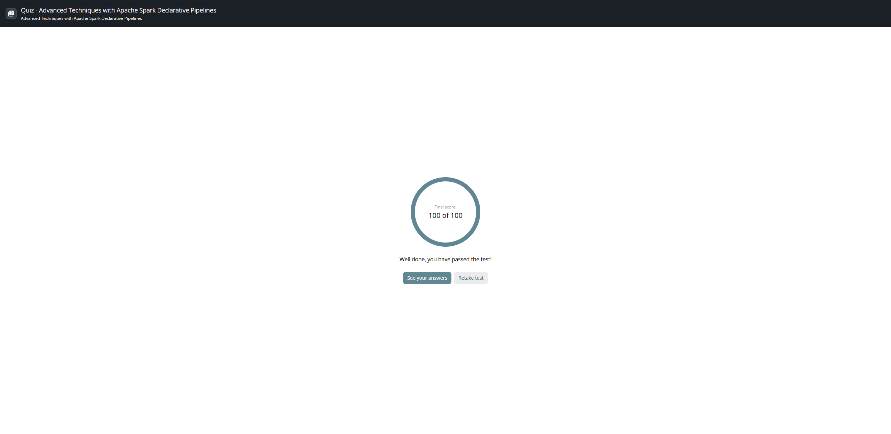

# Lesson 15: Quiz — Advanced Techniques with Apache Spark Declarative Pipelines

## 📋 Metadatos del Examen y Resultados

- **Curso:** Advanced Techniques with Apache Spark Declarative Pipelines (ID: 2972)
- **Tipo de Evaluación:** Test / Quiz Final de Certificación
- **Puntaje Obtenido:** **100 / 100 (100%)** — 20 de 20 preguntas correctas en el primer intento
- **Puntaje Mínimo de Aprobación:** 80 / 100 (80%)
- **Estado:** **Aprobado / Lesson Completed**
- **Tiempo de Ejecución:** 3 minutos 36 segundos
- **Límite de Tiempo:** Sin límite (No time limits)
- **Intentos Disponibles:** Ilimitados (Unlimited)

---

## 📸 Evidencias Visuales de la Evaluación

### Pantalla de Inicio del Examen


### Pregunta Final y Envío


### Resultado Oficial: 100 de 100 Aprobado


---

## 📝 Banco Completo de Preguntas, Respuestas y Retroalimentación Oficial

### Pregunta 1
**Enunciado:**
> What does the `TBLPROPERTIES` setting `'pipelines.reset.allowed' = 'false'` prevent on a Bronze streaming table?

**Opciones de Respuesta:**
- [x] **A. It prevents full table refreshes that would truncate data and remove checkpoints** *(Respuesta Correcta)*
- [ ] B. It prevents automatic schema evolution
- [ ] C. It prevents new flows from writing to the table
- [ ] D. It prevents the table from being queried by downstream systems

**Puntaje:** 5 / 5  
**Retroalimentación Oficial (Answer notes):**
> *Correct! This property protects the table from accidental full refreshes. This is critical when raw source files are automatically deleted after ingestion, as a full refresh would be unable to re-ingest the missing files, resulting in permanent data loss.*

---

### Pregunta 2
**Enunciado:**
> In the Quarantine Pattern, why is inverse logic (e.g., `NOT(all rules pass)`) used instead of applying `DROP ROW` on the tracking table?

**Opciones de Respuesta:**
- [ ] A. Inverse logic automatically corrects data formatting errors
- [x] **B. Inverse logic ensures all records are written and flagged, allowing downstream views to route valid and invalid records safely** *(Respuesta Correcta)*
- [ ] C. Inverse logic is required to process VARIANT columns
- [ ] D. Inverse logic improves query performance during ingestion

**Puntaje:** 5 / 5  
**Retroalimentación Oficial (Answer notes):**
> *Correct! The inverse logic pattern uses WARN-only constraints to ensure ALL records are written. Downstream views then filter on the boolean flag to separate valid and quarantined records, achieving zero data loss with full audit trails.*

---

### Pregunta 3
**Enunciado:**
> A team is building a multiplex pipeline that ingests raw telemetry events from a single Parquet source containing web, mobile, and API events. The Bronze table uses `PARSE_JSON` to store payload as a `VARIANT` column.
>
> They attempt to create the Bronze table but receive an error stating the `VARIANT` type is not supported. What is the most likely cause?

**Opciones de Respuesta:**
- [x] **A. The table is missing the TBLPROPERTIES setting `'delta.feature.variantType-preview' = 'supported'`** *(Respuesta Correcta)*
- [ ] B. The VARIANT type is only supported in Gold materialized views
- [ ] C. VARIANT columns cannot be used in streaming tables
- [ ] D. PARSE_JSON can only be used with JSON files, not Parquet

**Puntaje:** 5 / 5  
**Retroalimentación Oficial (Answer notes):**
> *Correct! The VARIANT data type requires explicit enablement via table properties. You must set `'delta.feature.variantType-preview' = 'supported'` in TBLPROPERTIES to unlock native support for semi-structured data using the VARIANT type.*

---

### Pregunta 4
**Enunciado:**
> In a multiplex streaming pipeline, what is the purpose of the "fan-out" step after the Bronze table?

**Opciones de Respuesta:**
- [ ] A. To merge all event types into a single denormalized table
- [ ] B. To duplicate all records across multiple geographic regions
- [x] **C. To filter and route different event types into separate, domain-specific Silver tables** *(Respuesta Correcta)*
- [ ] D. To compress the data for storage efficiency

**Puntaje:** 5 / 5  
**Retroalimentación Oficial (Answer notes):**
> *Correct! The fan-out step demultiplexes a mixed-schema Bronze table by filtering on event type and routing each category into its own domain-specific Silver table, enabling focused processing per business domain.*

---

### Pregunta 5
**Enunciado:**
> What do the `__START_AT` and `__END_AT` metadata columns represent in an SCD Type 2 table?

**Opciones de Respuesta:**
- [ ] A. The pipeline execution start and end times
- [ ] B. The checkpoint timestamps for streaming processing
- [ ] C. The time a file arrived in cloud storage and the time it was ingested
- [x] **D. The valid time range during which a specific version of a record was active** *(Respuesta Correcta)*

**Puntaje:** 5 / 5  
**Retroalimentación Oficial (Answer notes):**
> *Correct! `__START_AT` marks when a record version became active, and `__END_AT` marks when it became inactive. This enables point-in-time queries and full historical analysis.*

---

### Pregunta 6
**Enunciado:**
> A CDC pipeline uses `AUTO CDC INTO` to process user profile changes with SCD Type 2 storage. After processing two files, the Silver table contains the following records for `user_id = 98765`:
>
> | user_id | name | email | __START_AT | __END_AT |
> | :--- | :--- | :--- | :--- | :--- |
> | 98765 | Jane Doe | jane@email.com | 2026-01-01 10:00 | 2026-01-02 14:30 |
> | 98765 | Jane Doe | j.doe@newemail.com | 2026-01-02 14:30 | NULL |
>
> What type of CDC operation caused the second record to be created?

**Opciones de Respuesta:**
- [ ] A. INSERT
- [ ] B. MERGE
- [x] **C. UPDATE** *(Respuesta Correcta)*
- [ ] D. DELETE

**Puntaje:** 5 / 5  
**Retroalimentación Oficial (Answer notes):**
> *Correct! An UPDATE operation in SCD Type 2 closes the previous record by populating `__END_AT` with the new event's timestamp, then creates a new active record with `__END_AT = NULL`. The email change indicates an UPDATE event was processed.*

---

### Pregunta 7
**Enunciado:**
> A team implements the Quarantine Pattern using a tracking table (`tx_silver_dq`) with WARN-only constraints and an `is_quarantined` column defined using inverse logic:
> ```sql
> NOT(item_count >= 0 AND transaction_value >= 0) AS is_quarantined
> ```
> After processing 217 records, a downstream `valid_records` view contains 208 records, and a `quarantined_records` view contains 9 records. What is the primary benefit of this pattern over using `DROP ROW`?

**Opciones de Respuesta:**
- [ ] A. It automatically fixes data quality issues
- [x] **B. It preserves all invalid records with detailed failure tracking for audit and remediation** *(Respuesta Correcta)*
- [ ] C. It reduces storage costs by compressing invalid records
- [ ] D. It improves query performance by partitioning data

**Puntaje:** 5 / 5  
**Retroalimentación Oficial (Answer notes):**
> *Correct! The Quarantine Pattern using inverse logic ensures zero data loss by preserving all invalid records. This enables investigation, remediation, and compliance auditing—capabilities that DROP ROW cannot provide since it permanently deletes invalid records.*

---

### Pregunta 8
**Enunciado:**
> A pipeline processes 10,000 JSON records into a Bronze table. 50 records contain a malformed JSON structure that cannot be parsed into the defined schema columns. The data engineer included the `_rescued_data` column in the table definition.
>
> What is the state of the Bronze table after the run?

**Opciones de Respuesta:**
- [ ] A. 9,950 records are written; the 50 malformed records are permanently dropped
- [ ] B. 10,000 records are written, but the 50 malformed records contain only NULL values across all columns
- [x] **C. 10,000 records are written; the 50 malformed records have their raw strings captured in the `_rescued_data` column** *(Respuesta Correcta)*
- [ ] D. The pipeline fails because JSON parsing errors are fatal by default

**Puntaje:** 5 / 5  
**Retroalimentación Oficial (Answer notes):**
> *Correct! The `_rescued_data` column captures any data that doesn't match the expected schema, including parsing errors or unexpected columns. This ensures zero data loss at ingestion and provides a recovery mechanism for investigating malformed records.*

---

### Pregunta 9
**Enunciado:**
> A pipeline uses the `FAIL UPDATE` violation mode for a critical constraint:
> ```sql
> CONSTRAINT valid_user EXPECT (user_id IS NOT NULL) ON VIOLATION FAIL UPDATE
> ```
> A file arrives containing 1,000,000 valid records and exactly 1 record missing a `user_id`. What is the result of the pipeline run?

**Opciones de Respuesta:**
- [ ] A. All 1,000,000 records are written, but the pipeline logs a warning
- [x] **B. The entire pipeline update fails, and zero records are committed to the table** *(Respuesta Correcta)*
- [ ] C. 999,999 records are written, and 1 record is quarantined
- [ ] D. 999,999 records are written, and 1 record is dropped

**Puntaje:** 5 / 5  
**Retroalimentación Oficial (Answer notes):**
> *Correct! FAIL UPDATE treats constraint violations as critical errors. If even a single record fails the constraint, the entire pipeline update fails, no data is committed, and manual intervention is required to resolve the issue.*

---

### Pregunta 10
**Enunciado:**
> A data engineering team is building a pipeline that ingests transaction data from three regional divisions: Division Alpha (CSV), Division Beta (CSV), and Division Gamma (JSON). Each division delivers daily files to separate cloud storage volumes. The team wants all transactions consolidated into a single Bronze streaming table for unified downstream processing.
>
> What is the best approach to implement this in Spark Declarative Pipelines?

**Opciones de Respuesta:**
- [ ] A. Use a materialized view to merge the three separate Bronze tables
- [ ] B. Create a single flow that reads from all three volumes using wildcard paths
- [x] **C. Create three explicit CREATE FLOW definitions that each INSERT INTO the same Bronze target table BY NAME** *(Respuesta Correcta)*
- [ ] D. Use UNION ALL to combine three separate streaming tables into one Bronze table

**Puntaje:** 5 / 5  
**Retroalimentación Oficial (Answer notes):**
> *Correct! The multi-flow pattern uses explicit CREATE FLOW statements that each INSERT INTO the same target table BY NAME. This approach maintains independent checkpoints per source, allows per-source monitoring, and enables adding new sources without modifying existing logic.*

---

### Pregunta 11
**Enunciado:**
> In an `AUTO CDC INTO` flow, what is the purpose of the `SEQUENCE BY` clause?

**Opciones de Respuesta:**
- [ ] A. It generates an auto-incrementing ID for the table
- [ ] B. It specifies the primary key for the target table
- [x] **C. It ensures CDC events are applied in chronological order based on the specified column** *(Respuesta Correcta)*
- [ ] D. It defines which columns to include in the output

**Puntaje:** 5 / 5  
**Retroalimentación Oficial (Answer notes):**
> *Correct! SEQUENCE BY specifies the timestamp or monotonically increasing column used to order CDC events. This ensures that when multiple changes exist for the same key, they are applied in the correct chronological sequence.*

---

### Pregunta 12
**Enunciado:**
> A Silver streaming table processes inventory data and applies the following constraint:
> ```sql
> CONSTRAINT valid_stock EXPECT (stock_level >= 0) ON VIOLATION DROP ROW
> ```
> During a pipeline run, 500 records are processed. The pipeline UI shows that 12 records violated the `valid_stock` constraint. The Silver table contains 488 records.
>
> What happened to the 12 invalid records?

**Opciones de Respuesta:**
- [ ] A. They were flagged with is_quarantined = TRUE in the Silver table
- [x] **B. They were permanently deleted and cannot be recovered** *(Respuesta Correcta)*
- [ ] C. They triggered a FAIL UPDATE and stopped the pipeline
- [ ] D. They were written to a separate quarantine table automatically

**Puntaje:** 5 / 5  
**Retroalimentación Oficial (Answer notes):**
> *Correct! The DROP ROW violation mode permanently removes records that fail the constraint. There is no automatic quarantine table or recovery path. To preserve invalid records, you must implement the Quarantine Pattern using WARN mode instead.*

---

### Pregunta 13
**Enunciado:**
> What is the primary purpose of using explicit `CREATE FLOW` definitions instead of default single-flow `AS SELECT` statements in Spark Declarative Pipelines?

**Opciones de Respuesta:**
- [ ] A. Explicit flows do not require checkpoint management
- [x] **B. Explicit flows allow multiple source queries to write to a single target table independently** *(Respuesta Correcta)*
- [ ] C. Explicit flows execute faster than default flows
- [ ] D. Explicit flows automatically enable Liquid Clustering

**Puntaje:** 5 / 5  
**Retroalimentación Oficial (Answer notes):**
> *Correct! Explicit flows use `INSERT INTO ... BY NAME` to enable the multi-flow pattern, where multiple independent sources can append data to the same target table, each maintaining its own checkpoint.*

---

### Pregunta 14
**Enunciado:**
> What is the primary role of Unity Catalog tags (e.g., `ALTER TABLE SET TAGS ('domain' = 'finance')`) in a multi-layer pipeline?

**Opciones de Respuesta:**
- [ ] A. They automatically enforce row-level security
- [ ] B. They trigger automatic pipeline reruns when data changes
- [ ] C. They improve query execution speed by acting as secondary indexes
- [x] **D. They provide semantic metadata for organization, discoverability, and governance of pipeline objects** *(Respuesta Correcta)*

**Puntaje:** 5 / 5  
**Retroalimentación Oficial (Answer notes):**
> *Correct! Unity Catalog tags add semantic metadata to tables and views. This helps teams organize, search, and govern data assets by indicating ownership, quality level, or production-readiness, making it easier for users to discover trusted data.*

---

### Pregunta 15
**Enunciado:**
> What is the purpose of including `_metadata.file_name` when ingesting raw files into a Bronze streaming table?

**Opciones de Respuesta:**
- [x] **A. It provides the source file name for data lineage and debugging** *(Respuesta Correcta)*
- [ ] B. It stores the file size for cost tracking
- [ ] C. It automatically partitions the table by file
- [ ] D. It determines the processing sequence of the files

**Puntaje:** 5 / 5  
**Retroalimentación Oficial (Answer notes):**
> *Correct! The `_metadata.file_name` column captures the source file name for each ingested row, providing complete data lineage and helping trace data quality issues back to specific source files.*

---

### Pregunta 16
**Enunciado:**
> A streaming pipeline uses `TRY_CAST(transaction_value AS DOUBLE)` in the Silver layer. In the incoming data, one record has `transaction_value = "N/A"`.
>
> What does the Silver table contain for this specific record's `transaction_value` column?

**Opciones de Respuesta:**
- [x] **A. It contains a NULL value** *(Respuesta Correcta)*
- [ ] B. It contains the value 0.0
- [ ] C. The pipeline throws a runtime exception and fails
- [ ] D. It contains the string "N/A"

**Puntaje:** 5 / 5  
**Retroalimentación Oficial (Answer notes):**
> *Correct! TRY_CAST returns NULL when a cast operation fails instead of raising an error that would stop the pipeline. This is essential for handling dirty data where some values may not convert cleanly to the target type.*

---

### Pregunta 17
**Enunciado:**
> A business analyst runs the following query on an SCD Type 2 CDC table:
> ```sql
> SELECT * FROM users_silver WHERE __END_AT IS NULL
> ```
> What exactly is the analyst retrieving?

**Opciones de Respuesta:**
- [ ] A. The complete historical log of all user changes
- [x] **B. The currently active version of all users** *(Respuesta Correcta)*
- [ ] C. Users who are missing an expiration date due to data corruption
- [ ] D. All users who have been permanently deleted

**Puntaje:** 5 / 5  
**Retroalimentación Oficial (Answer notes):**
> *Correct! In an SCD Type 2 table generated by AUTO CDC INTO, a NULL value in the `__END_AT` column indicates that the record is the current, active version. Non-NULL values indicate historical or deleted versions.*

---

### Pregunta 18
**Enunciado:**
> A Bronze layer is designed to handle schema evolution for shipment data that will receive new columns in future file drops:
> ```sql
> FROM STREAM read_files(
>   '${source}',
>   format => 'csv',
>   schemaHints => 'delivery_status STRING, insurance_cost STRING'
> )
> ```
> The first file drop (`batch_1.csv`) does NOT contain `delivery_status` or `insurance_cost` columns. The second file drop (`batch_2.csv`) DOES contain both new columns.
>
> What will happen when both files are processed?

**Opciones de Respuesta:**
- [x] **A. batch_1.csv rows will have NULL for the new columns; batch_2.csv rows will have actual values** *(Respuesta Correcta)*
- [ ] B. The pipeline will fail when processing batch_1.csv due to missing columns
- [ ] C. Both new columns will be captured in _rescued_data for batch_1.csv
- [ ] D. The schemaHints setting will reject batch_1.csv until it contains all declared columns

**Puntaje:** 5 / 5  
**Retroalimentación Oficial (Answer notes):**
> *Correct! The `schemaHints` parameter declares expected future columns. For files that don't contain these columns yet, the fields will be NULL. When files arrive with the new columns, they populate normally—enabling seamless schema evolution without modifying pipeline code.*

---

### Pregunta 19
**Enunciado:**
> A multi-flow pipeline consolidates data from three different sources. The data engineer defines data quality constraints directly inside the three individual `CREATE FLOW` statements instead of on the target Bronze streaming table.
>
> What is the consequence of this design?

**Opciones de Respuesta:**
- [ ] A. It improves pipeline execution speed
- [ ] B. It enables liquid clustering on the individual flows
- [ ] C. It automatically creates three separate quarantine tables
- [x] **D. It is an invalid syntax; constraints must be defined centrally on the target table** *(Respuesta Correcta)*

**Puntaje:** 5 / 5  
**Retroalimentación Oficial (Answer notes):**
> *Correct! In a multi-flow pattern, data quality constraints must be defined on the target streaming table, not inside the CREATE FLOW definitions. The table enforces quality rules centrally for all flows that write to it.*

---

### Pregunta 20
**Enunciado:**
> Why can't Iceberg reads be enabled directly on pipeline-managed streaming tables or materialized views?

**Opciones de Respuesta:**
- [ ] A. Iceberg does not support streaming data ingestion
- [ ] B. Materialized views do not use the Delta Lake format
- [x] **C. Pipeline-managed tables cannot have the required delta.universalFormat.enabledFormats property set directly** *(Respuesta Correcta)*
- [ ] D. Streaming tables do not support columnar storage

**Puntaje:** 5 / 5  
**Retroalimentación Oficial (Answer notes):**
> *Correct! Pipeline-managed tables cannot have UniForm properties set directly. To enable Iceberg reads, you must write the stream to a plain external Delta table using a Delta Sink, then configure UniForm on that external table.*

---

## 🏆 Resumen de Competencias Validadas

| Dominio Arquitectónico | Preguntas | Conceptos Clave Evaluados |
| :--- | :---: | :--- |
| **Multi-Flow Ingestion & Table Properties** | Q1, Q10, Q13, Q15, Q19 | `INSERT INTO ... BY NAME`, múltiples checkpoints, `'pipelines.reset.allowed' = 'false'`, `_metadata.file_name`, definición centralizada de `CONSTRAINT` en target table. |
| **Data Quality & Quarantine Pattern** | Q2, Q7, Q9, Q12, Q16 | Lógica inversa (`NOT(rules)`), preservación total para auditoría, `FAIL UPDATE` atómico, pérdida de datos permanente en `DROP ROW`, mitigación de errores de casteo con `TRY_CAST`. |
| **Semi-Structured & Schema Evolution** | Q3, Q4, Q8, Q18 | Columna `VARIANT` con `delta.feature.variantType-preview = 'supported'`, demultiplexación (fan-out), protección de datos con `_rescued_data`, anticipación de columnas con `schemaHints`. |
| **CDC & SCD Type 2 Maintenance** | Q5, Q6, Q11, Q17 | Intervalos temporales (`__START_AT`, `__END_AT`), detección de `UPDATE`, ordenamiento cronológico con `SEQUENCE BY`, consulta del estado activo (`__END_AT IS NULL`). |
| **Interoperabilidad & Gobernanza UC** | Q14, Q20 | Etiquetas semánticas con Unity Catalog Tags, arquitectura de Delta Sinks (`dp.create_sink`) para compatibilidad UniForm con Apache Iceberg. |
