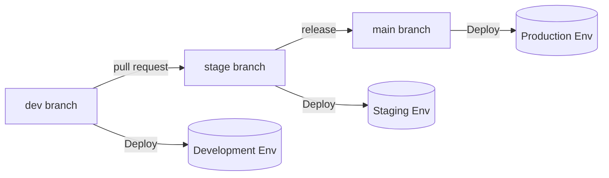

# Lecture: Deploying Databricks Projects

## Overview
In this lecture, you will review what makes up a typical Databricks project, the goal of the CI/CD journey from development to production, the tools available to orchestrate that journey, and how Declarative Automation Bundles (DABs) simplify deploying to multiple environments.

---

## Learning Objectives
By the end of this lecture, you will be able to:
- **Describe** the components of a Databricks project: code, resources, and execution environment.
- **Explain** the CI/CD journey across development, staging, and production environments.
- **Compare** the options for orchestrating deployment: the UI, the REST API/SDK, and Terraform.
- **Explain** how Declarative Automation Bundles (DABs) simplify deploying to multiple environments.

---

## A. Typical Databricks Projects

### A1. What Makes Up a Databricks Project?
Every Databricks project, from a simple report to a full MLOps pipeline, is built from the same three kinds of **components**:

1. **Code:** The logic that produces your data products:
   - Notebooks
   - Python wheels (`.whl`)
   - JAR files
   - dbt projects
   - SQL / Python / R scripts
2. **Resources:** The platform constructs that execute or organize the workload:
   - Tables and Views
   - Spark Declarative Pipelines (SDP)
   - Lakeflow Jobs / Workflows
   - Machine Learning models
   - Dashboards / Alerts
   - External services connectors
3. **Execution Environment:** The runtime and governance context:
   - Databricks Workspace
   - Unity Catalog metastore, catalogs, schemas
   - Compute configuration(s) (Single node, Serverless, multi-node clusters)

#### The Deliverable Determines the Components
- **A simple report:** Might consist of a notebook running on single-node compute.
- **A full MLOps pipeline:** Requires MLflow, Feature Store, and Model Serving components alongside automated scheduled jobs.

### A2. Simple Example Project Components
Mapping workspace assets to the core component triad:

| Component Type | Example Assets |
| :--- | :--- |
| **Code** | Python / SQL / R notebooks |
| **Resources** | Lakeflow Jobs, Spark Declarative Pipelines (SDP) |
| **Execution Environment** | Databricks Workspace, Unity Catalog, Compute configurations |

---

## B. The CI/CD Journey to Production

### B1. Multi-Environment Promotion Lifecycle
A project is promoted through **development**, **staging**, and **production**. Code moves via version control — a **pull request** into `stage`, a **release** into `main` — and each branch is deployed down into its own environment:

#### Environment Configurations Breakdown

1. **Development (`dev`)**:
   - **Assets:** Notebooks, SDP, Workflows, Unity Catalog
   - **Dev Configuration:**
     - Single-node compute
     - Run as user (individual developer identity)
     - Use dev data and dev catalog/schema

2. **Staging (`stage`)**:
   - **Assets:** Notebooks, SDP, Workflows, Unity Catalog
   - **Staging Configuration:**
     - Serverless or dedicated testing cluster
     - Run as **service principal**
     - Use staging data and staging validation environment

3. **Production (`prod`)**:
   - **Assets:** Notebooks, SDP, Workflows, Unity Catalog
   - **Production Configuration:**
     - Serverless or production-grade clusters
     - Run as **service principal**
     - Scheduled runs (e.g., Weekly or Hourly schedule)
     - Production data catalog with strict access governance

---

## C. Orchestrating the CI/CD Journey

### C1. Comparison of Deployment Approaches
Before Declarative Automation Bundles (DABs), three primary methods existed to orchestrate deployments, each presenting significant trade-offs:

| Approach | Description | Pros | Cons |
| :--- | :--- | :--- | :--- |
| **Manually (UI)** | Configuring jobs, pipelines, and permissions directly through the Databricks web interface. | • Easy to learn • High-level visual interface | • Highly time-consuming • Error-prone and impossible to reproduce reliably • Not a viable option for enterprise CI/CD |
| **Programmatically (REST API / SDK)** | Scripting deployments using the Databricks REST API or Databricks Python/Go/Java SDKs. | • Low-level, granular control | • Steep learning curve (hundreds of API endpoints/classes) • Time-consuming to build and maintain custom automation scripts |
| **Terraform (Databricks Provider)** | Using infrastructure-as-code to manage workspaces and cloud resources. | • Very powerful and expressive • Industry-standard tool for platform administrators | • High complexity for data scientists and data engineers who are not DevOps engineers |

---

## D. Simplifying with DABs

### D1. How Can the CI/CD Process Be Simplified?
The ultimate objective: **Write code once, then deploy to multiple environments easily.**

Declarative Automation Bundles satisfy all key requirements:
- **Co-version code with all configurations:** Bundled in a clean, human-readable **YAML** format.
- **Define Databricks resources using existing REST API parameters:** Direct correspondence with Databricks resource specifications.
- **Ensure user isolation during deployment:** Distinct dev prefixes and user targets prevent developers from overwriting each other's work.
- **Specify environment-based overrides and variables:** Seamless parameter substitution across dev, staging, and prod targets.
- **One bundle definition fanning out to all targets:** Deploy assets and configuration settings reliably across development, staging, and production.

### D2. Introducing Declarative Automation Bundles (DABs)
> **Definition:**
> **Declarative Automation Bundles (DABs)** is a tool designed to facilitate the adoption of software engineering best practices — including source control, code review, testing, and continuous integration and continuous delivery (CI/CD) — for data, analytics, and AI projects on Databricks.

---

## E. Conclusion
- A Databricks project is composed of three essential pillars: **code**, **resources**, and an **execution environment**.
- The CI/CD journey promotes a project across **development**, **staging**, and **production**, governed by version control branches and target-specific configurations.
- Traditional methods (UI, REST API, Terraform) present steep trade-offs between manual overhead, script maintenance, and complex admin tooling.
- **Declarative Automation Bundles (DABs)** co-version code and configuration in YAML, allowing rapid and reproducible deployments across all target environments.

---

## Next Steps
In the next lecture, you will explore the fundamental components, file structure, and configuration files of a Declarative Automation Bundle.
