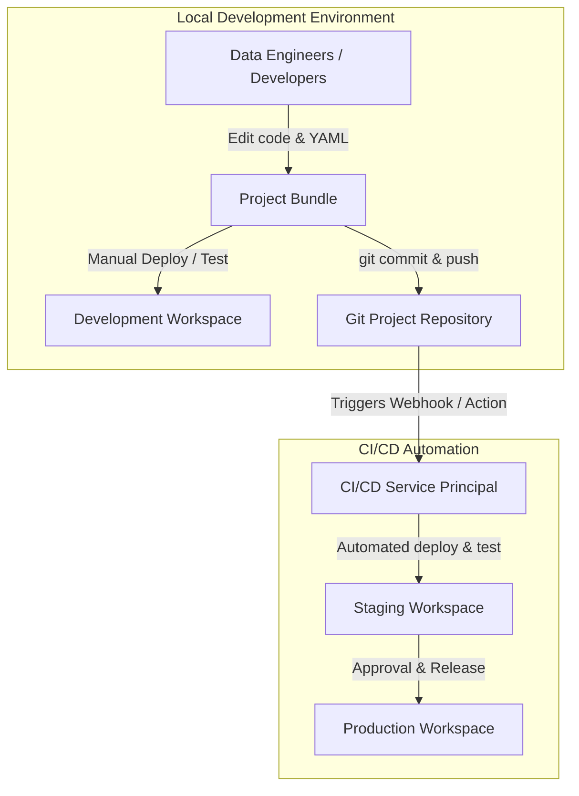
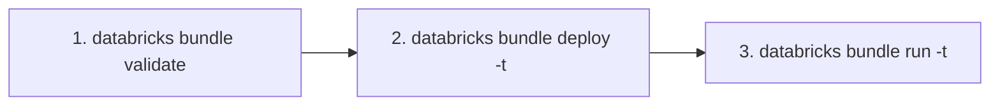

# Lecture: Introduction to Declarative Automation Bundles

## Overview
In this lecture, you will explore the fundamental components of a Declarative Automation Bundle (DAB), examine the standard project structure and the top-level mappings of the `databricks.yml` configuration file, and learn the essential Databricks CLI commands used to validate, deploy, and run bundles.

---

## Learning Objectives
By the end of this lecture, you will be able to:
- **Describe** the components of a Declarative Automation Bundle (DAB).
- **Explain** the standard file structure of a DAB project.
- **Explain** the top-level mappings of the `databricks.yml` configuration file.
- **Use** the Databricks CLI to validate, deploy, and run a bundle.

---

## A. What Are Declarative Automation Bundles?

### A1. DABs in Three Questions

1. **What are they?**
   - **Write code once, deploy everywhere.**
   - Declarative Automation Bundles (DABs) use **YAML files** to specify the artifacts, resources, and configurations of a Databricks project.
2. **How do they work?**
   - **Through the Databricks CLI.**
   - The Databricks CLI has dedicated `bundle` commands (`validate`, `deploy`, `run`, `destroy`, `init`) to manage the bundle lifecycle using the configuration declared in the YAML file.
3. **Where are they used?**
   - **Development and CI/CD.**
   - Bundles are designed for local development, team collaboration, and automated CI/CD pipelines to deploy Databricks assets seamlessly to development, staging, and production workspaces.

### A2. CI/CD with DABs: End-to-End Workflow Overview



- **Local Development:** Users can deploy directly to their sandbox development workspace to immediately see and test changes.
- **Version Control:** Developers commit bundle code to source control (GitHub, GitLab, Azure DevOps).
- **Staging Deployment:** CI/CD pipelines authenticate via service principals, running automated integration tests in the staging environment.
- **Production Deployment:** Following peer review and approvals, release pipelines deploy assets, configurations, and schedules to production.

---

## B. Simple Project Structure

### B1. Standard Directory Layout
A Declarative Automation Bundle follows a standardized, predictable folder layout:

```text
my_project/
├── databricks.yml          # REQUIRED: Primary bundle configuration file
├── resources/              # Modular YAML resource definitions (jobs, pipelines, alerts)
├── src/                    # Source code files (notebooks, Python wheels, SQL scripts)
└── tests/                  # Unit and integration tests (pytest, test fixtures)
```

#### Folder Breakdown:
- **`databricks.yml`**: The **REQUIRED** root bundle configuration file that must:
  - Be expressed in standard **YAML format**.
  - Contain at minimum the **top-level `bundle` mapping** with a unique project name.
  - Be the single, primary configuration entrypoint (only one file named `databricks.yml` at the project root).
- **`resources/`**: Houses modular YAML configuration files defining Databricks assets (such as Lakeflow Jobs, Spark Declarative Pipelines, MLflow experiments). This keeps the main `databricks.yml` clean and maintainable.
- **`src/`**: Contains the pipeline logic, transformation code, libraries, and notebooks executed by tasks.
- **`tests/`**: Contains automated unit tests (e.g. testing helper functions locally) and integration test suites executed in staging.

---

## C. The `databricks.yml` Configuration File

### C1. Top-Level Mappings
The top-level keys in `databricks.yml` define the identity, assets, and target environments for the bundle:

| Top-Level Mapping | Purpose |
| :--- | :--- |
| **`bundle`** | Identity of the bundle — declares the required bundle name and general metadata. |
| **`resources`** | Databricks objects managed by the bundle (Jobs, Pipelines, ML models, alerts), defined with REST API parameters. |
| **`targets`** | Environment definitions and configuration overrides (e.g., `development`, `staging`, `production`). |
| **`variables`** | Parameterized values that can be referenced throughout the YAML files and overridden per target. |
| **`workspace`** | Workspace-level settings such as host URL, auth type, and root deployment path. |
| **`permissions`** | Access control rules (ACLs) defining who can view, run, or manage the deployed resources. |
| **`artifacts`** | Custom build instructions, such as packaging Python wheels or JAR files. |
| **`include`** | Glob patterns to include modular YAML files from the `resources/` folder. |
| **`sync`** | File synchronization rules governing which local files are uploaded to the workspace. |

### C2. The `bundle` and `resources` Mappings
Example declaring bundle identity and a single-task Lakeflow Job:

```yaml
bundle:
  name: demo01_bundle

resources:
  jobs:
    l1_simple_dab:
      name: my_job_name_l1_simple_dab
      tasks:
        - task_key: create_bronze_table
          notebook_task:
            notebook_path: ./src/create_bronze_table.py
            source: WORKSPACE
```

#### Key Elements:
- **`bundle.name`**: Unique project name. In development mode, Databricks prepends a dev prefix (`[dev ${bundle.target.user}]`) to isolate assets.
- **`resources.jobs.<job_key>`**: The resource mapping key (e.g., `l1_simple_dab`). Must be unique within the bundle.
- **`name`**: The display name of the Job as it appears in the Databricks Workflows UI.
- **`notebook_task.notebook_path`**: Relative path to the notebook file.
  > [!NOTE]
  > Starting December 20, 2024, the default format for new notebooks is `.ipynb`. Always verify and match the file extension (`.py`, `.ipynb`, `.sql`) specified in `notebook_path`.

### C3. The `targets` Mapping
Defines target deployment environments and per-environment configuration overrides:

```yaml
targets:
  development:
    mode: development
    default: true
    workspace:
      host: https://dev.cloud.databricks.com/
  production:
    mode: production
    workspace:
      host: https://prod.cloud.databricks.com/
```

#### Key Properties:
- **`mode: development`**:
  - Automatically prefixes resource names with `[dev <username>]`.
  - Pauses job schedules and triggers so dev workloads don't fire unexpectedly.
  - Tags resources with dev metadata.
  - Deploys code to the current user's workspace directory (`/Users/<username>/.bundle/<bundle-name>/<target>`).
- **`mode: production`**:
  - Requires clean resource naming without user prefixes.
  - Enables schedules and production triggers.
  - Enforces deployment via service principals.
- **`default: true`**: Identifies the default target environment used when the `-t / --target` CLI flag is omitted.

---

## D. Validate, Deploy, and Run with the CLI

### D1. Essential Databricks Bundle Commands

Once your `databricks.yml` is defined, three core commands drive the deployment lifecycle:



```bash
# 1. Validate the bundle configuration schema
databricks bundle validate

# 2. Deploy bundle assets to the development environment
databricks bundle deploy -t development

# 3. Trigger an on-demand execution of the deployed job
databricks bundle run -t development l1_simple_dab
```

#### Command Specifications:
1. **`databricks bundle validate`**:
   - Synthesizes the YAML files and resolves variable substitutions.
   - Checks the configuration against the Databricks REST API schema.
   - Returns errors or warnings if unrecognized properties or syntax errors exist.
2. **`databricks bundle deploy -t <target>`**:
   - Synchronizes source files (`src/`) to the target workspace filesystem.
   - Creates or updates the Databricks resources (Jobs, Pipelines) defined under `resources:`.
   - When targeting `development`, creates isolated developer assets.
3. **`databricks bundle run -t <target> <resource-key>`**:
   - Initiates an immediate execution of the specified job key (e.g., `l1_simple_dab`) in the designated environment.
   - Streams real-time run status and provides a direct terminal URL to the job execution run in the Databricks UI.

---

## E. Conclusion
- A **Declarative Automation Bundle (DAB)** provides an end-to-end framework to co-version code, infrastructure resources, and multi-environment configurations in readable YAML.
- A standard bundle layout consists of `databricks.yml` at the root, alongside `resources/`, `src/`, and `tests/`.
- `databricks.yml` organizes project identity (`bundle`), managed assets (`resources`), and deployment environments (`targets`).
- The developer workflow is standardized into three fast CLI actions: **`validate`**, **`deploy`**, and **`run`**.

---

## Next Steps
In the next demo, you will deploy a simple DAB hands-on and observe these CLI commands in action.
