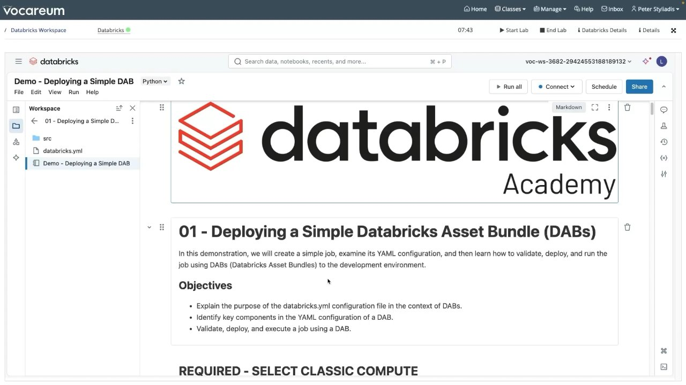
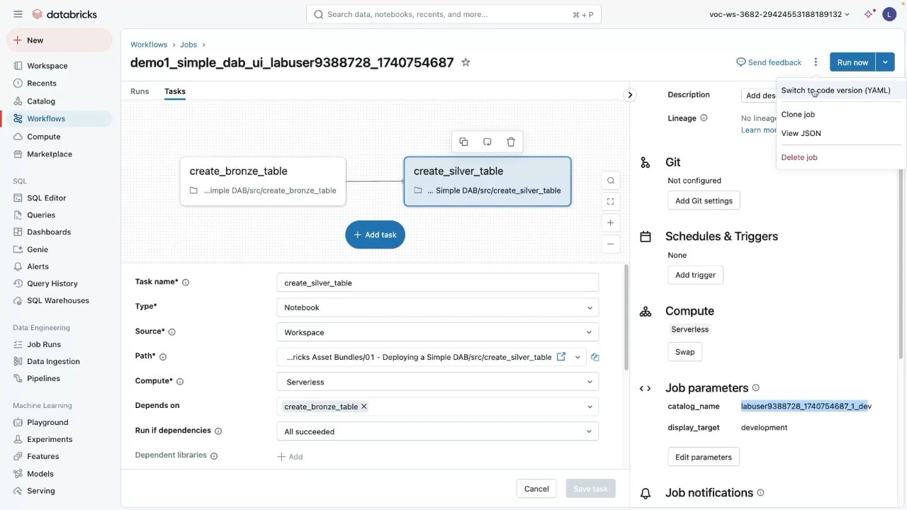
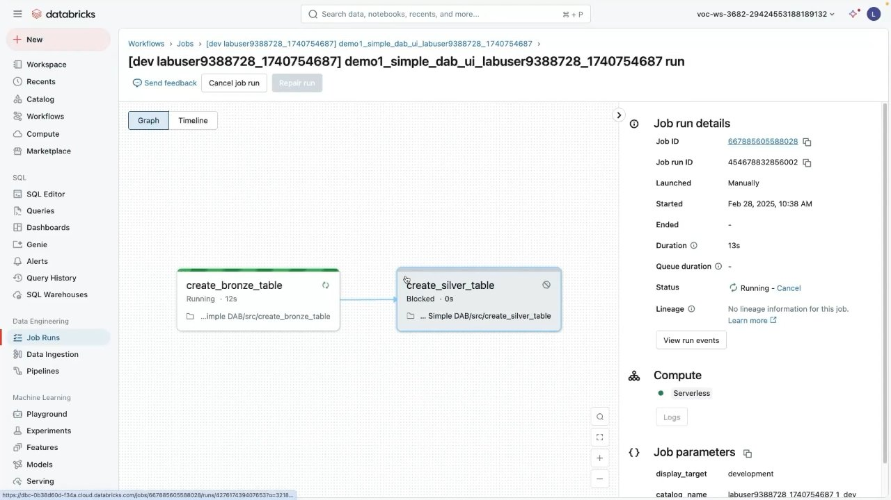
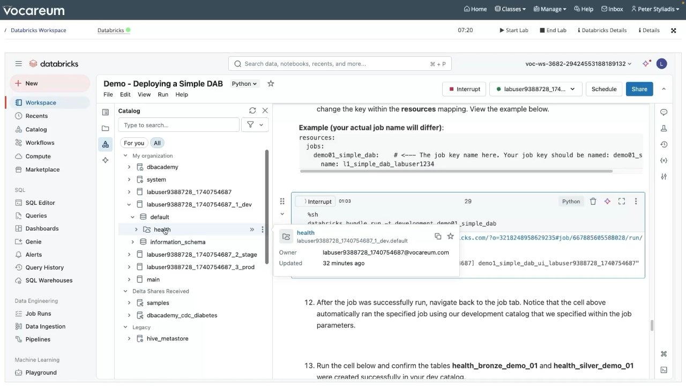

# Demo: Deploying a Simple DAB

## Overview
In this demonstration, you walk through creating a simple multi-task job, inspecting its YAML bundle definition, configuring workspace and target settings, and executing the complete lifecycle commands (`validate`, `deploy`, and `run`) using the Databricks CLI within a Databricks notebook environment.

---

## Objectives
- **Explain** the purpose and role of the `databricks.yml` configuration file in the context of Declarative Automation Bundles (DABs).
- **Identify** the key components and mappings in the YAML configuration of a DAB.
- **Validate, deploy, and execute** a multi-task job targeting the development environment.
- **Verify** resource naming, catalog isolation, and data assets created in Unity Catalog.

---

## Visual Captures


*Figure 7.1: Databricks Academy lab notebook showing bundle setup and demo objectives.*


*Figure 7.2: Databricks Workflows visual canvas showing tasks `create_bronze_table` and `create_silver_table`.*


*Figure 7.3: Active execution of the deployed job displaying the `[dev <username>]` namespace prefix.*


*Figure 7.4: Shell cell executing `databricks bundle run` and Unity Catalog showing target catalog `labuser..._1_dev`.*

---

## Step-by-Step Implementation

### Step 1: Project Bundle Directory Structure
The demo project is organized under a root folder (e.g. `01 - Deploying a Simple DAB/`):

```text
01 - Deploying a Simple DAB/
├── databricks.yml
└── src/
    ├── create_bronze_table.py
    └── create_silver_table.py
```

### Step 2: The `databricks.yml` Configuration
The bundle file defines the project identity, the managed job resource with its two sequential notebook tasks, and the target development environment:

```yaml
bundle:
  name: demo01_simple_dab_bundle

resources:
  jobs:
    demo01_simple_dab:
      name: demo01_simple_dab_ui_${bundle.target.user}
      tasks:
        - task_key: create_bronze_table
          notebook_task:
            notebook_path: ./src/create_bronze_table.py
            source: WORKSPACE
          compute_key: serverless_compute

        - task_key: create_silver_table
          depends_on:
            - task_key: create_bronze_table
          notebook_task:
            notebook_path: ./src/create_silver_table.py
            source: WORKSPACE
          compute_key: serverless_compute

      parameters:
        - name: catalog_name
          default: ${bundle.target.catalog}
        - name: display_target
          default: development

targets:
  development:
    mode: development
    default: true
    workspace:
      host: https://<workspace-url>
```

### Step 3: Bundle Validation
Before deploying, validate the syntax and REST API compatibility:

```bash
%sh
databricks bundle validate
```

**Output:**
```json
{
  "bundle": {
    "name": "demo01_simple_dab_bundle"
  },
  "targets": {
    "development": {
      "mode": "development",
      "default": true
    }
  },
  "resources": {
    "jobs": {
      "demo01_simple_dab": { ... }
    }
  }
}
```

### Step 4: Bundle Deployment
Deploy the bundle to the target environment (`development`):

```bash
%sh
databricks bundle deploy -t development
```

**Actions Performed by Databricks CLI:**
1. Uploads files from `./src/` to the developer's bundle workspace folder:
   `/Users/<username>/.bundle/demo01_simple_dab_bundle/development/files/src/`
2. Creates or updates the Databricks Lakeflow Job in the workspace.
3. Automatically applies the `[dev <username>]` prefix to the job name:
   `[dev labuser9388728_1740754687] demo01_simple_dab_ui_labuser9388728_1740754687`
4. Tags the job with bundle metadata (`bundle: demo01_simple_dab_bundle`, `target: development`).

### Step 5: Executing the Job via CLI
Trigger an immediate execution of the deployed job:

```bash
%sh
databricks bundle run -t development demo01_simple_dab
```

- Returns the live execution URL:
  `https://<workspace-host>/?o=...#job/<job-id>/run/<run-id>`
- Tracks task status in the console until completion.

### Step 6: Verifying Unity Catalog Artifacts
Upon completion, the two tasks materialize the expected tables in the development catalog:
- Catalog: `<username>_1_dev`
- Schema: `default`
- Tables generated:
  - `health_bronze_demo_01`: Ingested raw bronze dataset.
  - `health_silver_demo_01`: Cleansed, transformed silver dataset created by the downstream task.

```sql
SELECT * FROM labuser9388728_1740754687_1_dev.default.health_silver_demo_01 LIMIT 10;
```

---

## Key Takeaways
1. **User Isolation:** `mode: development` ensures that developer deployments never collide with team members or production schedules by prepending `[dev <username>]` and deploying to user-scoped paths.
2. **Sequential Dependencies:** Multi-task jobs declare DAG dependencies (`depends_on: - task_key: <prior_task>`) cleanly in YAML.
3. **Parameter Overrides:** Job parameters dynamically pass catalog and schema variables into notebook tasks via `${bundle.target.catalog}` substitutions.
4. **Three-Command Standard:** `validate` checks configuration, `deploy` syncs assets and provisions resources, and `run` executes the pipeline.
