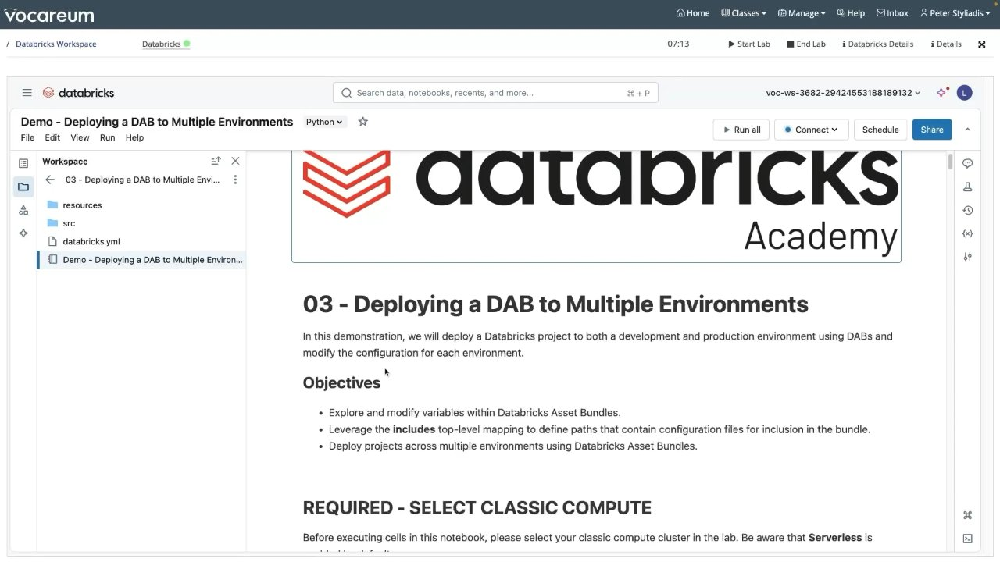
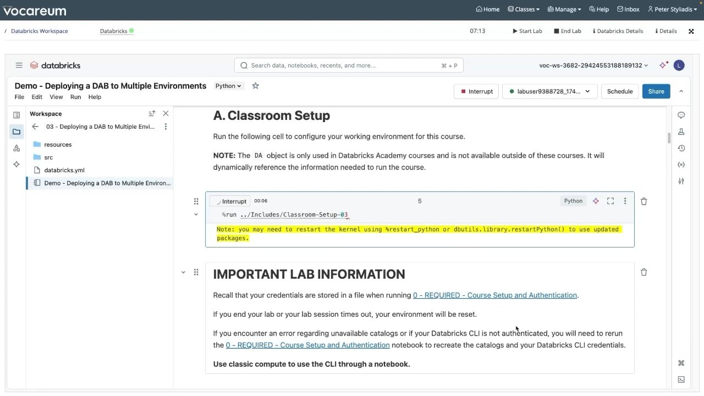
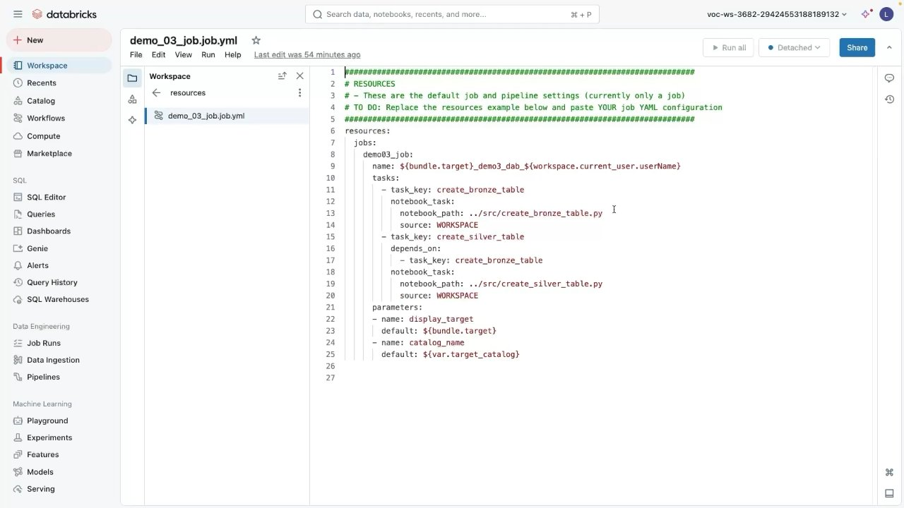
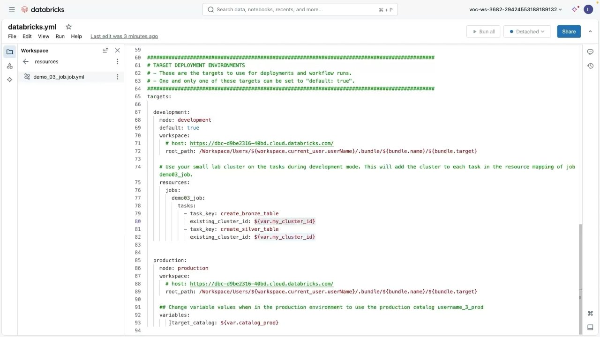

# Demo: Deploying a DAB to Multiple Environments

## Overview
In this demonstration, you explore advanced Declarative Automation Bundle capabilities by splitting configuration across modular files using the `include` mapping, defining custom and lookup variables, and deploying workloads across separate `development` and `production` environments with target-specific compute and catalog overrides.

---

## Objectives
- **Explore and modify** variables within Databricks Asset Bundles.
- **Leverage** the `include` top-level mapping to structure modular resource configuration files.
- **Deploy and run** projects across multiple environments (`development` and `production`) using the Databricks CLI.
- **Verify** environment isolation across compute clusters and Unity Catalog namespaces.

---

## Visual Captures


*Figure 9.1: Databricks Academy lab notebook showing multi-environment demo setup and objectives.*


*Figure 9.2: Classroom environment setup verifying CLI authentication and multi-catalog access.*


*Figure 9.3: Modular resource file `resources/demo_03_job.job.yml` referencing target variables.*


*Figure 9.4: Root `databricks.yml` showing compute overrides for `development` and catalog overrides for `production`.*

---

## Modular Bundle Architecture

### Project Directory Structure
```text
03 - Deploying a DAB to Multiple Environments/
├── .databricks/                  # Internal CLI state cache
├── .gitignore                    # Excludes .databricks/ and bundle artifacts
├── databricks.yml                # Root bundle configuration entrypoint
├── resources/                    # Modular resource YAML definitions
│   └── demo_03_job.job.yml       # Job specification
└── src/                          # Code executed by pipeline tasks
    ├── create_bronze_table.py
    └── create_silver_table.py
```

### 1. Root Configuration: `databricks.yml`
```yaml
bundle:
  name: demo03_multi_env_bundle

include:
  - resources/*.yml

variables:
  my_lab_user_name:
    description: "Lab username"
    default: labuser9388728

  catalog_dev:
    description: "Development catalog"
    default: ${var.my_lab_user_name}_1_dev

  catalog_prod:
    description: "Production catalog"
    default: ${var.my_lab_user_name}_3_prod

  target_catalog:
    description: "Active catalog for data output"
    default: ${var.catalog_dev}

  my_cluster_id:
    description: "Developer interactive cluster ID"
    lookup:
      cluster: "labuser9388728-cluster"

targets:
  development:
    mode: development
    default: true
    workspace:
      root_path: /Workspace/Users/${workspace.current_user.userName}/.bundle/${bundle.name}/${bundle.target}
    resources:
      jobs:
        demo03_job:
          tasks:
            - task_key: create_bronze_table
              existing_cluster_id: ${var.my_cluster_id}
            - task_key: create_silver_table
              existing_cluster_id: ${var.my_cluster_id}

  production:
    mode: production
    workspace:
      root_path: /Workspace/Users/${workspace.current_user.userName}/.bundle/${bundle.name}/${bundle.target}
    variables:
      target_catalog: ${var.catalog_prod}
```

### 2. Modular Resource Configuration: `resources/demo_03_job.job.yml`
```yaml
resources:
  jobs:
    demo03_job:
      name: ${bundle.target}_demo3_dab_${workspace.current_user.userName}
      tasks:
        - task_key: create_bronze_table
          notebook_task:
            notebook_path: ../src/create_bronze_table.py
            source: WORKSPACE

        - task_key: create_silver_table
          depends_on:
            - task_key: create_bronze_table
          notebook_task:
            notebook_path: ../src/create_silver_table.py
            source: WORKSPACE

      parameters:
        - name: display_target
          default: ${bundle.target}
        - name: catalog_name
          default: ${var.target_catalog}
```

---

## Deployment & Execution Procedures

### Step 1: Validate Configuration
```bash
%sh
databricks bundle validate
```
Synthesizes the included files from `resources/` and ensures all variable references (`${var.target_catalog}`) and lookups resolve properly.

### Step 2: Deploy & Run in Development
```bash
# Deploy to development
%sh
databricks bundle deploy -t development

# Run development job
%sh
databricks bundle run -t development demo03_job
```
- **Compute behavior:** The `existing_cluster_id` override directs execution to the developer's pre-warmed interactive cluster, speeding up iteration.
- **Unity Catalog destination:** Data lands in `<username>_1_dev.default`.
- **Display name:** `[dev <username>] development_demo3_dab_<username>`.

### Step 3: Deploy & Run in Production
```bash
# Deploy to production
%sh
databricks bundle deploy -t production

# Run production job
%sh
databricks bundle run -t production demo03_job
```
- **Compute behavior:** Falls back to default serverless/automated job compute.
- **Unity Catalog destination:** Variable override switches target catalog to `<username>_3_prod.default`.
- **Display name:** `production_demo3_dab_<username>` (no `[dev ...]` prefix in production mode).

---

## Verification Matrix

| Aspect | Development Target | Production Target |
| :--- | :--- | :--- |
| **CLI Target Flag** | `-t development` (or omitted as default) | `-t production` |
| **Deployment Mode** | `mode: development` | `mode: production` |
| **Job Name Prefix** | `[dev <user>]` prepended | None (clean production name) |
| **Compute Assigned** | Interactive cluster (`existing_cluster_id`) | Automated / Serverless job compute |
| **Target Catalog** | `${var.catalog_dev}` (`..._1_dev`) | `${var.catalog_prod}` (`..._3_prod`) |
| **Schedules** | Paused by default | Active / Enabled |

---

## Key Takeaways
1. **Modular Organization:** The `include: - resources/*.yml` pattern isolates resource definitions into dedicated files, preventing single massive YAML files in enterprise repositories.
2. **Environment Compute Differentiation:** Development targets can attach to shared or running clusters for fast feedback loops, while production targets automatically use isolated, cost-effective job clusters.
3. **Automated Catalog Routing:** Parameterizing catalog and schema names via variables guarantees that code cannot inadvertently write dev data into production tables.
