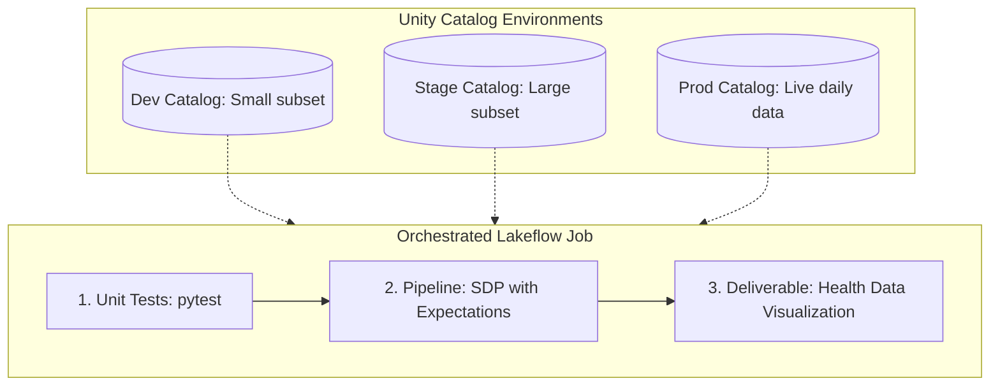
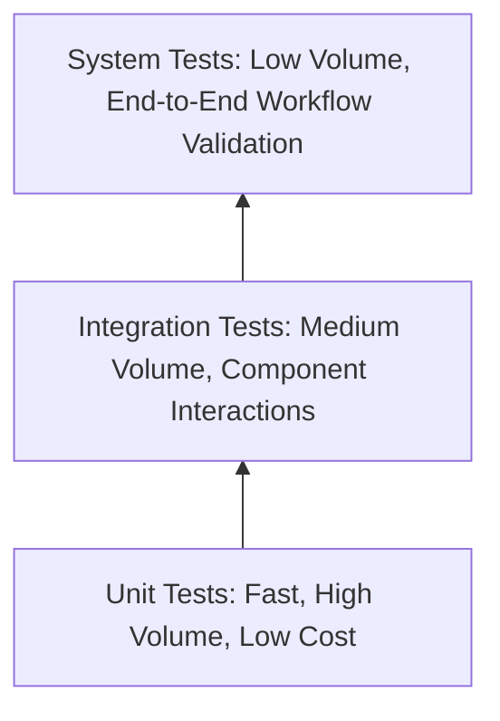
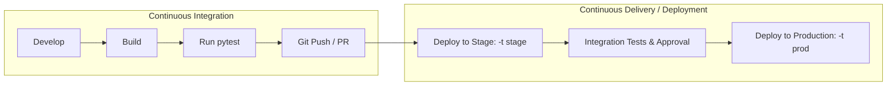

# Lecture: CI/CD Project Overview with DABs

## Overview
In this lecture, you examine the end-to-end data engineering reference project used throughout the remainder of the course. You will review project deliverables, multi-environment architecture across development, staging, and production catalogs, the testing pyramid (unit, integration, and system tests), and how Declarative Automation Bundles orchestrate continuous integration and continuous deployment.

---

## Learning Objectives
By the end of this lecture, you will be able to:
- **Describe** the course project's business requirements and Lakehouse architecture.
- **Explain** the specific role of unit, integration, and system tests in data engineering CI/CD.
- **Review** unit testing implementation with `pytest` and integration testing via Spark Declarative Pipeline Expectations.
- **Describe** how CI/CD pipelines automate deployments across development, stage, and production using DABs.

---

## A. Planning the Project

### A1. Requirements Breakdown
- **Deliverable:** Automated, executive-ready **Health Data Visualization** dashboards.
- **Core Pipeline Tasks:**
  1. **Bronze Layer:** Ingest daily incremental CSV files into a raw bronze Delta table.
  2. **Silver Layer:** Cleanse, filter, validate, and conform patient records into a structured silver Delta table.
  3. **Gold Layer:** Aggregate health metrics and key performance indicators into consumption-ready gold tables and views.
- **Databricks Assets Employed:** Workspace files, Notebooks, Spark Declarative Pipelines (SDP), Lakeflow Workflows/Jobs, and Serverless Compute.

### A2. Multi-Environment Architecture
The project isolates data, compute, and testing across three distinct Unity Catalog environments:



- **Development Catalog (`dev`):** Uses a small, anonymized subset of data for rapid developer iteration.
- **Staging Catalog (`stage`):** Contains a larger representative sample to validate pipeline performance, schemas, and expectations before production.
- **Production Catalog (`prod`):** Ingests live production feeds with strict access governance and SLA monitoring.

---

## B. Testing Strategy

### B1. The Testing Pyramid in Data Engineering
A robust data CI/CD pipeline structures testing into three distinct layers:



1. **Unit Tests (Base):**
   - **Scope:** Validates isolated custom PySpark functions, business logic transformations, and schema mapping utilities.
   - **Characteristics:** Fast (seconds), high code coverage, executed locally or during CI pull requests.
2. **Integration Tests (Middle):**
   - **Scope:** Validates interactions between components, such as SDP pipelines reading from volumes and writing to Delta tables.
   - **Tooling:** Implemented via **Pipeline Expectations** (`@dp.expect_all`, `@dp.expect_or_drop`).
3. **System Tests (Apex):**
   - **Scope:** Exercises the entire automated workflow end-to-end in staging, including alerts, job scheduling, and permission inheritance.

### B2. Unit Testing with `pytest`
`pytest` is the standard Python test runner integrated into DAB workflows:
- **Simple Syntax:** Test functions follow the `test_*` naming convention.
- **Rich Assertions:** Standard Python `assert` statements provide granular diffs on failure.
- **Automatic Discovery:** Discovers and executes all tests housed within the `tests/` directory.
- **Extensible:** Supports plugins for code coverage (`pytest-cov`) and parallelization (`pytest-xdist`).

```python
# tests/test_transformations.py
from src.helpers import clean_patient_status

def test_clean_patient_status_normalizes_case():
    assert clean_patient_status("ACTIVE") == "active"
    assert clean_patient_status("  inActive ") == "inactive"
```

### B3. Pipeline Expectations for Integration Testing
The **same** pipeline codebase runs across dev, stage, and production. In development and staging, test tables execute expectations to enforce data quality constraints:
- Verifying non-null primary keys.
- Checking row count invariants between raw bronze and transformed silver tables.
- Ensuring valid categorical ranges in gold aggregation views.

---

## C. CI/CD with DABs

### C1. Unified Deployment Workflow



- **Continuous Integration (CI):** Developers write code, test locally with `pytest`, validate bundle syntax (`databricks bundle validate`), and commit to Git.
- **Continuous Delivery (CD):** GitHub Actions or CI/CD runners authenticate via service principals to deploy the bundle to staging (`databricks bundle deploy -t stage`), trigger test runs, and await approval.
- **The DAB Advantage:** **The exact same bundle files and code assets are promoted across all environments.** Developers only change the target flag (`-t stage` → `-t prod`), ensuring 100% environment parity.

---

## D. Conclusion
- The project ingests daily CSV health data across bronze, silver, and gold tiers to produce executive visualizations.
- Testing employs a three-tier pyramid: fast unit tests (`pytest`), pipeline data expectations, and end-to-end system jobs.
- Declarative Automation Bundles simplify enterprise CI/CD by preserving a single source of truth across all deployment targets.

---

## Next Steps
In the next demo, you will implement continuous integration and continuous deployment with DABs hands-on.
