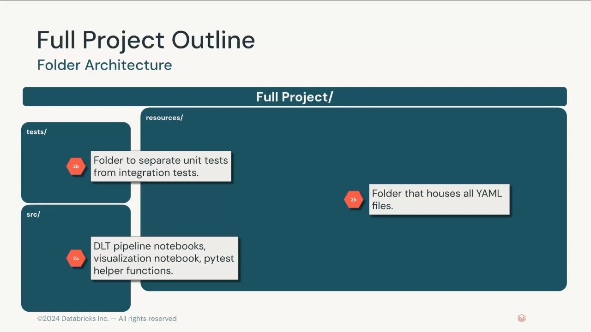
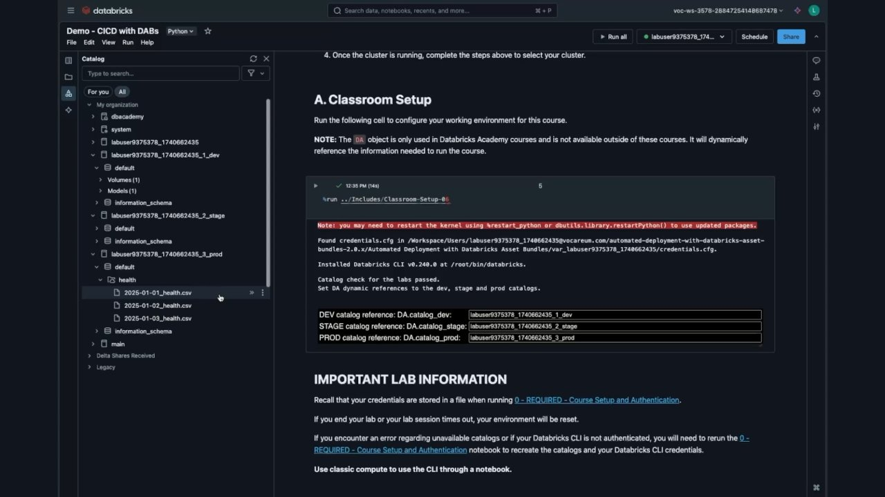
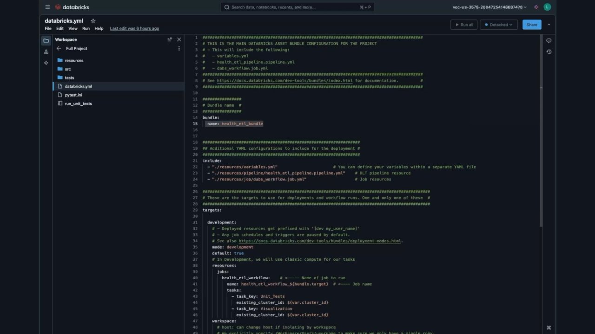
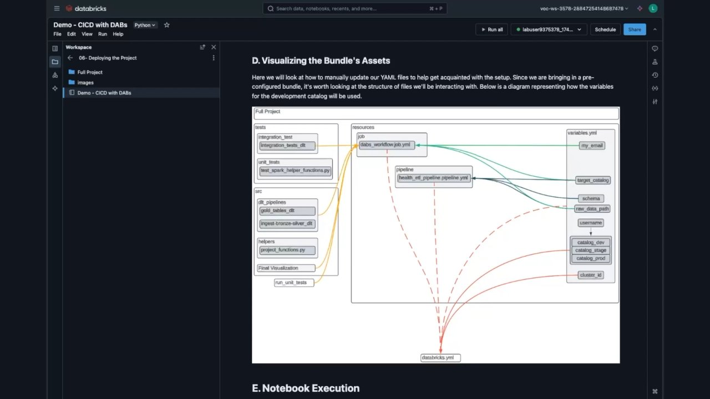

# Demo: Continuous Integration and Continuous Deployment with DABs

## Overview
In this demonstration, you implement an enterprise-grade CI/CD pipeline using Declarative Automation Bundles. The demo showcases a modular production layout integrating unit testing via `pytest`, integration testing via Spark Declarative Pipeline (SDP/DLT) Expectations, job orchestration, and automated deployments across `dev`, `stage`, and `prod` targets.

---

## Objectives
- **Implement** a fully modularized bundle architecture separating code (`src/`), tests (`tests/`), and resource definitions (`resources/`).
- **Integrate** automated unit testing into the bundle lifecycle using `pytest`.
- **Deploy and execute** an orchestrated Lakeflow Job that chains unit tests, an ingestion and transformation pipeline, and an executive visualization notebook.
- **Enforce** multi-environment parity across development, staging, and production Unity Catalog targets.

---

## Visual Captures


*Figure 12.1: Enterprise DAB folder architecture separating tests, source code, and modular resources.*


*Figure 12.2: Lab setup establishing CLI v0.240.0 and dynamic catalog references across dev, stage, and prod.*


*Figure 12.3: Root `databricks.yml` incorporating modular includes for variables, pipelines, and jobs.*


*Figure 12.4: Comprehensive architecture diagram illustrating how code, tests, and YAML resources bind to variables.*

---

## Enterprise Bundle Architecture

### Comprehensive Directory Layout
```text
Full Project/
├── databricks.yml                      # Root bundle entrypoint
├── pytest.ini                          # pytest configuration settings
├── run_unit_tests                      # Script wrapper to execute tests in Databricks
├── resources/                          # Modular YAML configurations
│   ├── variables.yml                   # Centralized variable declarations
│   ├── pipeline/
│   │   └── health_etl_pipeline.pipeline.yml # SDP / DLT pipeline specification
│   └── job/
│       └── dabs_workflow.job.yml       # Orchestrated multi-task Lakeflow Job
├── src/                                # Production transformation logic
│   ├── dlt_pipelines/
│   │   ├── ingest-bronze-silver_dlt    # Ingests CSVs and cleanses records
│   │   └── gold_tables_dlt             # Aggregates KPIs for consumption
│   ├── helpers/
│   │   └── project_functions.py        # Reusable PySpark helper functions
│   └── Final Visualization             # Dashboard notebook consuming gold tables
└── tests/                              # Automated test suites
    ├── unit_tests/
    │   └── test_spark_helper_functions.py   # Unit tests validating helper logic
    └── integration_test/
        └── integration_tests_dlt            # Pipeline expectation verification
```

---

## Configuration Specifications

### 1. `databricks.yml`
```yaml
bundle:
  name: health_etl_bundle

include:
  - "./resources/variables.yml"
  - "./resources/pipeline/health_etl_pipeline.pipeline.yml"
  - "./resources/job/dabs_workflow.job.yml"

targets:
  development:
    mode: development
    default: true
    workspace:
      root_path: /Workspace/Users/${workspace.current_user.userName}/.bundle/${bundle.name}/${bundle.target}
    resources:
      jobs:
        health_etl_workflow:
          name: health_etl_workflow_${bundle.target}
          tasks:
            - task_key: Unit_Tests
              existing_cluster_id: ${var.cluster_id}
            - task_key: Visualization
              existing_cluster_id: ${var.cluster_id}

  staging:
    mode: production
    variables:
      target_catalog: ${var.catalog_stage}

  production:
    mode: production
    variables:
      target_catalog: ${var.catalog_prod}
```

### 2. `resources/job/dabs_workflow.job.yml`
The Lakeflow Job coordinates three sequential tasks:
1. **`Unit_Tests`**: Runs `pytest` on `tests/unit_tests/`. If any test fails, the job immediately terminates, halting the release.
2. **`Execute_Pipeline`**: Runs the Spark Declarative Pipeline defined in `health_etl_pipeline.pipeline.yml`, materializing bronze, silver, and gold Delta tables with active data quality expectations.
3. **`Visualization`**: Runs `Final Visualization` to refresh business metrics and dashboards.

```yaml
resources:
  jobs:
    health_etl_workflow:
      name: health_etl_workflow_${bundle.target}
      tasks:
        - task_key: Unit_Tests
          notebook_task:
            notebook_path: ../../run_unit_tests
            source: WORKSPACE

        - task_key: Execute_Pipeline
          depends_on:
            - task_key: Unit_Tests
          pipeline_task:
            pipeline_id: ${resources.pipelines.health_etl_pipeline.id}

        - task_key: Visualization
          depends_on:
            - task_key: Execute_Pipeline
          notebook_task:
            notebook_path: ../../src/Final Visualization
            source: WORKSPACE
```

---

## End-to-End CI/CD Execution Sequence

```bash
# 1. Local / Dev Validation
databricks bundle validate

# 2. Deploy to Development & Run Iterative Tests
databricks bundle deploy -t development
databricks bundle run -t development health_etl_workflow

# 3. Automated Staging Promotion (CI/CD Pipeline)
databricks bundle deploy -t staging
databricks bundle run -t staging health_etl_workflow

# 4. Production Promotion (Following Pull Request & Release Approval)
databricks bundle deploy -t production
databricks bundle run -t production health_etl_workflow
```

---

## Key Takeaways
1. **Automated Quality Gates:** Binding unit tests (`run_unit_tests`) directly into the Lakeflow Job DAG guarantees that downstream data pipelines never process data if logic tests fail.
2. **Dynamic Pipeline Linking:** Using the resource reference `${resources.pipelines.health_etl_pipeline.id}` connects the orchestrated job task directly to the bundle-managed pipeline without hardcoding IDs.
3. **Multi-Stage Promotion:** The same code passes through dev (isolated sandbox), staging (integration verification), and production (live SLAs), modified purely by bundle target configurations.
