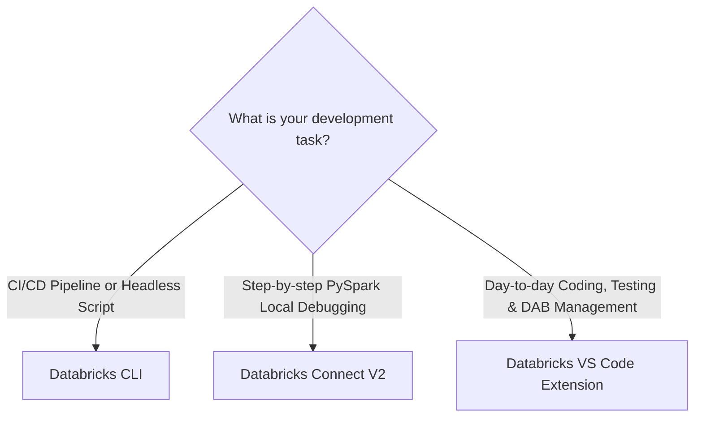

# Lecture: Developing Locally with Visual Studio Code (VS Code)

## Overview
In this lecture, you examine the modern local development toolset that connects your local IDE to the Databricks Data Intelligence Platform. You will compare the three core developer tools — the Databricks CLI, Databricks Connect V2, and the official Databricks Visual Studio Code Extension — and understand when and how to leverage each in enterprise data engineering.

---

## Learning Objectives
By the end of this lecture, you will be able to:
- **Describe** the three developer tools for working with Databricks from VS Code.
- **Explain** the distinct operational use cases for the Databricks CLI, Databricks Connect V2, and the VS Code Extension.
- **Configure** local development environments to author, debug, and deploy Declarative Automation Bundles.

---

## A. Developer Tools for Local Development

### A1. The Three Local Developer Pillars

| Developer Tool | Primary Role | Key Features |
| :--- | :--- | :--- |
| **Databricks CLI** | Scripting & CI/CD Automation | • Command-line bundle validation, deployment, and execution. • Ideal for terminal shell scripting, Docker containers, and CI/CD pipelines. • Supports unified authentication (OAuth machine-to-machine, user-to-machine, and PATs). • Fast and headless. |
| **Databricks Connect V2** | Remote Spark Execution & Debugging | • Executes standard PySpark DataFrame operations locally while delegating query compilation and execution to remote Databricks compute. • Step-through interactive debugging of PySpark code with local breakpoints. • Installed via `pip install "databricks-connect>=$DATABRICKS_RUNTIME_VERSION"`. |
| **Databricks VS Code Extension** | Native IDE Integration | • Visual interface inside VS Code for clusters, jobs, volumes, and catalogs. • Direct GUI integration with Declarative Automation Bundles (validate, deploy, run with one click). • Seamless synchronization between local workspaces and cloud files. |

---

## B. The Databricks Extension for VS Code

The official extension available in the Visual Studio Code Marketplace bridges the local developer experience with cloud Lakehouse compute:

1. **Simple Setup:**
   - Install the extension directly from the VS Code Marketplace.
   - Authenticate against workspace profiles configured via the Databricks CLI (`~/.databrickscfg`).
2. **Native Developer Experience:**
   - Full support for standard VS Code capabilities: IntelliSense autocomplete, syntax linting, Git source control, and pytest test runners.
3. **Run on Databricks:**
   - Run Python files and notebooks directly on an attached Databricks cluster or Serverless environment without leaving the editor.
4. **Declarative Automation Bundle Integration:**
   - Displays a dedicated **Databricks Asset Bundles** view in the sidebar.
   - Provides point-and-click buttons to validate `databricks.yml`, select deployment targets (`development`, `staging`, `production`), trigger deployments, and view run progress in real time.

---

## C. Tool Comparison & Selection Matrix

- **Use the CLI** when writing automated build scripts, GitHub Actions workflows, or quick terminal commands.
- **Use Databricks Connect V2** when unit testing PySpark transformations locally with standard IDE debuggers.
- **Use the VS Code Extension** for daily feature development, managing bundle YAML files, and coordinating deployment targets visually.

---

## D. Conclusion
- The modern Databricks developer experience centers on local development in IDEs like Visual Studio Code.
- Together, the **CLI**, **Databricks Connect V2**, and the **VS Code Extension** empower data engineers to write, debug, test, and deploy production-grade bundles with full software engineering rigor.

---

## Next Steps
In the next demo, you will observe the Databricks VS Code Extension and Databricks Connect in action.
