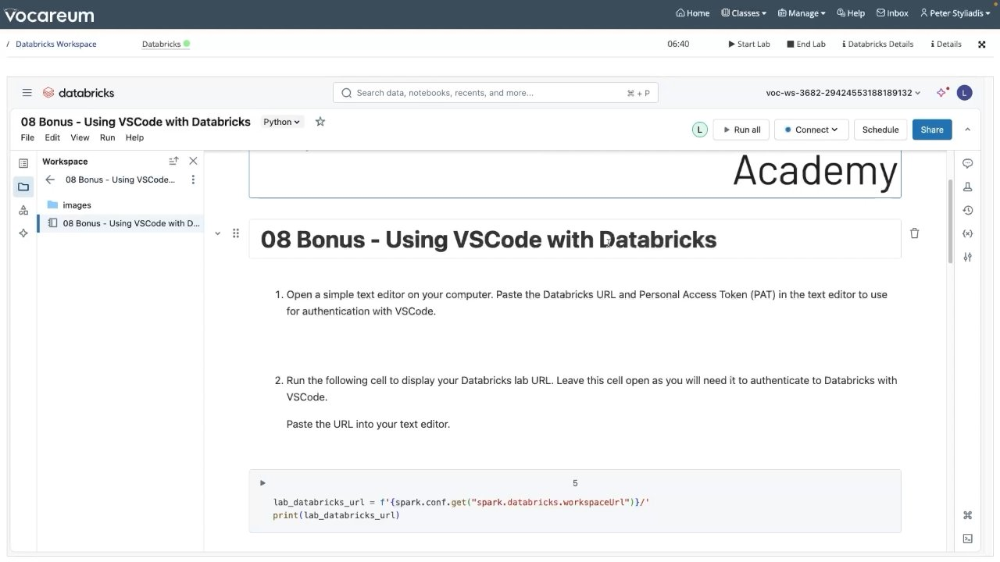
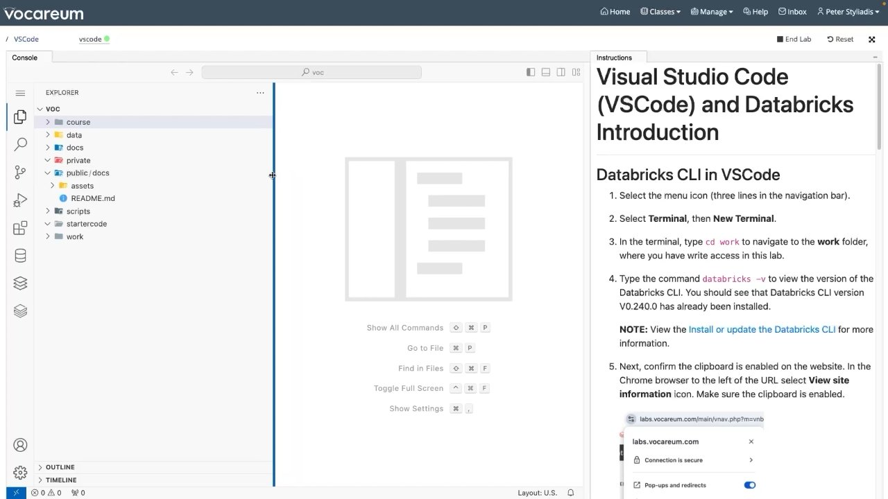
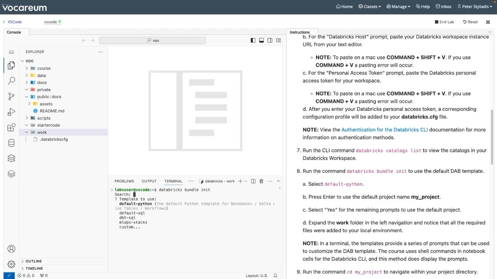
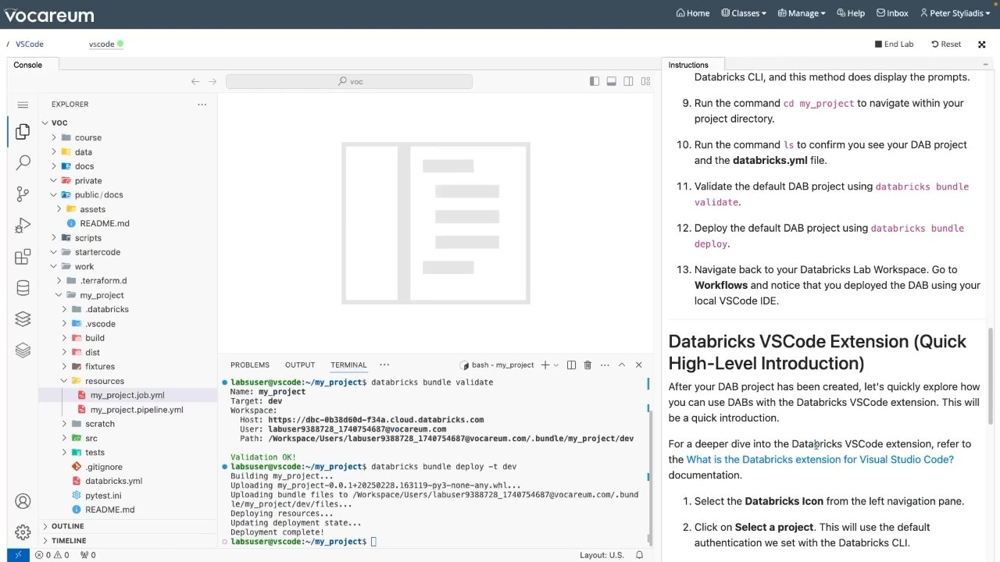

# Demo: Using VSCode with Databricks

## Overview
In this demonstration, you walk through configuring a complete local developer environment in Visual Studio Code. You will configure the Databricks CLI with token authentication, scaffold a production-ready bundle using `databricks bundle init default-python`, inspect the generated project structure (including automated wheel packaging), execute bundle validation and deployment from the integrated terminal, and explore the Databricks VS Code Extension interface.

---

## Objectives
- **Retrieve** workspace instance URLs and Personal Access Tokens (PATs) for local authentication.
- **Configure** Databricks CLI authentication profiles (`.databrickscfg`).
- **Scaffold** a new bundle project using the `default-python` template.
- **Validate and deploy** local bundle assets, Python wheels, and DLT pipelines to Databricks directly from VS Code.
- **Utilize** the Databricks VS Code Extension graphical interface to manage deployments.

---

## Visual Captures


*Figure 14.1: Retrieving workspace URL and credentials from the Databricks Academy notebook.*


*Figure 14.2: Initializing the VS Code terminal and verifying Databricks CLI v0.240.0.*


*Figure 14.3: Running `databricks bundle init` and selecting the `default-python` template.*


*Figure 14.4: VS Code terminal executing `bundle validate` and `bundle deploy`, showing wheel artifact generation and workspace file synchronization.*

---

## Step-by-Step Implementation Guide

### Step 1: Authentication Configuration
From the local VS Code terminal, navigate to your development directory and configure your Databricks profile:

```bash
cd work
databricks configure
```

**Prompts:**
- **Databricks Host:** `https://<workspace-instance-id>.cloud.databricks.com/`
- **Personal Access Token:** `<dapi...token>`

This writes credentials to `~/.databrickscfg`:
```ini
[DEFAULT]
host = https://dbc-0b38d60d-f34a.cloud.databricks.com/
token = dapi********************************
```

Verify connection by querying Unity Catalog:
```bash
databricks catalogs list
```

---

### Step 2: Scaffolding with `bundle init`
Generate a standard Python bundle project:

```bash
databricks bundle init
```

**Interactive Selection:**
```text
? Template to use:
> default-python (The default Python template for Notebooks / Delta Live Tables / Workflows)
  default-sql
  dbt-sql
  mlops-stacks
  custom...
```
- Set bundle name: `my_project`
- Accept defaults for catalog, schema, and Python wheel packaging.

---

### Step 3: Project Structure Generated by Template
```text
my_project/
├── .databricks/                  # CLI state tracking
├── .vscode/                      # VS Code debug and task settings
├── build/                        # Intermediate compilation assets
├── dist/                         # Packaged Python wheel (.whl)
├── fixtures/                     # Test data samples
├── resources/                    # Modular resource definitions
│   ├── my_project.job.yml        # Orchestrated Lakeflow Job
│   └── my_project.pipeline.yml   # Spark Declarative Pipeline definition
├── scratch/                      # Ad-hoc experimental scripts
├── src/                          # Business logic modules
│   └── my_project/
│       ├── __init__.py
│       └── main.py
├── tests/                        # Automated test suites
│   ├── main_test.py
│   └── fixtures/
├── .gitignore
├── databricks.yml                # Master bundle definition
├── pytest.ini                    # pytest test discovery rules
└── README.md
```

---

### Step 4: Validating and Deploying from VS Code Terminal

```bash
cd my_project

# 1. Validate bundle syntax and schema
databricks bundle validate
```

**Validation Output:**
```text
Name: my_project
Target: dev
Workspace:
  Host: https://dbc-0b38d60d-f34a.cloud.databricks.com
  User: developer@company.com
  Path: /Workspace/Users/developer@company.com/.bundle/my_project/dev
Validation OK!
```

```bash
# 2. Deploy bundle to dev target
databricks bundle deploy -t dev
```

**Deployment Lifecycle Execution:**
1. **Building package:** Compiles Python source code into a wheel: `dist/my_project-0.0.1-py3-none-any.whl`.
2. **Uploading artifacts:** Synchronizes the wheel file and bundle assets to cloud storage.
3. **Provisioning resources:** Creates/updates `my_project.job` and `my_project.pipeline` in the target workspace.
4. **Dev isolation:** Prepend `[dev <username>]` to all resource names.

---

### Step 5: Utilizing the Databricks VS Code Extension
1. Click the **Databricks Icon** on the VS Code Activity Bar (left sidebar).
2. Click **Select a project** and point to `my_project/databricks.yml`.
3. The sidebar reveals:
   - **Configuration:** Target environment selector (`dev`, `staging`, `prod`).
   - **Compute:** Cluster attachment picker.
   - **Bundle Actions:** Direct GUI buttons for **Validate**, **Deploy**, and **Run Workflows**.
   - **Workflows & Pipelines Explorer:** Real-time run status and execution logs streamed directly into the IDE output tab.

---

## Key Takeaways
1. **No Manual Packaging:** The `default-python` template automatically builds Python wheel artifacts upon `databricks bundle deploy` and installs them onto cluster compute.
2. **Standardized IDE Workflow:** Developers gain access to local Git, breakpoint debugging with Databricks Connect, linting, and automated testing without touching the web browser.
3. **Single Configuration Source:** Both the Databricks CLI and the VS Code Extension share the same `databricks.yml` and `.databrickscfg` configuration files.
