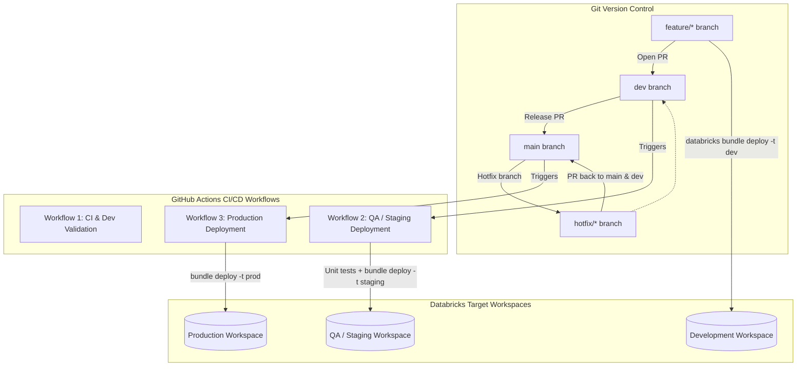

# Lecture: CI-CD Best Practices and Next Steps with GitHub Actions

## Overview
This lecture brings together foundational best practices for implementing continuous integration and continuous deployment in enterprise data engineering. You will examine the five core principles of data CI/CD, explore an enterprise GitFlow-style deployment architecture combining Declarative Automation Bundles with GitHub Actions, and review third-party Git provider integrations supported by Databricks.

---

## Learning Objectives
By the end of this lecture, you will be able to:
- **Summarize** the key best practices for implementing CI/CD in data engineering.
- **Describe** a deployment architecture combining DABs with GitHub Actions and a GitFlow branching strategy.
- **Identify** common Git providers and CI/CD tools that integrate with Databricks.

---

## A. CI/CD Best Practices for Data Engineering

### A1. The Five Core Practices to Remember
Successful data engineering DevOps rests on five foundational disciplines:

1. **Define a Clear Testing Strategy:**
   - Automate unit tests (`pytest`), integration tests (Spark Declarative Pipeline Expectations), and end-to-end system jobs.
   - Enforce quality gates that block promotions if test assertions fail.
2. **Automate Deployment with DABs:**
   - Eliminate error-prone manual UI changes.
   - Use Declarative Automation Bundles for consistent, declarative, and repeatable deployments across all environments.
3. **Implement a Robust Version Control Strategy:**
   - Treat all pipeline code, notebooks, test scripts, and infrastructure configurations as code in Git.
   - Enforce structured branching patterns (such as GitFlow or GitHub Flow).
4. **Establish Mandatory Code Reviews:**
   - Require peer reviews and automated status checks on pull requests before code merges into shared branches.
   - Verify logic transformations, data quality rules, and security/governance compliance.
5. **Monitor and Optimize CI/CD Pipelines:**
   - Continuously track pipeline runtime, build durations, and test coverage.
   - Optimize cluster spin-up times using serverless compute or warm pools.

---

## B. Automated Deployment with GitHub Actions & GitFlow

### B1. GitFlow Branching Architecture with DABs

### B2. Workflow Lifecycle Stages

1. **Feature Development (`feature/*`)**:
   - Developers branch off `dev`.
   - Work locally in VS Code or notebook sandboxes.
   - Manually deploy and test against their isolated development workspace (`mode: development`).
2. **Integration & Testing (`dev` branch)**:
   - Developer opens a Pull Request into `dev`.
   - GitHub Actions workflow triggers automatically:
     - Runs `databricks bundle validate`.
     - Executes unit test suites (`pytest`).
     - Checks code coverage and runs security/credential scans.
   - Once approved and merged, GitHub Actions deploys the bundle to the QA/Staging workspace (`databricks bundle deploy -t staging`).
3. **Production Release (`main` branch)**:
   - A release PR is submitted from `dev` to `main`.
   - Following managerial/stakeholder approvals, the merge creates an official release tag.
   - The production GitHub Actions workflow executes:
     - Authenticates using an enterprise **Service Principal** (OAuth M2M).
     - Deploys the bundle to production: `databricks bundle deploy -t prod`.
     - Activates production schedules, alert notifications, and SLA monitoring.
4. **Hotfix Workflow (`hotfix/*`)**:
   - Critical production defects are branched directly from `main`.
   - The fix is verified in staging, deployed to production, and merged back into both `main` and `dev` to maintain branch parity.

---

## C. Supported Git Integrations

Databricks seamlessly integrates with industry-standard Git providers for both workspace repository synchronization (Databricks Git Folders / Repos) and automated CI/CD:
- **GitHub & GitHub Actions**
- **GitLab & GitLab CI/CD**
- **Azure DevOps (Repos & Pipelines)**
- **Bitbucket & Bitbucket Pipelines**
- **AWS CodeCommit**

---

## D. Conclusion
- Enterprise data engineering requires structured testing, automated deployments, version control, code review, and active pipeline monitoring.
- Pairing **Declarative Automation Bundles** with **GitHub Actions** creates a deterministic, audited promotion path from developer laptop to mission-critical production.
- A single codebase and bundle definition powers all stages of the GitFlow lifecycle simply by toggling deployment targets.

---

## Next Steps
In the next section, you will review the complete course summary before taking the final graded certification quiz.
