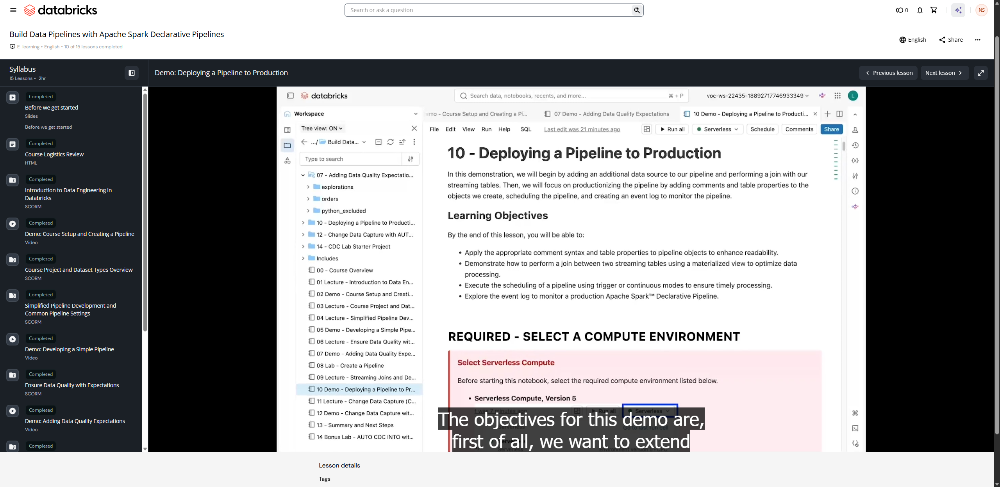

# Demo: Deploying a Pipeline to Production

**Course:** Build Data Pipelines with Lakeflow Spark Declarative Pipelines  
**Lesson:** 11 (Demo)  
**Duration:** ~20 min (1228s)  
**Instructor:** Marcelino Mayorga (Senior Technical Instructor, Databricks)  
**Screenshot:** 

---

## Overview & Learning Objectives

In this hands-on demonstration, Marcelino walks through taking an existing Spark Declarative Pipeline (Lakeflow pipeline) developed in development mode and deploying it into a production-ready schedule and execution model.

Key concepts demonstrated:
- Transitioning from **Development** to **Production** mode in Lakeflow Pipelines.
- Configuring **Continuous vs. Triggered** pipeline execution.
- Managing pipeline storage, target schema, and catalog in Unity Catalog.
- Automating pipeline runs using **Lakeflow Jobs / Workflows** integration.
- Monitoring pipeline runs, streaming metrics, and data quality expectations in production.

---

## Verbatim Video Transcript & Walkthrough

- **[00:00 - 00:01]** Hello everyone.
- **[00:01 - 00:02]** My name is Marcelino Mayorga.
- **[00:02 - 00:07]** I'm a senior technical instructor, and I will walk you through in this demo
- **[00:07 - 00:09]** 10 Deploying a Pipeline to Production.
- **[00:09 - 00:13]** The objectives for this demo are, first of all, we want to extend
- **[00:13 - 00:17]** our pipeline to include the new business concept of a status.
- **[00:18 - 00:21]** This will help us to extract a status details for our orders.
- **[00:22 - 00:26]** So we're going through the medallion architecture with the bronze, silver,
- **[00:26 - 00:28]** and gold datasets for the status.
- **[00:29 - 00:32]** Beyond of it, we're going to use a materialized view to join
- **[00:32 - 00:34]** our orders data with the status.
- **[00:35 - 00:38]** And for the pipeline operations, we're going to review the pipeline
- **[00:38 - 00:43]** mode and finally see how we can configure and query or event log.
- **[00:44 - 00:48]** Now, let's proceed to attach this notebook to a serverless compute
- **[00:48 - 00:53]** version 5 as usual, and let's run the classroom setup, which I already run.
- **[00:54 - 00:58]** Then, as I mentioned, we want to explore the orders and status.
- **[00:58 - 01:02]** So here in cell 8, we can see that we get the orders.
- **[01:02 - 01:04]** There's nothing new about this JSON.
- **[01:04 - 01:06]** We've been using it in the previous demos.
- **[01:07 - 01:11]** So here we can see the customer_id, that notifications, the order_id, the
- **[01:11 - 01:12]** order_timestamp, and _rescued_data.
- **[01:13 - 01:17]** So we can use the order_id in order to have a join with the status.
- **[01:18 - 01:23]** So within your source volume, you can see that we have
- **[01:23 - 01:25]** another folder for the status.
- **[01:26 - 01:30]** So we can proceed to read it pretty much as we did with the orders, and
- **[01:30 - 01:34]** the whole intention is to retrieve the defined order_status name
- **[01:37 - 01:42]** In this cell number 10, we can see that for a specific order_id, we
- **[01:42 - 01:46]** can see the different statuses that changes across the whole process.
- **[01:46 - 01:48]** And this is the best-case scenario, right?
- **[01:48 - 01:54]** We got the order was placed, then it was prepared, on the wait, and delivered.
- **[01:58 - 02:04]** So here in cell number 12, what we can do is read from these two sources, and
- **[02:04 - 02:07]** we can leverage here a common table expressions that holds these results
- **[02:07 - 02:10]** in memory, and it acts like a table.
- **[02:11 - 02:16]** So here we have one for orders, one for statuses, and then we have a
- **[02:16 - 02:21]** query here below where you can see we're doing a select on both tables,
- **[02:21 - 02:27]** that both they have a inner join from orders with status, and we're using
- **[02:27 - 02:30]** the order_id to match both tables.
- **[02:31 - 02:35]** And from there, we're pulling the order_id, the order_timestamp, the
- **[02:35 - 02:38]** order_status, and the order_timestamp.
- **[02:40 - 02:41]** Here we can see the results.
- **[02:44 - 02:44]** Good.
- **[02:44 - 02:48]** Now let's proceed to implement this into the pipeline.
- **[02:48 - 02:52]** Here we can see the resulting DAG after we prepare this pipeline.
- **[02:53 - 02:57]** Here we got the orders_bronze, the order_silver, and the gold_orders_by_date
- **[02:58 - 03:01]** as for materialized view that we reviewed in the previous demos.
- **[03:02 - 03:04]** And then we're gonna focus on this side.
- **[03:04 - 03:08]** Now we have the status_bronze, status_silver, and then we're going
- **[03:08 - 03:11]** to join both the status_silver and order_silver to get the
- **[03:12 - 03:14]** full_order_info_gold materialized view.
- **[03:15 - 03:18]** And from there, we're going to create two additional materialized
- **[03:18 - 03:23]** views, just filtered by their status, one for the canceled and
- **[03:23 - 03:25]** the another one for the delivered.
- **[03:28 - 03:33]** Here in cell 16, we got this function create declarative pipeline.
- **[03:33 - 03:36]** This was created by the classroom setup, and this is going to provide for
- **[03:36 - 03:39]** us a configuration of a new pipeline.
- **[03:39 - 03:42]** Here we can see the name of the new pipeline, so it's 10-Deploying
- **[03:42 - 03:44]** a Pipeline to Production.
- **[03:44 - 03:49]** Here we're also setting up the root folder into one of the folders
- **[03:49 - 03:50]** that are placed in our workspace.
- **[03:51 - 03:55]** We're setting up the catalog and schema as a default and
- **[03:55 - 03:57]** also setting up the code assets.
- **[03:57 - 04:02]** And as you can see now, we have not only orders, we also have statuses.
- **[04:02 - 04:05]** And you can see that we also have those folders in that
- **[04:06 - 04:07]** folder for that demo number 10.
- **[04:09 - 04:15]** From here now we're going to open the jobs and pipelines in the menu in a new tab.
- **[04:18 - 04:25]** And here we'll see now the 10-Deploying a Pipeline to Production pipeline.
- **[04:25 - 04:30]** Again, this is going to take you to that monitor page where again, we
- **[04:30 - 04:35]** haven't executed anything just yet, so we don't get to see much information.
- **[04:35 - 04:39]** We want to go to the code, so we click Edit pipeline or in the
- **[04:39 - 04:41]** source code in Open in Editor.
- **[04:46 - 04:48]** From here, we want to review the code.
- **[04:48 - 04:50]** So we already reviewed the orders.
- **[04:50 - 04:52]** It remains the same as the previous demo.
- **[04:52 - 04:54]** But notice we got the status folder with the status_pipeline.sql.
- **[04:57 - 04:58]** Let's review this file.
- **[04:58 - 05:03]** Again, this is going to create the bronze, silver, and gold layer
- **[05:03 - 05:05]** materialized views and streaming tables.
- **[05:06 - 05:08]** So first, we're going to start with the status_bronze.
- **[05:09 - 05:10]** This is a streaming table.
- **[05:11 - 05:15]** So notice in this case, now we're adding some metadata about this table.
- **[05:15 - 05:20]** We are adding the comment, which again, this is very important because this
- **[05:20 - 05:24]** is going to empower the searchability that Unity Catalog provides.
- **[05:25 - 05:30]** Also, we got table properties, which I got a very common question, if we should
- **[05:30 - 05:33]** add the name of the layer into the table.
- **[05:34 - 05:38]** In this case, we're doing this to make it explicit, but normally we
- **[05:38 - 05:42]** leverage whether table properties or tagging into the table.
- **[05:43 - 05:47]** Second, you can see in the table properties, we got this option that
- **[05:47 - 05:51]** says pipeline.reset_allowed = false.
- **[05:52 - 05:57]** So this flag is quite important because it's gonna help us out to lock the table
- **[05:57 - 06:04]** and avoid being truncated when you run your pipeline with full table refresh.
- **[06:04 - 06:08]** As I mentioned, in some cases, we don't want to do that because we may
- **[06:08 - 06:10]** lose data that we already processed.
- **[06:11 - 06:12]** So this flag is quite important.
- **[06:12 - 06:14]** This is how you prevent that.
- **[06:14 - 06:19]** So in this case, we're just reading the data from this time about the status
- **[06:19 - 06:22]** folder from our source volume path.
- **[06:22 - 06:23]** Pretty much the same, right?
- **[06:23 - 06:27]** We're getting all the columns, and then we're adding some metadata information.
- **[06:28 - 06:29]** Perfect.
- **[06:30 - 06:32]** Next, we got our status_silver.
- **[06:33 - 06:36]** And notice over here, we got two expectations.
- **[06:36 - 06:41]** The first one is called valid_timestamp, where we're validating the order_timestamp
- **[06:42 - 06:47]** to be greater than December 25th from 2021, with the behavior in
- **[06:47 - 06:51]** action ON VIOLATION DROP ROW.
- **[06:52 - 06:55]** Next, we have a second expectation called valid order_status.
- **[06:55 - 06:58]** In this case, we're making sure that the order_status column only
- **[06:58 - 07:01]** have these values specifically.
- **[07:02 - 07:06]** Next, we got some comments, and we got a table properties for this one.
- **[07:07 - 07:11]** As you may notice, in this case, we only have a very simple select to
- **[07:11 - 07:15]** pick the order_id, the order_status, and the status_timestamp.
- **[07:15 - 07:16]** We're reading from the status_bronze.
- **[07:19 - 07:24]** Next, we got the materialized view, starting with the full_order_info_gold.
- **[07:25 - 07:28]** So this one has create or refresh materialized view.
- **[07:28 - 07:30]** We add a comment, we add a table properties.
- **[07:31 - 07:35]** And in here, this is where we implement the join that we did in the notebook.
- **[07:36 - 07:42]** As you may notice over here, we're doing a join between the status and orders, and
- **[07:42 - 07:47]** actually we're joining them and matching them with the order_id on both ends.
- **[07:47 - 07:51]** So that way we can retrieve information from both tables.
- **[07:52 - 07:58]** Next, we got two materialized view that uses these full_order_info_gold.
- **[07:59 - 08:01]** The first one is called canceled_orders_gold.
- **[08:01 - 08:06]** So we are just doing a query in there, just adding here an extra
- **[08:06 - 08:12]** column for days to cancel, and we're filtering the full_order_info_gold
- **[08:12 - 08:14]** with order_status equals canceled.
- **[08:15 - 08:19]** The second materialized view is called delivered_orders_gold, and it follows
- **[08:19 - 08:24]** a similar approach, but in this case only with a filter of our order_status.
- **[08:27 - 08:32]** Now, before we run this pipeline, let's review some specific settings that help
- **[08:32 - 08:34]** us with the operations of our pipeline.
- **[08:34 - 08:39]** First of all, in the run pipeline here, we can see that we have also the option
- **[08:39 - 08:41]** of Run now with different settings.
- **[08:42 - 08:46]** So over here, we got the option to set up the table refresh.
- **[08:46 - 08:48]** We also got the performance optimize.
- **[08:48 - 08:52]** Again, we're working with serverless, so this is going to optimize
- **[08:54 - 08:57]** the startup and the performance of the process of the pipeline.
- **[08:58 - 09:02]** But here we have a very important feature that is called automatic recovery.
- **[09:02 - 09:08]** So our automatic recovery by default is disabled because, mainly
- **[09:08 - 09:10]** because this is for development.
- **[09:10 - 09:15]** In development, you iterate through your code, so when you run your pipeline,
- **[09:15 - 09:21]** your cluster is going to be attached for a few minutes later on, and you can
- **[09:21 - 09:23]** reiterate as many times as you need.
- **[09:24 - 09:31]** But when you enable this Run pipeline with retry, the retries are going to be managed
- **[09:31 - 09:33]** for you, so this is ideal for production.
- **[09:34 - 09:37]** So enable this for your production pipelines.
- **[09:39 - 09:44]** Next, we got here in the settings, we got the pipeline mode, which in this
- **[09:44 - 09:49]** case, by default, and we're going to use this, is going to be set as triggered.
- **[09:49 - 09:54]** Triggered, it means it can be manually triggered via the UI, the
- **[09:54 - 10:00]** CLI, the API, or using the Databricks automation bundles or the DABs.
- **[10:01 - 10:03]** Next, consider the run as well.
- **[10:03 - 10:08]** So you can create a service principal, a dummy service principal with the right
- **[10:08 - 10:13]** permissions to your catalogs and schemas, so it can run this pipeline effectively.
- **[10:16 - 10:22]** Next, we got notifications, where here you're allowed to set up the email on
- **[10:22 - 10:27]** the different events of your pipeline of success, failure, and fatal failure.
- **[10:27 - 10:32]** Fatal failure is related with the automatic recovery option as well.
- **[10:33 - 10:36]** After a few times, then it's going to launch a fatal
- **[10:36 - 10:38]** failure if it couldn't recover.
- **[10:38 - 10:44]** And on a flow, here we can capture exactly when there is an issue when
- **[10:45 - 10:50]** between the hops of your flowing data, between your volume and your bronze
- **[10:50 - 10:55]** table, between your bronze table to your silver table, to your silver
- **[10:55 - 10:58]** table to your gold materialized view.
- **[10:59 - 11:03]** If you need further options, you may want to consider Lakeflow
- **[11:03 - 11:08]** Jobs, where we got options with PagerDuty, Slack, and even more.
- **[11:09 - 11:14]** Last but not least, here in the advanced settings, everything that we do to
- **[11:14 - 11:19]** our pipeline, all modifications, all executions, everything gets logged.
- **[11:19 - 11:24]** Automatically, it is logged into a hidden table in the default catalog and schema.
- **[11:24 - 11:29]** But from here, we can proceed to click here at the advanced settings, and we can
- **[11:29 - 11:35]** define what is the name of that table, into what catalog, and to what schema.
- **[11:35 - 11:38]** So again, you don't have to find that hidden table.
- **[11:38 - 11:45]** By the way, you can just provide or use a function that is already available in the
- **[11:45 - 11:51]** framework in SQL that is called event_log, and then you pass the pipeline ID, and
- **[11:51 - 11:53]** you're gonna get that information as well.
- **[11:53 - 11:58]** So it makes sense, and it's very friendly to, better to give an proper name to that
- **[11:58 - 12:01]** table and also to your catalog and schema.
- **[12:03 - 12:05]** Now let's go ahead and run the pipeline.
- **[12:11 - 12:13]** So again, we're going to set up our sdp_1_bronze.
- **[12:16 - 12:18]** And here we can see the pipeline graph.
- **[12:18 - 12:22]** So we can see precisely now the orders and status.
- **[12:24 - 12:26]** Now our pipeline just finished.
- **[12:26 - 12:31]** So here we can see the resulting DAG where we're handling now the status and orders.
- **[12:31 - 12:36]** And remember, in this case, we got two different files, one for
- **[12:36 - 12:37]** orders, another one for status.
- **[12:38 - 12:43]** And in the status here, we're just declaring the dependency to our
- **[12:43 - 12:48]** orders, and the service is going to manage that dependency order.
- **[12:49 - 12:52]** And this will allow us to execute in parallel both status_bronze and
- **[12:53 - 12:53]** orders_bronze, then our status_silver and
- **[12:55 - 12:56]** order_silver.
- **[12:58 - 13:06]** And this will allow the materialized view for the orders to generate, and
- **[13:06 - 13:11]** at the same time, it will hold until both status_silver and order_silver
- **[13:11 - 13:15]** are ready to trigger the full order within for materialized view.
- **[13:16 - 13:21]** And of course, after this one is done, then it proceeds to create the subsequent
- **[13:21 - 13:26]** materialized views, one for delivered orders, the other one for canceled orders.
- **[13:27 - 13:32]** And of course, we can add new JSON files to showcase the incremental ingestion.
- **[13:32 - 13:38]** So we can go back to our notebook number 10 into our cell number 34.
- **[13:39 - 13:43]** And in this cell is going to place more JSON files into our
- **[13:43 - 13:45]** folder within our source volume.
- **[13:46 - 13:51]** So here we can see we got more JSON placing here.
- **[13:52 - 13:56]** So we just go back into our pipeline, and we run it once again.
- **[13:57 - 13:59]** And here we can see how the data is flowing.
- **[14:01 - 14:07]** In here, my recommendation is that you can adjust the UI so you get more room, and
- **[14:07 - 14:11]** you can see that nice DAG being generated.
- **[14:17 - 14:17]** Good.
- **[14:18 - 14:22]** Now we can see there is an incremental number of all the tables, and
- **[14:22 - 14:25]** we were able to see how the data flew from one side to another.
- **[14:27 - 14:32]** After running our pipeline, remember that everything in the pipeline gets logged,
- **[14:33 - 14:35]** so we can go back into our notebook.
- **[14:36 - 14:42]** In the cell 42 over here, we can see that we're querying our event_log_demo10
- **[14:43 - 14:46]** table in our sdp_1_bronze schema.
- **[14:47 - 14:50]** And in this table, this holds a lot of information.
- **[14:50 - 14:54]** Again, all the actions, all the executions, all modifications.
- **[14:54 - 15:00]** So these event logs are good for audit logs, data quality checks,
- **[15:00 - 15:02]** pipeline progress, and data lineage.
- **[15:03 - 15:08]** So notice over here, you got an ID, you got a sequence where all the events
- **[15:08 - 15:13]** are happening with an origin, where we get more information about the
- **[15:13 - 15:14]** compute that executed the pipeline.
- **[15:15 - 15:18]** We got a timestamp, we got a message.
- **[15:18 - 15:22]** By the way, all this information is also displayed in the monitoring page.
- **[15:22 - 15:22]** Here we can see
- **[15:25 - 15:32]** the info, maturity_level, and as well the columns for details and event_type.
- **[15:33 - 15:37]** These two columns are one of the most important because you want
- **[15:37 - 15:41]** to filter based on the event_type, based on the different types that we
- **[15:41 - 15:44]** have: update_progress, user_action, create_update, user_code_context,
- **[15:44 - 15:44]** runtime_details, data_life_cycle,
- **[15:50 - 15:50]** and even more.
- **[15:51 - 15:55]** But based on your event_type, information is going to be
- **[15:55 - 15:58]** placed into the details column.
- **[15:58 - 16:01]** And as you may noticed, all this information, it is
- **[16:01 - 16:03]** a JSON, a string of JSON.
- **[16:04 - 16:08]** So this gives you plenty of flexibility of what you can
- **[16:08 - 16:10]** extract out of these operations.
- **[16:11 - 16:15]** And remember, we reviewed these on the first course or in data
- **[16:15 - 16:19]** ingestion, how you can flatten and extract information from a JSON.
- **[16:19 - 16:24]** So here we can see in cell 45 we're doing that exactly.
- **[16:25 - 16:28]** We're cherry-picking here the id column, the event_type, and the
- **[16:28 - 16:30]** details that has all the information.
- **[16:31 - 16:39]** But seeing it is a string with a JSON, we can use a colon to extract a
- **[16:39 - 16:42]** specific attribute within that JSON.
- **[16:42 - 16:47]** So in this case, we're getting the flow_progress and the user_action This is
- **[16:47 - 16:51]** known as flattening because we're getting into their own corresponding columns.
- **[16:51 - 16:53]** So here we got the flow_progress and user_action.
- **[16:54 - 16:59]** Of course, not all event_types are going to have information, so you have to
- **[16:59 - 17:02]** explore this, all this information, okay?
- **[17:03 - 17:06]** We also have a documentation that it tells more information
- **[17:06 - 17:08]** about all these event_types.
- **[17:08 - 17:13]** So notice in this cell 47, we're going to leverage a little bit
- **[17:13 - 17:16]** what we learned from data ingestion with Lakeflow Connect course.
- **[17:17 - 17:20]** And over here, we have a temporary view that is called dq_source_vw.
- **[17:23 - 17:27]** And notice we're loading data or reading data from the event log.
- **[17:28 - 17:31]** And over here, we're doing two things.
- **[17:31 - 17:37]** First of all, we want to transform that JSON column of details to a
- **[17:37 - 17:41]** struct, and then we want to explode it.
- **[17:41 - 17:45]** This is going to return us a list of items, and then we want to explode
- **[17:45 - 17:47]** them, give their own records.
- **[17:48 - 17:52]** So notice over here, the details columns has an structure of flow_progress.
- **[17:52 - 17:55]** That flow_progress has an structure of data quality, and
- **[17:55 - 17:57]** inside it has expectations.
- **[17:58 - 18:03]** The from_json, the second argument, you provide the schema that you
- **[18:03 - 18:08]** need, and then we are going to explode all that information.
- **[18:08 - 18:10]** And notice over here we're filtering based on the flow_progress.
- **[18:11 - 18:17]** By the way, this query is exactly to get the expectations that were
- **[18:17 - 18:20]** infringed during the executions.
- **[18:20 - 18:25]** So here we have a select that we are using that dq_service
- **[18:25 - 18:27]** or data quality source view.
- **[18:28 - 18:32]** And here we're grouping the data based on a dataset and using the names.
- **[18:32 - 18:35]** And at the same time, we're running an aggregation for the
- **[18:35 - 18:37]** passing_records and the warning_records.
- **[18:38 - 18:42]** So in this case, this is telling us, hey, in the order_silver
- **[18:42 - 18:46]** table, there are expectations for valid_notifications, valid_date,
- **[18:46 - 18:50]** valid_order_status, and valid_timestamp.
- **[18:51 - 18:55]** And then we got these number of records that passed and the warn records as well.
- **[18:56 - 19:03]** So in this event log, again, in there you can pull audit logs, data quality checks,
- **[19:04 - 19:06]** pipeline progress, and data lineage.
- **[19:06 - 19:12]** I recommend to check for the documentation that shows even more helpful scripts
- **[19:12 - 19:14]** to retrieve all this information.
- **[19:16 - 19:20]** And the event log is key because that means that the observability, you're
- **[19:20 - 19:23]** not tied to the UI to see the results.
- **[19:23 - 19:26]** You can actually query this table to understand what happened to
- **[19:26 - 19:28]** all the runs of your pipeline.
- **[19:29 - 19:31]** So you can even extend this.
- **[19:31 - 19:35]** Let's say that you have a Lakeflow job where you have your task number
- **[19:35 - 19:40]** one being a Spark declarative pipelines to run your ETL process.
- **[19:40 - 19:45]** And then you can have a second task, let's say with the just a
- **[19:45 - 19:49]** simple notebook, that it creates and extracts all these insights.
- **[19:50 - 19:54]** And based on these results, you can determine if your pipeline
- **[19:54 - 19:56]** run was successful or not
- **[19:58 - 19:58]** good.
- **[19:58 - 20:04]** So in this demo, we were able to join data between two concepts, status and orders.
- **[20:04 - 20:07]** We went through the full medallion architecture, and we even
- **[20:07 - 20:11]** extended with extra materialized views to get information of
- **[20:11 - 20:13]** cancel and delivered orders.
- **[20:13 - 20:17]** We reviewed the operations about your pipeline and how you can
- **[20:17 - 20:23]** leverage the different modes, the notifications, the event log, and more.

---

## Key Takeaways

1. **Development vs. Production Mode:**
   - In Development mode, clusters remain active to avoid startup latency during iterative testing, and tables can be quickly reset.
   - In Production mode, clusters terminate after execution (in triggered mode) to optimize compute costs, and retries are automatically handled.

2. **Triggered vs. Continuous Execution:**
   - **Triggered:** Processes newly arrived data once and stops compute. Ideal for batch or hourly ingestion where compute cost must be minimized.
   - **Continuous:** Keeps streaming clusters running continuously, processing micro-batches as soon as files or events arrive with sub-minute latency.

3. **Production Governance:**
   - Always target a dedicated production schema/catalog in Unity Catalog.
   - Attach data quality expectations with `ON VIOLATION DROP ROW` or `FAIL UPDATE` according to SLA requirements.
