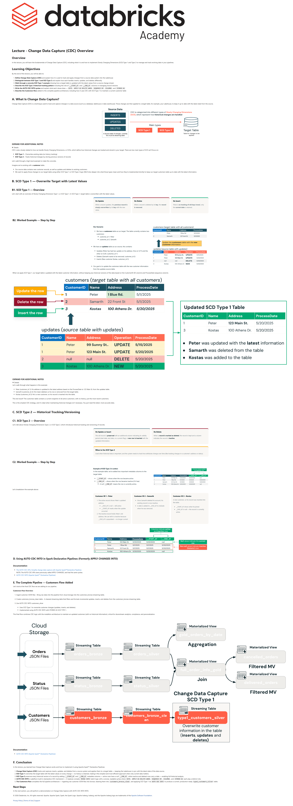

# Lecture: Change Data Capture (CDC) Overview

**Course:** Build Data Pipelines with Lakeflow Spark Declarative Pipelines  
**Lesson:** 12 (Lecture / SCORM)  
**Full Screenshot:** 

---

## Verbatim Lesson Content

	

	
Lecture - Change Data Capture (CDC) Overview
Overview

In this lecture, you will learn the fundamentals of Change Data Capture (CDC), including what it is and how to implement Slowly Changing Dimensions (SCD) Type 1 and Type 2 to manage and track evolving data in your pipelines.

Learning Objectives

By the end of this lecture, you will be able to:

Define Change Data Capture (CDC) and explain how it is used to track and apply changes from a source data system into the Lakehouse
Distinguish between SCD Type 1 and SCD Type 2 and explain how each handles inserts, updates, and deletes differently
Walk through a concrete SCD Type 1 example showing how a target table is updated with the latest values from a source change stream
Describe the SCD Type 2 historical tracking pattern including the role of __START_AT and __END_AT columns in managing record versions
Write the AUTO CDC INTO syntax and explain what each clause does — KEYS, APPLY AS DELETE WHEN, SEQUENCE BY, COLUMNS, and STORED AS
Describe the Customers flow added to the complete pipeline architecture, including how it uses CDC with SCD Type 1 to maintain a current customer table
	
A. What Is Change Data Capture?

Change Data Capture (CDC) is a technique used to track and capture changes in a data source (such as a database, lakehouse or data warehouse). Those changes are then applied to a target table, for example, your Lakehouse, to keep it up to date with the latest state from the source.

	
EXPAND FOR ADDITIONAL NOTES

CDC is also closely related to how we handle Slowly Changing Dimensions, or SCDs, which define how historical changes are tracked and stored in your target. There are two main types of SCD we’ll focus on:

SCD Type 1 – Overwrites existing data (no history tracking)
SCD Type 2 – Tracks historical changes by storing previous versions of records

Let’s walk through a high-level example to make this concrete.

Imagine we’re working with a customer table.

Our source data contains new customer records, as well as updates and deletes to existing customers.
We want to apply those changes to our target table using either SCD Type 1 or SCD Type 2 logic (We’ll dive deeper into what those types mean and how they’re implemented shortly) to keep our target customers table up to date with the latest information.
	
B. SCD Type 1 — Overwrite Target with Latest Values
	
B1. SCD Type 1 — Overview

Let’s start with an overview of Slowly Changing Dimension Type 1, or SCD Type 1. In SCD Type 1, target table is overwritten with the latest values.

On Update
When a record updates, the previous record is simply overwritten by its key with the new value.
On Delete
When a record is deleted by its key, the record is removed.
On Insert
There is no tracking of old keys (rows), only the current data is retained.
	
B2. Worked Example — Step by Step

Our Scenario:

We have a customers table as our target. The table currently contains two customers:
customer_id 1, Peter
customer_id 2, Samarth

We have an updates table as our source, this contains:
Updates (Peter has had two update on his address. One on 5/15 and the other on 5/20, customer_id 1)
Deletes (Samarth wants to be removed, customer_id 2)
Inserts (New customer Kostas, customer_id 3)

Our goal is to update the customers table with the new customer information from the updates source table.
	

When we apply SCD Type 1, our target table is updated with the latest customer information, without keeping any historical versions of the data based on the CustomerID (ID column) and ProcessDate (sequence column).

	
	
EXPAND FOR ADDITIONAL NOTES

Let’s walk through what happens in this example:

Peter (customer_id 1): His address is updated to the latest address based on the ProcessDate to 123 Main St. from the updates table.
Samarth (customer_id 2): He’s been deleted, so his row is removed from the target table.
Kostas (customer_id 3): He’s a new customer, so his record is inserted into the table.

The end result? The customers table contains a current snapshot of all active customers, with no history, just the most recent customers.

This is the simplest CDC strategy, and it’s ideal when maintaining historical changes isn’t necessary. You just need the latest, most accurate data.

	
C. SCD Type 2 — Historical Tracking/Versioning
	
C1. SCD Type 2 — Overview

Let’s talk about Slowly Changing Dimensions Type 2, or SCD Type 2, which introduces historical tracking and versioning of records.

On Update or Insert
The old record is preserved with an additional column indicating its validity period (start date, end date, or a current flag). A new row is inserted with the updated information.
On Delete
When a record is marked as deleted, the record is kept and a column indicates the record is inactive.
When to Use SCD Type 2
Used when historical data is important, and the system needs to track how attributes change over time (like tracking changes in a customer's address or status).
	
C2. Worked Example — Step by Step

Example of SCD Type 2 in action:
In the example table, we’ve added two important metadata columns to the target table:
__START_AT – shows when the row became active
__END_AT – shows when the row became inactive (if it has)
A null __END_AT means the row is currently active.
	

Let's breakdown the example above:

Customer ID 1 – Peter
The active record shows Peter’s updated address.
__END_AT is null → still active
__START_AT marks when the update occurred
The inactive record holds Peter’s old address. We can tell it is inactive because __END_AT is populated → no longer current
Customer ID 2 – Samarth
Since Samarth deleted his account, his existing record is now inactive.
A date is added to __END_AT to indicate when he was removed.
Customer ID 3 – Kostas
A new customer, so his record was inserted into the table.
__START_AT shows when he joined
__END_AT is null → the record is currently active
	
D. Using AUTO CDC INTO in Spark Declarative Pipelines (Formerly APPLY CHANGES INTO)
	
Documentation
The AUTO CDC APIs: Simplify change data capture with Apache Spark™Declarative Pipelines
NOTE: The AUTO CDC APIs were previously called APPLY CHANGES, and had the same syntax.
AUTO CDC INTO (Apache Spark™ Declarative Pipelines)
	
E. The Complete Pipeline — Customers Flow Added

Let's look at the final CDC flow we are adding to our pipeline.

Customers Flow Overview:

Ingest customer JSON files - Bring raw data into the pipeline from cloud storage into the customers_bronze streaming table.

Create customers_bronze_clean table - A cleaned streaming table that filters and formats incremental updates, inserts, and deletes from the customers_bronze streaming table.

Use AUTO CDC INTO customers_silver

Uses SCD Type 1 to overwrite customer changes (updates, inserts, and deletes).
Implemented using AUTO CDC INTO with STORED AS SCD TYPE 1.

This final flow combines CDC logic with the medallion architecture to maintain an updated customers (with no historical information), critical for downstream analytics, compliance, and personalization.

	
Documentation
AUTO CDC INTO (Apache Spark™ Declarative Pipelines)
	
F. Conclusion

In this lecture, you learned how Change Data Capture works and how to implement it using Apache Spark™ Declarative Pipelines:

Change Data Capture (CDC) tracks and captures inserts, updates, and deletes from a source system and applies them to a target table — keeping the Lakehouse in sync with the latest state of the data source.
SCD Type 1 overwrites the target table with the latest values on every change — no history is retained, making it the simplest and most efficient approach when only current data matters.
SCD Type 2 preserves every historical version of a record by adding __START_AT and __END_AT metadata columns — active rows have a null __END_AT, while inactive and deleted rows carry a date — enabling full historical analysis.
AUTO CDC INTO is Lakeflow's built-in declarative CDC mechanism — it replaces complex MERGE INTO batch logic with a concise, readable syntax where KEYS, APPLY AS DELETE WHEN, SEQUENCE BY, COLUMNS, and STORED AS each play a distinct role.
The Customers flow completes the full pipeline architecture — ingesting raw customer JSON files into bronze, cleaning them into customers_bronze_clean, and applying SCD Type 1 via AUTO CDC INTO to produce a current, production-ready type1_customers_silver table.
Next Steps

In the next section, you will perform a demonstration on Change Data Capture with AUTO CDC INTO INTO.

	

© 2026 Databricks, Inc. All rights reserved. Apache, Apache Spark, Spark, the Spark Logo, Apache Iceberg, Iceberg, and the Apache Iceberg logo are trademarks of the Apache Software Foundation.

Privacy Policy | Terms of Use | Support

