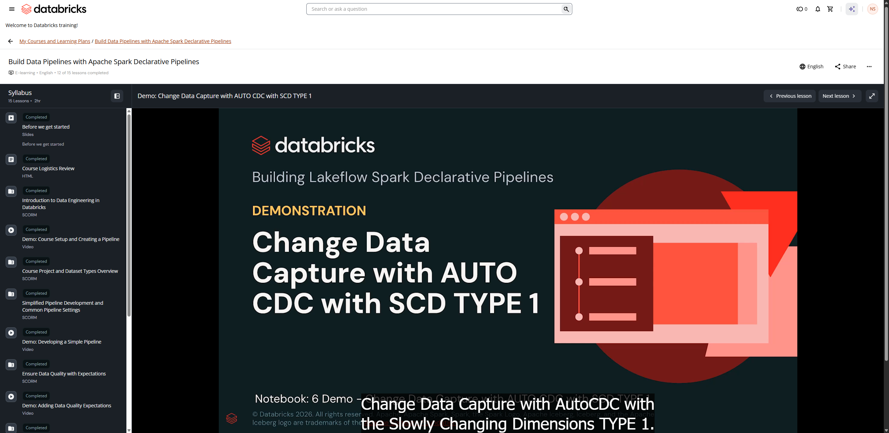

# Demo: Change Data Capture with AUTO CDC with SCD TYPE 1

**Course:** Build Data Pipelines with Lakeflow Spark Declarative Pipelines  
**Lesson:** 13 (Demo)  
**Duration:** ~18 min (1075s)  
**Instructor:** Marcelino Mayorga (Senior Technical Instructor, Databricks)  
**Screenshot:** 

---

## Overview & Learning Objectives

In this hands-on demonstration, Marcelino demonstrates implementing Change Data Capture (CDC) processing using Spark Declarative Pipelines with AUTO CDC (formerly known as `APPLY CHANGES INTO`) applying Slowly Changing Dimensions (SCD) Type 1.

Key concepts covered:
- Reading change logs containing inserts, updates, and deletes (`__apply_date`, `__operation`, etc.).
- Defining target streaming tables with `CREATE OR REFRESH STREAMING TABLE`.
- Applying `AUTO CDC INTO` / `APPLY CHANGES INTO` specifying:
  - `KEYS (customer_id)` for primary key identification.
  - `APPLY AS DELETE WHEN operation = 'DELETE'`.
  - `SEQUENCE BY sequence_num` to handle out-of-order records accurately.
  - `COLUMNS * EXCEPT (_rescued_data, operation, sequence_num)`.
- Validating SCD Type 1 behavior where row updates overwrite existing records in-place and deletions remove matching rows.

---

## Verbatim Video Transcript & Walkthrough

- **[00:01 - 00:01]** Hello everyone.
- **[00:01 - 00:03]** My name is Marcelino Mayorga.
- **[00:03 - 00:06]** I'm a senior technical instructor, and I will walk you through in this demo 12,
- **[00:07 - 00:12]** Change Data Capture with AutoCDC with the Slowly Changing Dimensions TYPE 1.
- **[00:14 - 00:18]** The objectives for this demo are: first, we're going to complete our status
- **[00:18 - 00:20]** and orders pipeline with customers.
- **[00:20 - 00:25]** Similarly, we'll read the data from a JSON file into the
- **[00:25 - 00:26]** customer's folder through bronze.
- **[00:27 - 00:30]** Then we're going to flow the data into a second bronze table
- **[00:30 - 00:33]** called bronze customers clean.
- **[00:33 - 00:38]** And next, we're going to apply change data capture using AutoCDC with
- **[00:38 - 00:43]** slowly changing dimensions Type 1, which this one overwrites the data.
- **[00:44 - 00:49]** And finally, we're going to move the data from bronze customers clean, that
- **[00:49 - 00:53]** it has some expectations to prepare the data, to a ground truth table
- **[00:53 - 00:57]** called SCD TYPE 1 customer_silver.
- **[00:59 - 01:05]** Now it is time to attach to our notebook to the serverless cluster version 5.
- **[01:05 - 01:08]** Remember, we always need to do that for every notebook.
- **[01:09 - 01:13]** And then we need to run our classroom setup that will provide for us
- **[01:13 - 01:16]** all the resources for this demo, such as the catalogs and schemas.
- **[01:17 - 01:18]** Here we can see the output.
- **[01:18 - 01:22]** So we're going to keep working on this labuser catalog, sdp_1_bronze
- **[01:23 - 01:29]** schema, silver and gold, also using the volume we've been using all along.
- **[01:30 - 01:33]** But this time, we're going to work with customers.
- **[01:33 - 01:38]** So here we can change the Catalog Explorer and just confirm what we have over here.
- **[01:38 - 01:45]** We got our labuser catalog, our sdp_1_bronze  schema, our source volume,
- **[01:45 - 01:47]** and here we have our customers folder.
- **[01:49 - 01:49]** Perfect.
- **[01:50 - 01:53]** And now we can go ahead to cell 11, and we can actually peek into
- **[01:56 - 01:57]** this file.
- **[01:57 - 02:00]** And here we got plenty of columns we need to review.
- **[02:00 - 02:04]** We got an address, we got a city, a customer_id, an email, a name.
- **[02:06 - 02:11]** And as you work with your organization and the responsible for the data,
- **[02:11 - 02:15]** you'll receive a column that normally is labeled as a operation,
- **[02:15 - 02:17]** sometimes also is called a status.
- **[02:18 - 02:21]** Always check with your team what is the right name for this column.
- **[02:21 - 02:24]** But the intention for this column is to guide you through in what
- **[02:24 - 02:26]** to do with all the records.
- **[02:27 - 02:32]** In here, you can tell that it is an INSERT, an UPDATE, or a DELETE.
- **[02:32 - 02:36]** And this is quite important or change data capture because this
- **[02:36 - 02:38]** is going to tell us what to do.
- **[02:39 - 02:42]** Then we got a state, we got a timestamp, we got a zip_code, and
- **[02:42 - 02:43]** of course, we got the rescued_data.
- **[02:44 - 02:50]** After all, we're just peeking in and checking that data, that JSON file.
- **[02:51 - 02:56]** Next, in cell 15, we got the create_declarative_pipeline function.
- **[02:56 - 02:59]** Remember, this was added by the classroom setup, so this
- **[02:59 - 03:01]** is not a framework function.
- **[03:01 - 03:06]** But if you're curious in how to create this job programmatically, please check
- **[03:06 - 03:08]** that function in the includes folder.
- **[03:09 - 03:14]** And over here, you can see we got a job with the name of 12 - Change Data Capture.
- **[03:14 - 03:18]** You can see that we are using the root path folder, which by the
- **[03:18 - 03:20]** way, it is in the same folder.
- **[03:20 - 03:24]** It has its own folder here in 12 - Change Data Capture.
- **[03:25 - 03:29]** . Here we can see precisely that we got a folder for customers, we got one
- **[03:29 - 03:32]** for orders, and we got for status.
- **[03:32 - 03:34]** So now we have the full picture of it.
- **[03:34 - 03:37]** And now you can see the source folder is also configured.
- **[03:38 - 03:42]** So here we're going to execute all the files with customers,
- **[03:42 - 03:44]** orders, and statuses.
- **[03:46 - 03:52]** Before reviewing the job, here below, we also have the cell that allows to
- **[03:52 - 03:58]** just run a quick list of currently only JSON files on both and all the folders.
- **[04:01 - 04:04]** Everything is ready, so now we can proceed to open the pipeline.
- **[04:05 - 04:10]** So we open the left menu and opening a new tab, jobs and pipelines.
- **[04:12 - 04:17]** And here you should be able to see your pipeline 12 - Change Data Capture.
- **[04:17 - 04:18]** with AUTO CDC.
- **[04:19 - 04:22]** Remember, when you open this pipeline, this will take
- **[04:22 - 04:24]** you to that monitoring page.
- **[04:24 - 04:27]** So from here, we haven't executed this pipeline.
- **[04:27 - 04:29]** We actually want to open the code.
- **[04:29 - 04:35]** So remember, you can access here in Edit pipeline or here in Open in editor.
- **[04:39 - 04:41]** Now let's proceed and review the customers.
- **[04:41 - 04:45]** So over here, we open the customers folder, and here we have our SQL file.
- **[04:46 - 04:49]** First, we're going to start with the customers_bronze table.
- **[04:49 - 04:52]** This is a streaming table, pretty much as the other ones.
- **[04:52 - 04:56]** Notice over here, we're adding a comment, and as well, we're
- **[04:56 - 04:57]** adding table properties.
- **[04:57 - 05:03]** Remember, alternatively, you have the option to use tags into your table to
- **[05:03 - 05:05]** use the label the quality to bronze.
- **[05:06 - 05:10]** And remember, you also can set up the configuration for pipelines.reset.allowed.
- **[05:12 - 05:18]** This is to prevent and protect your table to be truncated when you run
- **[05:18 - 05:20]** your full run with table refresh.
- **[05:21 - 05:24]** And then, as usual, over here, we're reading the data from all the
- **[05:24 - 05:26]** fields and also adding metadata.
- **[05:27 - 05:31]** Here, reading from using the read files function with a stream keyword.
- **[05:31 - 05:35]** And notice over here, now we're changing to the specific customers folder.
- **[05:36 - 05:37]** Perfect.
- **[05:38 - 05:44]** Now we have the customers_bronze_clean, where in this case, first of all,
- **[05:44 - 05:47]** let's notice over here we're reading from the customers_bronze_raw.
- **[05:48 - 05:54]** And notice that this is a second bronze table for customers.
- **[05:54 - 05:58]** You can add as many tables as you need in your layers.
- **[05:59 - 06:03]** In this case, this table, it is aimed to prepare the data before
- **[06:03 - 06:05]** running a change data capture.
- **[06:06 - 06:08]** So please notice here we got a couple expectations.
- **[06:08 - 06:12]** The first one is valid_id, where the customer not to be null.
- **[06:12 - 06:17]** And in this case, we're adding the action that on violation fail UPDATE.
- **[06:17 - 06:22]** This is important because without the customer_id, we wouldn't know from the
- **[06:22 - 06:27]** source table, which is customers_bronze, if we, if this ID already exists
- **[06:27 - 06:30]** or it can be, it can run an UPDATE.
- **[06:31 - 06:35]** So without an ID, we cannot do much, so we want to fail the whole process.
- **[06:36 - 06:39]** Then we got a valid operation, which in this case, the valid
- **[06:39 - 06:42]** operation is asked not to be null.
- **[06:42 - 06:47]** In this case, we want to drop the row for those that do not have an operation.
- **[06:47 - 06:52]** And mainly this is related to the same topic because without an operation, you
- **[06:52 - 06:56]** will, you wouldn't know exactly what to do, an INSERT, UPDATE, and DELETE.
- **[06:57 - 06:59]** So in this case, we drop the record.
- **[07:00 - 07:06]** By the way, I like to call off that in here you can also create a pattern called
- **[07:07 - 07:13]** a quarantine, that in this case is just having a secondary table that captures
- **[07:13 - 07:18]** those dropped records from your main table, so that way you don't lose data.
- **[07:20 - 07:20]** Right.
- **[07:20 - 07:22]** Unfortunately, we don't get to see this pattern, but I wanna
- **[07:22 - 07:24]** let you know that is an option.
- **[07:24 - 07:29]** Then we have also valid_name expectation, which in this case we're asking for the
- **[07:29 - 07:34]** name not to be null or the operation to be equal DELETE, because in that
- **[07:34 - 07:39]** case, that record will be deleted, so we wouldn't care if the name is not null.
- **[07:39 - 07:44]** We can also use the valid_address, where in this case we're
- **[07:50 - 07:52]** the operation it is equal to DELETE.
- **[07:53 - 07:58]** Same case with the name over here. And finally, we got another expectation
- **[07:58 - 08:02]** called valid_email that in this case we're using a function rlike
- **[08:02 - 08:05]** that enables regular expressions.
- **[08:05 - 08:11]** So in this case, we can validate the email column to follow this format.
- **[08:12 - 08:16]** In this case, or the operation equals to DELETE, in this case,
- **[08:16 - 08:19]** we want ON VIOLATION DROP ROW.
- **[08:19 - 08:25]** Here we can also use a comment, but notice this is the heavy lifting happening in
- **[08:25 - 08:31]** the customers_bronze_clean, as we are just merely doing a simple SELECT * and adding
- **[08:32 - 08:36]** there a timestamp for the date that we're reading from the customers_bronze_raw.
- **[08:37 - 08:40]** Which by the way, this is a streaming table, so we need the stream keyword.
- **[08:42 - 08:45]** Then we're ready to move into our silver table.
- **[08:45 - 08:50]** In this case, this is a streaming table called scd_type1_customer_silver.
- **[08:51 - 08:55]** Notice over here we don't have any schema, only adding a comment.
- **[08:57 - 09:01]** Because we're going to let the AUTO CDC to handle this for us.
- **[09:03 - 09:07]** First, we need to create a flow, and when we refer a flow, it is the hub
- **[09:07 - 09:09]** between your source to your target.
- **[09:09 - 09:14]** So there are multiple examples over here, from your volume to your customer_bronze
- **[09:15 - 09:20]** table, from your customers_bronze to your customer_bronze_clean table.
- **[09:21 - 09:22]** All that is a hub.
- **[09:23 - 09:30]** And then from your customers_bronze_clean to your scd_type1_customer_silver  table.
- **[09:30 - 09:32]** That is a hub or a flow.
- **[09:32 - 09:37]** And over here, we're going to use the syntax of AUTO CDC INTO.
- **[09:38 - 09:42]** My recommendation over here is that if you already know about MERGE INTO, it
- **[09:42 - 09:45]** follows a pretty much a similar approach.
- **[09:45 - 09:50]** The main difference is the MERGE INTO, it works on a batch style.
- **[09:50 - 09:54]** Every time you run it, it will take all your source table and
- **[09:54 - 09:56]** compare it with your target table.
- **[09:57 - 10:00]** Unfortunately, MERGE INTO, it is not ideal for streaming.
- **[10:01 - 10:03]** That's where AUTO CDC it is for.
- **[10:04 - 10:10]** So in here, the AUTO CDC will implement a very similar syntax, but
- **[10:10 - 10:14]** understanding MERGE INTO it will make your life easier for understanding this.
- **[10:14 - 10:19]** So notice over here, we got the AUTO CDC INTO, and we have our target
- **[10:19 - 10:21]** table, which in this case it is our scd_type1_customer_silver_demo.
- **[10:24 - 10:28]** Then we need our source, which in this case, we're going to use the
- **[10:28 - 10:32]** from statement, and we're going to use customers_bronze_clean.
- **[10:32 - 10:35]** And because these two tables are streaming, remember we
- **[10:35 - 10:37]** need that stream keyword.
- **[10:38 - 10:43]** Next, we're going to leverage the customer_id as for the keys.
- **[10:43 - 10:46]** Remember, you can add as many keys as you need over here to compare
- **[10:46 - 10:49]** both your source with your target.
- **[10:49 - 10:52]** And here's where it differs from the MERGE INTO.
- **[10:52 - 10:56]** In the MERGE INTO, you specify what to do when you find your ID,
- **[10:56 - 11:00]** when you find your ID, and then you want to do an UPDATE or DELETE.
- **[11:00 - 11:06]** In this case, the AUTO CDC handles those three operations automatically.
- **[11:06 - 11:11]** What is left in the next statements are merely configuration.
- **[11:11 - 11:16]** So yes, when we have a key, a customer_id on your target, it
- **[11:16 - 11:18]** is going to UPDATE the data.
- **[11:18 - 11:22]** If it doesn't have applies as DELETE when operation equals to DELETE.
- **[11:24 - 11:25]** By the way, this is optional.
- **[11:26 - 11:30]** If you remove this, then you're going only to UPDATE the data
- **[11:31 - 11:33]** because there is no DELETE operation.
- **[11:34 - 11:39]** If the customer_id is not found, then it's going to run an INSERT.
- **[11:40 - 11:45]** Next, with the streaming, there is always the time detail that
- **[11:45 - 11:46]** you always need to consider.
- **[11:46 - 11:50]** Sometimes you're gonna get multiple UPDATEs, and you wanna
- **[11:50 - 11:52]** make sure which one is the latest.
- **[11:52 - 11:58]** So sequence by, this is where you target your column in order to get to order by
- **[11:58 - 12:03]** all these different UPDATEs, INSERTs, and DELETEs, and take the latest and greatest.
- **[12:05 - 12:07]** Next, we got the columns.
- **[12:07 - 12:09]** In this case, we're telling to use all the columns except timestamp,
- **[12:10 - 12:13]** rescued_data, and operation because we don't need it at this point.
- **[12:13 - 12:18]** Remember, on this case, the scd_type1_customer_silver  table,
- **[12:18 - 12:20]** it holds our ground truth data.
- **[12:20 - 12:25]** We're polishing and evolving the quality and the structure of our data.
- **[12:26 - 12:29]** And last but not least, we got stored as SCD Type 1.
- **[12:30 - 12:36]** In this case, remember, this is Type 1 is to overwrite data, and type 2, it is
- **[12:36 - 12:38]** for keeping the history of your data.
- **[12:41 - 12:43]** So now let's proceed and review the results of this pipeline.
- **[12:43 - 12:48]** So over here, I'm going to open the bottom pipeline, and also I'm going to center.
- **[12:49 - 12:52]** And as you can see, we already have the orders, we got the status, and
- **[12:52 - 12:54]** we just including the customers.
- **[12:55 - 12:58]** And over here we got our customers_bronze_raw, our
- **[12:58 - 13:01]** customers_bronze_clean, that it behaves pretty much as the other ones.
- **[13:02 - 13:07]** But please notice over here the scd_type1_customer_silver  table.
- **[13:08 - 13:11]** There are other tables show output records.
- **[13:11 - 13:19]** Meanwhile, this one, it recognizes that we have implemented an AUTO CDC, so
- **[13:19 - 13:21]** it shows the upserted records as well.
- **[13:21 - 13:26]** Over here it shows 939 and 0 deleted records.
- **[13:28 - 13:32]** After running our pipeline for the very first time, now we can go back into our
- **[13:32 - 13:38]** notebook cell 28, and here we can run this query to confirm that we got the 939
- **[13:38 - 13:42]** records into the scd_type1_customer_silver
- **[13:43 - 13:43]** . Good.
- **[13:44 - 13:49]** Then we want to review what will be the case using change data
- **[13:49 - 13:53]** capture when we want to UPDATE or DELETE specific customers.
- **[13:53 - 13:57]** So here in cell 30, we can see we got two of our customers.
- **[13:57 - 14:02]** We got Sandy Adams, that this person lives at Jacqueline Mountains,
- **[14:02 - 14:04]** and we also got Stephen Green.
- **[14:05 - 14:10]** Next, we're going to add more data into our folders within our volume
- **[14:10 - 14:13]** for orders, status, and customers.
- **[14:15 - 14:20]** And if we scroll down just a bit here in cell 35, we can query just in a
- **[14:20 - 14:25]** list command, and now we can confirm that we got a second JSON, 01.json.
- **[14:27 - 14:31]** Next, we can go ahead and just query that file directly.
- **[14:32 - 14:35]** And here we can see we got around 23 records.
- **[14:36 - 14:39]** And notice over here we got the operation with plenty of DELETEs.
- **[14:40 - 14:40]** Check this one out.
- **[14:40 - 14:45]** Here we got one DELETE, and we also got some new INSERTs
- **[14:49 - 14:55]** Now, if we query this file with the two customers we queried before, here
- **[14:55 - 15:00]** we should be able to see that Sandy Adams now has an UPDATE into an updated
- **[15:00 - 15:01]** address to John Stravenue suite.
- **[15:03 - 15:07]** Meanwhile, our friend Stephen Green is going to be deleted here
- **[15:07 - 15:11]** with the customer_id, and for that reason, we don't have any other
- **[15:11 - 15:13]** information about this customer.
- **[15:14 - 15:16]** Now it's time for us to run the pipeline.
- **[15:17 - 15:23]** After running our pipeline, here we can see the pipeline was able to incrementally
- **[15:23 - 15:26]** ingest the new 01.json file for customers.
- **[15:27 - 15:31]** So here we can see that we get 23 records that went from bronze
- **[15:32 - 15:33]** to customers_bronze_clean.
- **[15:33 - 15:37]** Remember, here is where we apply five expectations in preparation
- **[15:37 - 15:39]** for the change data capture process.
- **[15:40 - 15:46]** And then we're going to do the AUTO CDC INTO the scd_type1_customer_silver  table.
- **[15:47 - 15:50]** And notice over here, you also get to see that if we hover over,
- **[15:50 - 15:55]** let us know that there are 22 upserted records and one deleted.
- **[15:55 - 15:57]** That is our friend Stephen Green.
- **[15:58 - 16:01]** And we also updated the address for Sandy Adams.
- **[16:02 - 16:02]** So let's review.
- **[16:04 - 16:08]** Back into the notebook here in cell 44, we can see there is another query into
- **[16:08 - 16:09]** the scd_type1_customer_silver_demo,
- **[16:11 - 16:17]** which by the way, here we can check we got a total of 948 records after
- **[16:17 - 16:19]** our second pipeline execution.
- **[16:20 - 16:26]** And mainly, remember, in here, we're handling 23 upserts, 22 are INSERTs
- **[16:26 - 16:29]** and UPDATEs, and one was deleted.
- **[16:30 - 16:35]** So let's proceed to query the table here in cell 46, where we got the
- **[16:35 - 16:40]** scd_type1_customer_silver_demo table, and we're filtering based on the two customers
- **[16:40 - 16:42]** for Sandy Adams and Stephen Green.
- **[16:43 - 16:46]** After executing the pipeline, we get to see the results.
- **[16:46 - 16:50]** Remember, we're applying change data capture with the slowly
- **[16:50 - 16:52]** changing dimensions of Type 1.
- **[16:52 - 16:56]** We are overriding data, and that is exactly what we're seeing over here.
- **[16:56 - 16:59]** Here we can see Sandy Adams with the updated value of the
- **[16:59 - 17:01]** address for John Stravenue suite.
- **[17:02 - 17:06]** And as you may notice, our friend Stephen Green, it is no longer
- **[17:06 - 17:07]** shown because he was deleted.
- **[17:09 - 17:14]** So in conclusion, in this demo, we were able to extend the pipeline for
- **[17:14 - 17:17]** status and orders to include customers.
- **[17:17 - 17:20]** We reviewed the code for customers for having the customers_bronze_clean
- **[17:22 - 17:22]** and the scd_type1_customer_silver_demo
- **[17:25 - 17:26]** table.
- **[17:27 - 17:31]** We implemented change data capture using AutoCDC with the slowly
- **[17:31 - 17:33]** changing dimensions of Type 1.
- **[17:33 - 17:35]** That is for overriding the data.
- **[17:35 - 17:40]** And then we executed twice our pipeline, the first one to ingest the data for
- **[17:40 - 17:45]** customers that provided our base-baseline, and then we added more JSON files.
- **[17:45 - 17:50]** And finally, we ran a second time our pipeline and confirmed those changes.

---

## Key Takeaways

1. **AUTO CDC Syntax:**
   - In Lakeflow Spark Declarative Pipelines (Delta Live Tables), `AUTO CDC INTO` (or `APPLY CHANGES INTO`) automates the complex merge and deduplication logic required for CDC feeds.
   - It requires a target streaming table created with no schema or selection (`CREATE OR REFRESH STREAMING TABLE target_table;`).

2. **Handling Out-of-Order Delivery:**
   - The `SEQUENCE BY` clause ensures that even if CDC events arrive out of chronological order from upstream message buses (Kafka/Kinesis), the latest event always determines final state.

3. **SCD Type 1 vs. Type 2:**
   - **SCD Type 1:** Overwrites current record without keeping history.
   - **SCD Type 2:** Maintains full change history using `STORED AS SCD TYPE 2` with valid-from and valid-to timestamps.
