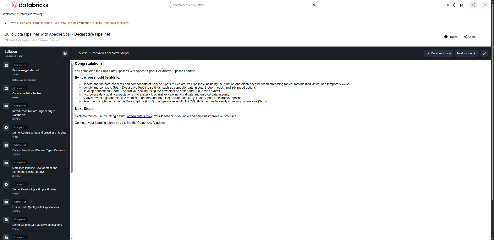

# Course Summary and Next Steps

**Course:** Build Data Pipelines with Lakeflow Spark Declarative Pipelines  
**Lesson:** 14 (Course Summary)  
**Screenshot:** 

---

## Verbatim Summary

### Congratulations!

You completed the **Build Data Pipelines with Apache Spark Declarative Pipelines** course.

By now, you should be able to:

- **Understand the core concepts and components** of Apache Spark™ Declarative Pipelines, including the function and differences between streaming tables, materialized views, and temporary views.
- **Identify and configure Spark Declarative Pipeline settings**, such as compute, data assets, trigger modes, and advanced options.
- **Develop a functional Spark Declarative Pipeline** using the new pipeline editor and SQL-based syntax.
- **Incorporate data quality expectations** into a Spark Declarative Pipeline to validate and enforce data integrity.
- **Analyze event logs and pipeline metrics** to understand the full execution and lifecycle of a Spark Declarative Pipeline.
- **Design and implement Change Data Capture (CDC)** to a pipeline using `AUTO CDC INTO` to handle slowly changing dimensions (SCD).

---

## Next Steps

- Evaluate this course by taking a brief, one-minute survey. Your feedback is valuable and helps us improve our courses.
- Continue your learning journey by visiting the **Databricks Academy**.
