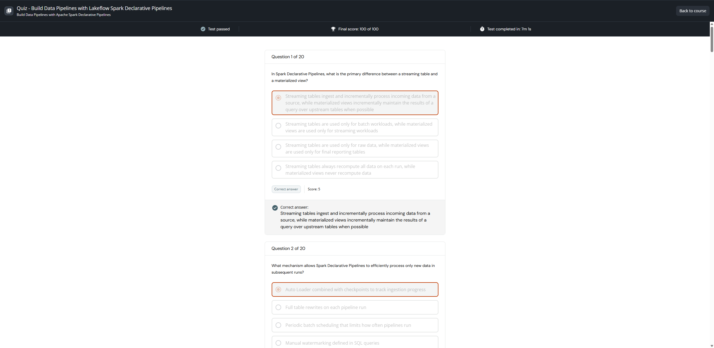

# Quiz - Build Data Pipelines with Lakeflow Spark Declarative Pipelines

**Course:** Build Data Pipelines with Lakeflow Spark Declarative Pipelines  
**Lesson:** 15 (Graded Assessment / Test)  
**Passing Score:** 80% (16/20)  
**Achieved Score:** 100% (20/20) - PASSED  
**Screenshot:** 

---

## Verbatim Questions and Verified Answer Key (100% Score)

Question 1 of 20

In Spark Declarative Pipelines, what is the primary difference between a streaming table and a materialized view?

Streaming tables ingest and incrementally process incoming data from a source, while materialized views incrementally maintain the results of a query over upstream tables when possible

Streaming tables are used only for batch workloads, while materialized views are used only for streaming workloads

Streaming tables are used only for raw data, while materialized views are used only for final reporting tables

Streaming tables always recompute all data on each run, while materialized views never recompute data

Options
You gave the correct answer and your score is 5
Correct answer
Score: 5
Correct answer:

Streaming tables ingest and incrementally process incoming data from a source, while materialized views incrementally maintain the results of a query over upstream tables when possible

Question 2 of 20

What mechanism allows Spark Declarative Pipelines to efficiently process only new data in subsequent runs?

Auto Loader combined with checkpoints to track ingestion progress

Full table rewrites on each pipeline run

Periodic batch scheduling that limits how often pipelines run

Manual watermarking defined in SQL queries

Options
You gave the correct answer and your score is 5
Correct answer
Score: 5
Correct answer:

Auto Loader combined with checkpoints to track ingestion progress

Question 3 of 20

What is the purpose of the event log in Lakeflow Spark Declarative Pipelines, and what information does it provide?

It tracks pipeline runs, including start time, end time, number of records processed, and any errors or warnings from expectations or transformations

It logs only schema changes made to target tables during schema evolution

It records user access and permissions changes to pipeline definitions

It stores the raw data ingested by streaming tables before processing

Options
You gave the correct answer and your score is 5
Correct answer
Score: 5
Correct answer:

It tracks pipeline runs, including start time, end time, number of records processed, and any errors or warnings from expectations or transformations

Question 4 of 20

When configuring a Spark Declarative Pipeline, which compute option is recommended for cost-effective, scalable processing?

Shared cluster

Multi-node cluster

Serverless compute

Single-node cluster

Options
You gave the correct answer and your score is 5
Correct answer
Score: 5
Correct answer:

Serverless compute

Question 5 of 20

Assume you have JSON log files arriving continuously in cloud storage at /Volumes/logs/events. You want to ingest them into a streaming table called events_bronze. 

Which SQL statement correctly defines this streaming table in Databricks SQL

CREATE OR REFRESH STREAMING TABLE events_bronze
AS
SELECT *
FROM STREAM read_files('/Volumes/logs/events', format => 'json');

CREATE STREAMING TABLE events_bronze
AS
SELECT *
FROM read_files('/Volumes/logs/events', format => 'json');

CREATE OR REFRESH TABLE events_bronze
AS
SELECT *
FROM read_files('/Volumes/logs/events', format => 'json');

CREATE STREAMING TABLE events_bronze
AS
SELECT *
FROM read_files('/Volumes/logs/events', format => 'json')
SCHEDULE EVERY 1 HOUR;

Options
You gave the correct answer and your score is 5
Correct answer
Score: 5
Correct answer:

CREATE OR REFRESH STREAMING TABLE events_bronze
AS
SELECT *
FROM STREAM read_files('/Volumes/logs/events', format => 'json');

Question 6 of 20

When a streaming table in Spark Declarative Pipelines processes new data from its source, how is that data written to the target table?

Data is stored only in a temporary view until the next refresh

New records are appended incrementally to the streaming table

Records are merged into the table using MERGE INTO semantics

Existing data in the table is completely overwritten

Options
You gave the correct answer and your score is 5
Correct answer
Score: 5
Correct answer:

New records are appended incrementally to the streaming table

Question 7 of 20

You are building a pipeline in Lakeflow Spark Declarative Pipelines. You want to make the path to your input data configurable depending on the environment (dev, test, prod). You set a pipeline configuration parameter named input_path. 

Which SQL snippet correctly references this parameter to define a streaming table that uses that path?

CREATE OR REFRESH STREAMING TABLE raw_events
AS
SELECT *
FROM STREAM read_files({input_path}, format => 'json');

CREATE OR REFRESH STREAMING TABLE raw_events
AS SELECT *
FROM STREAM read_files('${input_path}', format => 'json');

CREATE OR REFRESH STREAMING TABLE raw_events
AS
SELECT *
FROM STREAM read_files($$input_path$$, format => 'json');

CREATE OR REFRESH STREAMING TABLE raw_events
AS
SELECT *
FROM STREAM read_files(input_path, format => 'json');

Options
You gave the correct answer and your score is 5
Correct answer
Score: 5
Correct answer:

CREATE OR REFRESH STREAMING TABLE raw_events
AS SELECT *
FROM STREAM read_files('${input_path}', format => 'json');

Question 8 of 20

In Spark Declarative Pipelines, what is the primary role of a materialized view?

Tracking every historical change to records over time

Enforcing schemas on incoming data

Producing aggregated or derived results from upstream tables

Raw data ingestion from external sources

Options
You gave the correct answer and your score is 5
Correct answer
Score: 5
Correct answer:

Producing aggregated or derived results from upstream tables

Question 9 of 20

You have a Lakeflow Spark Declarative Pipeline that includes streaming tables, downstream transformations, and materialized views.

You want to:

Delete all pipeline checkpoints
Clear all data from streaming tables
Reprocess all source data from scratch
Fully rebuild all downstream tables and materialized views

Which action should you take?

Run the pipeline with a full table refresh

Run the pipeline with different settings

Manually delete the pipeline and start it again

Select delete all and run the pipeline

Options
You gave the correct answer and your score is 5
Correct answer
Score: 5
Correct answer:

Run the pipeline with a full table refresh

Question 10 of 20

You are building a Spark Declarative Pipeline with the following datasets:

A streaming table orders_stream that ingests new orders as they arrive.
A static table customers_dim containing customer attributes that change infrequently.

You want to enrich each incoming order with customer details while allowing the pipeline to handle incremental processing and execution order.

Which approach best fits Spark Declarative Pipelines?

Manually cache the static table inside the pipeline for each run

Convert customers_dim into a streaming table so both inputs are streaming

Join the streaming table with the static table in a declarative transformation and let the pipeline manage incremental updates

Run a separate batch job to periodically join and overwrite the results

Options
You gave the correct answer and your score is 5
Correct answer
Score: 5
Correct answer:

Join the streaming table with the static table in a declarative transformation and let the pipeline manage incremental updates

Question 11 of 20

Which feature improves reliability and reduces maintenance in Spark Declarative Pipelines?

Governance

Simplified Pipeline Authoring

Version Control

Automated Scaling and Recovery

Options
You gave the correct answer and your score is 5
Correct answer
Score: 5
Correct answer:

Automated Scaling and Recovery

Question 12 of 20

Which of the following statements best describes the core purpose of Lakeflow Spark Declarative Pipelines?

It’s a low-level library requiring manual orchestration of Spark Structured Streaming jobs.

It is only for batch ETL jobs and does not support real-time or streaming data.

It acts as a declarative framework that lets you define incremental batch or streaming data pipelines in SQL or Python, while handling orchestration, incremental processing, and failure recovery automatically.

It only handles ingestion, and transformations must be handled by separate Spark jobs outside the framework.

Options
You gave the correct answer and your score is 5
Correct answer
Score: 5
Correct answer:

It acts as a declarative framework that lets you define incremental batch or streaming data pipelines in SQL or Python, while handling orchestration, incremental processing, and failure recovery automatically.

Question 13 of 20

When running a Spark Declarative Pipeline for the second time after landing new data, how many rows should be processed?

All rows in the source volume

The original rows only

Zero rows, requiring a manual refresh

Only the new rows added since the last run

Options
You gave the correct answer and your score is 5
Correct answer
Score: 5
Correct answer:

Only the new rows added since the last run

Question 14 of 20

You are building a Spark Declarative Pipeline with the following requirements:

A Silver streaming table orders_silver already exists and is updated incrementally
You want to create a Gold-layer dataset that aggregates order counts by customer
The aggregated results should be stored as an object and incrementally updated when possible as new data arrives
You want the pipeline engine to manage refresh logic automatically

Which SQL definition best meets these requirements?

INSERT INTO customer_order_summary
SELECT
customer_id,
COUNT(order_id)
FROM orders_silver
GROUP BY customer_id;

CREATE STREAMING TABLE customer_order_summary
AS
SELECT
customer_id,
COUNT(order_id) AS order_count
FROM STREAM(orders_silver)
GROUP BY customer_id;

CREATE OR REFRESH MATERIALIZED VIEW customer_order_summary
AS
SELECT
customer_id,
COUNT(order_id) AS order_count
FROM orders_silver
GROUP BY customer_id;

CREATE OR REPLACE VIEW customer_order_summary
AS
SELECT
customer_id,
COUNT(order_id) AS order_count
FROM orders_silver
GROUP BY customer_id;

Options
You gave the correct answer and your score is 5
Correct answer
Score: 5
Correct answer:

CREATE OR REFRESH MATERIALIZED VIEW customer_order_summary
AS
SELECT
customer_id,
COUNT(order_id) AS order_count
FROM orders_silver
GROUP BY customer_id;

Question 15 of 20

When using batch notebook-based ETL for large data volumes, what processing or cost consideration often motivates teams to migrate to Spark Declarative Pipelines?

Batch notebook ETL cannot be scheduled, while Spark Declarative Pipelines can

Batch notebook ETL often fully reprocesses data on each run, increasing compute cost, whereas Spark Declarative Pipelines manage incremental processing automatically

Batch notebook ETL cannot use Auto Loader, while Spark Declarative Pipelines can

Batch notebook ETL does not support distributed processing, while Spark Declarative Pipelines do

Options
You gave the correct answer and your score is 5
Correct answer
Score: 5
Correct answer:

Batch notebook ETL often fully reprocesses data on each run, increasing compute cost, whereas Spark Declarative Pipelines manage incremental processing automatically

Question 16 of 20

You define a Lakeflow Spark Declarative Pipeline where:

A bronze streaming table ingests new JSON files as they arrive in cloud storage.
A downstream silver streaming table applies transformations such as filtering and enrichment on the bronze streaming table
A materialized view aggregates the transformed results.

When new files arrive in cloud storage and the pipeline is run, what happens?

Only the new files are ingested and downstream streaming tables are updated incrementally, but the materialized view is always fully recomputed.

The entire pipeline is re-run from scratch, reprocessing all historical data to produce updated results.

Only the new files are ingested, downstream streaming tables are updated incrementally, and the materialized view is incrementally updated when possible.

Only the new files are ingested and downstream streaming tables are updated incrementally, but the materialized view must be manually refreshed.

Options
You gave the correct answer and your score is 5
Correct answer
Score: 5
Correct answer:

Only the new files are ingested, downstream streaming tables are updated incrementally, and the materialized view is incrementally updated when possible.

Question 17 of 20

A team has an incremental batch Spark Declarative Pipeline that processes new files daily. The data source begins delivering files continuously, and the team wants near real time processing without rewriting transformations. What change is required?

Change the pipeline trigger from scheduled to continuous execution

Convert the pipeline to a notebook based streaming job

Rewrite all tables as streaming only SQL

Add manual watermark logic to every query

Options
You gave the correct answer and your score is 5
Correct answer
Score: 5
Correct answer:

Change the pipeline trigger from scheduled to continuous execution

Question 18 of 20

You are migrating a traditional batch ETL workflow, where the entire dataset is fully reprocessed each time the job runs, into a Lakeflow Spark Declarative Pipeline using a Bronze > Silver > Gold architecture.

In the existing workflow:

Raw files are ingested, cleaned, joined, and aggregated in a single batch job.
Each run processes all historical data, even when new data has arrived.

Which approach best reflects how this workflow should be redesigned using Spark Declarative Pipelines?

Split the logic into separate batch jobs and manually orchestrate them in sequence

Keep the single batch job and run it more frequently to reduce data latency

Convert the batch SQL into Python and execute it unchanged in a pipeline notebook

Define a Bronze streaming table for raw ingestion, Silver tables for cleansing and enrichment, and Gold materialized views for aggregations, allowing the pipeline to manage dependencies and incremental updates

Options
You gave the correct answer and your score is 5
Correct answer
Score: 5
Correct answer:

Define a Bronze streaming table for raw ingestion, Silver tables for cleansing and enrichment, and Gold materialized views for aggregations, allowing the pipeline to manage dependencies and incremental updates

Question 19 of 20

What does the AUTO CDC INTO syntax in Lakeflow Declarative Pipelines accomplish?

Automatically creates dashboards for CDC data

Schedules pipeline runs

Deletes all data in the pipeline

Simplifies change data capture by incrementally applying inserts, updates, and deletes to a target table

Options
You gave the correct answer and your score is 5
Correct answer
Score: 5
Correct answer:

Simplifies change data capture by incrementally applying inserts, updates, and deletes to a target table

Question 20 of 20

In Lakeflow Spark Declarative Pipelines, what is the primary purpose of adding an expectation when defining a streaming table or materialized view?

To apply a data quality constraint that validates each record as it flows through, and optionally drop or flag invalid records

To convert JSON strings into structured columns for better querying

To enforce a static schema so that all data must match specified columns exactly

To automatically partition data based on quality checks

Options
You gave the correct answer and your score is 5
Correct answer
Score: 5
Correct answer:

To apply a data quality constraint that validates each record as it flows through, and optionally drop or flag invalid records

---

## Master Question & Answer Summary for The Data Dojo

### Question 1: Streaming Tables vs. Materialized Views
- **Question:** In Spark Declarative Pipelines, what is the primary difference between a streaming table and a materialized view?
- **Correct Answer:** Streaming tables ingest and incrementally process incoming data from a source, while materialized views incrementally maintain the results of a query over upstream tables when possible.

### Question 2: Incremental Ingestion Mechanism
- **Question:** What mechanism allows Spark Declarative Pipelines to efficiently process only new data in subsequent runs?
- **Correct Answer:** Auto Loader combined with checkpoints to track ingestion progress.

### Question 3: Event Log Purpose
- **Question:** What is the purpose of the event log in Lakeflow Spark Declarative Pipelines, and what information does it provide?
- **Correct Answer:** It tracks pipeline runs, including start time, end time, number of records processed, and any errors or warnings from expectations or transformations.

### Question 4: Recommended Compute Option
- **Question:** When configuring a Spark Declarative Pipeline, which compute option is recommended for cost-effective, scalable processing?
- **Correct Answer:** Serverless compute.

### Question 5: Defining a Streaming Table from Volume Files
- **Question:** Assume you have JSON log files arriving continuously in cloud storage at /Volumes/logs/events. You want to ingest them into a streaming table called events_bronze. Which SQL statement correctly defines this streaming table in Databricks SQL?
- **Correct Answer:**
```sql
CREATE OR REFRESH STREAMING TABLE events_bronze
AS
SELECT *
FROM STREAM read_files('/Volumes/logs/events', format => 'json');
```

### Question 6: Streaming Table Write Mode
- **Question:** When a streaming table in Spark Declarative Pipelines processes new data from its source, how is that data written to the target table?
- **Correct Answer:** New records are appended incrementally to the streaming table.

### Question 7: Referencing Configuration Parameters
- **Question:** You are building a pipeline in Lakeflow Spark Declarative Pipelines. You want to make the path to your input data configurable depending on the environment (dev, test, prod). You set a pipeline configuration parameter named input_path. Which SQL snippet correctly references this parameter to define a streaming table that uses that path?
- **Correct Answer:**
```sql
CREATE OR REFRESH STREAMING TABLE raw_events
AS SELECT *
FROM STREAM read_files('${input_path}', format => 'json');
```

### Question 8: Primary Role of a Materialized View
- **Question:** In Spark Declarative Pipelines, what is the primary role of a materialized view?
- **Correct Answer:** Producing aggregated or derived results from upstream tables.

### Question 9: Full Table Refresh Action
- **Question:** You have a Lakeflow Spark Declarative Pipeline that includes streaming tables, downstream transformations, and materialized views. You want to: Delete all pipeline checkpoints, Clear all data from streaming tables, Reprocess all source data from scratch, Fully rebuild all downstream tables and materialized views. Which action should you take?
- **Correct Answer:** Run the pipeline with a full table refresh.

### Question 10: Stream-Static Join Architecture
- **Question:** You are building a Spark Declarative Pipeline with a streaming table orders_stream and a static table customers_dim containing customer attributes that change infrequently. You want to enrich each incoming order with customer details while allowing the pipeline to handle incremental processing and execution order. Which approach best fits Spark Declarative Pipelines?
- **Correct Answer:** Join the streaming table with the static table in a declarative transformation and let the pipeline manage incremental updates.

### Question 11: Reliability Feature
- **Question:** Which feature improves reliability and reduces maintenance in Spark Declarative Pipelines?
- **Correct Answer:** Automated Scaling and Recovery.

### Question 12: Core Purpose of Lakeflow Pipelines
- **Question:** Which of the following statements best describes the core purpose of Lakeflow Spark Declarative Pipelines?
- **Correct Answer:** It acts as a declarative framework that lets you define incremental batch or streaming data pipelines in SQL or Python, while handling orchestration, incremental processing, and failure recovery automatically.

### Question 13: Processing Rows on Second Run
- **Question:** When running a Spark Declarative Pipeline for the second time after landing new data, how many rows should be processed?
- **Correct Answer:** Only the new rows added since the last run.

### Question 14: Materialized View Aggregations
- **Question:** A Silver streaming table orders_silver already exists and is updated incrementally. You want to create a Gold-layer dataset that aggregates order counts by customer. The aggregated results should be stored as an object and incrementally updated when possible as new data arrives. You want the pipeline engine to manage refresh logic automatically. Which SQL definition best meets these requirements?
- **Correct Answer:**
```sql
CREATE OR REFRESH MATERIALIZED VIEW customer_order_summary
AS
SELECT
  customer_id,
  COUNT(order_id) AS order_count
FROM orders_silver
GROUP BY customer_id;
```

### Question 15: Migration Motivation from Batch Notebooks
- **Question:** When using batch notebook-based ETL for large data volumes, what processing or cost consideration often motivates teams to migrate to Spark Declarative Pipelines?
- **Correct Answer:** Batch notebook ETL often fully reprocesses data on each run, increasing compute cost, whereas Spark Declarative Pipelines manage incremental processing automatically.

### Question 16: Pipeline Refresh Behavior
- **Question:** When new files arrive in cloud storage and the pipeline is run (Bronze streaming table -> Silver streaming table -> Gold materialized view), what happens?
- **Correct Answer:** Only the new files are ingested, downstream streaming tables are updated incrementally, and the materialized view is incrementally updated when possible.

### Question 17: Switching to Continuous Execution
- **Question:** A team has an incremental batch Spark Declarative Pipeline that processes new files daily. The data source begins delivering files continuously, and the team wants near real time processing without rewriting transformations. What change is required?
- **Correct Answer:** Change the pipeline trigger from scheduled to continuous execution.

### Question 18: Redesigning Batch ETL to Medallion Pipeline
- **Question:** Which approach best reflects how a monolithic batch workflow should be redesigned using Spark Declarative Pipelines?
- **Correct Answer:** Define a Bronze streaming table for raw ingestion, Silver tables for cleansing and enrichment, and Gold materialized views for aggregations, allowing the pipeline to manage dependencies and incremental updates.

### Question 19: AUTO CDC INTO Purpose
- **Question:** What does the AUTO CDC INTO syntax in Lakeflow Declarative Pipelines accomplish?
- **Correct Answer:** Simplifies change data capture by incrementally applying inserts, updates, and deletes to a target table.

### Question 20: Expectations Purpose
- **Question:** In Lakeflow Spark Declarative Pipelines, what is the primary purpose of adding an expectation when defining a streaming table or materialized view?
- **Correct Answer:** To apply a data quality constraint that validates each record as it flows through, and optionally drop or flag invalid records.
