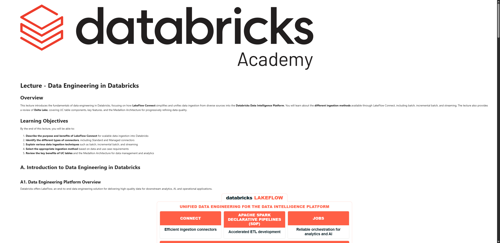

# Lecture: Data Engineering in Databricks

**Curso:** Data Ingestion with Lakeflow Connect  
**Tipo de Contenido:** SCORM / Lección Interactiva  
**Captura de Pantalla:** 

---

## Overview

This lecture introduces the fundamentals of data engineering in Databricks, focusing on how **LakeFlow Connect** simplifies and unifies data ingestion from diverse sources into the **Databricks Data Intelligence Platform**. You will learn about the **different ingestion methods** available through LakeFlow Connect, including batch, incremental batch, and streaming. The lecture also provides a review of **Delta Lake**, covering UC table components, key features, and the Medallion Architecture for progressively refining data quality.

## Learning Objectives

By the end of this lecture, you will be able to:

1. **Describe the purpose and benefits of LakeFlow Connect** for scalable data ingestion into Databricks.
2. **Identify the different types of connectors**, including Standard and Managed connectors.
3. **Explain various data ingestion techniques** such as batch, incremental batch, and streaming.
4. **Select the appropriate ingestion method** based on data and use case requirements.
5. **Review the key benefits of UC tables** and the Medallion Architecture for data management and analytics.

---

## A. Introduction to Data Engineering in Databricks

### A1. Data Engineering Platform Overview

Databricks offers **LakeFlow**, an end-to-end data engineering solution for delivering high-quality data for downstream analytics, AI, and operational applications:

- **CONNECT**: Efficient ingestion connectors (files, object storage, SaaS, databases, streaming).
- **APACHE SPARK DECLARATIVE PIPELINES (SDP)**: Accelerated ETL development with auto-orchestration.
- **JOBS**: Reliable orchestration for analytics, data engineering, and AI workloads.
- **PROCESSING ENGINE**: Apache Spark + Structured Streaming (Photon-powered).
- **UNIFIED GOVERNANCE**: Unity Catalog (centralized access control, lineage, and auditing).
- **OPTIMIZED STORAGE**: Delta Lake (open table format on Parquet + JSON transaction logs).

---

## B. What Is LakeFlow Connect?

LakeFlow Connect streamlines data ingestion with simple, efficient connectors that enable you to bring in data from files, cloud storage, databases, enterprise applications, and streaming sources directly into the Databricks Lakehouse — all within a unified, managed platform.

### B1. Traditional Data Ingestion Challenges
- Fragmentation across multiple tools and point solutions.
- Brittle custom connectors requiring ongoing maintenance.
- Lack of centralized governance, lineage, and data security.
- High operational overhead and compute costs.

### B2. LakeFlow Connect: Unified Ingestion
- Ingestion pipelines built entirely within Databricks.
- Simple setup, automated scaling, zero-management infrastructure.
- Unified observability, data health monitoring, and Unity Catalog governance.

### B3. Connector Categories
1. **Upload Files**: Direct manual upload of local files into Unity Catalog volumes or tables (great for testing and ad-hoc analysis).
2. **Standard Connectors**:
   - Supported sources: Cloud Object Storage (S3, ADLS Gen2, GCS), Apache Kafka, and message queues.
   - Methods: Batch (`CTAS` / `spark.read`), Incremental Batch (`COPY INTO`), and Streaming (`Auto Loader`).
3. **Managed Connectors**:
   - Supported sources: SaaS applications (Salesforce, Workday, ServiceNow, etc.) and operational databases (PostgreSQL, MySQL, SQL Server, Oracle).
   - Ingestion: Native, serverless change data capture (CDC), highly efficient incremental reads/writes without impacting operational systems.

---

## C. Ingestion Methods

### 1. Batch Ingestion
- Loads data as complete batches of rows, typically on a scheduled basis.
- Processes all available records each time it runs.
- **Techniques:** SQL `CREATE TABLE AS SELECT (CTAS)` | Python `spark.read.load()`.

### 2. Incremental Batch Ingestion
- Only new or modified files are ingested; previously processed files are skipped automatically.
- Idempotent and cost-efficient.
- **Techniques:** SQL `COPY INTO` | Python `spark.readStream` (Auto Loader with timed triggers) | SDP `CREATE OR REFRESH STREAMING TABLE`.

### 3. Streaming Ingestion
- Continuously loads records as they are generated for near real-time queries.
- Micro-batch processing at sub-second to minute intervals.
- **Techniques:** `spark.readStream` with Auto Loader (`cloudFiles`) | Declarative Pipelines with continuous trigger.

---

## D. Delta Lake Review & UC Tables

Delta Lake delivers open, reliable, and scalable storage for the Lakehouse:
- **ACID Transactions**: Atomicity, Consistency, Isolation, and Durability ensure concurrent reads/writes never conflict.
- **Parquet + Transaction Log**: Data files stored as columnar Parquet files, tracked by a strict `_delta_log` directory of sequential JSON commits.
- **Medallion Architecture**:
  - **Bronze**: Raw ingest preserving source data fidelity.
  - **Silver**: Cleaned, filtered, validated, and conformed data.
  - **Gold**: Business-level aggregations and feature stores for BI and ML.
