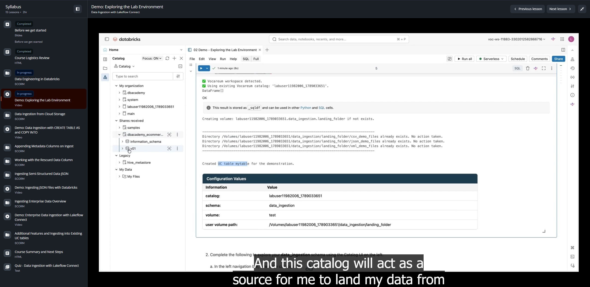

# Demo: Exploring the Lab Environment

**Curso:** Data Ingestion with Lakeflow Connect  
**Tipo de Contenido:** Video / Demostración práctica  
**Duración aproximada:** 6 minutos 21 segundos  

---

## Captura de Pantalla del Entorno



---

## Resumen Técnico y Comandos del Laboratorio

En esta demostración se realiza un recorrido completo por los objetos de datos y esquemas en **Unity Catalog** utilizados durante el curso:

1. **Configuración de Cómputo:**
   - Conexión a un clúster **Serverless Classic Compute** (versión actual de Serverless).
   - Ejecución del script de inicialización del aula (`classroom-setup`), que crea y asigna:
     - Catálogo por defecto del usuario: `labuser_<id>`.
     - Esquema de trabajo por defecto: `data_ingestion`.
     - Volumen administrado (`landing`) con carpetas para fuentes `csv`, `json` y `xml`.
     - Tabla administrada inicial de prueba.

2. **Catálogos y Fuentes:**
   - Catálogo de trabajo individual: `labuser_<id>`.
   - Catálogo compartido del Marketplace: `dbacademy_ecommerce` (actúa como origen de datos históricos para aterrizar en los volúmenes del usuario).

3. **Sintaxis SQL Demostrada:**
   ```sql
   -- Establecer catálogo y esquema dinámicamente usando IDENTIFIER
   USE CATALOG IDENTIFIER(:my_catalog);
   USE SCHEMA data_ingestion;

   -- Verificar catálogo y esquema activo
   SELECT current_catalog(), current_schema();

   -- Inspeccionar esquemas y metadatos
   SHOW SCHEMAS;
   DESCRIBE SCHEMA EXTENDED data_ingestion;

   -- Describir propiedades de tablas
   DESCRIBE TABLE EXTENDED my_table;

   -- Inspeccionar volúmenes y listar archivos Parquet
   DESCRIBE VOLUME dbacademy_ecommerce.raw.user_historical;
   LIST '/Volumes/dbacademy_ecommerce/raw/user_historical';
   ```

---

## Transcripción Literal Completa

**[00:00 - 00:03]** Welcome to demo, Exploring the Lab Environment.

**[00:04 - 00:08]** So this demo is particularly designed to walk you through all the data objects that are present in the Unity Catalog and all the resources that we are going to use into our demo.

**[00:08 - 00:11]** So first thing first, I'll just make sure I'm connected to a serverless classic compute, which I am, and this is the current and the latest version of serverless.

**[00:15 - 00:25]** Then I'm going to run my classroom setup script.

**[00:25 - 00:32]** What this script is going to do, it is going to assign my default catalog as my labuser catalog, which is different for different labuser.

**[00:33 - 00:44]** Then it is also going to define the data_ingestion schema to my default schema. Right.

**[00:45 - 00:53]** Also, it has created a volume for me and created three directory inside that, and it has created a UC table.

**[00:53 - 00:57]** So we are going to see each one of these one by one.

**[00:57 - 01:07]** First thing first, I'll go into the catalog icon on the left-hand side pane. Then you can see all the available catalogs.

**[01:08 - 01:14]** I'm particularly interested in my catalog. Under this catalog, I have three different schemas.

**[01:14 - 01:23]** So my working schema, which I'm going to use in this course, is data_ingestion. This default schemas gets created whenever a new catalog gets created.

**[01:23 - 01:31]** And this is our information schema, which contains more or less the metadata information. So I'm going to open this data_ingestion.

**[01:31 - 01:40]** You can see under Tables, I have one table present, which I just created. And in Volumes, I have a landing folder.

**[01:40 - 01:50]** Under these landing folders, I have three files folder for CSV, JSON, and XML, which we are going to see in upcoming demos. Right.

**[01:51 - 02:03]** Also, you can see I have this shared catalog here by the name of dbacademy_ecommerce. So this is catalog which has been created from marketplace.

**[02:04 - 02:20]** And this catalog will act as a source for me to land my data from these volumes to my labuser volumes. We are going to see that in the further demos. Okay.

**[02:22 - 02:35]** First thing first, let me see what is my catalog, which is again nothing but my labuser catalog, right? So as I told you, in the setup script itself, we have defaulted my labuser catalog to a default catalog.

**[02:38 - 02:45]** But if somebody needs to know how you do that, so these are the SQL commands. Excuse me. Yeah.

**[02:46 - 03:04]** So these are the SQL commands. So I'm using identifier, which is going to be used in SQL to reference any variable, which in my case is my catalog. And then the schema name is same throughout for every user, so it is data_ingestion only, right?

**[03:04 - 03:14]** So these are the commands, and then I'm going to select what is my current_catalog, and I should get my catalog and data_ingestion schema value here.

**[03:16 - 03:22]** You can see my current_catalog is labuser, some random number, and data_ingestion is my current_schema. Okay.

**[03:23 - 03:32]** Now, inspecting and referencing Unity Catalog object, which we just see in the left-side pane, but you can use it via command as well.

**[03:33 - 03:42]** So it says SHOW SCHEMA. So it just shown schema, which is in my default catalog, right? Because I've selected in the upper command.

**[03:42 - 03:59]** So there are three schemas that's present, and under my data_ingestion schema, let me see the metadata information as well. So it says the catalog name is this, the namespace name is this, who is the owner of this, and what are the properties, whether the predictive optimization is enabled or not. So I get some metadata information here. Okay.

**[04:01 - 04:12]** Then what is the property of the table that I just created? So you can see there are two columns: ID and name, and the data type is listed as well.

**[04:12 - 04:28]** Then some stats about this table, and then some detailed information, right? What is the location, what is the type of table, it is managed or external, and whether the predictive optimization enabled or not. Right.

**[04:29 - 04:44]** Now, volumes, I already discussed about all the things, all the data. If you want to store it in Unity Catalog, we have specific location for this, where you can store all your data and then fetch it later for creating tables, right?

**[04:44 - 04:50]** And you can share some functions and your ML models as well in the volumes, right?

**[04:50 - 05:00]** So I have gone through the UI already, but let just me give you a quick walk-through what are the different volumes that we are going to use.

**[05:01 - 05:11]** So under Delta, we have some different folders, some data. But for this particular demonstration, we are going to interested in the raw.

**[05:11 - 05:28]** So under raw folder, I have this sales_historical, which has some data. And if I say user_historical, it has one, two, three, four files and three metadata files. We start with the underscore.

**[05:31 - 05:44]** Or you can do a DESCRIBE VOLUME on dbacademy_ecommerce, and this is my schema, and this is my volume, right? So here is properties about it.

**[05:45 - 05:48]** The volume type is managed, securable type, securable kind.

**[05:49 - 06:05]** Then if I want to list what are the different files available under user_historical, which we just saw, I can click on this and see. So you can see there are four part files, which is of type Parquet, and there are these three files, which is metadata files, right?

**[06:05 - 06:12]** You can see the modification time and the size as well.

**[06:13 - 06:21]** So that's it for this demo. And in the upcoming demo, we are going to see how we can ingest data and going to learn more techniques about it. Thank you.
