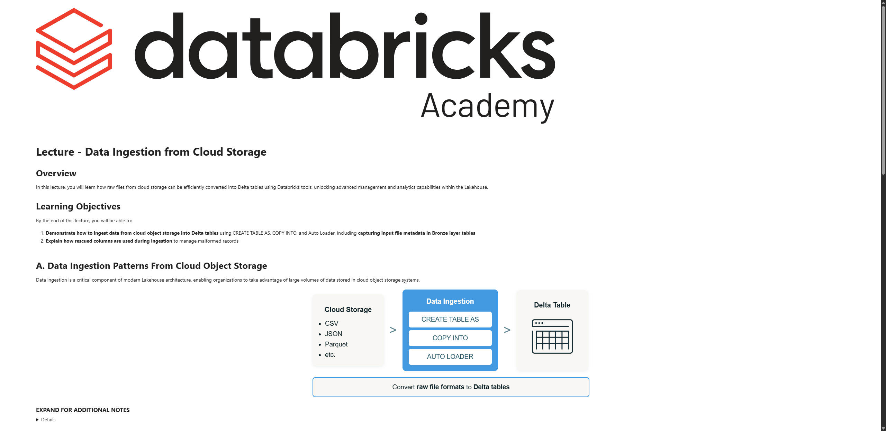

# Lecture: Data Ingestion from Cloud Storage

**Curso:** Data Ingestion with Lakeflow Connect  
**Tipo de Contenido:** SCORM / Lección Interactiva  
**Captura de Pantalla:** 

---

## Overview

In this lecture, you will learn how raw files from cloud storage can be efficiently converted into Delta tables using Databricks tools, unlocking advanced management and analytics capabilities within the Lakehouse.

## Learning Objectives

By the end of this lecture, you will be able to:

1. **Demonstrate how to ingest data from cloud object storage into Delta tables** using `CREATE TABLE AS`, `COPY INTO`, and `Auto Loader`, including capturing input file metadata in Bronze layer tables.
2. **Explain how rescued columns are used during ingestion** to manage malformed records.

---

## A. Data Ingestion Patterns From Cloud Object Storage

Data ingestion is a critical component of modern Lakehouse architecture, enabling organizations to take advantage of large volumes of data stored in cloud object storage systems.

```
Cloud Storage (CSV, JSON, Parquet, etc.) 
   └──> Data Ingestion (CREATE TABLE AS, COPY INTO, AUTO LOADER)
         └──> Delta Table (Unity Catalog)
```

Convert **raw file formats** to **Delta tables**.

---

## B. Data Ingestion Methods

When ingesting data into Databricks using Lakeflow Connect Standard Connectors, you can choose from several ingestion methods:

### Method 1 - Batch: `CREATE TABLE AS (CTAS)`

```sql
CREATE TABLE new_table AS
SELECT *
FROM read_files(
  <path_to_file(s)>,
  format => '<file_type>',
  <other_format_specific_options>
);
```

- `CREATE TABLE AS (CTAS)` creates a Delta table **by default** from files in cloud object storage.
- The `read_files()` function reads files under a provided location and returns the data in **tabular form**.

---

### Method 2 - Incremental Batch: `COPY INTO`

```sql
CREATE TABLE new_table;

COPY INTO new_table
FROM '<dir_path>'
FILEFORMAT = <file_type>
FORMAT_OPTIONS (<options>)
COPY_OPTIONS (<options>);
```

- Use the `COPY INTO` statement to copy files from cloud storage into the Delta table; this performs a bulk load from files in cloud object storage into the table.
- `COPY INTO` will skip any files that have already been loaded into the table, and only new files will be ingested (idempotent).

---

### Method 3 - Incremental Batch or Streaming: `AUTO LOADER`

#### Python Auto Loader
```python
(spark
  .readStream
    .format("cloudFiles")
    .option("cloudFiles.format", "json")
    .option("cloudFiles.schemaLocation", "<checkpoint_path>")
    .load("/Volumes/catalog/schema/files")
  .writeStream
    .option("checkpointLocation", "<checkpoint_path>")
    .trigger(processingTime="5 seconds")
    .toTable("catalog.database.table")
)
```

#### Auto Loader with SQL (Declarative Pipelines / SDP)
```sql
CREATE OR REFRESH STREAMING TABLE
  catalog.schema.table
SCHEDULE EVERY 1 HOUR
AS
SELECT *
FROM STREAM read_files(
  '<dir_path>',
  format => '<file_type>'
);
```

---

## C. Ingestion Methods at a Glance

| Característica / Feature | `CREATE TABLE AS (CTAS)` + `spark.read` | `COPY INTO` | `Auto Loader` |
|---|---|---|---|
| **Tipo de Ingesta** | Batch | Incremental Batch | Incremental (Batch o Streaming) |
| **Casos de Uso** | Ideal para datasets pequeños o cargas ad-hoc | Ideal para miles de archivos | Escala a millones de archivos por hora, backfills de miles de millones |
| **Sintaxis / Interfaz** | Python (`spark.read`) / SQL (`CTAS`) | SQL | Python (`spark.readStream`) / SQL en SDP (`STREAM read_files`) / Streaming tables |
| **Idempotencia** | No | Sí | Sí |
| **Evolución de Esquema** | Manual o inferida en lectura | Soportada con opciones | Detección automática y evolución transparente (rescued data column) |
| **Latencia** | Alta | Moderada (programada) | Baja a alta según configuración de trigger |
| **Dificultad de Uso** | Simple | Simple y basada en SQL | Intermedia a avanzada |
| **Resumen** | Carga completa en cada ejecución | Ingesta incremental repetible | Máxima automatización, escalabilidad y producción |

---

## D. Conclusion & Next Steps

In this lecture, you learned the three primary methods for ingesting data from cloud object storage into Delta tables:
- **`CREATE TABLE AS (CTAS)`**: Ingesta batch con `read_files()` que crea tablas Delta desde archivos crudos.
- **`COPY INTO`**: Ingesta incremental idempotente que ignora archivos ya cargados y soporta opciones de formato.
- **`AUTO LOADER`**: El método más escalable, construido sobre Spark Structured Streaming, con evolución automática de esquemas.
