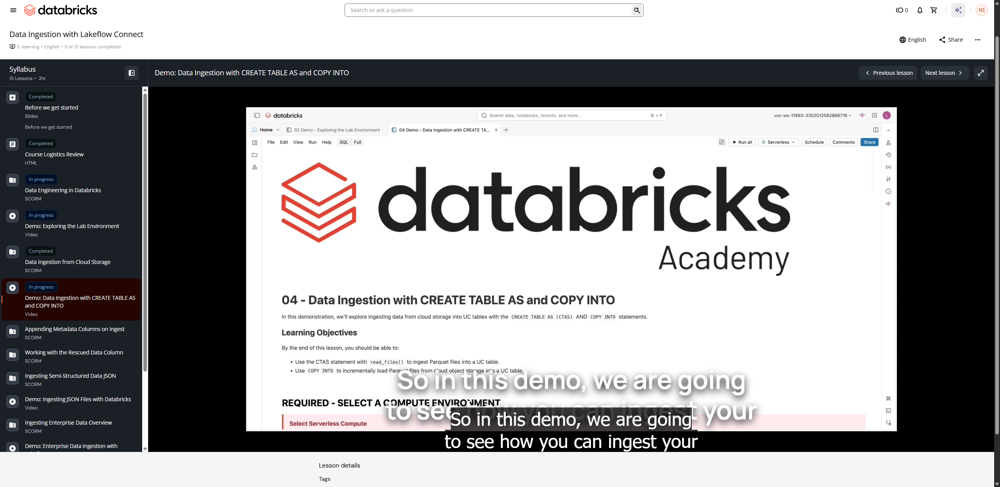

# Demo: Data Ingestion with CREATE TABLE AS and COPY INTO

**Curso:** Data Ingestion with Lakeflow Connect  
**Tipo de Contenido:** Video / Demostración Práctica  
**Duración aproximada:** 11 minutos 05 segundos  
**Captura de Pantalla:** 

---

## Resumen Técnico y Patrones Clave

En esta demostración se enseñan e implementan dos patrones fundamentales de ingesta en Databricks:

### 1. Ingesta por Lotes con CTAS (`CREATE TABLE AS SELECT`)
- **Función `read_files()`**: Permite consultar directamente archivos en almacenamiento en la nube o volúmenes de Unity Catalog.
  - Parámetros clave: `format => 'parquet'`, `schemaHints`, `inferColumnTypes`.
  - Columna automática `_rescued_data`: Se incluye por defecto para capturar registros malformados o que no coinciden con el esquema inferido.
- **Creación de Tabla:**
  ```sql
  CREATE OR REPLACE TABLE user_historical_ctas AS
  SELECT *
  FROM read_files(
    '/Volumes/dbacademy_ecommerce/raw/user_historical',
    format => 'parquet'
  );
  ```

### 2. Tablas Administradas (Managed) vs Tablas Externas (External)
- **Managed Tables (por defecto):** Databricks administra tanto los metadatos en Unity Catalog como los archivos físicos subyacentes. Al ejecutar `DROP TABLE`, se eliminan tanto la definición como los datos.
- **External Tables:** Databricks solo gestiona los metadatos; la ubicación física reside en un storage externo con credenciales de acceso. Al ejecutar `DROP TABLE`, solo se borran los metadatos; los archivos físicos se conservan.

### 3. Equivalente en PySpark
```python
df = (spark.read
      .format("parquet")
      .load("/Volumes/dbacademy_ecommerce/raw/user_historical"))

df.write.mode("overwrite").saveAsTable("user_historical_pyspark")
```

### 4. Ingesta Incremental con `COPY INTO` (Idempotencia y Evolución de Esquema)
- **Idempotencia:** Si se vuelve a ejecutar `COPY INTO` sobre la misma ruta con los mismos archivos, no se insertan duplicados (`0 files affected`).
- **Manejo de Desajuste de Esquema (`mergeSchema`):**
  ```sql
  COPY INTO user_historical_copy
  FROM '/Volumes/dbacademy_ecommerce/raw/user_historical'
  FILEFORMAT = PARQUET
  COPY_OPTIONS ('mergeSchema' = 'true');
  ```

---

## Transcripción Literal Completa

**[00:00 - 00:09]** Welcome to demo, Data Ingestion with CREATE TABLE and COPY INTO. So in this demo, we are going to see how you can ingest your data using two specific methods.

**[00:09 - 00:15]** The first one is using CTAS, which is called as CREATE TABLE AS, and using the COPY INTO command. Right.

**[00:18 - 00:26]** So before starting, I'll just make sure I'm connected to a serverless compute. I'm on the latest version. Then I run my classroom setup script.

**[00:27 - 00:34]** What it is going to do, it is going to default my catalog as labuser catalog and my schema as data_ingestion schema. Right. Okay.

**[00:37 - 00:56]** Now, meanwhile this is running, I will quickly go into my catalog. Inside my schema, you can see I only have one table. Okay. Now it has completed. Then just quickly see what is my catalog and current schema. Okay.

**[01:00 - 01:24]** Now, the next step is to review the data source files. You can either go into the catalog, go to the dbacademy_ecommerce under raw in the user historical section, which we seen in the last demo as well, or I can just query to see the number of available files in my source. Right.

**[01:25 - 01:45]** It says I have four Parquet files and some metadata files. Then for querying the file, here is the command. So what we do, we need to know the format of the file, then we give the location, the absolute location of where the file currently resides, and we use the apostrophe. Right.

**[01:46 - 02:08]** Let's say this file is of type CSV, then I need to define CSV here. Please remember that this is just a querying, it is just reading the data, right? Okay, now it looks good. It has two information. The first one is user_id, and the second one is user_first_touch_timestamp, and their emails as well. Right.

**[02:10 - 02:25]** Now, we are going to see the first method, the CTAS method. Before that, let me shift focus to the read_files functionality, because we are going to use that for extracting or ingesting, right?

**[02:25 - 02:46]** read_files generally gives you options in which you can either define the schema of your file that you have, or you can also define what sort of a file it is coming, what type of file format it is, right? So we have the documentation here. I'm just going to click on this.

**[02:46 - 03:05]** Now I'm going into the options. So you can see the first option here is the format one, which basically means what sort of a file I'm expecting, right? The type is string, which means I need to define it as a string. So it could be of, let's say, Parquet, text, XML, and many other formats, right?

**[03:05 - 03:27]** The schema type. Let's say if I want to explicitly define my schema. Databricks has the capability, or the UC Managed Tables has the ability to auto-detect the schema. But if you want to pass the schema explicitly, you can use this, right? Then the infer column types as well, right? Whether you want to infer the columns or not, which means to infer the schema or not. Right.

**[03:27 - 04:08]** Then we have the partition columns. You can define which columns you want to have the partition on. And this is an interesting one, which is schema hints. So it is generally used in the case of loader, or let's say in a case in which you are expecting some columns to be flown in futures, right? And you basically want to declare that right now into your schema. So the point the data is not coming, the value for those column will flow as null automatically. As soon as the data gets arrived into the source, it will ingest the data into the table. Right. So these are some options.

**[04:09 - 04:38]** Now I'm heading back to the demo and see how read_files works. So this is the query for the read_files. You can see I am still referring to my volume path. And so first I need to provide the path. Second, I need to define what format it is, right? So it is, you can say, a similar of this, what we have done here, but we'll see how it allows more functionality as well, which this direct query can't provide.

**[04:43 - 05:03]** I'm going to run this. And you can see one additional thing here, that is _rescued_data. So it is automatically included by default to capture any sort of a data that doesn't match the inferred schema, right?

**[05:06 - 05:24]** I'm going to run this command. Now, this command is going to create a table for me, right? So as I have set default catalog and schema, so I don't need to explicitly define the three-tier namespace here. I can just use my table name, and it is going to be stored inside my schema only. Right.

**[05:24 - 05:43]** So you can see the first thing is if you are doing it like multiple times, so if you want to make sure that you delete the table first, then you insert the data into that, and then we are querying it. Okay. Now you will see it has successfully completed.

**[05:44 - 06:11]** I have my table. Let me run a describe extended on that to see the metadata, the table information, and all of those stats. So you can see there are like four columns in here. The Delta stats is here as well, and we have a detailed table information. What is the table type, whether the predictive optimization is enabled or not, who is the owner, who is the provider, where is, actually this table have been stored. So we have that location as well. Right.

**[06:12 - 06:40]** Now comes the interesting part. So in Databricks, we have two sorts of table types you can say broadly. The first one is the managed tables. So these are by default. So whenever you create a table into the Databricks platform, and if you don't define anything, so by default, all your metadata and the actual data is going to be stored inside Databricks, and it is going to be completely managed storage. Right.

**[06:40 - 06:49]** So it is recommended because when you have the managed tables, you will get the latest and greatest that Databricks has to offer.

**[06:49 - 07:16]** The second here is the external tables. In that case, Databricks only manage the table's metadata. Your actual data resides somewhere in the external location. Sometimes company opt for this when they have a some strict guideline to store data in their specified location. So the main thing here is to notice is, if you drop the table, it will not delete the data because data doesn't resides in the Databricks.

**[07:16 - 07:24]** It is ideal for sharing data across platform, and you can use the existing internal data. Now, is the bonus part, is the Python integration. Let's see.

**[07:26 - 07:59]** So this is the same command. We are going to do the same thing. It's just we are not using SQL, we are using Python this time. So in Python, you are using PySpark, which means it is actually a read_files version of PySpark, in which we see spark.read the format we defined and the location we defined, right? And we are storing it in the DataFrame. Then once we have the DataFrame in place, we are going to write the DataFrame into this particular location, right? We are using the overwrite command, which means if the table already exists, it's going to overwrite into that.

**[08:00 - 08:15]** Then we are going to again display and query the table. So any of the method you can use, and you will have the same results.

**[08:16 - 08:34]** Now, the second method, it is the incremental data ingestion with the COPY INTO command. So it is the method which loads data from your source location into your UC table. But one thing that is different here, it is that it is retryable and idempotent. What does that mean?

**[08:35 - 08:51]** So it basically doesn't allow to copy the same data again into the same table. So if I run same command twice, it is not going to copy again data from source location to the destination location. Right.

**[08:52 - 09:07]** So we're going to see two examples here. The first one is we're going to use the same set of Parquet files and going to look two example. The first one is we are going to see common schema mismatch error, and second one is preemptively handling schema evolution. First, we'll see. Right.

**[09:08 - 09:45]** So this is the table we have, and I'm going to use a COPY INTO command. Right. I'm defining my table and then trying to COPY INTO. Right. This must return error because why? This, the location at which the file is present, we have seen it has three columns, right? It has user_id, first_user_timestamp, and the email as well. But when we are defining a schema, we don't have that. So let's see. It should return an error. Yeah, it says the schema has been mismatched with the target table.

**[09:46 - 10:13]** Now, to deal with this, what I need to do is I need to pass the mergeSchema as true. So what it's going to do, it's going to merge the schema. So whatever have been present in the source file, it's going to merge into the destination or into my table. Let's see what happens now. Ideally, it should create a new column. So you can say number of affected row, number of inserted row, and number of skipped row file. So it has inserted. The operation have been successful. Let me query the data. Again, it's the same data.

**[10:17 - 10:43]** The second example is preemptively handling schema evolution. Right. Now, in this case, what I'm doing, I'm not doing anything. I'm not passing a schema. Instead, I'm just defining my format and making the mergeSchema as true. You can see the table name is different. Okay. So it should work as well.

**[10:46 - 11:05]** Now, then comes the idempotency part, right? The incremental ingestion. So it should not support a repetitive ingestion. So if I try to COPY INTO the existing table, it says no files have been affected or inserted or corrupted. Thank you.
