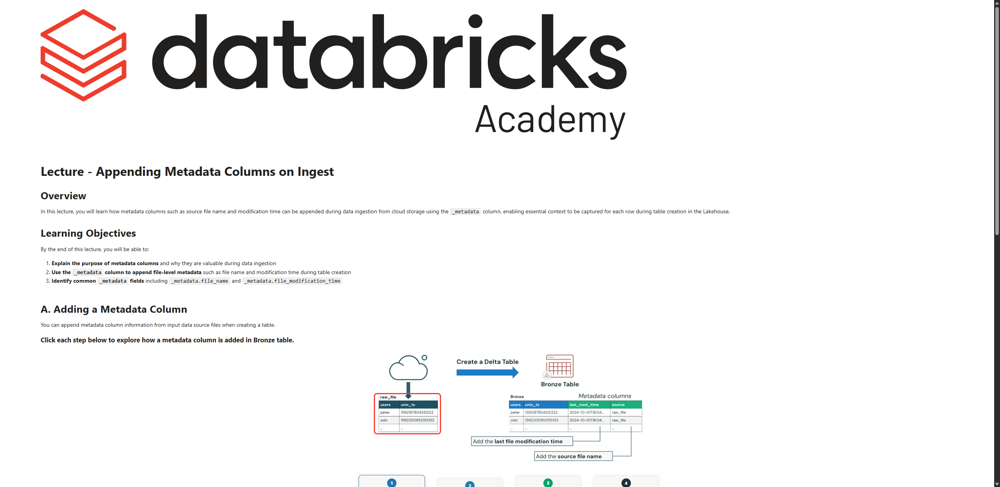

# Lecture: Appending Metadata Columns on Ingest

**Curso:** Data Ingestion with Lakeflow Connect  
**Tipo de Contenido:** SCORM / Lección Interactiva  
**Captura de Pantalla:** 

---

## Overview

In this lecture, you will learn how metadata columns such as source file name and modification time can be appended during data ingestion from cloud storage using the `_metadata` column, enabling essential context to be captured for each row during table creation in the Lakehouse.

## Learning Objectives

By the end of this lecture, you will be able to:

1. **Explain the purpose of metadata columns** and why they are valuable during data ingestion.
2. **Use the `_metadata` column** to append file-level metadata such as file name and modification time during table creation.
3. **Identify common `_metadata` fields** including `_metadata.file_name` and `_metadata.file_modification_time`.

---

## A. Adding a Metadata Column

You can append metadata column information from input data source files when creating a Bronze table:

1. **Raw Files:** CSV, TXT, JSON, Parquet en cloud storage.
2. **Create Delta Table:** Ingest raw files into Bronze layer.
3. **Metadata Columns:** Added from the ingestion source for lineage, auditing, and debugging.
4. **Bronze Table:** Original columns plus metadata columns.

### Ejemplo conceptual de transformación:
```
Raw File:
[users, unix_ts]
('peter', 1592187804331222)
('zebi',  1592200952155132)

         ↓↓ Ingestión con _metadata ↓↓

Bronze Table:
[users, unix_ts, last_mod_time, source]
('peter', 1592187804331222, '2024-10-01T18:04:00Z', 'raw_file.csv')
('zebi',  1592200952155132, '2024-10-01T18:04:00Z', 'raw_file.csv')
```

---

## B. Common File Metadata Fields (`_metadata`)

To add metadata columns during ingestion, you can use the special hidden column `_metadata`. This column is available across all supported input file formats:

- **`_metadata.file_name`**: The name of the input source file (e.g., `part-00002-7573-1-c000.parquet`).
- **`_metadata.file_modification_time`**: The timestamp of when the file was last modified in cloud storage (e.g., `2024-10-07T18:04:42.885+00:00`).
- **`_metadata.file_path`**: Full URI of the input file in cloud storage / volume.
- **`_metadata.file_size`**: Size of the input file in bytes.

### Sintaxis SQL:
```sql
CREATE OR REPLACE TABLE bronze_users AS
SELECT 
  *,
  _metadata.file_name AS source_file,
  _metadata.file_modification_time AS ingestion_file_time
FROM read_files(
  '/Volumes/catalog/schema/raw_data',
  format => 'csv'
);
```

---

## C. Conclusion & Key Takeaways

- Metadata columns preserve vital context about data origin, essential for auditing, data lineage, and debugging.
- The hidden `_metadata` column must be explicitly selected in your read query.
- Best practice in Medallion Architecture: Always enrich Bronze tables with `_metadata` fields to guarantee full end-to-end traceability before Silver processing.
