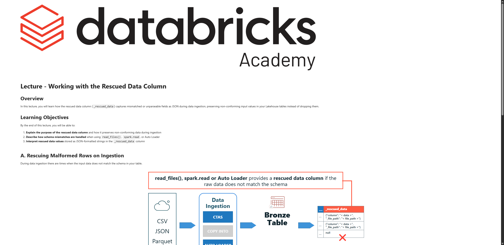

# Lecture: Working with the Rescued Data Column

**Curso:** Data Ingestion with Lakeflow Connect  
**Tipo de Contenido:** SCORM / Lección Interactiva  
**Captura de Pantalla:** 

---

## Overview

In this lecture, you will learn how the rescued data column (`_rescued_data`) captures mismatched or unparseable fields as JSON during data ingestion, preserving non-conforming input values in your Lakehouse tables instead of dropping them.

## Learning Objectives

By the end of this lecture, you will be able to:

1. **Explain the purpose of the rescued data column** and how it preserves non-conforming data during ingestion.
2. **Describe how schema mismatches are handled** when using `read_files()`, `spark.read`, or `Auto Loader`.
3. **Interpret rescued data values** stored as JSON-formatted strings in the `_rescued_data` column.

---

## A. Rescuing Malformed Rows on Ingestion

During data ingestion there are times when the input data does not match the schema in your target table. Instead of failing the entire stream/batch or silently dropping fields with nulls, Databricks tools (`read_files()`, `spark.read`, and `Auto Loader`) automatically populate a **rescued data column**:

```
Source File Records:
Row 1: { "users": "Peter", "cost": "$100" }  --> ($100 is string, expected BIGINT)
Row 2: { "users": "zebi",  "cost": 300 }      --> (valid BIGINT)

            ↓↓ Ingestión a Tabla Bronze ↓↓

Bronze Table Result:
| users | cost | _rescued_data |
|---|---|---|
| Peter | null | {"cost": "$100", "_file_path": "/Volumes/.../file1.csv"} |
| zebi  | 300  | null |
```

---

## B. Rescued Data Column Key Behavior

1. **JSON-Formatted String:** Values that fail parsing or type coercion are serialized as JSON key-value pairs, including the column name and the source file path.
2. **Conforming Fields Ingested Normally:** All other valid fields in that row (like `users: 'Peter'`) are populated normally.
3. **No Silent Data Loss:** Eliminates silent corruption, allowing data engineers to query `_rescued_data IS NOT NULL` to quarantine or fix dirty records in the Silver layer.
4. **Extra Columns Captured:** If a source file contains unexpected columns not declared in the target schema (and schema evolution is not active), those extra columns are also preserved inside `_rescued_data`.

### Consultas de Depuración Comunes:
```sql
-- Identificar registros rescatados
SELECT *
FROM bronze_users
WHERE _rescued_data IS NOT NULL;

-- Extraer el valor original rescatado mediante notación JSON
SELECT 
  users,
  _rescued_data:cost::string AS raw_cost,
  _rescued_data:_file_path::string AS source_file
FROM bronze_users
WHERE _rescued_data IS NOT NULL;
```

---

## C. Conclusion & Key Takeaways

- Available automatically in `read_files()`, `spark.read`, and `Auto Loader`.
- Prevents silent data loss and pipeline failures due to schema drift or dirty source data.
- Non-conforming rows are retained with `null` in the typed column and the raw unparsed value inside `_rescued_data`.
