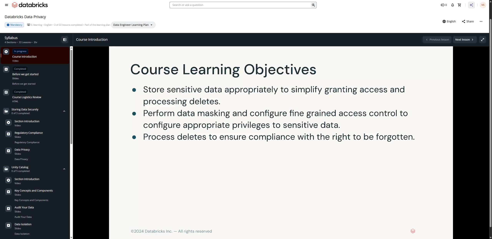
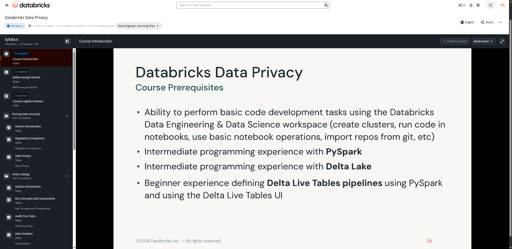
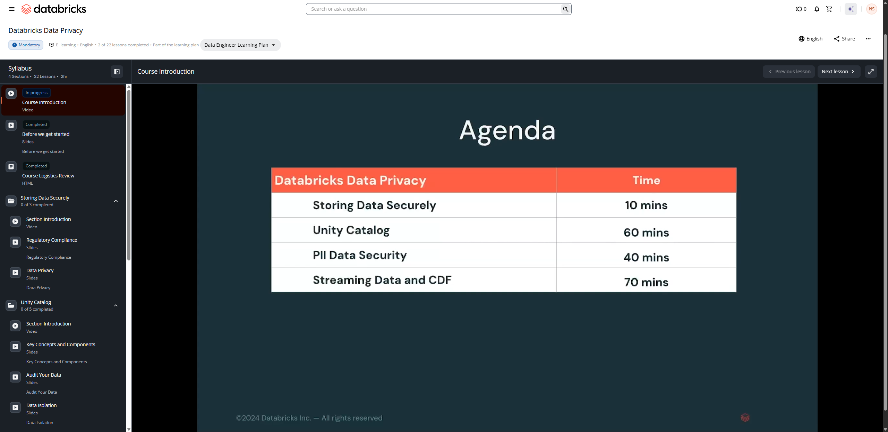

# Lesson 01: Course Introduction — Databricks Data Privacy

## 📋 Resumen de la Lección

- **Curso:** Databricks Data Privacy (ID: 3767)
- **Tipo de Contenido:** Video Conferencia
- **Duración:** 1 minuto 36 segundos (96.36 s)
- **Objetivo Principal:** Introducción general a las capacidades de privacidad de datos, gobierno y cumplimiento regulatorio en la plataforma Databricks Intelligence Platform con Unity Catalog.

---

## 📸 Evidencias Visuales de la Lección

### 1. Objetivos de Aprendizaje del Curso

### 2. Prerrequisitos Técnicos

### 3. Agenda Oficial del Curso y Distribución de Tiempos

---

## 🎯 Objetivos de Aprendizaje Oficiales (Course Learning Objectives)

1. **Almacenamiento Seguro de Datos Sensibles (Store Sensitive Data Appropriately):**
   - Almacenar datos confidenciales y PII en estructuras adecuadas para simplificar la concesión de privilegios de acceso y facilitar el procesamiento de solicitudes de eliminación (deletes).
2. **Enmascaramiento y Control de Acceso Granular (Data Masking & Fine-Grained Access Control):**
   - Implementar máscaras dinámicas de datos a nivel de columna (Column Masks) y filtros a nivel de fila (Row Filters) en Unity Catalog para otorgar privilegios estrictamente basados en roles y pertenencia a grupos.
3. **Cumplimiento del Derecho al Olvido (Right to Be Forgotten):**
   - Procesar borrados y purgas físicas de registros para garantizar el cumplimiento de normativas de privacidad globales (GDPR, CCPA/CPRA, HIPAA).

---

## 🛠️ Prerrequisitos Oficiales (Course Prerequisites)

- **Desarrollo en el Workspace de Databricks:** Capacidad para realizar tareas básicas de desarrollo de código en el entorno de Data Engineering & Data Science (creación de clusters/compute, ejecución de celdas en notebooks, gestión de repositorios Git integrados).
- **Programación Intermedia en PySpark:** Manejo fluido de DataFrames de Spark, funciones de transformación y expresiones SQL.
- **Experiencia Intermedia con Delta Lake:** Comprensión profunda de tablas Delta, transacciones ACID, registro de transacciones Delta (`_delta_log`), `OPTIMIZE` y borrados con `VACUUM`.
- **Experiencia Inicial en Delta Live Tables (DLT) / Spark Declarative Pipelines (SDP):** Definición básica de pipelines de ingesta continua y streaming con PySpark y uso de la interfaz de usuario de DLT.

---

## ⏱️ Agenda Oficial del Curso

| Módulo / Sección | Duración Estimada | Enfoque Técnico |
| :--- | :---: | :--- |
| **Section 1: Storing Data Securely** | 10 mins | Marcos regulatorios (GDPR, CCPA), clasificación de datos y diseño de almacenamiento. |
| **Section 2: Unity Catalog** | 60 mins | Arquitectura de 3 niveles, auditoría del metastore, aislamiento de datos y controles de acceso granular (Row Filters / Column Masks). |
| **Section 3: PII Data Security** | 40 mins | Pseudonimización, anonimización, funciones hash/criptográficas y mejores prácticas. |
| **Section 4: Streaming Data and CDF** | 70 mins | Change Data Feed (CDF), propagación de borrados a través de pipelines de streaming y eliminación física con `VACUUM`. |
| **Total Estimado:** | **~3 horas** | **22 Lecciones en 4 Secciones Principales** |
