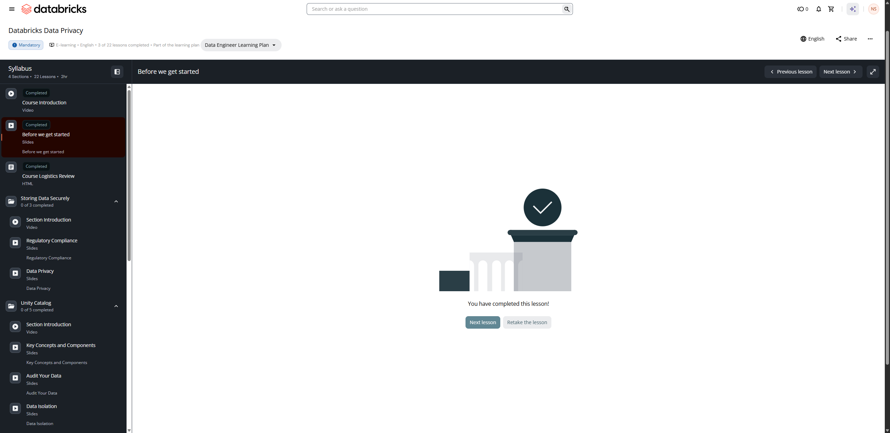

# Lesson 02: Before we get started — Databricks Data Privacy

## 📋 Resumen de la Lección

- **Curso:** Databricks Data Privacy (ID: 3767)
- **Tipo de Contenido:** Slides Interactivas / Prerrequisitos de Laboratorio
- **Estado:** Completado (Completed)
- **Objetivo:** Directrices de configuración del entorno de laboratorio, políticas de uso del workspace de Databricks Academy y preparación del metastore de Unity Catalog.

---

## 📸 Evidencia Visual de la Lección

---

## ⚙️ Directrices de Entorno y Configuración de Laboratorio

1. **Workspace Asignado por Databricks Academy:**
   - Para los laboratorios de privacidad de datos, cada participante utiliza un workspace de Databricks pre-aprovisionado o su propio entorno habilitado con Unity Catalog.
   - El catálogo asignado suele seguir el patrón `dbacademy_<username>` o un catálogo dedicado de laboratorio con permisos de `USE CATALOG` y `USE SCHEMA`.
2. **Requisitos de Compute (Clusters):**
   - Se requiere un cluster de cómputo en modo de acceso **Single User** o **Shared** (recomendado para validación de Row Filters y Column Masks con diferentes identidades de usuario).
   - Databricks Runtime (DBR): Versión 13.3 LTS o superior, con soporte para funciones de enmascaramiento dinámico de datos y Change Data Feed.
3. **Buenas Prácticas de Ejecución:**
   - No almacenar credenciales en texto plano dentro de notebooks.
   - Utilizar Databricks Secrets (`dbutils.secrets.get()`) para cualquier conexión externa.
   - Terminar clusters inactivos para optimizar el consumo de unidades de cómputo (DBUs).
