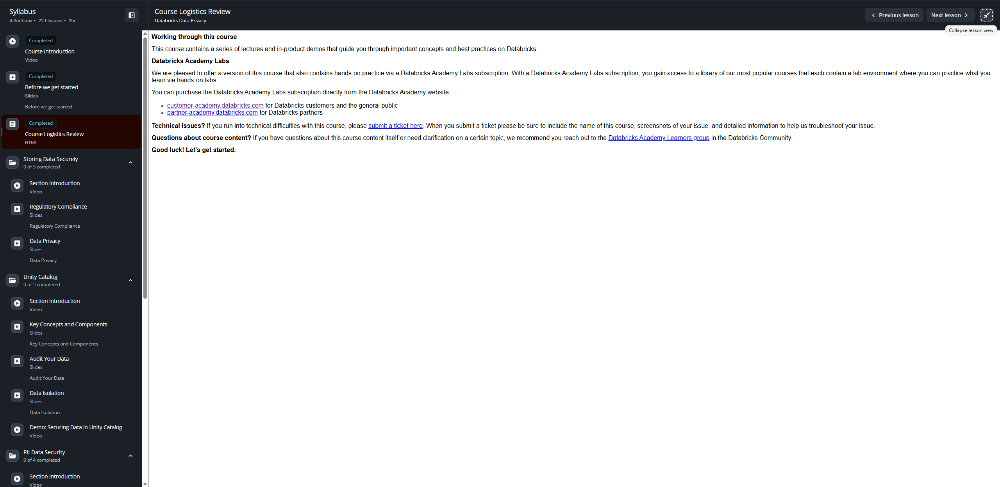

# Lesson 03: Course Logistics Review — Databricks Data Privacy

## 📋 Resumen de la Lección

- **Curso:** Databricks Data Privacy (ID: 3767)
- **Tipo de Contenido:** HTML Interactivo / Guía Logística
- **Estado:** Completado (Completed)
- **Objetivo:** Directrices operativas para completar el curso, recursos de soporte técnico, canales comunitarios y entornos prácticos de laboratorio.

---

## 📸 Evidencia Visual de la Lección

---

## 📖 Contenido Verbatim Oficial

### Working through this course
> *This course contains a series of lectures and in-product demos that guide you through important concepts and best practices on Databricks.*

### Databricks Academy Labs
> *We are pleased to offer a version of this course that also contains hands-on practice via a Databricks Academy Labs subscription. With a Databricks Academy Labs subscription, you gain access to a library of our most popular courses that each contain a lab environment where you can practice what you learn via hands-on labs.*
>
> *You can purchase the Databricks Academy Labs subscription directly from the Databricks Academy website:*
> - `customer-academy.databricks.com` for Databricks customers and the general public
> - `partner-academy.databricks.com` for Databricks partners

### Technical Issues & Troubleshooting
> *If you run into technical difficulties with this course, please submit a ticket here. When you submit a ticket please be sure to include the name of this course, screenshots of your issue, and detailed information to help us troubleshoot your issue.*

### Questions about Course Content
> *If you have questions about this course content itself or need clarification on a certain topic, we recommend you reach out to the Databricks Academy Learners group in the Databricks Community.*
>
> *Good luck! Let's get started.*
