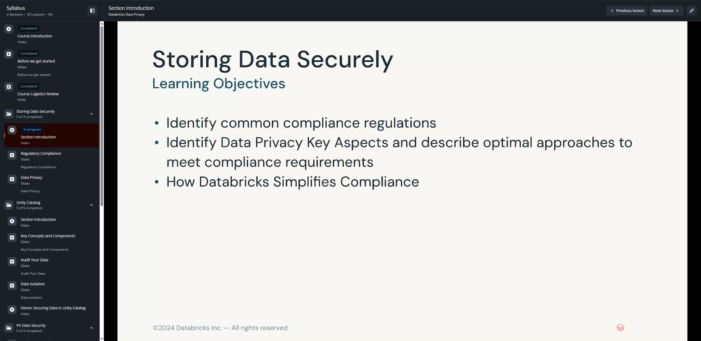

# Lesson 04: Section Introduction — Storing Data Securely

## 📋 Resumen de la Lección

- **Curso:** Databricks Data Privacy (ID: 3767)
- **Sección:** Section 1: Storing Data Securely
- **Tipo de Contenido:** Video Conferencia
- **Duración:** 36.13 segundos
- **Objetivo Principal:** Presentación de los objetivos de aprendizaje de la Sección 1, enfocada en regulaciones de cumplimiento, aspectos clave de privacidad de datos y simplificación del cumplimiento normativo en Databricks.

---

## 📸 Evidencia Visual de la Lección

---

## 🎯 Objetivos de Aprendizaje de la Sección 1 (Learning Objectives)

1. **Identificar Regulaciones Comunes de Cumplimiento (Identify Common Compliance Regulations):**
   - Reconocer los requisitos normativos internacionales y sectoriales clave:
     - **GDPR (General Data Protection Regulation):** Unión Europea — consentimiento explícito, derecho al olvido (Right to Erasure / Article 17), portabilidad y minimización de datos.
     - **CCPA / CPRA (California Consumer Privacy Act):** Estados Unidos — derecho a conocer, derecho a eliminar y derecho a optar por no vender ni compartir información personal sensible.
     - **HIPAA (Health Insurance Portability and Accountability Act):** Estados Unidos — protección de información médica protegida (PHI).
2. **Aspectos Clave de la Privacidad de Datos y Estrategias Óptimas:**
   - Clasificación estricta de datos (PII directa vs PII indirecta o cuasi-identificadores).
   - Patrones de almacenamiento seguro para aislar datos sensibles desde la capa Bronze.
3. **Cómo Databricks Simplifica el Cumplimiento (How Databricks Simplifies Compliance):**
   - Transacciones ACID en Delta Lake para mutabilidad garantizada de registros (`UPDATE`, `DELETE`, `MERGE`).
   - Gobernanza unificada con Unity Catalog para centralizar permisos, auditoría y linaje.
   - Purgas físicas irreversibles de archivos subyacentes mediante `VACUUM`.
