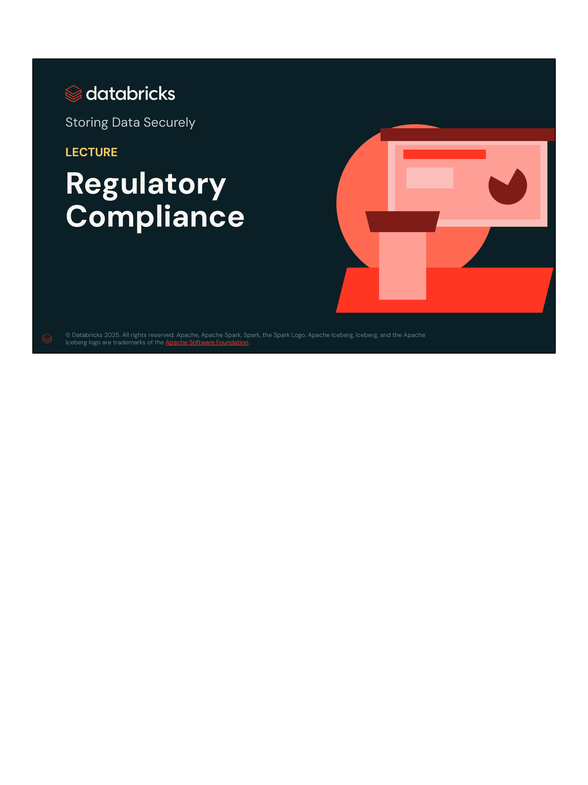
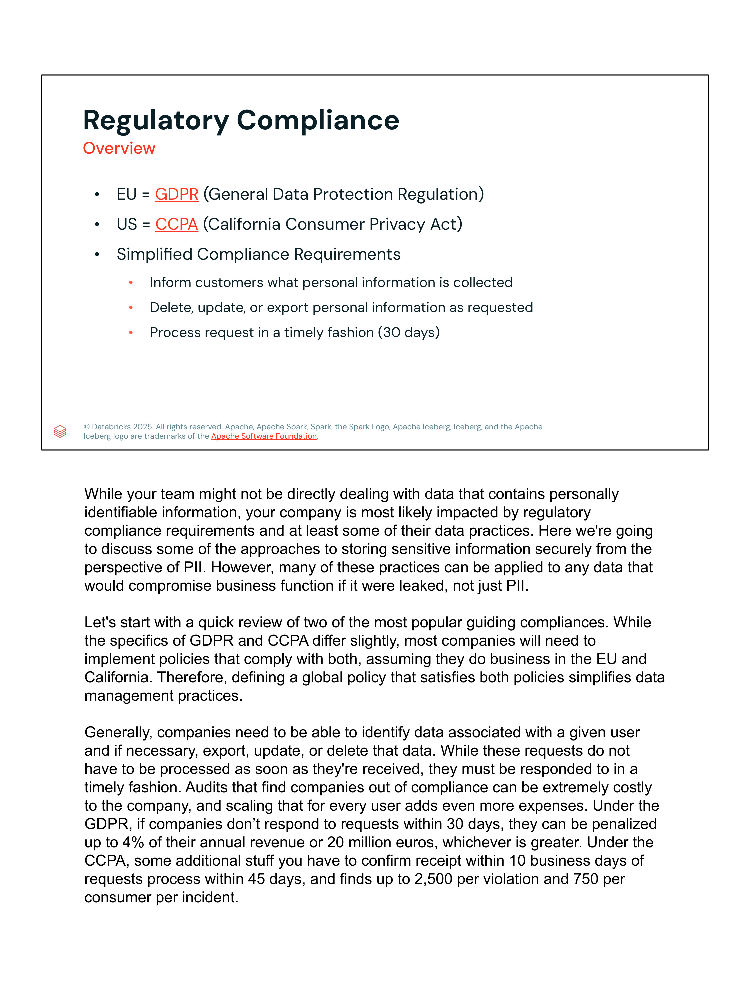
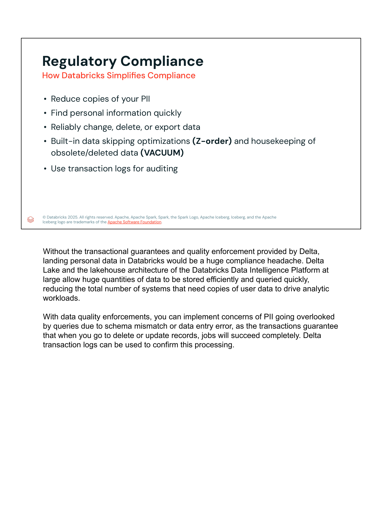

# Lección 05: Regulatory Compliance

**Curso:** Databricks Data Privacy  
**Sección:** Storing Data Securely  
**Formato:** Slides & Lecture Transcripts  
**Estado:** Completado 100%  

---

## 1. Visión General de la Lección y Objetivos

En esta lección se exploran los marcos regulatorios internacionales más importantes sobre privacidad de datos (**GDPR** en la Unión Europea y **CCPA** en los Estados Unidos), sus implicaciones y requisitos de cumplimiento para las organizaciones de datos, y cómo la arquitectura **Lakehouse de Databricks** y el formato **Delta Lake** simplifican radicalmente el cumplimiento normativo.

---

## 2. Diapositivas y Transcripciones Verbatim

### Slide 1: Portada

- **Título:** Storing Data Securely
- **Tema:** LECTURE: Regulatory Compliance
- **Organización:** Databricks Academy

---

### Slide 2: Overview (Marcos Regulatorios y Requisitos)

#### Contenido de la Diapositiva
- **EU = GDPR** (*General Data Protection Regulation*)
- **US = CCPA** (*California Consumer Privacy Act*)
- **Simplified Compliance Requirements:**
  - Inform customers what personal information is collected.
  - Delete, update, or export personal information as requested.
  - Process request in a timely fashion (30 days).

#### Transcripción Oficial del Instructor (Verbatim)
> *"While your team might not be directly dealing with data that contains personally identifiable information, your company is most likely impacted by regulatory compliance requirements and at least some of their data practices. Here we're going to discuss some of the approaches to storing sensitive information securely from the perspective of PII. However, many of these practices can be applied to any data that would compromise business function if it were leaked, not just PII.*
>
> *Let's start with a quick review of two of the most popular guiding compliances. While the specifics of GDPR and CCPA differ slightly, most companies will need to implement policies that comply with both, assuming they do business in the EU and California. Therefore, defining a global policy that satisfies both policies simplifies data management practices.*
>
> *Generally, companies need to be able to identify data associated with a given user and if necessary, export, update, or delete that data. While these requests do not have to be processed as soon as they're received, they must be responded to in a timely fashion. Audits that find companies out of compliance can be extremely costly to the company, and scaling that for every user adds even more expenses. Under the GDPR, if companies don't respond to requests within 30 days, they can be penalized up to 4% of their annual revenue or 20 million euros, whichever is greater. Under the CCPA, some additional stuff you have to confirm receipt within 10 business days of requests process within 45 days, and fines up to $2,500 per violation and $750 per consumer per incident."*

---

### Slide 3: How Databricks Simplifies Compliance

#### Contenido de la Diapositiva
- **Reduce copies of your PII**
- **Find personal information quickly**
- **Reliably change, delete, or export data**
- **Built-in data skipping optimizations (`Z-order`) and housekeeping of obsolete/deleted data (`VACUUM`)**
- **Use transaction logs for auditing**

#### Transcripción Oficial del Instructor (Verbatim)
> *"Without the transactional guarantees and quality enforcement provided by Delta, landing personal data in Databricks would be a huge compliance headache. Delta Lake and the lakehouse architecture of the Databricks Data Intelligence Platform at large allow huge quantities of data to be stored efficiently and queried quickly, reducing the total number of systems that need copies of user data to drive analytic workloads.*
>
> *With data quality enforcements, you can eliminate concerns of PII going overlooked by queries due to schema mismatch or data entry error, as the transactions guarantee that when you go to delete or update records, jobs will succeed completely. Delta transaction logs can be used to confirm this processing."*

---

## 3. Matriz Comparativa: GDPR vs. CCPA

| Dimensión | GDPR (Unión Europea) | CCPA (California / EE. UU.) |
| :--- | :--- | :--- |
| **Ámbito de Aplicación** | Ciudadanos y residentes de la Unión Europea. Aplica globalmente a cualquier entidad que procese sus datos. | Consumidores residentes en California. Aplica a empresas con fines de lucro que operan en CA y cumplen ciertos umbrales de ingresos/volumen. |
| **Plazo de Respuesta** | **30 días** naturales (prorrogable bajo circunstancias justificadas). | Confirmación de recepción en **10 días hábiles**; respuesta/procesamiento en **45 días** naturales. |
| **Derechos Fundamentales** | Acceso, Rectificación, Supresión ("Derecho al Olvido"), Portabilidad, Oposición, Limitación del Tratamiento. | Derecho a saber qué se recopila, Derecho a eliminar, Derecho a optar por no vender/compartir datos (*Opt-out*), Derecho a no discriminación. |
| **Sanciones Máximas** | Hasta **€20 millones** o el **4% de la facturación global anual** del ejercicio anterior (lo que sea mayor). | Multas civiles de hasta **$2,500** por violación involuntaria o **$7,500** por violación intencionada; daños estatutarios de **$100 a $750 por consumidor e incidente** en filtraciones. |

---

## 4. Capacidades Técnicas de Databricks para Cumplimiento

1. **Centralización en el Lakehouse (Reducción de silos de PII):**
   - Elimina la necesidad de replicar conjuntos de datos en almacenes de datos propietarios (EDW), datamarts y data lakes dispersos.
   - Una única copia gobernada por **Unity Catalog** para analítica, BI, streaming y Machine Learning.

2. **Garantías Transaccionales ACID en Delta Lake:**
   - Sentencias `UPDATE`, `DELETE` y `MERGE INTO` totalmente atómicas.
   - Si una operación de supresión de datos o rectificación falla a mitad de camino, se revierte sin dejar estados corruptos o inconsistentes.

3. **Optimizaciones de Salto de Datos (*Data Skipping* & Indexing):**
   - Uso de estadísticas de archivo min/max, **Z-Ordering** o **Liquid Clustering (`CLUSTER BY`)** por claves identificadoras de usuarios (ej. `user_id`, `customer_id`).
   - Permite localizar y reescribir únicamente los archivos Parquet que contienen el PII del usuario solicitante, reduciendo tiempos y costos de escaneo masivo.

4. **Eliminación Física con `VACUUM`:**
   - Las operaciones `DELETE` en Delta Lake marcan los registros lógicamente creando nuevos archivos Parquet sin esos registros (manteniendo el historial de *Time Travel* en el log).
   - Para cumplir rigurosamente con el "Derecho al Olvido", el comando `VACUUM table_name [RETAIN num HOURS]` purga físicamente del almacenamiento de objetos (S3/ADLS/GCS) los archivos obsoletos no referenciados por la versión actual del log transaccional.

5. **Trazabilidad y Auditoría en Delta Transaction Log (`_delta_log`):**
   - Cada commit genera un archivo `.json` inmutable con timestamp, usuario ejecutor, motor y operación realizada (`DELETE`, `UPDATE`), sirviendo como evidencia legal de cumplimiento frente a auditorías regulatorias.
