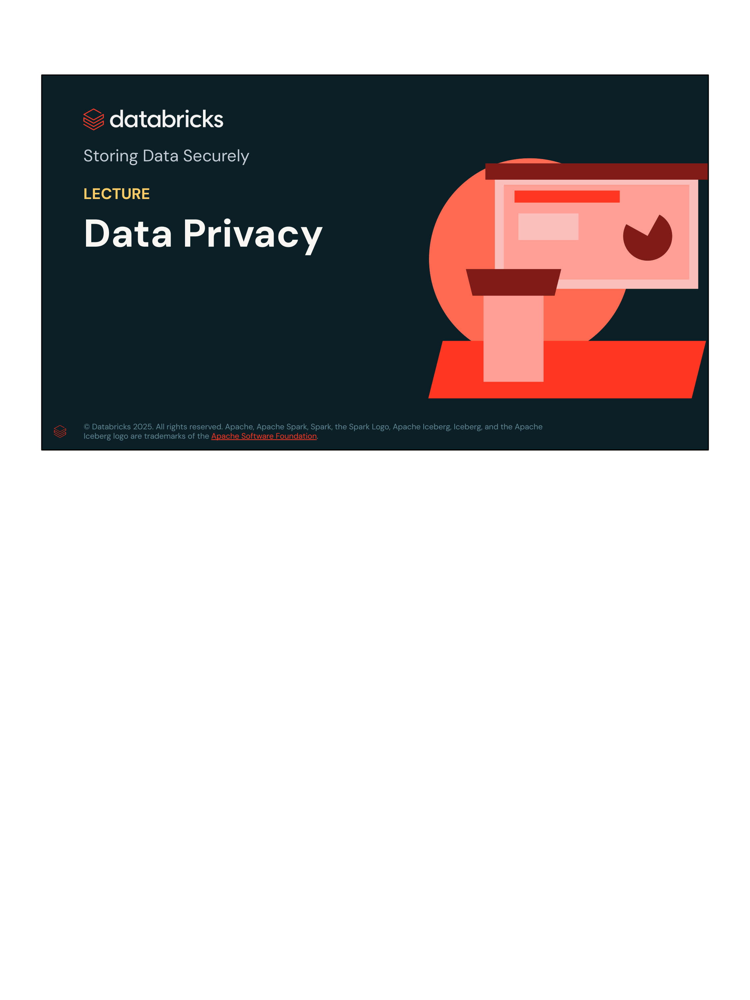
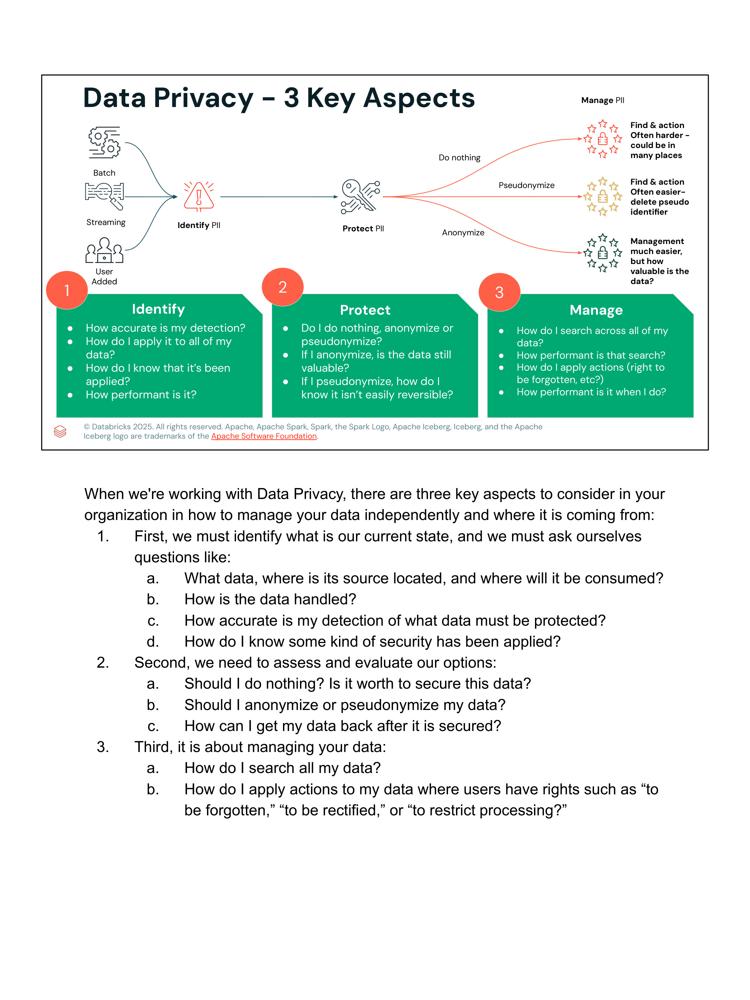
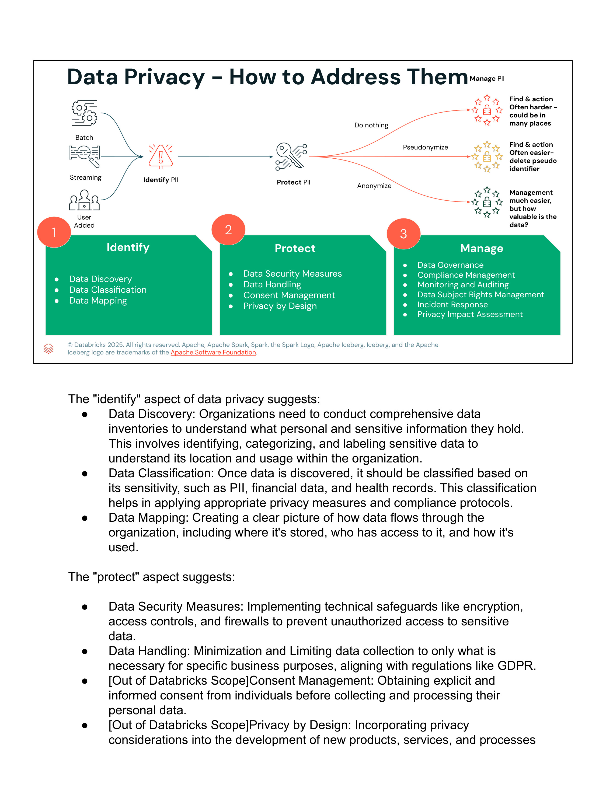
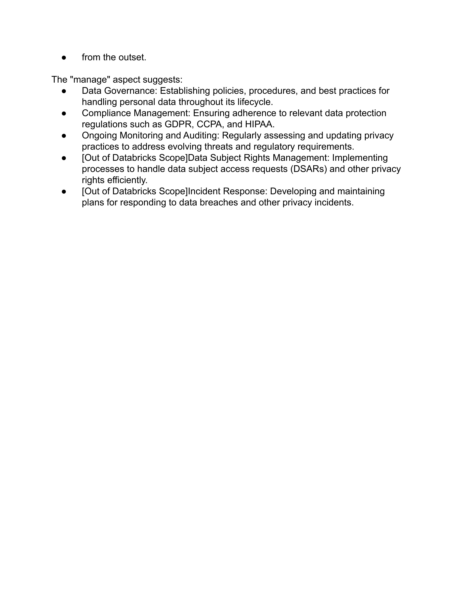

# Lección 06: Data Privacy

**Curso:** Databricks Data Privacy  
**Sección:** Storing Data Securely  
**Formato:** Slides & Lecture Transcripts  
**Estado:** Completado 100%  

---

## 1. Visión General de la Lección

Esta lección desglosa los **tres pilares fundamentales de la Privacidad de Datos** en cualquier organización: **Identify (Identificar)**, **Protect (Proteger)** y **Manage (Gestionar)**. Se profundiza en el impacto técnico de cada estrategia de protección (no hacer nada vs. pseudonimización vs. anonimización) sobre el ciclo de vida del dato, el valor analítico residual y la complejidad operativa para atender solicitudes de derechos de los titulares.

---

## 2. Diapositivas y Transcripciones Verbatim

### Slide 1: Portada


- **Título:** Storing Data Securely
- **Tema:** LECTURE: Data Privacy
- **Organización:** Databricks Academy

---

### Slide 2: Data Privacy – 3 Key Aspects


#### Diagrama de Flujo del Ciclo de PII
- **Ingesta:** `Batch`, `Streaming`, `User Added` $\rightarrow$ **Identify PII** $\rightarrow$ **Protect PII** $\rightarrow$
  - Rama 1: **Do nothing** $\rightarrow$ *Find & action often harder – could be in many places.*
  - Rama 2: **Pseudonymize** $\rightarrow$ *Find & action often easier – delete pseudo identifier.*
  - Rama 3: **Anonymize** $\rightarrow$ *Management much easier, but how valuable is the data?*

#### Las Preguntas Clave por Pilar
1. **Identify (Identificar):**
   - *How accurate is my detection?*
   - *How do I apply it to all of my data?*
   - *How do I know that it's been applied?*
   - *How performant is it?*
2. **Protect (Proteger):**
   - *Do I do nothing, anonymize or pseudonymize?*
   - *If I anonymize, is the data still valuable?*
   - *If I pseudonymize, how do I know it isn't easily reversible?*
3. **Manage (Gestionar):**
   - *How do I search across all of my data?*
   - *How performant is that search?*
   - *How do I apply actions (right to be forgotten, etc.)?*
   - *How performant is it when I do?*

#### Transcripción Oficial del Instructor (Verbatim)
> *"When we're working with Data Privacy, there are three key aspects to consider in your organization in how to manage your data independently and where it is coming from:*
>
> *1. First, we must identify what is our current state, and we must ask ourselves questions like:*
> *   a. What data, where is its source located, and where will it be consumed?*
> *   b. How is the data handled?*
> *   c. How accurate is my detection of what data must be protected?*
> *   d. How do I know some kind of security has been applied?*
>
> *2. Second, we need to assess and evaluate our options:*
> *   a. Should I do nothing? Is it worth to secure this data?*
> *   b. Should I anonymize or pseudonymize my data?*
> *   c. How can I get my data back after it is secured?*
>
> *3. Third, it is about managing your data:*
> *   a. How do I search all my data?*
> *   b. How do I apply actions to my data where users have rights such as 'to be forgotten,' 'to be rectified,' or 'to restrict processing?'"*

---

### Slide 3 y 4: Data Privacy – How to Address Them



#### Matriz de Capacidades y Alcance (Databricks vs. Organizacional)

```
┌────────────────────────────────┬──────────────────────────────────┬─────────────────────────────────┐
│          1. IDENTIFY           │            2. PROTECT            │            3. MANAGE            │
├────────────────────────────────┼──────────────────────────────────┼─────────────────────────────────┤
│ • Data Discovery               │ • Data Security Measures         │ • Data Governance               │
│ • Data Classification          │ • Data Handling                  │ • Compliance Management         │
│ • Data Mapping                 │ • Consent Management [Ext]       │ • Monitoring and Auditing       │
│                                │ • Privacy by Design [Ext]        │ • Data Subject Rights [Ext]     │
│                                │                                  │ • Incident Response [Ext]       │
│                                │                                  │ • Privacy Impact Assessment     │
└────────────────────────────────┴──────────────────────────────────┴─────────────────────────────────┘
*Nota: [Ext] = Fuera del alcance nativo de Databricks (requiere procesos organizacionales/legales externos).*
```

#### Transcripción Oficial del Instructor (Verbatim)

##### The "Identify" Aspect:
> - **Data Discovery:** Organizations need to conduct comprehensive data inventories to understand what personal and sensitive information they hold. This involves identifying, categorizing, and labeling sensitive data to understand its location and usage within the organization.
> - **Data Classification:** Once data is discovered, it should be classified based on its sensitivity, such as PII, financial data, and health records. This classification helps in applying appropriate privacy measures and compliance protocols.
> - **Data Mapping:** Creating a clear picture of how data flows through the organization, including where it's stored, who has access to it, and how it's used.

##### The "Protect" Aspect:
> - **Data Security Measures:** Implementing technical safeguards like encryption, access controls, and firewalls to prevent unauthorized access to sensitive data.
> - **Data Handling:** Minimization and Limiting data collection to only what is necessary for specific business purposes, aligning with regulations like GDPR.
> - **[Out of Databricks Scope] Consent Management:** Obtaining explicit and informed consent from individuals before collecting and processing their personal data.
> - **[Out of Databricks Scope] Privacy by Design:** Incorporating privacy considerations into the development of new products, services, and processes from the outset.

##### The "Manage" Aspect:
> - **Data Governance:** Establishing policies, procedures, and best practices for handling personal data throughout its lifecycle.
> - **Compliance Management:** Ensuring adherence to relevant data protection regulations such as GDPR, CCPA, and HIPAA.
> - **Ongoing Monitoring and Auditing:** Regularly assessing and updating privacy practices to address evolving threats and regulatory requirements.
> - **[Out of Databricks Scope] Data Subject Rights Management:** Implementing processes to handle data subject access requests (DSARs) and other privacy rights efficiently.
> - **[Out of Databricks Scope] Incident Response:** Developing and maintaining plans for responding to data breaches and other privacy incidents.

---

## 3. Comparativa Técnica de Estrategias de Manejo de PII

| Estrategia | Descripción | Impacto en la Utilidad del Dato | Complejidad de Búsqueda y Supresión (DSAR) |
| :--- | :--- | :--- | :--- |
| **Do Nothing (Sin protección)** | Almacena datos PII en texto claro sin transformación ni ofuscación. | Máxima utilidad analítica inmediata, pero **riesgo extremo de fuga y sanciones severas**. | **Muy Alta / Dispersa**: Requiere escanear y actualizar múltiples tablas bronce/plata/oro cuando un usuario solicita el derecho al olvido. |
| **Pseudonymization (Pseudonimización)** | Reemplaza los identificadores directos por identificadores artificiales (tokens/hashes salteados), manteniendo un mapa de correspondencia separado y seguro. | **Alta**: Permite análisis de comportamiento, uniones de tablas (*joins*) y agrupaciones longitudinales sin exponer la identidad. | **Baja / Controlada**: Para olvidar al usuario, basta con eliminar la clave o registro correspondiente en la tabla de mapeo (o destruir la sal/llave criptográfica). |
| **Anonymization (Anonimización irreversible)** | Destruye o generaliza irreversiblemente los identificadores personales de modo que el individuo no pueda ser reidentificado jamás. | **Reducida**: Se pierde la capacidad de correlacionar registros individuales en el tiempo o realizar análisis a nivel de entidad. | **Cero**: Los datos ya no se consideran legalmente datos personales bajo GDPR, por lo que no aplican solicitudes de supresión. |

---

## 4. Arquitectura de Gobernanza en Databricks Unity Catalog

1. **Descubrimiento y Clasificación Automática:**
   - Uso de tags en Unity Catalog (`tag: pii = 'true'`, `classification = 'confidential'`).
   - Linaje automatizado a nivel de tabla y columna para rastrear el flujo de PII desde la ingesta hasta los dashboards.
2. **Protección en Vuelo y en Reposo:**
   - Cifrado transparente con claves gestionadas por el cliente (CMEK / CMK).
   - Control de acceso basado en atributos (ABAC) y funciones dinámicas: **Row Filters** y **Column Masks**.
3. **Gestión Unificada del Ciclo de Vida:**
   - Registro de auditoría centralizado en tablas del sistema (`system.access.audit`).
   - Propagación de cambios y borrados mediante **Change Data Feed (CDF)** en Delta Lake.
