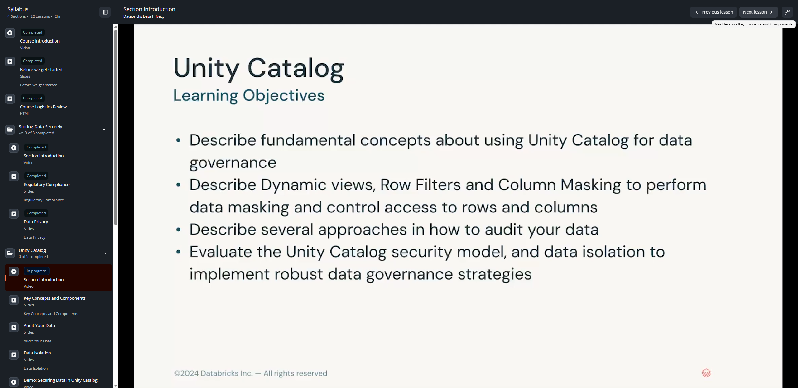
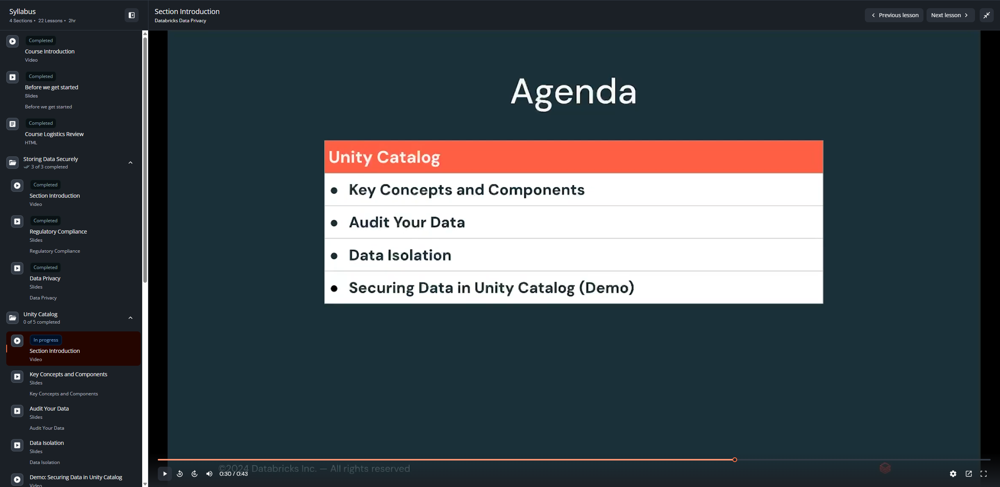

# Lección 07: Section Introduction – Unity Catalog

**Curso:** Databricks Data Privacy  
**Sección:** Unity Catalog (Sección 2)  
**Formato:** Video Conferencia (43 segundos)  
**Estado:** Completado 100%  

---

## 1. Visión General de la Sección

La Sección 2 del curso se enfoca en **Unity Catalog**, la capa unificada de gobernanza y control de acceso para datos e inteligencia artificial en la plataforma Databricks Lakehouse. A lo largo de esta sección se exploran los componentes clave de Unity Catalog, técnicas avanzadas de ofuscación dinámica (**Dynamic Views**, **Row Filters**, **Column Masks**), mecanismos de auditoría mediante **System Tables** y modelos de aislamiento de datos (*Data Isolation*).

---

## 2. Objetivos de Aprendizaje (Learning Objectives)

1. **Describir los conceptos fundamentales** del uso de Unity Catalog para la gobernanza de datos (*Describe fundamental concepts about using Unity Catalog for data governance*).
2. **Describir Vistas Dinámicas, Filtros de Fila y Enmascaramiento de Columna** para realizar enmascaramiento de datos y controlar el acceso a filas y columnas (*Describe Dynamic views, Row Filters and Column Masking to perform data masking and control access to rows and columns*).
3. **Describir múltiples enfoques** sobre cómo auditar sus datos (*Describe several approaches in how to audit your data*).
4. **Evaluar el modelo de seguridad de Unity Catalog** y el aislamiento de datos para implementar estrategias robustas de gobernanza (*Evaluate the Unity Catalog security model, and data isolation to implement robust data governance strategies*).

---

## 3. Agenda de la Sección

1. **Key Concepts and Components (Lección 08):** Metastore, jerarquía de 3 niveles (`catalog.schema.table`), securables, identidades y permisos.
2. **Audit Your Data (Lección 09):** Tablas de sistema (`system.access.audit`), linaje de datos y trazabilidad regulatoria.
3. **Data Isolation (Lección 10):** Separación de ambientes (dev/stage/prod), credenciales de almacenamiento y ubicaciones externas.
4. **Securing Data in Unity Catalog - Demo (Lección 11):** Implementación práctica de Row Filters, Column Masks y permisos granulares.
