# Lección 08: Key Concepts and Components (Unity Catalog)

- **Curso:** Databricks Data Privacy (Course ID: 3767)
- **Lección:** 08 / 22 (Section 2: Unity Catalog)
- **Tipo de Contenido:** Diapositivas interactivas con transcripción y notas oficiales del instructor (17 diapositivas)
- **Estado en plataforma:** Completado (100% verificado)

---

## 1. Visión General de la Lección

Esta lección aborda la arquitectura fundamental de **Unity Catalog** como el motor unificado de gobernanza para datos e inteligencia artificial en la plataforma Databricks Lakehouse. Examina los desafíos históricos de gobernanza híbrida y fragmentada, el modelo integral de seguridad y control de acceso (ACLs), el linaje de datos automatizado en tiempo de ejecución, el descubrimiento asistido por IA, los mecanismos avanzados de seguridad a nivel de fila y enmascaramiento de columnas (*Row-Level Security* y *Column-Level Masking*), así como el marco de gobernanza para privacidad de datos (*Identify, Protect, Manage*).

---

## 2. Desafíos Históricos de Gobernanza de Datos (Legacy Challenges)

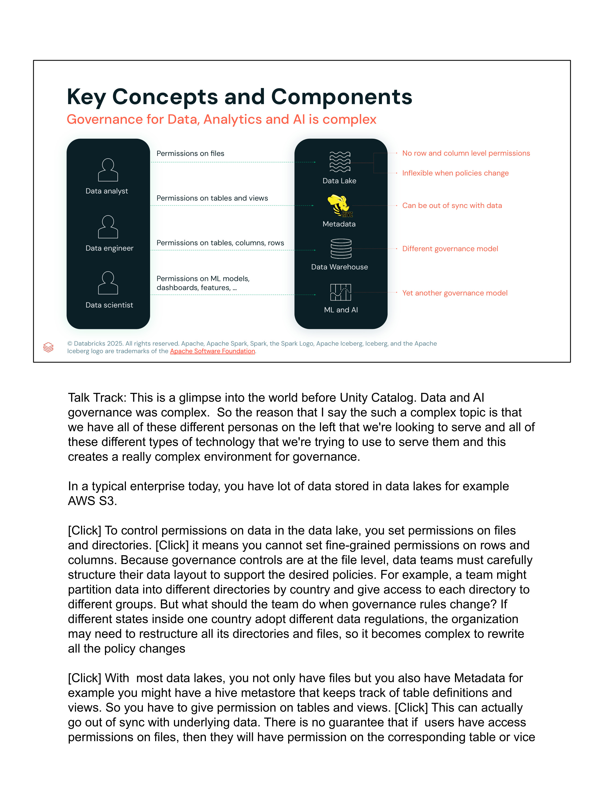

### El Punto de Partida Tradicional
Históricamente, las organizaciones han intentado gobernar sus datos utilizando múltiples modelos disjuntos y fragmentados:

1. **Permisos a nivel de archivos en el Data Lake (Storage ACLs):**
   - Políticas en buckets/contenedores (AWS S3 IAM/Bucket Policies, Azure ADLS POSIX ACLs/RBAC).
   - Controlan quién puede descargar o leer blobs completos, pero carecen de visibilidad a nivel de esquemas relacionales, tablas, filas o columnas.
2. **Permisos a nivel de tabla en Hive Metastore:**
   - Permisos SQL tradicionales (`GRANT SELECT ON TABLE`).
   - Se encuentran desfasados de los permisos de almacenamiento físico subyacentes, creando vulnerabilidades donde un usuario sin acceso SQL puede leer los archivos directamente mediante rutas `s3://` o `abfss://`.
3. **Permisos a nivel de fila y columna en Data Warehouses propietarios:**
   - Para aplicar control granular, las organizaciones creaban copias secundarias de datos (data marts) o vistas restringidas.

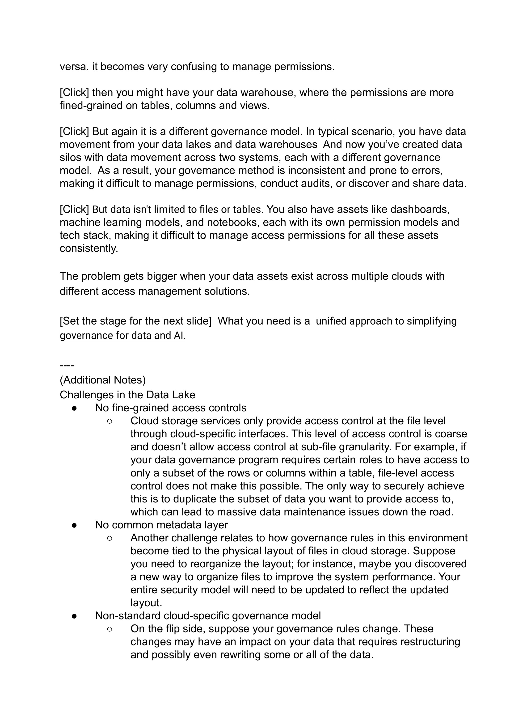
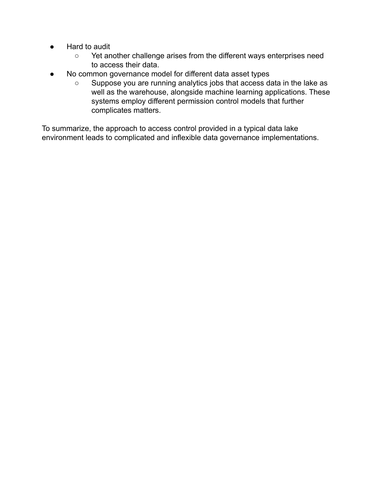

### Problemas Críticos de la Arquitectura Legada
- **Silos de Datos y Duplicación Incontrolada:** Para proteger columnas sensibles (como SSN o salarios), los equipos de ingeniería creaban tablas filtradas secundarias, multiplicando los costos de almacenamiento y generando discrepancias de datos.
- **Políticas de Seguridad Desincronizadas:** Los cambios en las políticas de seguridad debían propagarse manualmente a través de M storage buckets, N catálogos de metadatos y herramientas de BI.
- **Cuellos de Botella de Rendimiento y Operación:** Las vistas tradicionales y las capas proxy de seguridad introducían latencia y complejidad operativa severa.
- **Imposibilidad de Auditoría Unificada:** No existía una bitácora única que correlacionara consultas analíticas, ejecuciones de pipelines ETL, llamadas a APIs y accesos directos al almacenamiento.

---

## 3. Unity Catalog: Solución Unificada para Datos e IA

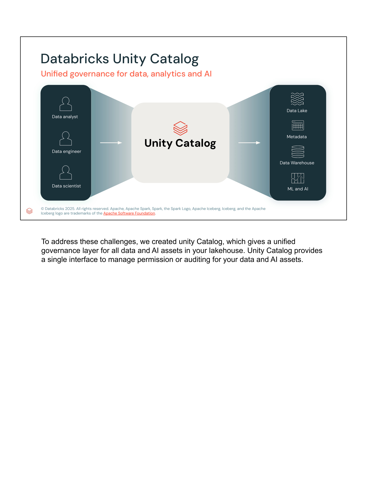

Unity Catalog resuelve esta fragmentación actuando como un **plano de control y gobernanza único y universal** que se interpone entre todos los clientes de consumo (SQL, Python, R, Scala, BI, APIs) y los datos almacenados en formato abierto (Delta Lake, Apache Iceberg, Apache Parquet).

### Características Clave:
- **Gobierno de Datos y Modelos:** Unifica tablas, vistas, volúmenes de archivos no estructurados, funciones definidas por el usuario (UDFs) y modelos de Machine Learning (MLflow) bajo la misma jerarquía de permisos.
- **Multinube Consistente:** Modelo idéntico en AWS, Azure y Google Cloud Platform.
- **Gobernanza Federada:** Conexiones directas a almacenes externos (PostgreSQL, Snowflake, BigQuery, SQL Server) gobernadas por Unity Catalog (Lakehouse Federation).

---

## 4. Modelo de Seguridad y Listas de Control de Acceso (ACLs)

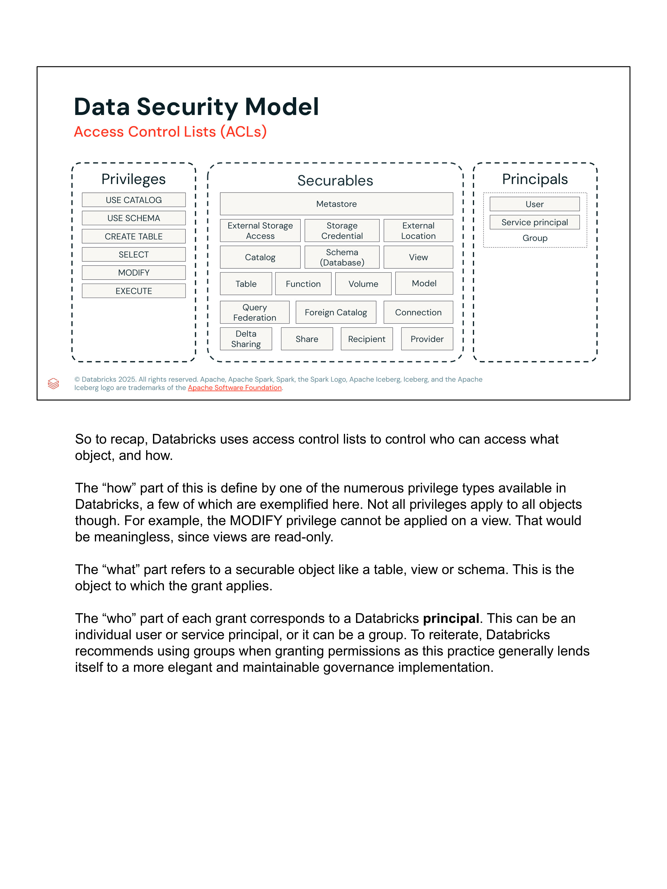

El modelo de control de acceso de Unity Catalog se compone de tres entidades fundamentales:

### A. Securables (Objetos Asegurables)
Jerarquía canónica de 3 niveles y objetos de infraestructura:
$$\text{Metastore} \longrightarrow \text{Catalog} \longrightarrow \text{Schema (Database)} \longrightarrow \text{Table / View / Volume / Function / Model}$$

Otros objetos asegurables críticos:
- **Storage Credentials:** Entidades que encapsulan credenciales de nube (IAM Roles, Service Principals, Managed Identities).
- **External Locations:** Vínculos entre una Storage Credential y una ruta URI de almacenamiento de objetos (ej. `s3://my-bucket/path` o `abfss://container@account.dfs.core.windows.net/`).
- **Foreign Catalogs & Connections:** Conexiones de federación de consultas externas.
- **Clean Rooms & Delta Sharing:** Objetos para compartición segura inter-organizacional (`Share`, `Recipient`, `Provider`).

### B. Principals (Identidades)
- **Users:** Identidades de usuarios individuales sincronizadas mediante SCIM.
- **Service Principals:** Identidades no humanas para automatizaciones, pipelines CI/CD y trabajos de Lakeflow.
- **Account Groups:** Grupos de usuarios administrados a nivel de cuenta.
> **Mejor Práctica Oficial:** Los privilegios deben asignarse siempre a **Grupos**, nunca a usuarios individuales directamente, facilitando la administración del ciclo de vida de identidades.

### C. Privileges (Permisos Disponibles)
- `USE CATALOG`: Requisito indispensable para acceder a cualquier objeto dentro del catálogo.
- `USE SCHEMA`: Requisito indispensable para acceder a cualquier objeto dentro del esquema.
- `SELECT`: Lectura de tablas, vistas y ejecución de funciones de consulta.
- `MODIFY`: Inserción, actualización y eliminación de registros (`INSERT`, `UPDATE`, `DELETE`, `MERGE`).
- `CREATE TABLE`, `CREATE SCHEMA`, `CREATE VOLUME`, `CREATE FUNCTION`.
- `READ VOLUME`, `WRITE VOLUME`: Control para archivos binarios y no estructurados.
- `EXECUTE`: Ejecución de funciones definidas por el usuario (UDFs).
- `ALL PRIVILEGES`: Otorga todos los permisos aplicables sobre el objeto.

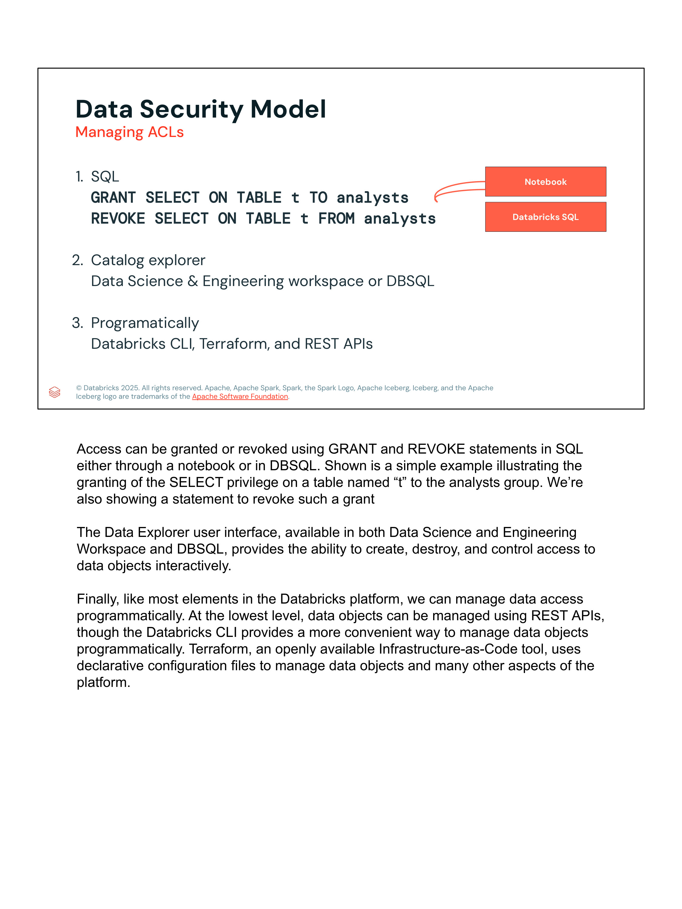

### Gestión de ACLs
Se puede realizar mediante tres interfaces:
1. **Declarativa en ANSI SQL:**
   ```sql
   -- Concesión de privilegios
   GRANT USE CATALOG ON CATALOG finance_prod TO `finance-analysts`;
   GRANT USE SCHEMA ON SCHEMA finance_prod.reporting TO `finance-analysts`;
   GRANT SELECT ON TABLE finance_prod.reporting.quarterly_summary TO `finance-analysts`;

   -- Revocación de privilegios
   REVOKE MODIFY ON TABLE finance_prod.reporting.quarterly_summary FROM `interns`;
   ```
2. **Catalog Explorer UI:** Interfaz visual interactiva con gestión de permisos por pestañas.
3. **Programática:** Terraform Provider (`databricks_grant`), Databricks CLI y REST APIs de Unity Catalog.

---

## 5. Linaje Automatizado en Tiempo de Ejecución (Automated Runtime Lineage)

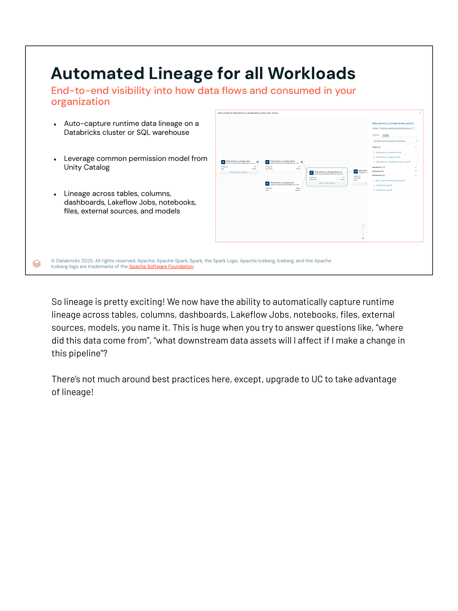

Unity Catalog captura linaje de datos de manera automática e implícita en tiempo de ejecución:
- **Captura sin instrumentación:** Opera de forma transparente sin requerir cambios de código en notebooks, scripts o consultas.
- **Granularidad de Tablas y Columnas:** Mapea el flujo de datos desde el origen de datos crudos hasta las métricas finales agregadas en dashboards.
- **Cobertura de Cargas de Trabajo:** Clusters interactivos, SQL Warehouses, Delta Live Tables (Lakeflow Pipelines) y Lakeflow Jobs.
- **Impact Analysis:** Permite a los ingenieros de datos evaluar el impacto que tendrá modificar o eliminar una columna en reportes downstream o modelos de machine learning.

---

## 6. Etiquetado y Documentación Generada por IA

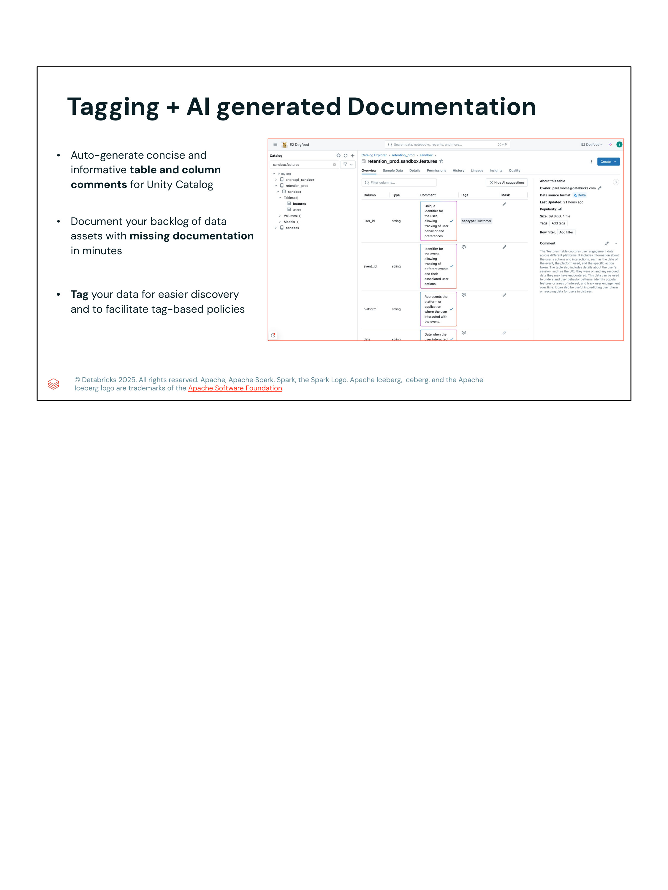

### Funcionalidades de Documentación Asistida:
- **Generación de comentarios con IA:** Unity Catalog analiza el esquema, los nombres de columnas y muestras de datos para redactar automáticamente comentarios y definiciones concisas sobre tablas y columnas.
- **Resolución de deuda de documentación:** Permite documentar catálogos completos con miles de columnas en minutos.
- **Etiquetado Semántico (Tags):** Facilita la asignación de etiquetas de negocio y privacidad (`pii: true`, `confidential`, `regulatory: gdpr`, `domain: finance`), habilitando políticas de gobernanza basadas en atributos (ABAC).

---

## 7. Búsqueda y Descubrimiento Centralizado

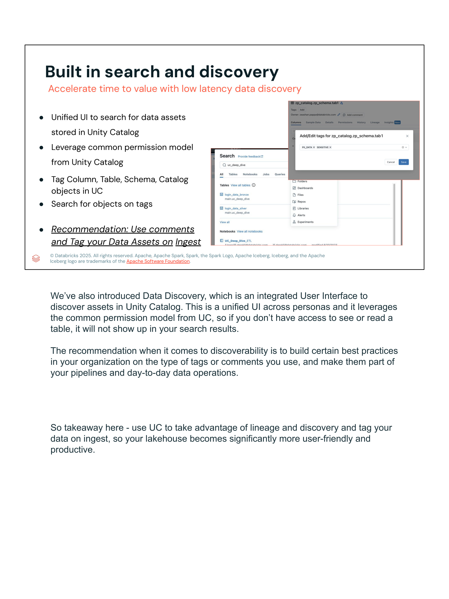

- **UI Unificada de Búsqueda:** Proporciona un buscador unificado para tablas, volúmenes, modelos y dashboards.
- **Filtrado Basado en Permisos:** Si un usuario no posee el privilegio `SELECT` o `USE` sobre un objeto asegurables, dicho objeto se omite por completo de los resultados de búsqueda para prevenir fugas de metadatos.
- **Búsqueda por Etiquetas:** Filtrado instantáneo por etiquetas asignadas manualmente o durante la ingesta.
> **Recomendación Databricks:** Implementar el etiquetado y comentarios en los activos de datos como una etapa obligatoria durante el pipeline de ingesta (*Tag on Ingest*).

---

## 8. Control de Acceso de Grano Fino (Fine-grained Access Control)

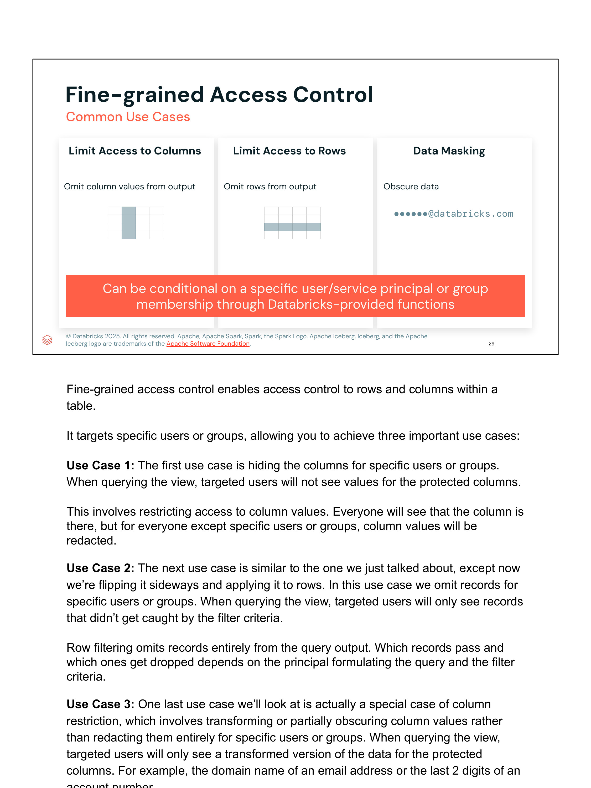

### Casos de Uso Críticos:
1. **Limitar Acceso a Columnas:** Ocultar u omitir columnas con información sensible para ciertos grupos o usuarios.
2. **Limitar Acceso a Filas:** Filtrar registros de modo que los analistas solo visualicen datos de su región geográfica o división de negocio.
3. **Enmascaramiento de Datos (Data Masking):** Transformar u oscurecer datos (ej. enmascarar correos electrónicos como `••••••@databricks.com` o tarjetas de crédito como `****-****-****-1234`).

---

## 9. Métodos de Implementación: Dynamic Views vs Row Filters / Column Masks

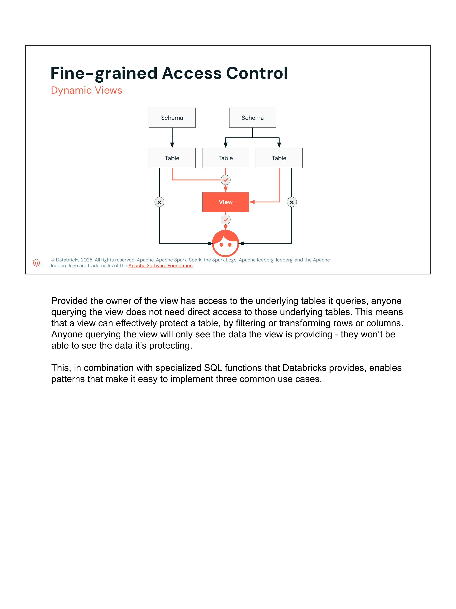
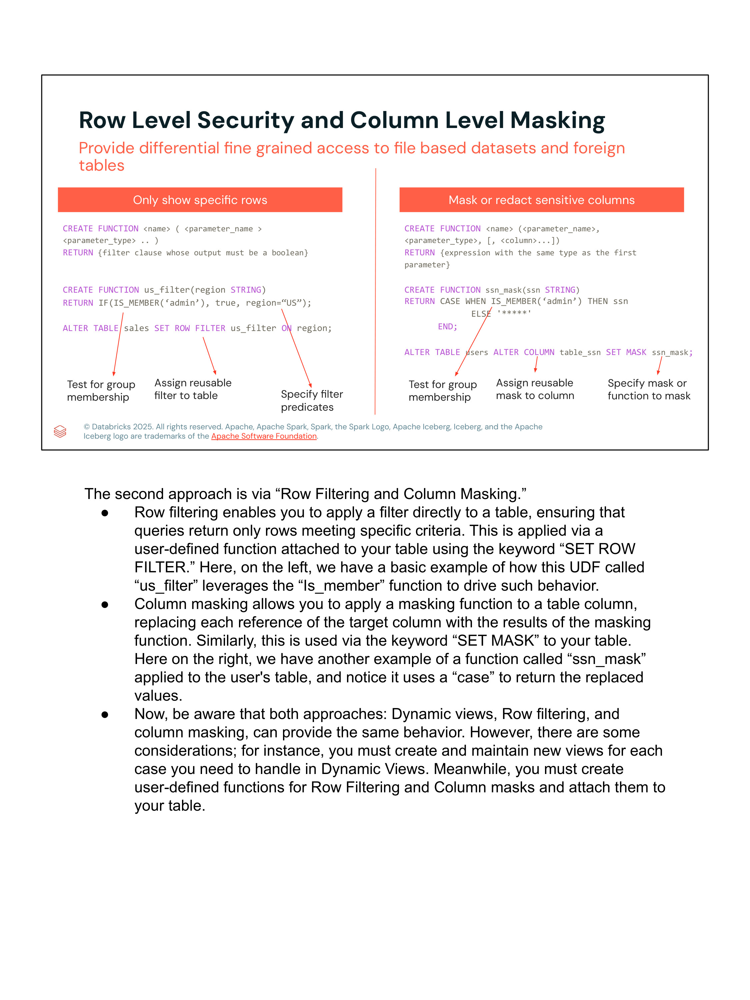

### Comparativa Arquitectural

| Criterio | Vistas Dinámicas (Dynamic Views) | Row Filters & Column Masks (Nativo UC) |
|---|---|---|
| **Punto de anclaje** | Objeto secundario (Vista) | Directamente sobre la Tabla Base |
| **Transparencia para el usuario** | El usuario debe conocer el nombre de la vista | Totalmente transparente; el usuario consulta la tabla base |
| **Mantenimiento** | Requiere crear y mantener múltiples vistas | Se define una función reutilizable y se aplica a N tablas |
| **Gobernanza y Permisos** | El usuario solo recibe permisos sobre la vista | El usuario recibe permisos sobre la tabla; UC aplica la función |
| **Soporte de datasets federados** | Requiere redefinir vistas por motor | Compatible con tablas Delta, Parquet e Iceberg |

### Sintaxis DDL Oficial de Unity Catalog

#### A. Row Filters (Filtros de Fila)
```sql
-- 1. Crear la función UDF booleana de filtrado
CREATE OR REPLACE FUNCTION us_filter(region STRING)
RETURN IF(IS_MEMBER('admin'), true, region = 'US');

-- 2. Aplicar el filtro de fila a la tabla base
ALTER TABLE sales SET ROW FILTER us_filter ON (region);

-- Para remover el filtro en caso necesario:
-- ALTER TABLE sales DROP ROW FILTER;
```

#### B. Column Masks (Máscaras de Columna)
```sql
-- 1. Crear la función UDF de enmascaramiento (mismo tipo de retorno que el campo)
CREATE OR REPLACE FUNCTION ssn_mask(ssn STRING)
RETURN CASE 
  WHEN IS_MEMBER('admin') THEN ssn 
  ELSE '***-**-****' 
END;

-- 2. Aplicar la máscara a la columna específica
ALTER TABLE users ALTER COLUMN table_ssn SET MASK ssn_mask;

-- Para remover la máscara en caso necesario:
-- ALTER TABLE users ALTER COLUMN table_ssn DROP MASK;
```

---

## 10. Marco Integral de Gobernanza y Privacidad

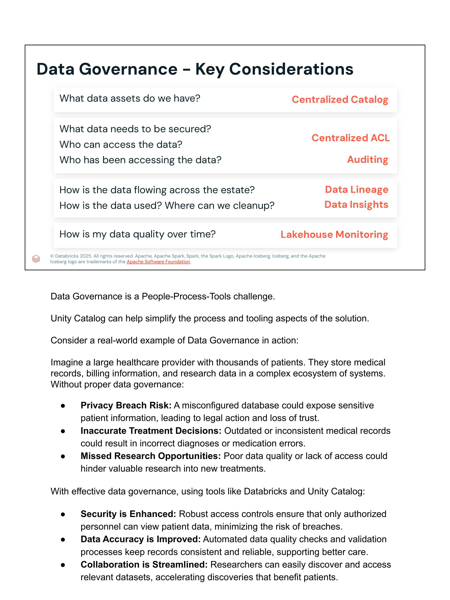
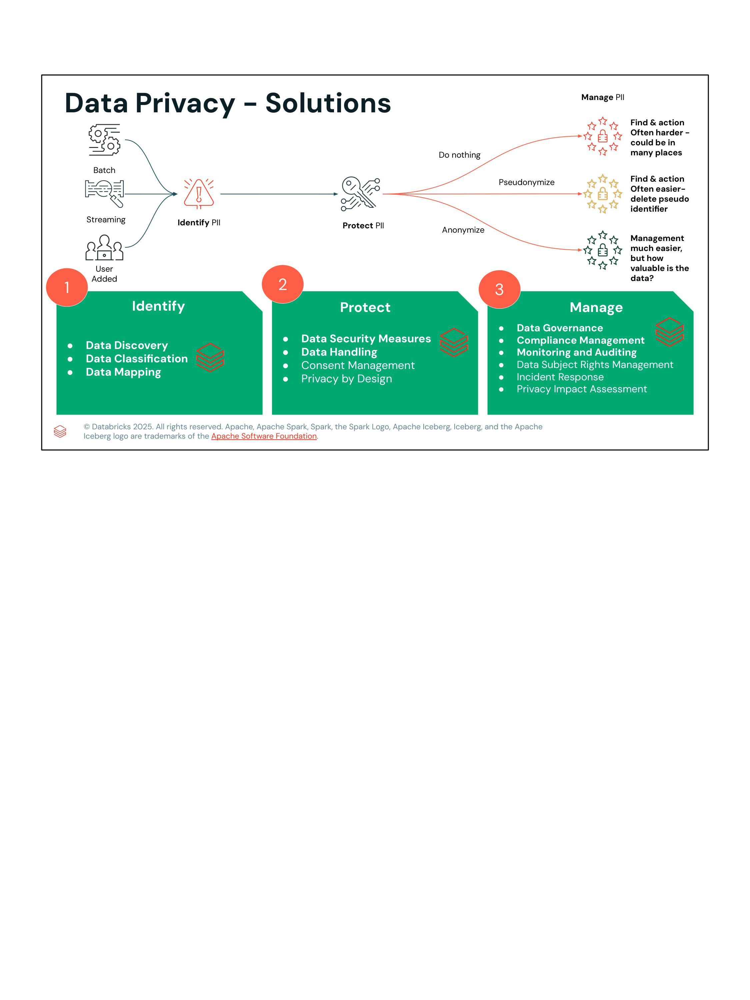

### Las Tres Etapas de la Solución de Privacidad:

```
    [ Batch Data ]
    [ Streaming  ] ──> [ 1. Identify ] ──> [ 2. Protect ] ──> [ 3. Manage ]
    [ User Added ]
```

1. **IDENTIFY (Identificar):**
   - **Data Discovery:** Detección de activos en el lago de datos.
   - **Data Classification:** Clasificación de datos sensibles (PII, PHI, PCI).
   - **Data Mapping:** Mapeo de inventario y linaje de flujos de datos.
2. **PROTECT (Proteger):**
   - **Medidas de Seguridad de Datos:** Cifrado en reposo y en tránsito.
   - **Manejo de Datos Sensibles:** Estrategias de retención y minimización.
   - **Técnicas de Protección PII:**
     - *Do nothing:* Mantener PII en texto claro (alto riesgo, requiere auditoría estricta).
     - *Pseudonymize:* Reemplazar identificadores directos por identificadores seudo-anónimos (permite análisis y borrado simple revocando la clave de mapeo).
     - *Anonymize:* Técnicas irreversibles (k-anonimato, agregación diferencial) que eliminan el vínculo de identidad.
3. **MANAGE (Gestionar):**
   - **Auditoría y Monitoreo:** Tablas de sistema (`system.access.audit`).
   - **Gestión de Derechos de Titulares (Data Subject Rights):** Soporte para el Derecho al Olvido (GDPR RTBF) mediante `DELETE` y `MERGE` en Delta Lake.
   - **Evaluación de Impacto de Privacidad (PIA).**
