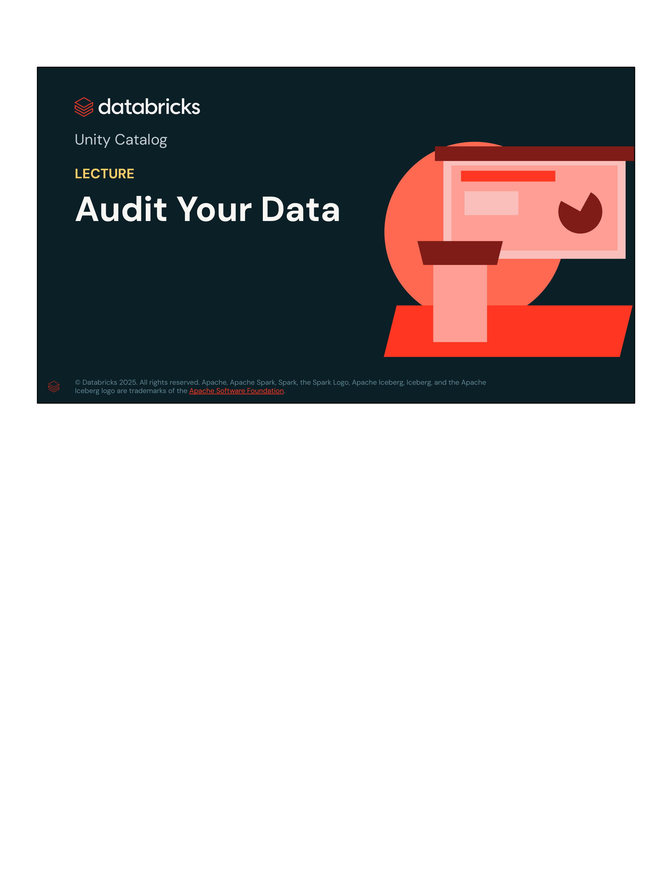
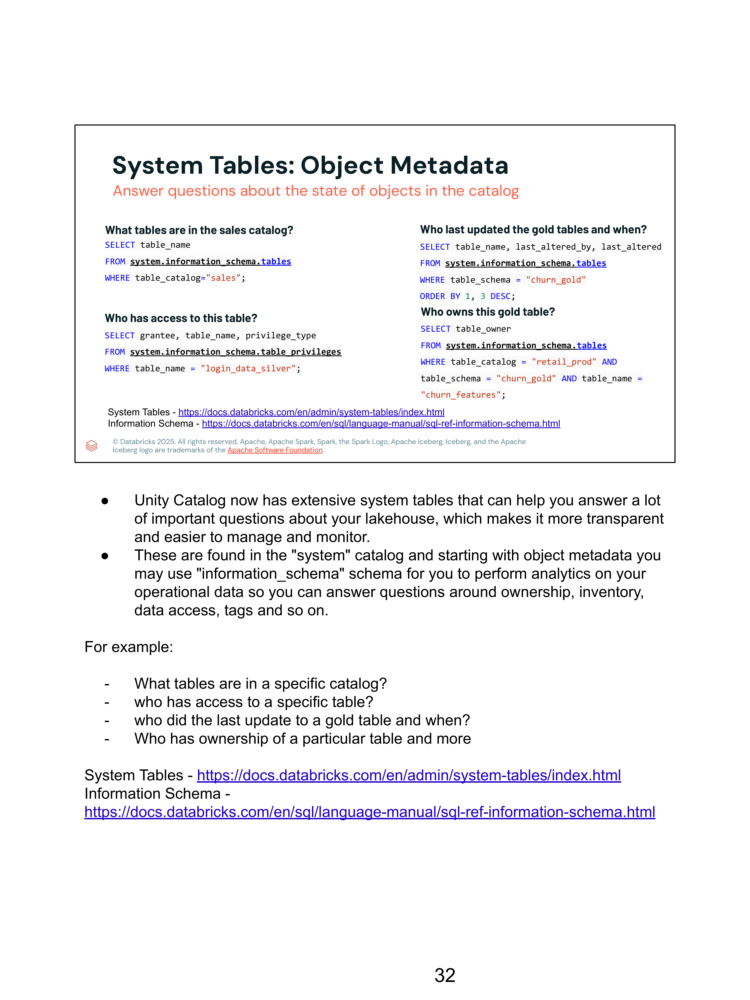
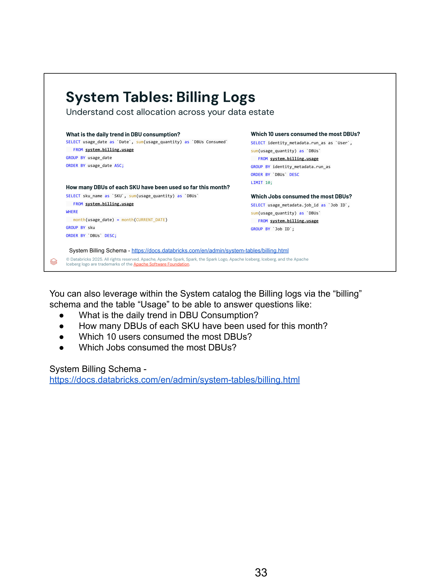
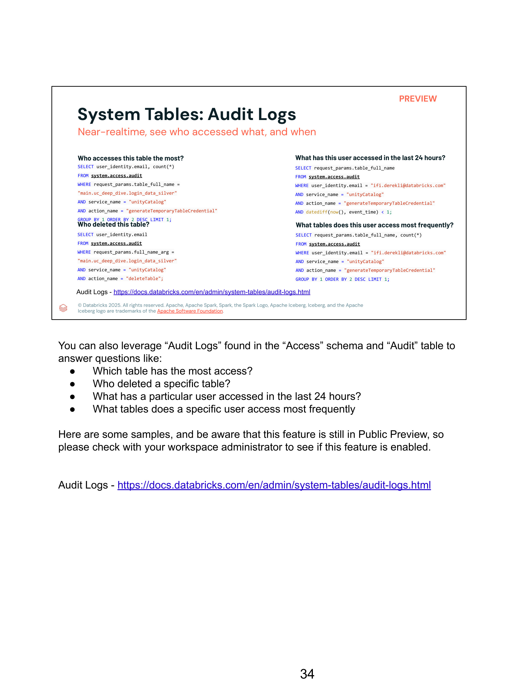
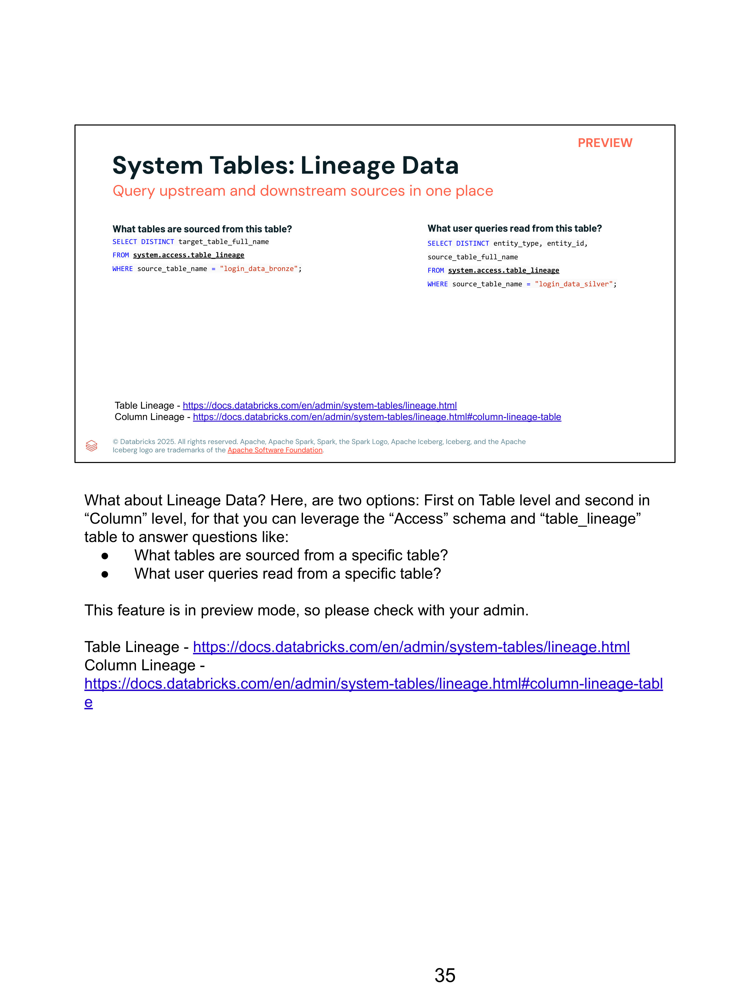

# Lección 09: Audit Your Data (Tablas de Sistema de Unity Catalog)

- **Curso:** Databricks Data Privacy (Course ID: 3767)
- **Lección:** 09 / 22 (Section 2: Unity Catalog)
- **Tipo de Contenido:** Diapositivas interactivas con transcripción y notas oficiales del instructor (5 diapositivas)
- **Estado en plataforma:** Completado (100% verificado)

---

## 1. Visión General de la Lección



La auditoría y trazabilidad son pilares obligatorios para el cumplimiento normativo en materia de privacidad de datos (GDPR, CCPA/CPRA, HIPAA, SOC 2). Unity Catalog proporciona **System Tables** (Tablas de Sistema), un catálogo analítico administrado por Databricks denominado `system`, que almacena de manera centralizada metadatos operacionales, consumo de cómputo/facturación, registros de auditoría de seguridad y linaje en tiempo cuasi-real.

---

## 2. Metadatos de Objetos: `system.information_schema`



El esquema `information_schema` dentro del catálogo `system` ofrece vistas SQL estándar para responder interrogantes sobre el inventario, propiedad y permisos de todos los activos gobernados por Unity Catalog.

### Consultas Esenciales de Metadatos

#### 1. ¿Qué tablas existen en un catálogo específico?
```sql
SELECT table_name
FROM system.information_schema.tables
WHERE table_catalog = "sales";
```

#### 2. ¿Quién tiene acceso y qué privilegios tiene asignados sobre una tabla?
```sql
SELECT grantee, table_name, privilege_type
FROM system.information_schema.table_privileges
WHERE table_name = "login_data_silver";
```

#### 3. ¿Quién modificó por última vez las tablas Gold y en qué fecha?
```sql
SELECT table_name, last_altered_by, last_altered
FROM system.information_schema.tables
WHERE table_schema = "churn_gold"
ORDER BY 1, 3 DESC;
```

#### 4. ¿Quién es el propietario formal de una tabla?
```sql
SELECT table_owner
FROM system.information_schema.tables
WHERE table_catalog = "retail_prod" 
  AND table_schema = "churn_gold" 
  AND table_name = "churn_features";
```

---

## 3. Registros de Facturación y Consumo: `system.billing.usage`



Permite correlacionar el costo de procesamiento con el uso analítico y de privacidad mediante la tabla `system.billing.usage`.

### Consultas de Atribución de Costos y Recursos

#### 1. Tendencia diaria de consumo de DBUs:
```sql
SELECT usage_date AS `Date`, sum(usage_quantity) AS `DBUs Consumed`
FROM system.billing.usage
GROUP BY usage_date
ORDER BY usage_date ASC;
```

#### 2. Consumo de DBUs agrupado por SKU durante el mes en curso:
```sql
SELECT sku_name AS `SKU`, sum(usage_quantity) AS `DBUs`
FROM system.billing.usage
WHERE month(usage_date) = month(CURRENT_DATE)
GROUP BY sku
ORDER BY `DBUs` DESC;
```

#### 3. Top 10 usuarios con mayor consumo de DBUs:
```sql
SELECT identity_metadata.run_as AS `User`, sum(usage_quantity) AS `DBUs`
FROM system.billing.usage
GROUP BY identity_metadata.run_as
ORDER BY `DBUs` DESC
LIMIT 10;
```

#### 4. Trabajos (Jobs) con mayor consumo de recursos:
```sql
SELECT usage_metadata.job_id AS `Job ID`, sum(usage_quantity) AS `DBUs`
FROM system.billing.usage
GROUP BY `Job ID`;
```

---

## 4. Registros de Auditoría de Seguridad: `system.access.audit`



La tabla `system.access.audit` captura eventos de auditoría de plano de control y de datos en tiempo cuasi-real (*near-realtime*). Es la fuente primaria para investigaciones forenses de privacidad, detección de accesos no autorizados y justificación de cumplimiento ante auditores externos.

### Consultas Forenses y de Seguridad

#### 1. ¿Qué usuario consulta con mayor frecuencia una tabla sensible?
```sql
SELECT user_identity.email, count(*) AS access_count
FROM system.access.audit
WHERE request_params.table_full_name = "main.uc_deep_dive.login_data_silver"
  AND service_name = "unityCatalog"
  AND action_name = "generateTemporaryTableCredential"
GROUP BY 1 
ORDER BY 2 DESC 
LIMIT 1;
```

#### 2. ¿Quién eliminó una tabla y cuándo se ejecutó la acción?
```sql
SELECT user_identity.email, event_time, request_params
FROM system.access.audit
WHERE request_params.full_name_arg = "main.uc_deep_dive.login_data_silver"
  AND service_name = "unityCatalog"
  AND action_name = "deleteTable";
```

#### 3. ¿A qué tablas ha accedido un usuario sospechoso o auditado en las últimas 24 horas?
```sql
SELECT request_params.table_full_name, event_time
FROM system.access.audit
WHERE user_identity.email = "ifi.derekli@databricks.com"
  AND service_name = "unityCatalog"
  AND action_name = "generateTemporaryTableCredential"
  AND datediff(now(), event_time) < 1;
```

#### 4. ¿Cuáles son las tablas a las que un usuario accede con mayor frecuencia?
```sql
SELECT request_params.table_full_name, count(*) AS total_queries
FROM system.access.audit
WHERE user_identity.email = "ifi.derekli@databricks.com"
  AND service_name = "unityCatalog"
  AND action_name = "generateTemporaryTableCredential"
GROUP BY 1 
ORDER BY 2 DESC 
LIMIT 1;
```

---

## 5. Auditoría de Linaje de Datos: `system.access.table_lineage` y `column_lineage`



Permite auditar el flujo de datos sensibles a través de la arquitectura Lakehouse, identificando qué tablas o reportes dependen de fuentes que contienen información confidencial.

### Consultas de Linaje Programático

#### 1. ¿Qué tablas downstream se alimentan a partir de una tabla origen?
```sql
SELECT DISTINCT target_table_full_name
FROM system.access.table_lineage
WHERE source_table_name = "login_data_bronze";
```

#### 2. ¿Qué consultas o entidades de usuario leen de una tabla?
```sql
SELECT DISTINCT entity_type, entity_id, source_table_full_name
FROM system.access.table_lineage
WHERE source_table_name = "login_data_silver";
```

> **Resumen de Arquitectura de Auditoría:**  
> Las tablas de sistema eliminan la necesidad de exportar y procesar archivos JSON de bitácoras de almacenamiento en AWS S3 CloudTrail o Azure Diagnostic Logs. Al estar disponibles como tablas relacionales gobernadas por el propio Unity Catalog, los ingenieros de datos y oficiales de seguridad pueden crear alertas automatizadas, tableros de BI en Lakeview (Databricks Dashboards) y políticas de retención directamente mediante SQL.
