# Lección 10: Data Isolation (Aislamiento de Datos en Databricks)

**Curso:** Databricks Data Privacy (ID: 3767)  
**Sección:** Section 2: Unity Catalog  
**Duración estimada:** ~15 minutos  
**Diapositivas:** 15  
**Autor:** Databricks Academy  

---

## 1. Visión General y Objetivos de la Lección

Esta lección aborda en profundidad la arquitectura de **aislamiento de datos** (*Data Isolation*) en Databricks con Unity Catalog, cubriendo desde el contenedor de metadatos de nivel superior (**Metastore**) hasta el nivel primario de segregación corporativa (**Catálogos** y **Esquemas**), la administración de almacenamiento físico (separación de buckets/contenedores en la nube), el ciclo de vida de ejecución segura de consultas (modelo de tokens efímeros firmados), y las mejores prácticas modernas de gobernanza para mitigar riesgos de filtración y cumplimiento de privacidad (GDPR, CCPA/CPRA, HIPAA).

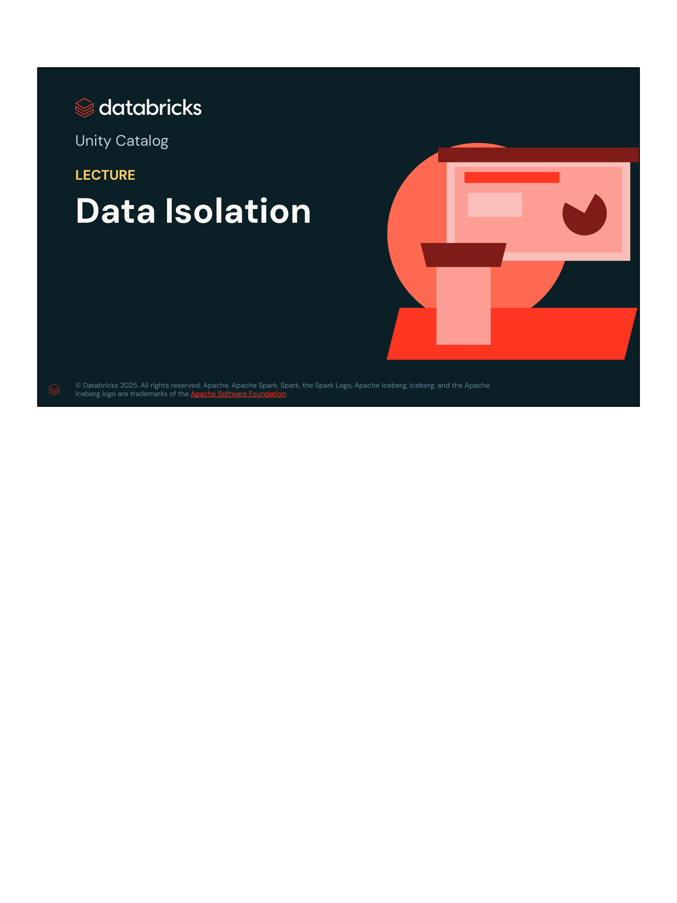

---

## 2. Jerarquía de Objetos Protegibles (*Securables Hierarchy*)

En Unity Catalog, todos los datos y recursos computacionales se estructuran mediante un **espacio de nombres de tres niveles** (*three-level namespace*): `catalog.schema.table` (o `view`, `volume`, `model`, `function`).

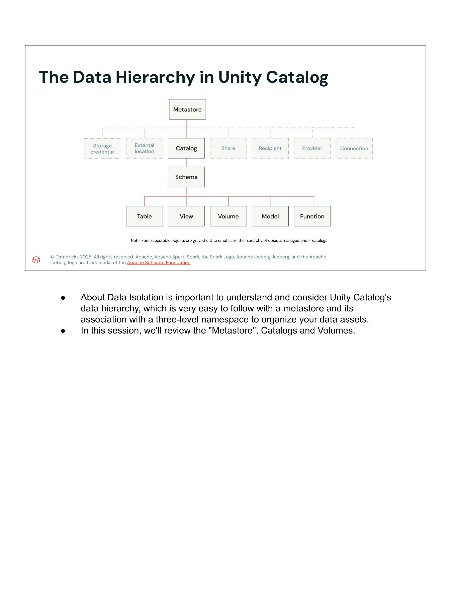

```
                       ┌───────────────────────┐
                       │       Metastore       │ (Nivel Cuenta / Región)
                       └───────────┬───────────┘
                                   │
         ┌─────────────────────────┼─────────────────────────┐
         ▼                         ▼                         ▼
┌──────────────────┐      ┌──────────────────┐      ┌──────────────────┐
│External Location │      │     Catalog      │      │      Share       │
│ & Storage Cred.  │      └────────┬─────────┘      │ (Delta Sharing)  │
└──────────────────┘               │                └──────────────────┘
                                   ▼
                          ┌──────────────────┐
                          │      Schema      │ (Base de Datos)
                          └────────┬─────────┘
                                   │
         ┌─────────────────────────┼─────────────────────────┐
         ▼                         ▼                         ▼
┌──────────────────┐      ┌──────────────────┐      ┌──────────────────┐
│      Table       │      │       View       │      │      Volume      │
│(Managed/External)│      │(Standard/Dynamic)│      │(Managed/External)│
└──────────────────┘      └──────────────────┘      └──────────────────┘
```

### Notas del Instructor (Verbatim):
> *"Securables hierarchy in Databricks Unity catalog begins at the top with the Metastore, which acts as the ultimate container for all metadata within a specific region. Below the metastore are catalogs, which serve as the primary units of data isolation, and can be configured to represent different business units, environments, or projects. Within catalogs, schemas (also known as databases) provide further organization and logical grouping of data assets.*  
> *Finally, schemas contain the actual securable objects, which include tables (for structured tabular data), views (which are saved queries that can be used to control data access and present simplified data representations), and volumes (which manage non-tabular data files like images, audio, and documents).*  
> *Each level of this hierarchy allows for granular permission management, enabling administrators to implement the principle of least privilege effectively throughout the data lakehouse."*

---

## 3. Metastores: Contenedor de Metadatos Regional

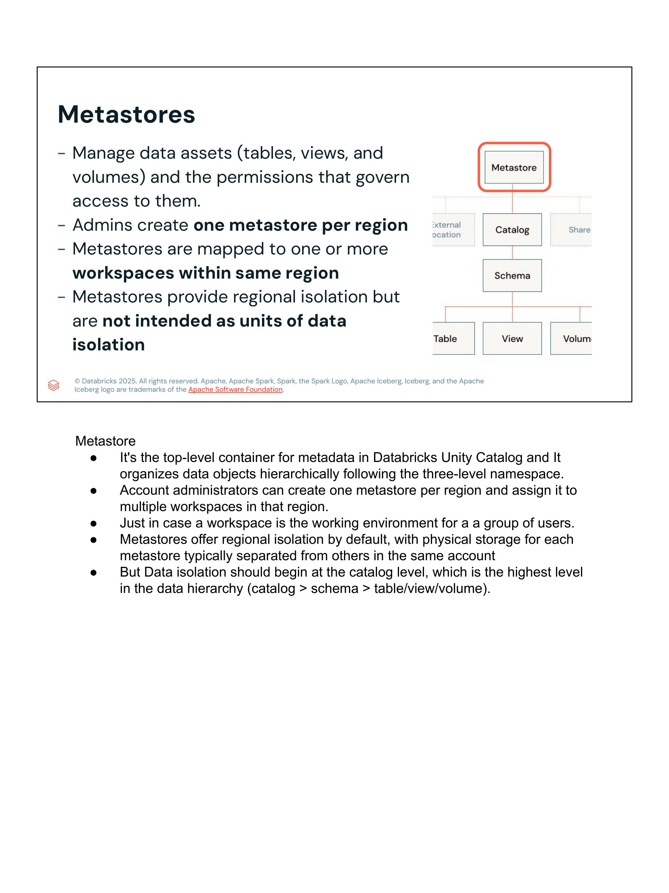

- **Propósito:** Administra los activos de datos (tablas, vistas, volúmenes) y los permisos que gobiernan el acceso sobre ellos.
- **Topología:** Los administradores de cuenta crean **un metastore por región de nube**.
- **Mapeo:** Un metastore se mapea a **uno o más workspaces** dentro de la misma región geográfica.
- **Límite de aislamiento:** Proporciona **aislamiento regional**, pero **no está diseñado como la unidad primaria de aislamiento de datos corporativos**. El aislamiento real de datos de negocio debe comenzar en el nivel de **Catálogo**.

### Notas del Instructor (Verbatim):
> - *It's the top-level container for metadata in Databricks Unity Catalog and it organizes data objects hierarchically following the three-level namespace.*
> - *Account administrators can create one metastore per region and assign it to multiple workspaces in that region.*
> - *Just in case a workspace is the working environment for a group of users.*
> - *Metastores offer regional isolation by default, with physical storage for each metastore typically separated from others in the same account.*
> - *But data isolation should begin at the catalog level, which is the highest level in the data hierarchy (catalog > schema > table/view/volume).*

---

## 4. Catalogs: La Unidad Primaria de Aislamiento de Datos

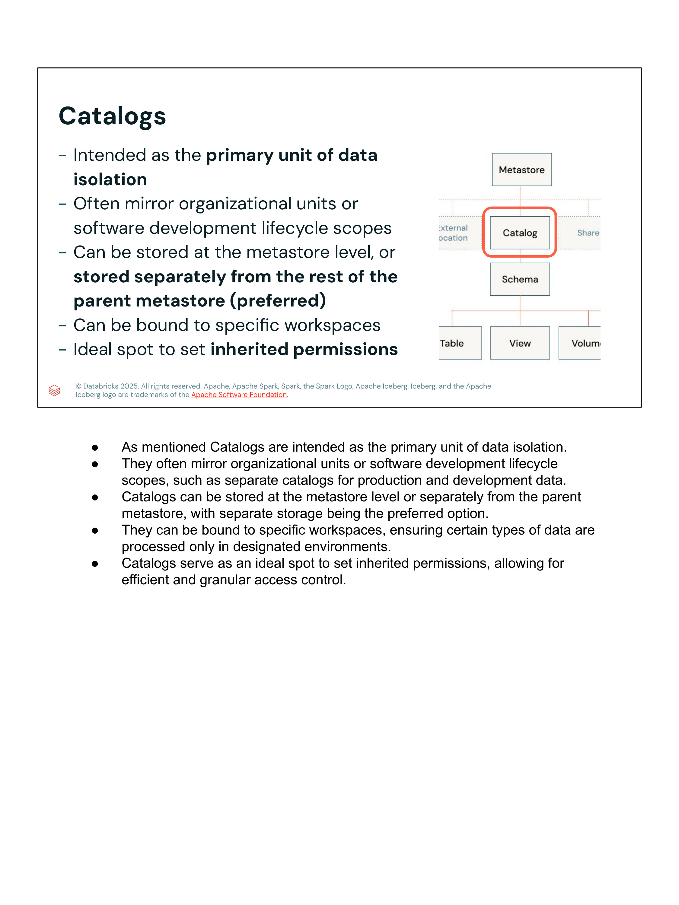

Los catálogos están específicamente diseñados como la **unidad primaria de aislamiento de datos** en el Lakehouse:
- **Modelos de segregación:** Reflejan unidades organizativas (Finanzas, RRHH, Marketing) o alcances del ciclo de vida del desarrollo de software (**SDLC**: `dev`, `staging`, `prod`).
- **Ubicación de almacenamiento:** Los datos administrados de un catálogo pueden residir en el bucket raíz del metastore, o **almacenarse de forma completamente separada en un bucket/contenedor dedicado** (opción altamente recomendada por seguridad y soberanía).
- **Workspace-Catalog Binding:** Se pueden vincular catálogos a workspaces específicos para garantizar que datos de producción solo sean accesibles desde workspaces de producción.
- **Herencia de permisos:** Es el punto ideal para establecer permisos heredados hacia esquemas y tablas subordinados.

### Notas del Instructor (Verbatim):
> - *As mentioned, Catalogs are intended as the primary unit of data isolation.*
> - *They often mirror organizational units or software development lifecycle scopes, such as separate catalogs for production and development data.*
> - *Catalogs can be stored at the metastore level or separately from the parent metastore, with separate storage being the preferred option.*
> - *They can be bound to specific workspaces, ensuring certain types of data are processed only in designated environments.*
> - *Catalogs serve as an ideal spot to set inherited permissions, allowing for efficient and granular access control.*

---

## 5. Volumes: Gobernanza de Datos No Tabulares

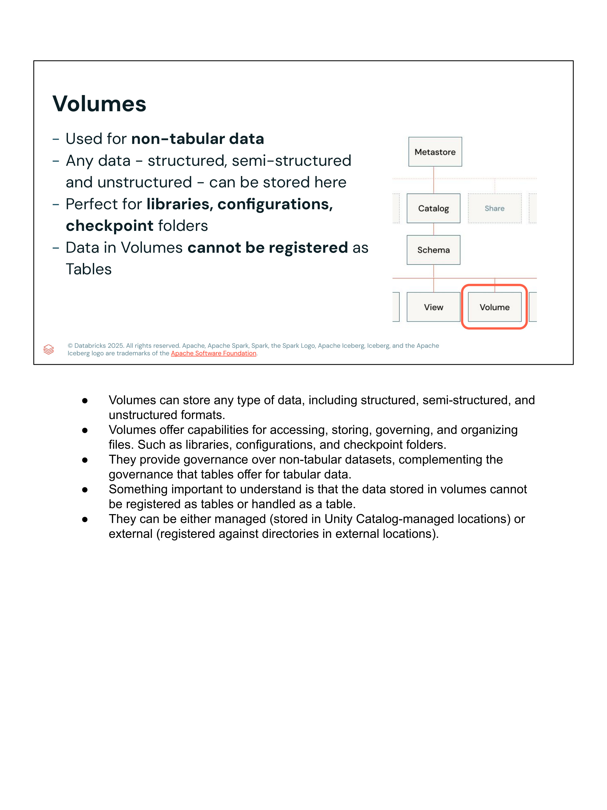

Los **Volumes** extienden la gobernanza de Unity Catalog a activos de archivos no tabulares:
- **Formatos admitidos:** Cualquier tipo de archivo: no estructurado (PDFs, imágenes de pasaportes/DNI, audio, modelos binarios), semiestructurado (JSON crudo, XML) y estructurado.
- **Casos de uso ideales:** Bibliotecas de código (`.whl`, `.jar`), archivos de configuración (`.yaml`, `.json`), puntos de control de streaming (**checkpoint folders**).
- **Regla fundamental:** Los datos almacenados dentro de un Volume **no pueden registrarse como tablas ni manipularse como si fueran tablas**.
- **Tipos de Volumes:**
  1. **Managed Volumes:** El almacenamiento físico reside en la ubicación administrada de Unity Catalog.
  2. **External Volumes:** Se registran contra un directorio específico dentro de una *External Location*.

### Notas del Instructor (Verbatim):
> - *Volumes can store any type of data, including structured, semi-structured, and unstructured formats.*
> - *Volumes offer capabilities for accessing, storing, governing, and organizing files. Such as libraries, configurations, and checkpoint folders.*
> - *They provide governance over non-tabular datasets, complementing the governance that tables offer for tabular data.*
> - *Something important to understand is that the data stored in volumes cannot be registered as tables or handled as a table.*
> - *They can be either managed (stored in Unity Catalog-managed locations) or external (registered against directories in external locations).*

---

## 6. Separación Física de Datos (*Physically Separating Data*)

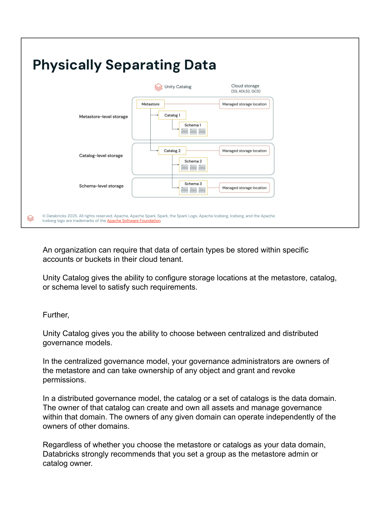

Unity Catalog permite configurar ubicaciones de almacenamiento dedicadas en tres niveles distintos de la jerarquía:

```
┌────────────────────────────────────────────────────────┐
│                      Unity Catalog                     │
└────────────────────────────────────────────────────────┘
  │
  ├─► [Metastore-level Storage] ──► Managed Storage Location (Bucket Raíz S3 / ADLS Gen2 / GCS)
  │     └─► Catalog 1
  │           └─► Schema 1 (hereda bucket raíz)
  │
  ├─► [Catalog-level Storage]   ──► Managed Storage Location (Bucket Dedicado por Catálogo / Prod)
  │     └─► Catalog 2
  │           └─► Schema 2 (hereda bucket de Catalog 2)
  │
  └─► [Schema-level Storage]    ──► Managed Storage Location (Bucket Dedicado por Esquema / PII)
        └─► Schema 3
```

### Modelos de Gobernanza:
1. **Modelo Centralizado:**
   - Un equipo de administradores de gobernanza es propietario del metastore.
   - Poseen autoridad total para asignar y revocar permisos sobre cualquier objeto del lakehouse.
2. **Modelo Distribuido:**
   - Un catálogo o grupo de catálogos representa un dominio de datos (*Data Mesh*).
   - El propietario del catálogo administra y gobierna de manera totalmente independiente los activos de su dominio.
3. **Recomendación Databricks:** Siempre asignar **grupos de usuarios** (no identidades individuales) como administradores del metastore o propietarios de catálogos para evitar puntos únicos de fallo organizativo.

### Notas del Instructor (Verbatim):
> - *An organization can require that data of certain types be stored within specific accounts or buckets in their cloud tenant.*
> - *Unity Catalog gives the ability to configure storage locations at the metastore, catalog, or schema level to satisfy such requirements.*
> - *Further, Unity Catalog gives you the ability to choose between centralized and distributed governance models.*
> - *In the centralized governance model, your governance administrators are owners of the metastore and can take ownership of any object and grant and revoke permissions.*
> - *In a distributed governance model, the catalog or a set of catalogs is the data domain. The owner of that catalog can create and own all assets and manage governance within that domain. The owners of any given domain can operate independently of the owners of other domains.*
> - *Regardless of whether you choose the metastore or catalogs as your data domain, Databricks strongly recommends that you set a group as the metastore admin or catalog owner.*

---

## 7. External Locations y Storage Credentials

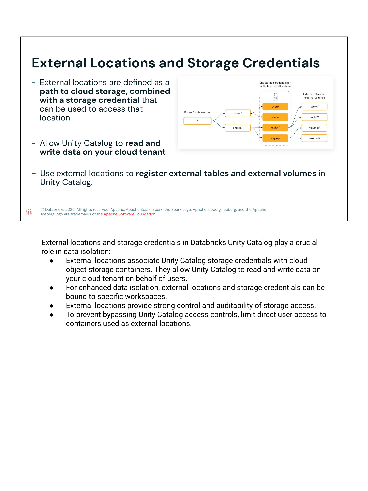

- **Storage Credential:** Encapsula una identidad de nube administrada (Rol IAM de AWS con relación de confianza con Databricks, Azure Managed Identity / Service Principal, o GCP Service Account).
- **External Location:** Combina una ruta de almacenamiento en la nube (ej. `s3://prod-lakehouse-data/finance/` o `abfss://container@account.dfs.core.windows.net/hr/`) con una *Storage Credential*.
- **Aislamiento Reforzado:** Las ubicaciones externas y credenciales pueden **vincularse a workspaces específicos** (*Workspace Binding*).
- **Control Antielusión (*Anti-bypass*):** Para evitar que los usuarios eludan los controles de acceso de Unity Catalog, se debe revocar o limitar el acceso IAM directo de los usuarios a los buckets de nube subyacentes.

### Notas del Instructor (Verbatim):
> *External locations and storage credentials in Databricks Unity Catalog play a crucial role in data isolation:*
> - *External locations associate Unity Catalog storage credentials with cloud object storage containers. They allow Unity Catalog to read and write data on your cloud tenant on behalf of users.*
> - *For enhanced data isolation, external locations and storage credentials can be bound to specific workspaces.*
> - *External locations provide strong control and auditability of storage access.*
> - *To prevent bypassing Unity Catalog access controls, limit direct user access to containers used as external locations.*

---

## 8. El Modelo de Seguridad de Unity Catalog: Ciclo de Vida de una Consulta

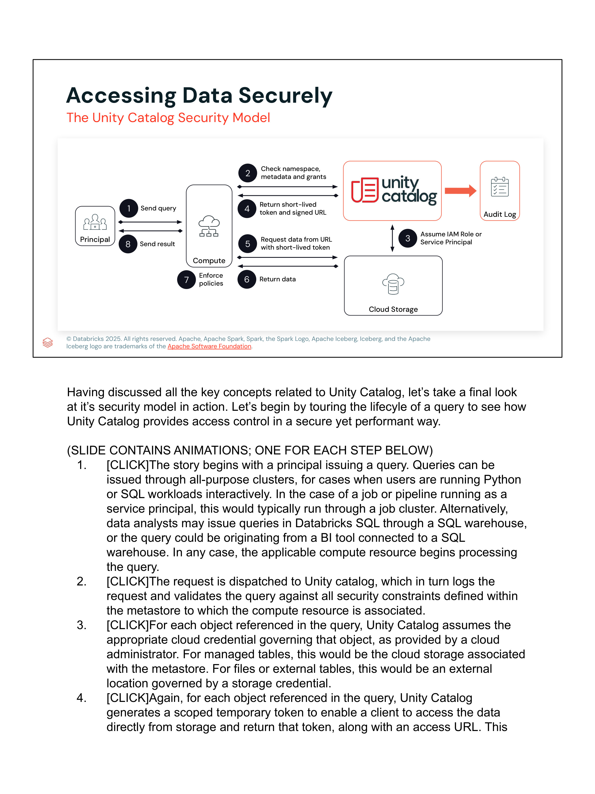
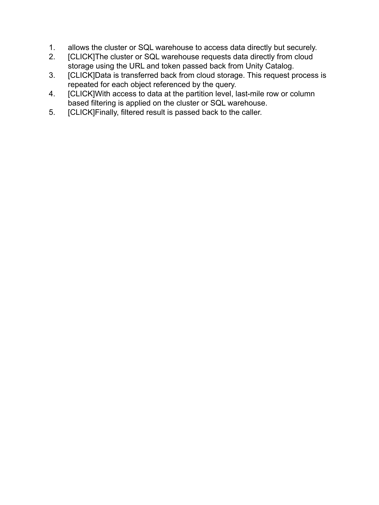

El acceso a los datos en Unity Catalog no expone credenciales maestras de la nube ni requiere acceso directo del usuario al almacenamiento. Opera bajo un **modelo de acceso mediado por token temporal de corta duración**:

```
 [1] Emite Query
Principal  ───────────►   [ Compute ]
 (User /                  (Cluster /   ───────────►   [ Unity Catalog ]
  Service                 SQL WH)     ◄───────────    (Metastore & ACLs)
 Principal)               ▲         ▲   [4] Token corto       │ [3] Asume Rol IAM /
                          │         │       y Signed URL      ▼     Storage Credential
                          │[5] Pide │                   ┌──────────────┐
                          │    data │[6] Retorna        │  Audit Log   │
                          ▼    URL  │    data           │(system.access│
                     ┌──────────────┴─────────┐         │   .audit)    │
                     │     Cloud Storage      │         └──────────────┘
                     │ (S3 / ADLS Gen2 / GCS) │
                     └────────────────────────┘
                          │
                   [7] Compute aplica
                       Row Filters / Column Masks
                          │
                   [8] Envía resultado filtrado
Principal  ◄─────────── Compute
```

### Paso a Paso Detallado:
1. **Envío de la consulta:** El Principal (usuario interactivo, job de servicio o herramienta BI) emite una consulta SQL/Python al recurso de cómputo (Cluster interactivo, Job cluster o SQL Warehouse).
2. **Validación y auditoría:** El cómputo despacha la solicitud a Unity Catalog, que registra el evento en el registro de auditoría (`system.access.audit`) y valida los permisos del catálogo, esquema y tabla.
3. **Asunción de credenciales:** Unity Catalog asume el rol de nube correspondiente definido en la *Storage Credential* asociada al objeto.
4. **Token efímero y URL firmada:** Unity Catalog genera un token con alcance limitado y tiempo de expiración corto junto con una URL de acceso directo, retornándolos al clúster de cómputo.
5. **Solicitud directa:** El clúster o SQL Warehouse solicita los bloques de datos directamente a la nube usando la URL firmada y el token efímero.
6. **Retorno de datos brutos:** El almacenamiento de la nube transfiere los datos al clúster (permitiendo throughput masivo sin que Unity Catalog sea un cuello de botella de I/O).
7. **Aplicación de políticas de última milla:** El motor de cómputo aplica filtros de fila (*Row Filters*) y máscaras de columna (*Column Masks*) según la identidad del usuario que originó la consulta.
8. **Entrega de resultados:** El resultado final higienizado y filtrado se devuelve al usuario.

### Notas del Instructor (Verbatim):
> *Having discussed all the key concepts related to Unity Catalog, let's take a final look at its security model in action. Let's begin by touring the lifecycle of a query to see how Unity Catalog provides access control in a secure yet performant way.*  
> 1. *The story begins with a principal issuing a query. Queries can be issued through all-purpose clusters, for cases when users are running Python or SQL workloads interactively. In the case of a job or pipeline running as a service principal, this would typically run through a job cluster. Alternatively, data analysts may issue queries in Databricks SQL through a SQL warehouse, or the query could be originating from a BI tool connected to a SQL warehouse. In any case, the applicable compute resource begins processing the query.*  
> 2. *The request is dispatched to Unity catalog, which in turn logs the request and validates the query against all security constraints defined within the metastore to which the compute resource is associated.*  
> 3. *For each object referenced in the query, Unity Catalog assumes the appropriate cloud credential governing that object, as provided by a cloud administrator. For managed tables, this would be the cloud storage associated with the metastore. For files or external tables, this would be an external location governed by a storage credential.*  
> 4. *Again, for each object referenced in the query, Unity Catalog generates a scoped temporary token to enable a client to access the data directly from storage and return that token, along with an access URL. This allows the cluster or SQL warehouse to access data directly but securely.*  
> 5. *The cluster or SQL warehouse requests data directly from cloud storage using the URL and token passed back from Unity Catalog.*  
> 6. *Data is transferred back from cloud storage. This request process is repeated for each object referenced by the query.*  
> 7. *With access to data at the partition level, last-mile row or column based filtering is applied on the cluster or SQL warehouse.*  
> 8. *Finally, filtered result is passed back to the caller.*

---

## 9. Aislamiento de Cómputo y Cargas de Trabajo (*Workload Isolation*)

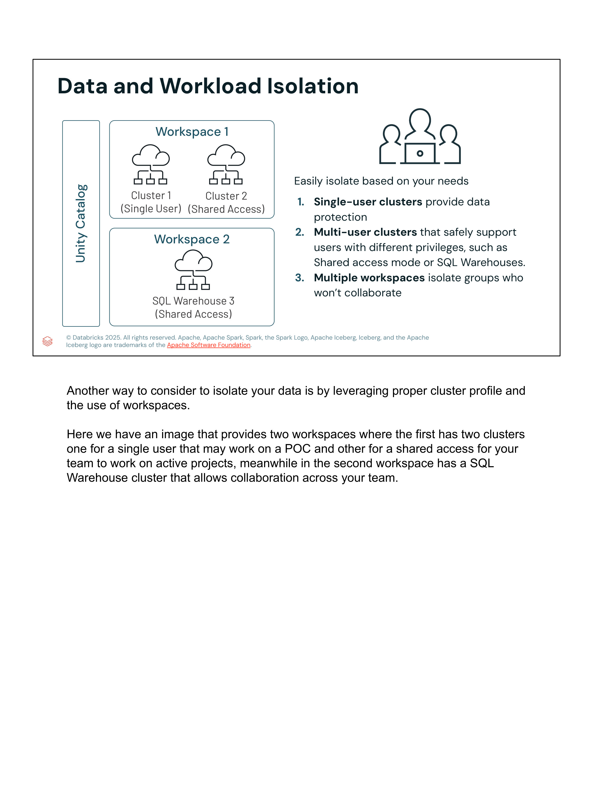

Para prevenir interferencias de procesos, escalado de privilegios o filtración de memoria entre usuarios, se implementan tres niveles de aislamiento computacional:
1. **Single-User Clusters (Clústeres de usuario único):** Dedicados exclusivamente a un usuario o *service principal*. Soportan todos los lenguajes (Python, SQL, Scala, R) con aislamiento a nivel de máquina virtual.
2. **Multi-User Clusters (Clústeres compartidos):** Clústeres con modo de acceso compartido (*Shared Access Mode*) o **SQL Warehouses**. Aplican aislamiento a nivel de proceso con soporte riguroso de Table ACLs y Unity Catalog.
3. **Múltiples Workspaces:** Permiten aislar grupos de usuarios que no colaboran entre sí o separar estrictamente entornos regulatorios y fases del ciclo de vida (Desarrollo, Pruebas y Producción).

### Notas del Instructor (Verbatim):
> *Another way to consider to isolate your data is by leveraging proper cluster profile and the use of workspaces.*  
> *Here we have an image that provides two workspaces where the first has two clusters: one for a single user that may work on a POC and other for a shared access for your team to work on active projects, meanwhile in the second workspace has a SQL Warehouse cluster that allows collaboration across your team.*

---

## 10. Cifrado por Defecto (*Encryption by Default*)

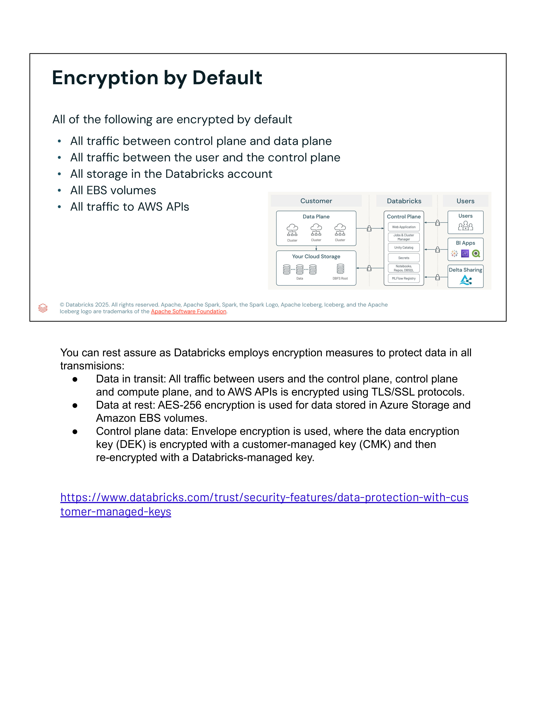

Databricks aplica cifrado integral en todos los vectores de transmisión y persistencia:
- **Datos en tránsito (*In Transit*):**
  - Todo el tráfico entre usuarios y el *Control Plane* está cifrado con **TLS/SSL (HTTPS)**.
  - Todo el tráfico entre el *Control Plane* y el *Data Plane* (computación del cliente) está cifrado mediante túneles seguros TLS.
  - Toda llamada a las APIs de la nube (AWS, Azure, GCP) utiliza conexiones cifradas TLS/SSL.
- **Datos en reposo (*At Rest*):**
  - Cifrado nativo de almacenamiento en la nube: **AES-256** en Azure Data Lake Storage / AWS S3.
  - Todos los volúmenes de almacenamiento en bloque locales de los nodos de cómputo (**Amazon EBS / Azure Managed Disks**) están cifrados.
- **Control Plane Data (Envelope Encryption):**
  - Se utiliza cifrado de sobre (*Envelope Encryption*): la clave de cifrado de datos (**DEK**) se cifra con una clave administrada por el cliente (**Customer-Managed Key - CMK**) y se vuelve a cifrar con la clave administrada por Databricks.
  - Referencia oficial: [Databricks Customer-Managed Keys](https://www.databricks.com/trust/security-features/data-protection-with-customer-managed-keys).

### Notas del Instructor (Verbatim):
> *You can rest assure as Databricks employs encryption measures to protect data in all transmissions:*  
> - *Data in transit: All traffic between users and the control plane, control plane and compute plane, and to AWS APIs is encrypted using TLS/SSL protocols.*  
> - *Data at rest: AES-256 encryption is used for data stored in Azure Storage and Amazon EBS volumes.*  
> - *Control plane data: Envelope encryption is used, where the data encryption key (DEK) is encrypted with a customer-managed key (CMK) and then re-encrypted with a Databricks-managed key.*

---

## 11. Gestión de Acceso a PII (*Manage Access to PII*)

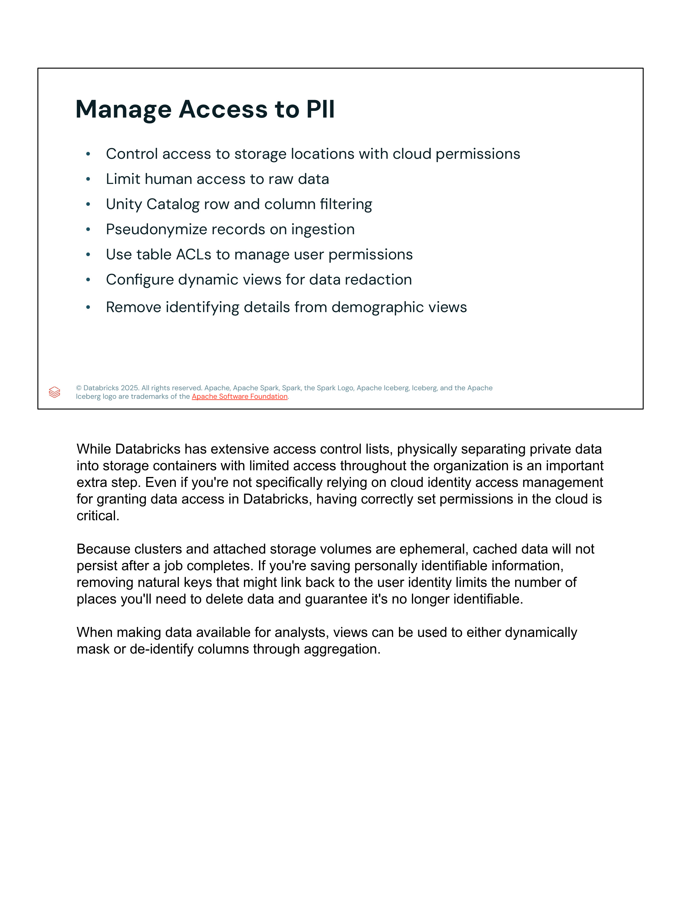

Estrategias operativas clave para minimizar la exposición de datos sensibles:
- **Segregación física de contenedores:** Almacenar datos privados en contenedores o buckets de almacenamiento dedicados con permisos IAM estrictos.
- **Restricción de acceso humano a datos crudos:** Los científicos y analistas no deben interactuar con capas de datos crudos (*Bronze/Landing*); el acceso debe reservarse a pipelines automatizados con Service Principals.
- **Row and Column Filtering nativo de Unity Catalog:** Ocultar dinámicamente filas o columnas sensibles según membresía de grupo (`is_account_group_member('pii_admins')`).
- **Pseudonimización en la ingesta:** Reemplazar identificadores naturales por tokens o hashes salteados en el momento de la ingesta para que los discos temporales de clústeres no persistan PII legible.
- **Table ACLs y Vistas Dinámicas:** Emplear vistas de agregación que eliminen detalles identificables para análisis demográficos.

### Notas del Instructor (Verbatim):
> *While Databricks has extensive access control lists, physically separating private data into storage containers with limited access throughout the organization is an important extra step. Even if you're not specifically relying on cloud identity access management for granting data access in Databricks, having correctly set permissions in the cloud is critical.*  
> *Because clusters and attached storage volumes are ephemeral, cached data will not persist after a job completes. If you're saving personally identifiable information, removing natural keys that might link back to the user identity limits the number of places you'll need to delete data and guarantee it's no longer identifiable.*  
> *When making data available for analysts, views can be used to either dynamically mask or de-identify columns through aggregation.*

---

## 12. Nuevas Mejores Prácticas de Databricks (*New Best Practices*)

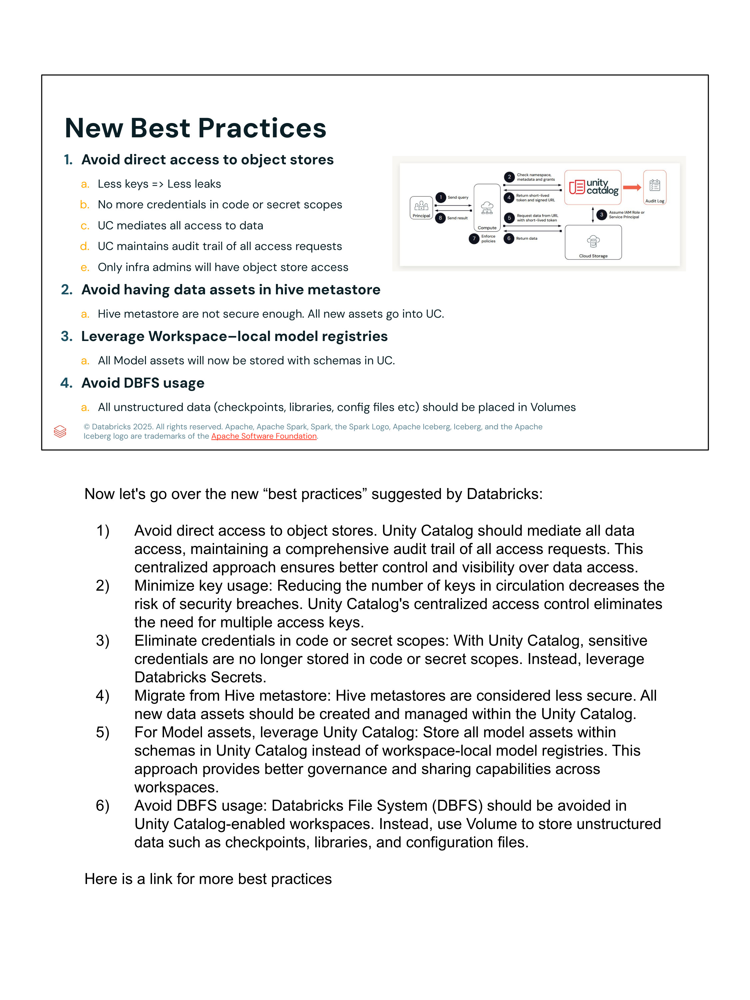


1. **Evitar acceso directo a almacenes de objetos (*Avoid Direct Access to Object Stores*):**
   - Menos claves en circulación = menos fugas potenciales.
   - Eliminar credenciales embebidas en código de notebooks o scopes de secretos para acceder a buckets.
   - Unity Catalog debe mediar **todo** acceso a datos y mantener un registro de auditoría completo.
2. **Evitar activos de datos en Hive Metastore:**
   - El Hive Metastore tradicional carece de controles granulares de seguridad y auditoría centralizada.
   - Todos los activos nuevos deben crearse y gobernarse exclusivamente en **Unity Catalog**.
3. **Migrar Model Registries de Workspace a Unity Catalog:**
   - Registrar modelos de ML directamente en esquemas de Unity Catalog (`catalog.schema.model_name`) para gobernanza y linaje unificados.
4. **Evitar el uso de DBFS (*Avoid DBFS Usage*):**
   - El Databricks File System (DBFS) raíz no ofrece gobernanza granular.
   - Todos los datos no estructurados (checkpoints de streaming, bibliotecas de código `.whl`/`.jar`, archivos de configuración) deben almacenarse en **Unity Catalog Volumes**.
- Referencia oficial: [Unity Catalog Best Practices](https://docs.databricks.com/en/data-governance/unity-catalog/best-practices.html).

### Notas del Instructor (Verbatim):
> *Now let's go over the new "best practices" suggested by Databricks:*  
> 1) *Avoid direct access to object stores. Unity Catalog should mediate all data access, maintaining a comprehensive audit trail of all access requests. This centralized approach ensures better control and visibility over data access.*  
> 2) *Minimize key usage: Reducing the number of keys in circulation decreases the risk of security breaches. Unity Catalog's centralized access control eliminates the need for multiple access keys.*  
> 3) *Eliminate credentials in code or secret scopes: With Unity Catalog, sensitive credentials are no longer stored in code or secret scopes. Instead, leverage Databricks Secrets.*  
> 4) *Migrate from Hive metastore: Hive metastores are considered less secure. All new data assets should be created and managed within the Unity Catalog.*  
> 5) *For Model assets, leverage Unity Catalog: Store all model assets within schemas in Unity Catalog instead of workspace-local model registries. This approach provides better governance and sharing capabilities across workspaces.*  
> 6) *Avoid DBFS usage: Databricks File System (DBFS) should be avoided in Unity Catalog-enabled workspaces. Instead, use Volume to store unstructured data such as checkpoints, libraries, and configuration files.*

---

## 13. Caso de Éxito de la Industria: SEEK

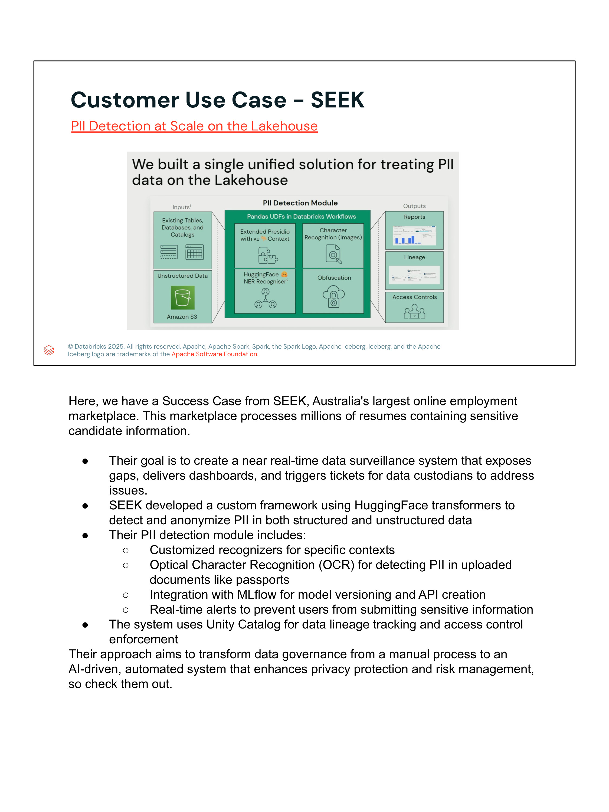

**SEEK**, el portal de empleo y reclutamiento más grande de Australia, procesa millones de currículums y documentos con datos confidenciales de candidatos:

- **Desafío:** Detectar y anonimizar información confidencial tanto en fuentes estructuradas (bases de datos, catálogos) como no estructuradas (currículums en PDF, imágenes de pasaportes).
- **Arquitectura Implementada:**
  - **Framework Personalizado:** Basado en modelos de lenguaje de HuggingFace Transformers combinados con Microsoft Presidio adaptado a entidades australianas.
  - **OCR de Imágenes:** Reconocimiento óptico de caracteres para extraer y examinar texto incrustado en fotos de documentos de identidad.
  - **Pandas UDFs en Databricks Workflows:** Ejecución distribuida y paralela a escala masiva para ofuscar PII antes de almacenar en tablas Delta.
  - **Integración con MLflow y Unity Catalog:** Seguimiento riguroso de linaje de datos de extremo a extremo y control estricto de accesos.
- **Resultado:** Transformación de la gobernanza de datos de un proceso manual reactivo a un sistema automatizado continuo impulsado por IA.

### Notas del Instructor (Verbatim):
> *Here, we have a Success Case from SEEK, Australia's largest online employment marketplace. This marketplace processes millions of resumes containing sensitive candidate information.*  
> - *Their goal is to create a near real-time data surveillance system that exposes gaps, delivers dashboards, and triggers tickets for data custodians to address issues.*  
> - *SEEK developed a custom framework using HuggingFace transformers to detect and anonymize PII in both structured and unstructured data.*  
> - *Their PII detection module includes:*  
>   - *Customized recognizers for specific contexts*  
>   - *Optical Character Recognition (OCR) for detecting PII in uploaded documents like passports*  
>   - *Integration with MLflow for model versioning and API creation*  
>   - *Real-time alerts to prevent users from submitting sensitive information*  
> - *The system uses Unity Catalog for data lineage tracking and access control enforcement.*  
> *Their approach aims to transform data governance from a manual process to an AI-driven, automated system that enhances privacy protection and risk management, so check them out.*

---

## 14. Resumen Técnico para Certificación

| Dimensión | Enfoque Histórico / Legado | Estándar Recomendado con Unity Catalog |
|---|---|---|
| **Unidad de Aislamiento** | Workspace o Metastore individual | **Catálogo (`catalog`)** vinculado a workspaces y storage dedicados |
| **Acceso a Storage** | Claves IAM estáticas / Montajes DBFS | **Storage Credentials + External Locations** mediadas por UC |
| **Tokens de Acceso** | Tokens permanentes o credenciales en Secret Scopes | **Tokens temporales de corta duración con signed URLs** generados por UC |
| **Archivos no tabulares / Checkpoints** | `/dbfs/FileStore/`, montajes de almacenamiento | **Unity Catalog Volumes (Managed o External)** |
| **Modelos de ML** | Workspace MLflow Model Registry | **Modelos en esquemas de Unity Catalog (`catalog.schema.model`)** |
| **Gobernanza de Cómputo** | Clústeres no controlados / No-isolation shared | **Single-User Clusters** o **Shared Access Mode / SQL Warehouses** |
| **Cifrado de Datos** | Manual / Configuración por bucket | **Cifrado por defecto en reposo (AES-256), en tránsito (TLS/SSL) y sobre (DEK/CMK)** |
