# Lección 11: Demo: Securing Data in Unity Catalog (DP 1.1)

**Curso:** Databricks Data Privacy (ID: 3767)  
**Sección:** Section 2: Unity Catalog  
**Lección:** Demo: Securing Data in Unity Catalog (Lesson ID: 34610)  
**Notebook:** `DP 1.1 - Securing Data in Unity Catalog`  
**Duración del Video:** 23 min 55 s (1,435 segundos)  
**Entorno de Ejecución:** Databricks Runtime con Unity Catalog habilitado  
**Autor:** Databricks Academy  

---

## 1. Visión General del Laboratorio y Objetivos Técnicos

En este laboratorio práctico de demostración (*Demonstration / Hands-on Lab*), se implementa un modelo de seguridad multicapa para datos confidenciales (PII - *Personally Identifiable Information*) utilizando las capacidades nativas de **Unity Catalog**. 

El objetivo primordial es transitar desde el acceso irrestricto de tablas Silver/Bronze hacia la gobernanza de mínimo privilegio (*Least Privilege Principle*), implementando:
1. **Espacio de nombres de 3 niveles** (`catalog.schema.table_or_view`).
2. **Control de acceso granular basado en privilegios** (`USE CATALOG`, `USE SCHEMA`, `SELECT`).
3. **Vistas Dinámicas con enmascaramiento condicional** mediante funciones de contexto de usuario (`current_user()`, `is_account_group_member()`, `is_member()`).
4. **Filtros de Fila Nativos (*Row Filters*)** aplicados a tablas físicas mediante funciones definidas por el usuario (UDFs).
5. **Máscaras de Columna Nativas (*Column Masks*)** aplicadas a columnas de alta sensibilidad (e.g. Tax ID / SSN).
6. **Capacidades de Descubrimiento de Datos (*Data Discoverability*)** mediante etiquetado jerárquico (*Tags*) a nivel de tabla y columna, descripciones asistidas por IA en Catalog Explorer y búsquedas por sintaxis `tag:value`.

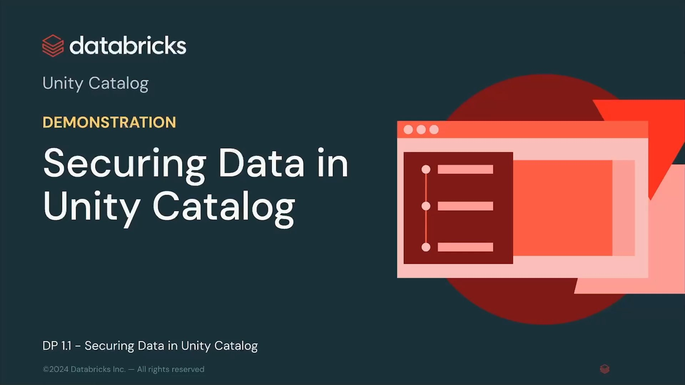

---

## 2. Preparación del Catálogo y Esquema de Trabajo

El laboratorio se ejecuta dentro de un catálogo aislado asignado a la sesión del usuario (`labuser<id>`) y un esquema específico para datos de clientes y privacidad (`pii_data`):

```sql
-- Selección del contexto de ejecución en 3 niveles
USE CATALOG labuser8911981_1741121650;
USE SCHEMA pii_data;

-- Inspección inicial de tablas creadas
SHOW TABLES;
```

Las tablas disponibles en el esquema son:
- `customers_bronze`: Datos en bruto ingeridos directamente de los sistemas de origen.
- `customers_silver`: Datos limpios, estructurados y tipados, conteniendo PII sin enmascarar (nombres, estados, tax IDs, números de teléfono, etc.).
- `customers_silver_with_row_filter_and_column_masks`: Copia de la tabla silver preparada para la aplicación de políticas de seguridad a nivel de celda sin alterar la tabla base.

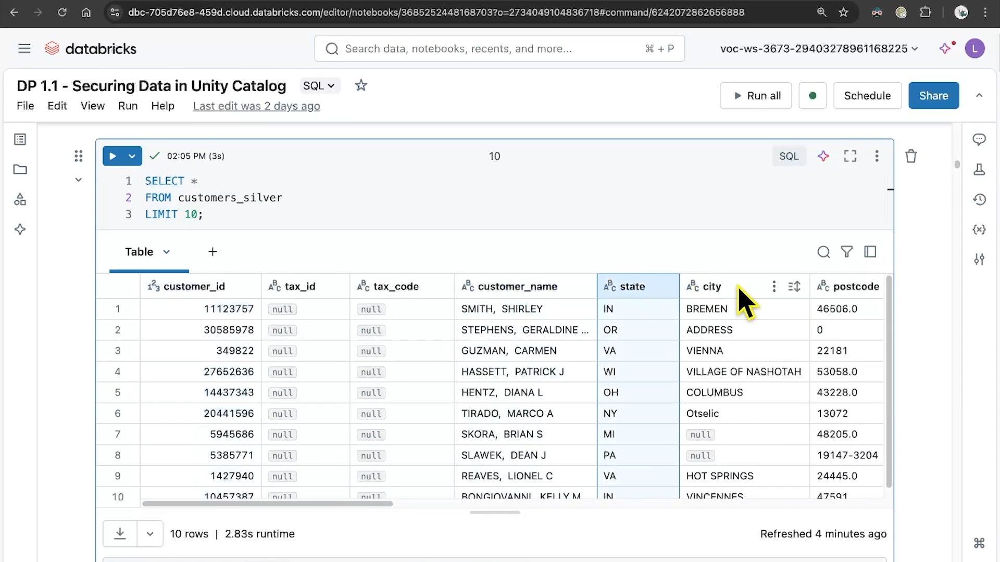

```sql
-- Consulta de validación preliminar
SELECT * FROM customers_silver LIMIT 10;
```

---

## 3. Sección C: Control de Acceso a Datos (Privilegios en Unity Catalog)

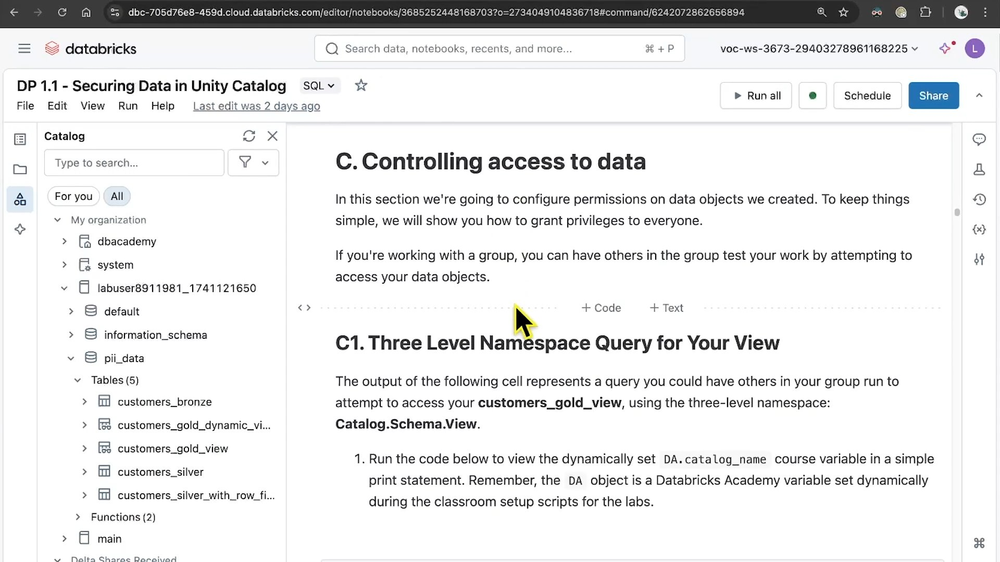

### 3.1 Modelo de Concesión de Permisos
Para que un usuario o grupo acceda a cualquier objeto dentro de Unity Catalog, debe poseer privilegios en toda la cadena de ancestros:
- `USE CATALOG` sobre el catálogo contenedor.
- `USE SCHEMA` sobre el esquema contenedor.
- `SELECT` sobre la tabla o vista específica.

Si falta cualquiera de estos permisos en la jerarquía, Databricks rechaza inmediatamente la consulta con una excepción de autorización.

### 3.2 Manejo de Errores de Permiso
Cuando un usuario que no es administrador (`Metastore Admin` o propietario del catálogo) intenta alterar o acceder a recursos sin los permisos necesarios, Unity Catalog genera un error explícito:

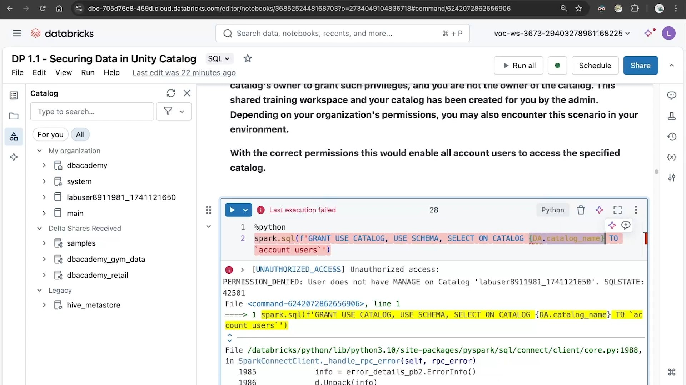

```
[PERMISSION_DENIED] User does not have MANAGE on Catalog 'labuser8911981_1741121650'.
```

### 3.3 Concesión de Privilegios para Consumo de Vistas Gold
Para exponer información analítica a los usuarios comerciales sin otorgarles acceso a las tablas físicas subyacentes, se aplican los siguientes permisos:

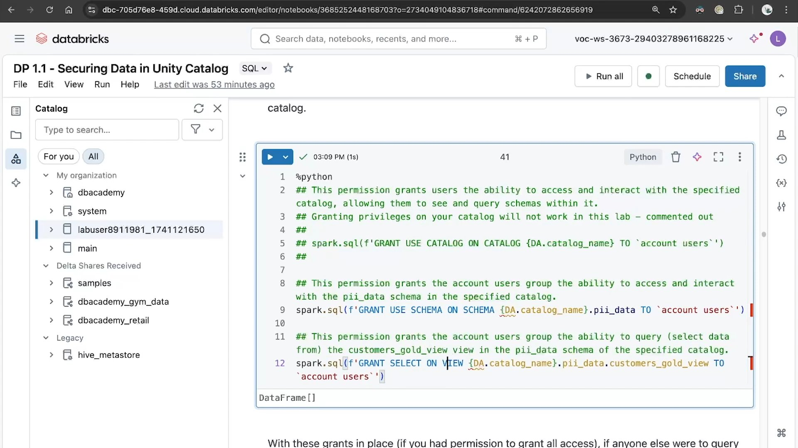

```sql
-- Permitir navegación en la jerarquía
GRANT USE CATALOG ON CATALOG labuser8911981_1741121650 TO `account users`;
GRANT USE SCHEMA ON SCHEMA labuser8911981_1741121650.pii_data TO `account users`;

-- Otorgar lectura exclusivamente sobre la vista Gold
GRANT SELECT ON VIEW labuser8911981_1741121650.pii_data.customers_gold_view TO `account users`;
```

---

## 4. Sección D: Vistas Dinámicas (*Dynamic Views*)

Las vistas dinámicas permiten devolver diferentes filas o columnas según la identidad o pertenencia a grupos del usuario que ejecuta la consulta en tiempo real.

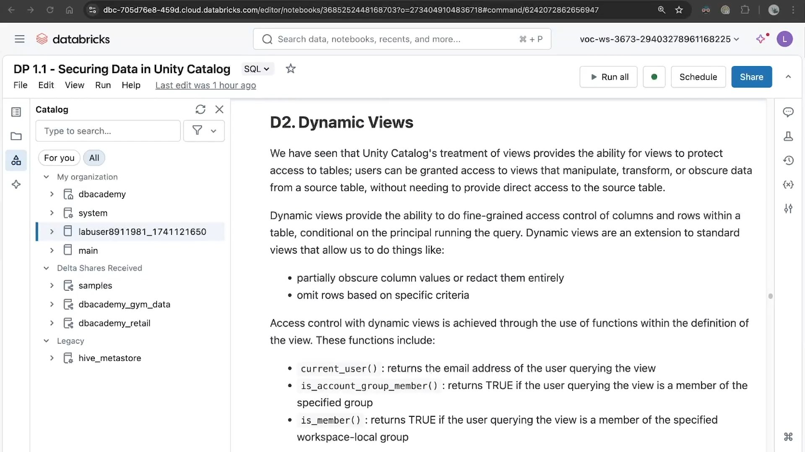

### 4.1 Funciones de Contexto de Seguridad
- `current_user()`: Retorna el correo electrónico del usuario conectado que ejecuta la consulta.
- `is_account_group_member('group_name')`: Retorna `TRUE` si el usuario pertenece al grupo definido a nivel de cuenta de Databricks.
- `is_member('group_name')`: Función heredada que valida pertenencia a nivel de workspace local. Se recomienda usar `is_account_group_member()` en arquitecturas modernas de Unity Catalog multi-workspace.

### 4.2 Creación de Vista Dinámica con Redacción de Datos
Se construye una vista `customers_gold_dynamic_view` donde el `customer_id` es reemplazado por un valor ficticio (`9999999`) a menos que el usuario pertenezca al grupo privilegiado `pii_admins`:

```sql
CREATE OR REPLACE VIEW customers_gold_dynamic_view AS
SELECT
  CASE 
    WHEN is_account_group_member('pii_admins') THEN customer_id 
    ELSE 9999999 
  END AS customer_id,
  state,
  average_units_purchased,
  loyalty_segment
FROM customers_silver;
```

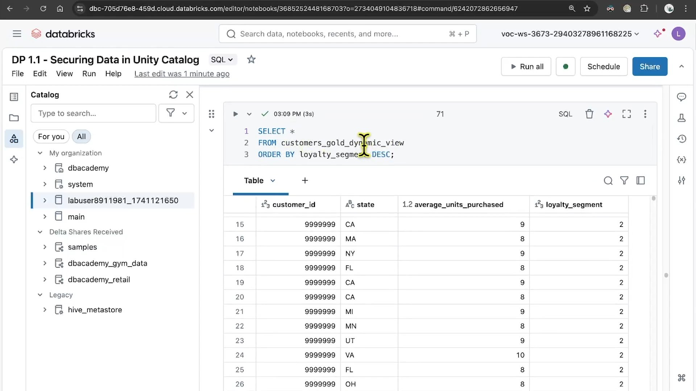

Al ejecutar la consulta desde un rol estándar, el resultado muestra que todas las identidades numéricas han sido redactadas a `9999999`:
```sql
SELECT * FROM customers_gold_dynamic_view LIMIT 15;
```

---

## 5. Sección E: Filtros de Fila Nativos (*Row Filters*)

A diferencia de las vistas dinámicas, los **Row Filters** se aplican directamente a la tabla Delta base. Cualquier consulta directa sobre la tabla (`SELECT * FROM table`) evalúa automáticamente la función de predicado sin requerir que los usuarios apunten a una vista intermedia.

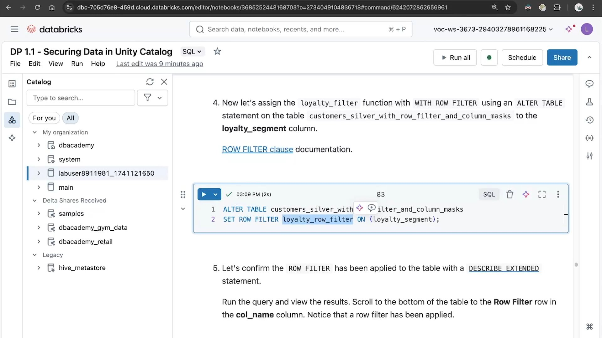

### 5.1 Definición de la Función de Filtro de Fila
Se define una función escalar SQL que actúa como predicado booleano:

```sql
CREATE OR REPLACE FUNCTION loyalty_row_filter(segment INT)
  RETURN IF(is_account_group_member('loyalty_managers'), TRUE, segment = 2);
```
- Si el usuario es miembro de `loyalty_managers`, la función retorna `TRUE` para todos los registros (acceso total a todas las filas).
- Para el resto de usuarios, la función solo retorna `TRUE` cuando `loyalty_segment = 2`.

### 5.2 Vinculación del Filtro a la Tabla
```sql
ALTER TABLE customers_silver_with_row_filter_and_column_masks
  SET ROW FILTER loyalty_row_filter ON (loyalty_segment);
```

### 5.3 Validación del Filtro de Filas
```sql
SELECT * FROM customers_silver_with_row_filter_and_column_masks LIMIT 20;
```

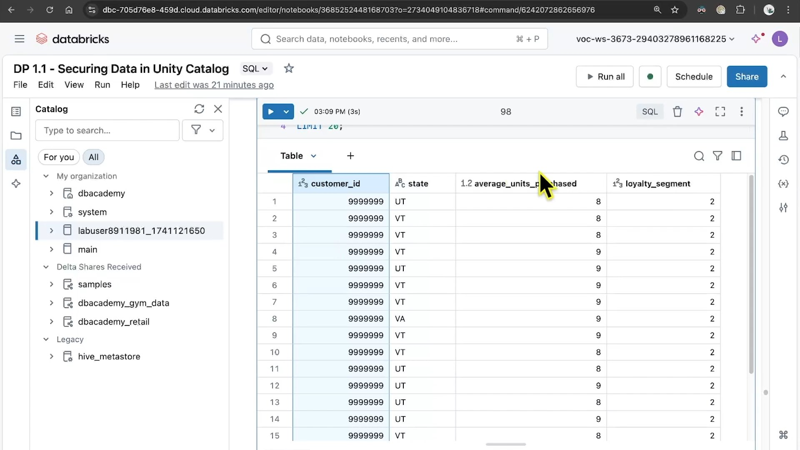

Como se observa en la ejecución, todos los registros devueltos tienen obligatoriamente `loyalty_segment = 2`, bloqueando la visibilidad del resto de segmentos para usuarios no autorizados de forma totalmente transparente para el analista.

---

## 6. Sección F: Máscaras de Columna Nativas (*Column Masks*)

Las **Column Masks** permiten ocultar o transformar el contenido de una columna específica basándose en políticas de usuario, sustituyendo el valor por hashes, máscaras fijas (`***-**-****`) o valores nulos.

### 6.1 Definición de la Función de Enmascaramiento
```sql
CREATE OR REPLACE FUNCTION tax_id_mask(tax_id STRING)
  RETURN IF(is_account_group_member('compliance_admins'), tax_id, '***-**-****');
```

### 6.2 Aplicación de la Máscara a la Columna
```sql
ALTER TABLE customers_silver_with_row_filter_and_column_masks
  ALTER COLUMN tax_id SET MASK tax_id_mask;
```

### 6.3 Verificación con `DESCRIBE EXTENDED`
Para auditar qué políticas de seguridad gobiernan la tabla:
```sql
DESCRIBE EXTENDED customers_silver_with_row_filter_and_column_masks;
```
En el resultado del comando, la columna `tax_id` exhibe su regla de máscara asociada, y en las propiedades de la tabla figura el `Row Filter: loyalty_row_filter`.

---

## 7. Sección H: Descubrimiento de Datos y Etiquetas (*Discoverability*)

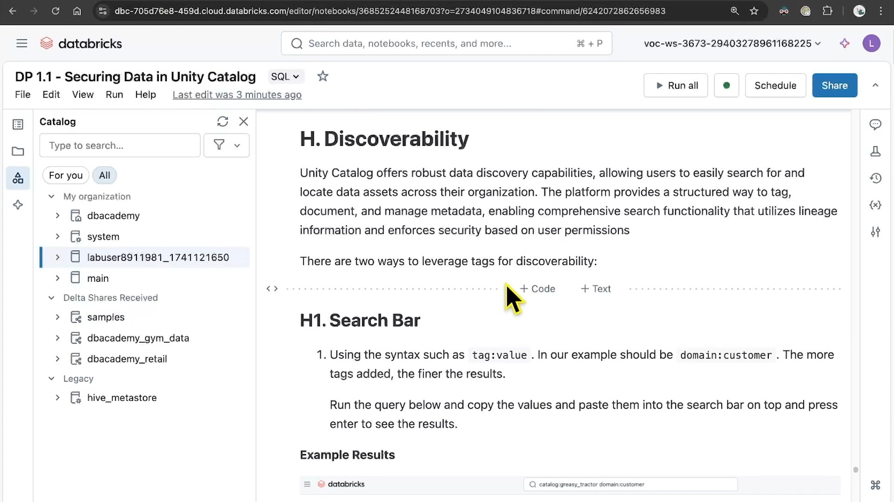

Unity Catalog ofrece capacidades avanzadas para la catalogación y descubrimiento de activos analíticos:

### 7.1 Etiquetado Jerárquico (*Tags*)
Se pueden asignar pares clave-valor a nivel de catálogo, esquema, tabla o columna:
```sql
-- Etiquetas a nivel de tabla
ALTER TABLE customers_silver SET TAGS ('domain' = 'customer', 'quality' = 'silver');

-- Etiquetas a nivel de columna para trazabilidad de privacidad
ALTER TABLE customers_silver ALTER COLUMN customer_id SET TAGS ('compliance' = 'GDPR');
```

### 7.2 Búsqueda Estructurada en la Barra de Navegación
Los analistas pueden localizar conjuntos de datos autorizados mediante sintaxis de filtros:
- `tag:value` (e.g. `domain:customer`)
- `catalog:<catalog_name> domain:customer`

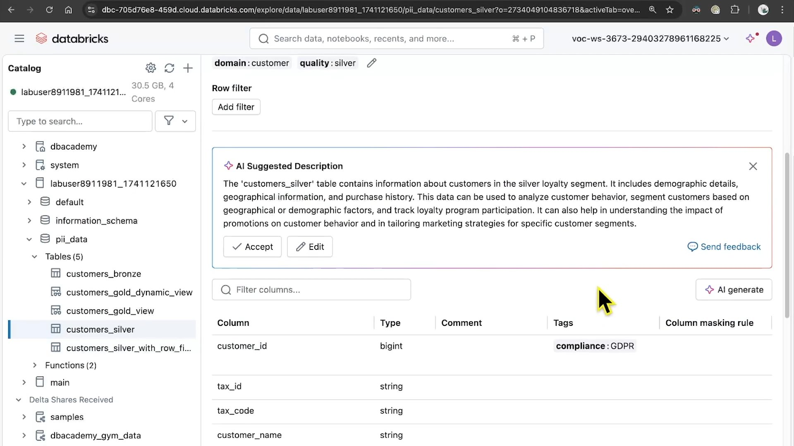

### 7.3 Descripciones Sugeridas por IA (*AI Suggested Descriptions*)
Catalog Explorer integra modelos generativos que inspeccionan el esquema y los tipos de datos para redactar automáticamente descripciones funcionales del activo:
> *"The 'customers_silver' table contains information about customers in the silver loyalty segment. It includes demographic details, geographical information, and purchase history. This data can be used to analyze customer behavior, segment customers based on geographical or demographic factors, and track loyalty program participation..."*

---

## 8. Resumen Comparativo de Mecanismos de Seguridad

| Característica | Vistas Dinámicas (*Dynamic Views*) | Filtros de Fila (*Row Filters*) | Máscaras de Columna (*Column Masks*) |
|---|---|---|---|
| **Nivel de Aplicación** | Capa lógica (Vista) | Tabla física base | Columna de tabla física base |
| **Transparencia** | Requiere que el usuario consulte la vista en vez de la tabla | 100% transparente sobre la tabla base | 100% transparente sobre la tabla base |
| **Mantenimiento** | Puede requerir crear múltiples vistas para distintos perfiles | Centralizado en una UDF ligada a la tabla | Centralizado en una UDF ligada a la columna |
| **Rendimiento** | Optimizado con pushdown de predicados en Photon | Nativo en el motor Delta/Photon | Nativo en el motor Delta/Photon |
| **Caso de Uso Típico** | Transformaciones complejas o agregaciones seguras | Segregación multitenant o geográfica | Ocultación de PII (SSN, emails, teléfonos, tarjetas) |
