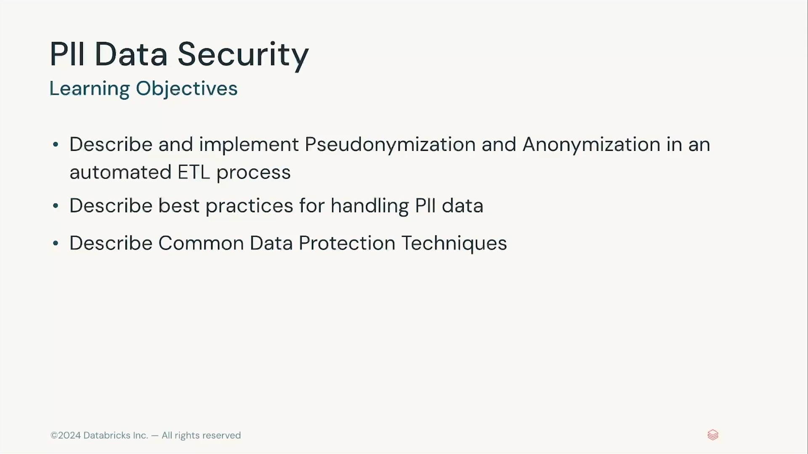

# Lección 12: Section Introduction – PII Data Security

**Curso:** Databricks Data Privacy (ID: 3767)  
**Sección:** PII Data Security (Sección 3)  
**Lección:** Section Introduction (Lesson ID: 34602)  
**Formato:** Video Conferencia (27 segundos)  
**Estado:** Completado 100%  
**Autor:** Databricks Academy  

---

## 1. Visión General de la Sección 3

La Sección 3 del curso aborda de manera integral la **Seguridad de Datos de Información de Identificación Personal (PII - *Personally Identifiable Information*)** dentro de la plataforma Databricks Lakehouse. 

En los pipelines modernos de ingeniería de datos, el cumplimiento estricto de marcos normativos como **GDPR**, **CCPA/CPRA** y **HIPAA** exige la adopción de técnicas sistemáticas de preservación de la privacidad que impidan la exposición innecesaria de datos sensibles a usuarios y cargas analíticas, al mismo tiempo que preservan el valor analítico para el negocio.

---

## 2. Objetivos de Aprendizaje (*Learning Objectives*)

Los objetivos pedagógicos y técnicos definidos para esta sección son:

1. **Describir e implementar Seudonimización y Anonimización** en un proceso ETL automatizado (*Describe and implement Pseudonymization and Anonymization in an automated ETL process*).
2. **Describir mejores prácticas** para el tratamiento y gobierno de datos PII (*Describe best practices for handling PII data*).
3. **Describir técnicas comunes de protección de datos** (*Describe Common Data Protection Techniques*).

---

## 3. Estructura y Contenido de la Sección 3

La sección se articula en cuatro módulos fundamentales:

1. **Section Introduction (Lección 12):** Encuadre conceptual y objetivos de seguridad de datos PII.
2. **Pseudonymization and Anonymization (Lección 13):** Conceptos clave, diferencias técnicas entre seudonimización (reversible con clave separada) y anonimización (irreversible), técnicas criptográficas (hashing con sal, encriptación determinista y probabilística, tokenización) y generalización/perturbación de datos.
3. **Summary and Best Practices (Lección 14):** Principios de minimización de datos, segregación de almacenamiento, administración de claves criptográficas y matrices de control de acceso.
4. **Demo: PII Data Security (Lección 15):** Laboratorio práctico de implementación en Databricks aplicando funciones criptográficas y pipelines de anonimización/seudonimización en Delta Lake.
