# Lección 13: Pseudonymization & Anonymization

**Curso:** Databricks Data Privacy  
**Sección:** PII Data Security  
**Formato:** Slides & Lecture Transcripts (12 Diapositivas)  
**Estado:** Completado 100%  

---

## 1. Visión General de la Lección y Objetivos

Esta lección aborda las dos estrategias fundamentales de modelado y transformación de datos para la protección de Información de Identificación Personal (**PII**):
1. **Seudonimización (*Pseudonymization*):** Protección a nivel de registro que sustituye identificadores directos por identificadores artificiales (seudónimos), permitiendo unir (*join*) datasets y entrenar modelos analíticos sin revelar los valores PII en texto plano. Sigue considerándose PII bajo normativas como GDPR debido a que la re-identificación es técnicamente viable.
2. **Anonimización (*Anonymization*):** Protección aplicada a nivel de dataset completo mediante transformaciones irreversibles y no enlazables, diseñada principalmente para análisis estadístico, inteligencia de negocios (BI) y machine learning donde las identidades individuales carecen de relevancia.

---

## 2. Diapositivas y Transcripciones Verbatim

### Slide 1: Portada
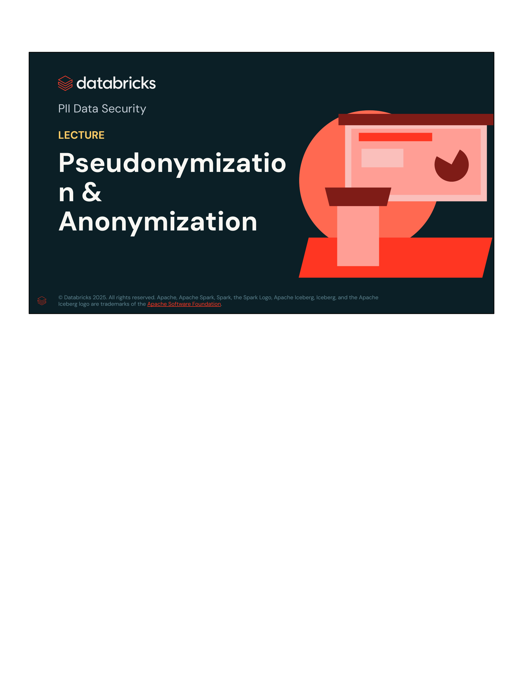

- **Título:** PII Data Security
- **Subtítulo:** LECTURE: Pseudonymization & Anonymization
- **Organización:** Databricks Academy

---

### Slide 2: Two Main Modeling Approaches
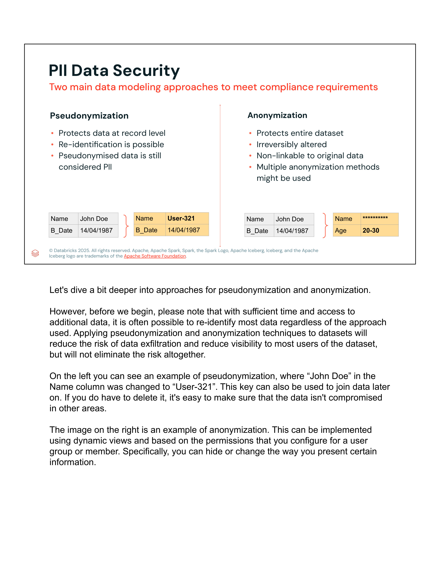

#### Contenido de la Diapositiva
- **Pseudonymization:**
  - Record-level protection
  - Re-identification possible
  - Considered PII under GDPR
- **Anonymization:**
  - Protects entire dataset
  - Irreversibly altered
  - Non-linkable
  - Multiple techniques combined

#### Transcripción Oficial del Instructor (Verbatim)
> *"There are two main modeling approaches used to secure PII: pseudonymization and anonymization. Pseudonymization protects data at the record level. However, re-identification of individuals is still possible, and this data is still considered PII under GDPR.*
>
> *Anonymization, on the other hand, protects the entire dataset so that data is irreversibly altered and non-linkable. Generally, multiple techniques are combined to ensure anonymization."*

---

### Slide 3: Pseudonymization Overview
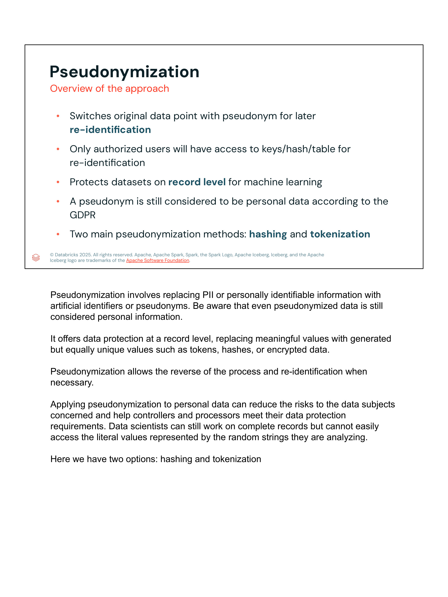

#### Contenido de la Diapositiva
- **Replace PII with artificial identifiers, or pseudonyms**
  - Hashing
  - Tokens
  - Encryption
- **Allows data to be used in joins or for training ML models**
- **Protects against revealing PII in plain text**
- **Two main methods:**
  - Hashing
  - Tokenization

#### Transcripción Oficial del Instructor (Verbatim)
> *"Pseudonymization replaces PII with artificial identifiers, or pseudonyms, such as hashes, tokens, or encryption. This technique allows data to be used in joins or for training machine learning models while protecting against revealing PII in plain text.*
>
> *The two main methods of pseudonymization are hashing and tokenization."*

---

### Slide 4: Pseudonymization Method: Hashing
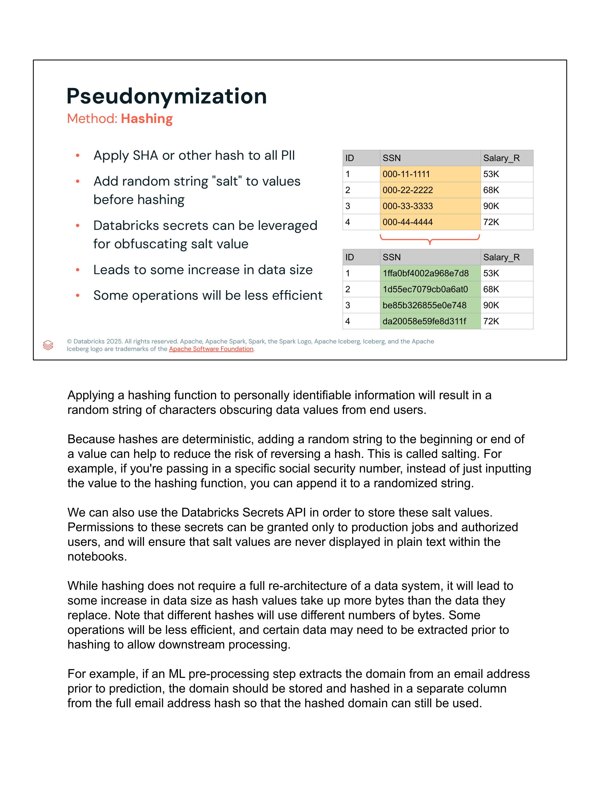

#### Contenido de la Diapositiva
- **Apply hash functions (SHA, etc.) to PII**
- **Add random "salt" before hashing**
  - Prevents rainbow table attacks and reverse lookup
  - Store salt securely using Databricks Secrets API
- **Trade-offs:**
  - Increases data size
  - Causes potential query overhead

#### Transcripción Oficial del Instructor (Verbatim)
> *"Hashing applies hash functions like SHA to PII. A critical component of this process is adding a random salt before hashing. This prevents rainbow table attacks and reverse lookups, ensuring that someone cannot simply guess the original value from the hash.*
>
> *The salt should be stored securely, such as with the Databricks Secrets API. While effective, hashing can increase data size and cause potential query overhead, which should be considered when designing your data pipeline."*

---

### Slide 5: Pseudonymization Method: Tokenization
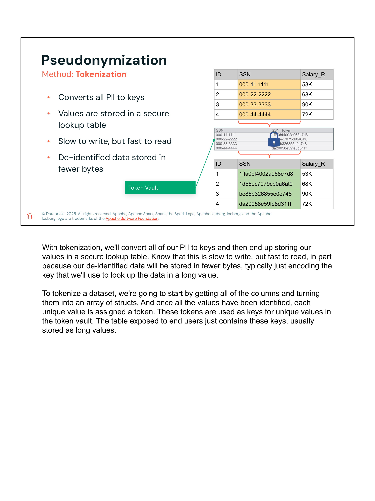

#### Contenido de la Diapositiva
- **Replace PII with keys referencing a secure Token Vault (lookup table)**
- **Trade-offs:**
  - Slower write time
  - Fast read time
  - Byte-efficient (typically `BIGINT`/`LONG`)

#### Transcripción Oficial del Instructor (Verbatim)
> *"Tokenization replaces PII with keys that reference a secure token vault, which is essentially a protected lookup table. This approach has different trade-offs compared to hashing:*
>
> *Writing data is slower because you must insert into and query the vault, but reading data is very fast, and it is byte-efficient, typically represented as a BIGINT or LONG in your tables."*

---

### Slide 6: Anonymization Overview
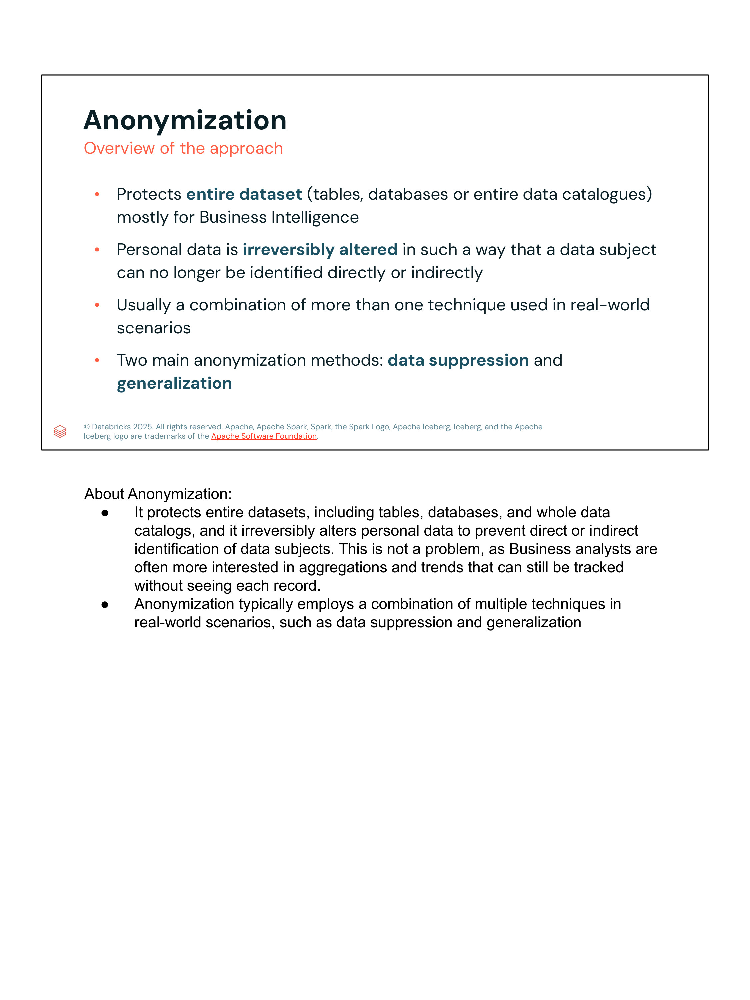

#### Contenido de la Diapositiva
- **Protects entire datasets**
- **Irreversibly altered**
- **Non-linkable**
- **Primarily used for BI and analytics where individual identities are irrelevant**
- **Two main methods:**
  - Data Suppression
  - Generalization

#### Transcripción Oficial del Instructor (Verbatim)
> *"Anonymization protects entire datasets by irreversibly altering data so that it cannot be linked back to individuals. This is primarily used for BI and analytics reporting where individual identities are irrelevant.*
>
> *The two main methods of anonymization are data suppression and generalization."*

---

### Slide 7: Anonymization Method: Data Suppression
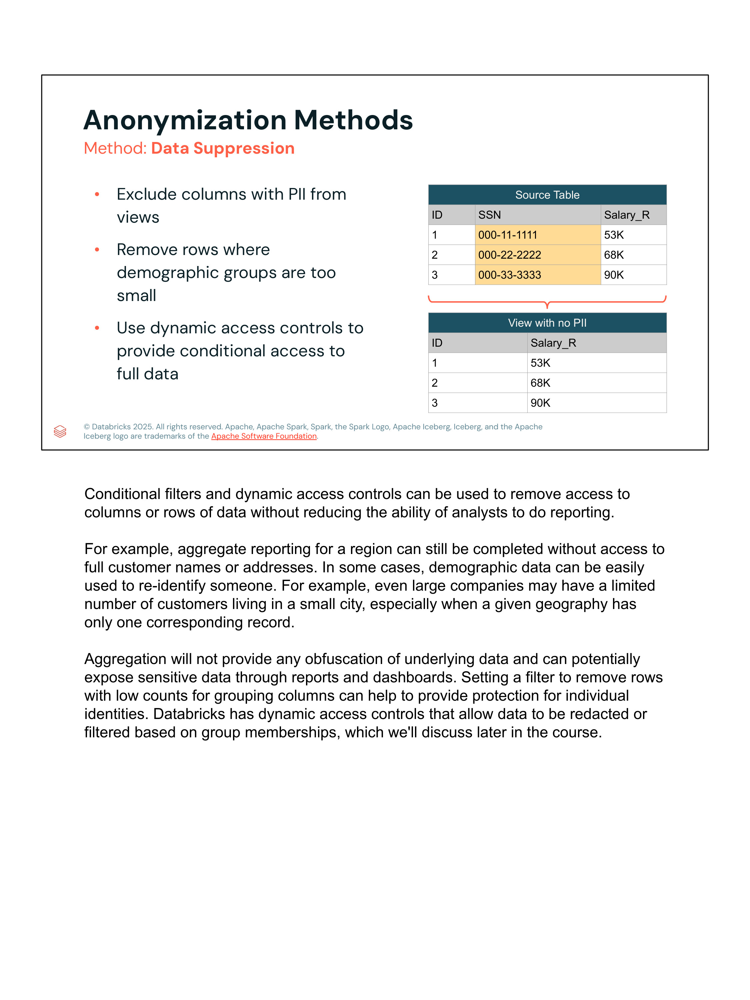

#### Contenido de la Diapositiva
- **Exclude PII columns from views**
- **Remove rows where demographic or cohort groups are too small to prevent re-identification**
- **Use dynamic access controls (Row Filters & Column Masks)**

#### Transcripción Oficial del Instructor (Verbatim)
> *"Data suppression involves excluding PII columns from views or queries and removing rows where demographic or cohort groups are too small, preventing re-identification through process of elimination.*
>
> *Dynamic access controls, such as row filters and column masks in Unity Catalog, make it straightforward to implement data suppression based on user roles and permissions."*

---

### Slide 8: Anonymization Method: Generalization
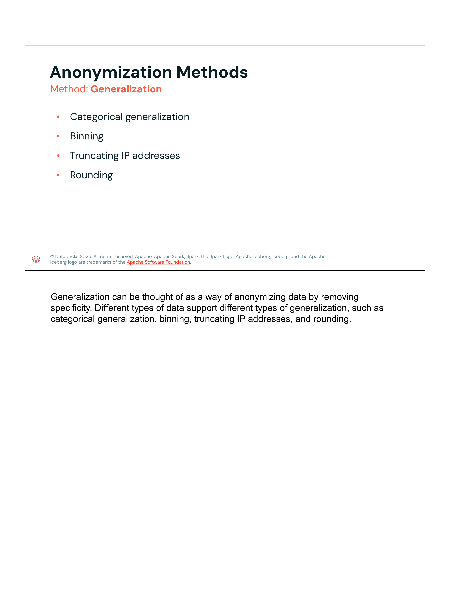

#### Contenido de la Diapositiva
- **Categorical generalization**
- **Binning**
- **Truncating IP addresses**
- **Rounding**

#### Transcripción Oficial del Instructor (Verbatim)
> *"Generalization can be thought of as a way of anonymizing data by removing specificity. Different types of data support different types of generalization, such as categorical generalization, binning, truncating IP addresses, and rounding."*

---

### Slide 9: Generalization: Categorical Generalization
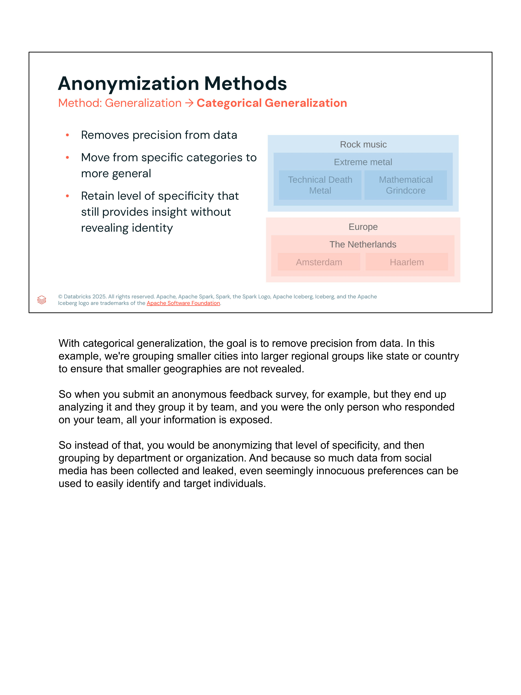

#### Contenido de la Diapositiva
- **Removes precision from data**
- **Move from specific categories to more general**
  - *Ejemplo Musical:* Technical Death Metal / Mathematical Grindcore $\rightarrow$ Extreme metal $\rightarrow$ Rock music
  - *Ejemplo Geográfico:* Amsterdam / Haarlem $\rightarrow$ The Netherlands $\rightarrow$ Europe
- **Retain level of specificity that still provides insight without revealing identity**

#### Transcripción Oficial del Instructor (Verbatim)
> *"With categorical generalization, the goal is to remove precision from data. In this example, we're grouping smaller cities into larger regional groups like state or country to ensure that smaller geographies are not revealed.*
>
> *So when you submit an anonymous feedback survey, for example, but they end up analyzing it and they group it by team, and you were the only person who responded on your team, all your information is exposed.*
>
> *So instead of that, you would be anonymizing that level of specificity, and then grouping by department or organization. And because so much data from social media has been collected and leaked, even seemingly innocuous preferences can be used to easily identify and target individuals."*

---

### Slide 10: Generalization: Binning
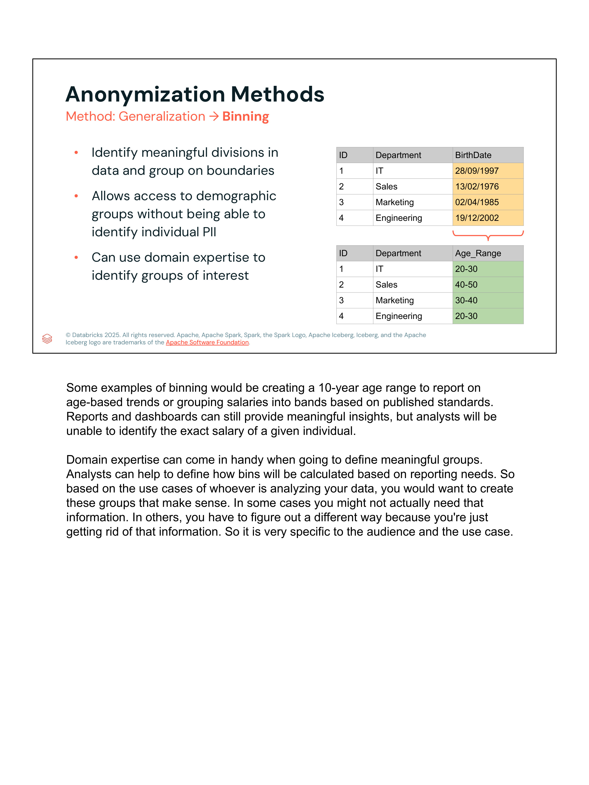

#### Contenido de la Diapositiva
- **Identify meaningful divisions in data and group on boundaries**
- **Allows access to demographic groups without being able to identify individual PII**
- **Can use domain expertise to identify groups of interest**

| ID | Department | BirthDate (Raw PII) | ID | Department | Age_Range (Binned) |
|---|---|---|---|---|---|
| 1 | IT | 28/09/1997 | 1 | IT | 20-30 |
| 2 | Sales | 13/02/1976 | 2 | Sales | 40-50 |
| 3 | Marketing | 02/04/1985 | 3 | Marketing | 30-40 |
| 4 | Engineering | 19/12/2002 | 4 | Engineering | 20-30 |

#### Transcripción Oficial del Instructor (Verbatim)
> *"Some examples of binning would be creating a 10-year age range to report on age-based trends or grouping salaries into bands based on published standards. Reports and dashboards can still provide meaningful insights, but analysts will be unable to identify the exact salary of a given individual.*
>
> *Domain expertise can come in handy when going to define meaningful groups. Analysts can help to define how bins will be calculated based on reporting needs. So based on the use cases of whoever is analyzing your data, you would want to create these groups that make sense. In some cases you might not actually need that information. In others, you have to figure out a different way because you're just getting rid of that information. So it is very specific to the audience and the use case."*

---

### Slide 11: Generalization: Truncating IP Addresses
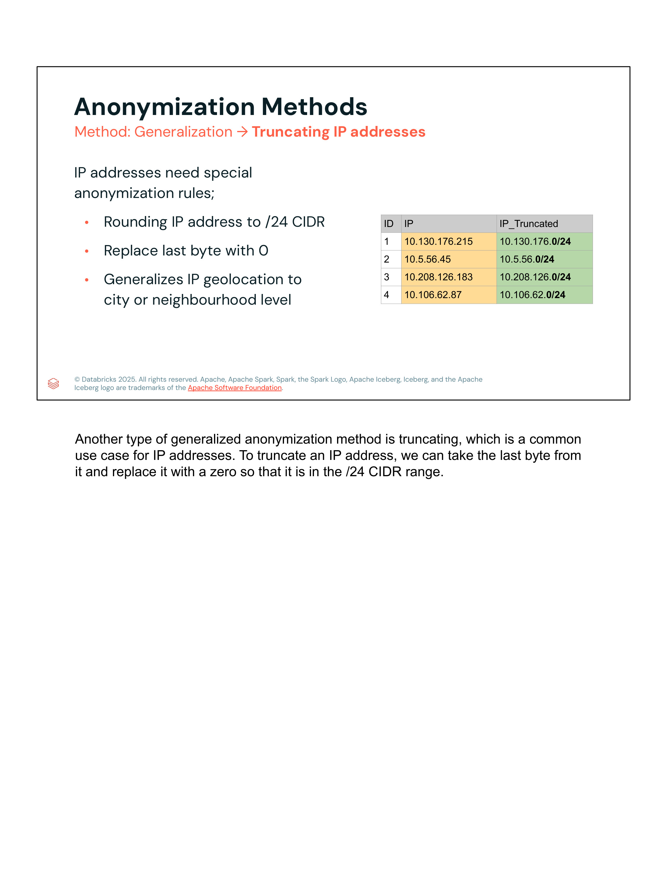

#### Contenido de la Diapositiva
- **IP addresses need special anonymization rules**
- **Rounding IP address to `/24` CIDR**
- **Replace last byte with 0**
- **Generalizes IP geolocation to city or neighbourhood level**

| ID | Raw IP Address | IP_Truncated (`/24` CIDR) |
|---|---|---|
| 1 | `10.130.176.215` | `10.130.176.0/24` |
| 2 | `10.5.56.45` | `10.5.56.0/24` |
| 3 | `10.208.126.183` | `10.208.126.0/24` |
| 4 | `10.106.62.87` | `10.106.62.0/24` |

#### Transcripción Oficial del Instructor (Verbatim)
> *"Another type of generalized anonymization method is truncating, which is a common use case for IP addresses. To truncate an IP address, we can take the last byte from it and replace it with a zero so that it is in the /24 CIDR range."*

---

### Slide 12: Generalization: Rounding
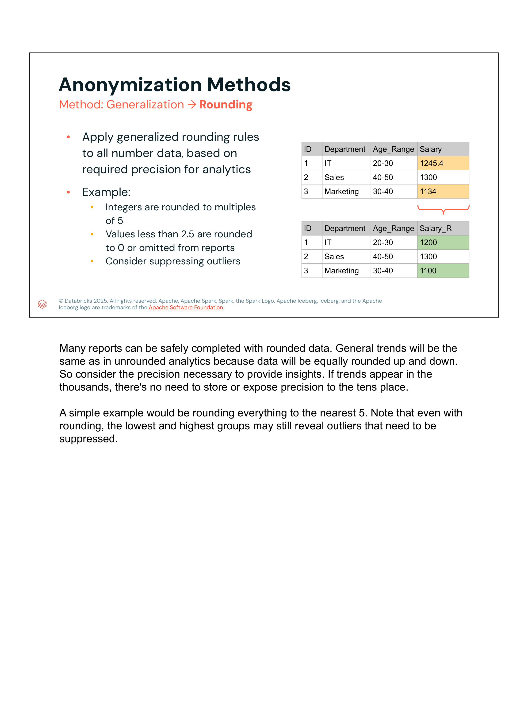

#### Contenido de la Diapositiva
- **Apply generalized rounding rules to all number data, based on required precision for analytics**
- **Example:**
  - Integers are rounded to multiples of 5
  - Values less than 2.5 are rounded to 0 or omitted from reports
  - Consider suppressing outliers

| ID | Department | Age_Range | Raw Salary | ID | Department | Age_Range | Salary_R (Rounded) |
|---|---|---|---|---|---|---|---|
| 1 | IT | 20-30 | 1245.4 | 1 | IT | 20-30 | 1200 |
| 2 | Sales | 40-50 | 1300 | 2 | Sales | 40-50 | 1300 |
| 3 | Marketing | 30-40 | 1134 | 3 | Marketing | 30-40 | 1100 |

#### Transcripción Oficial del Instructor (Verbatim)
> *"Many reports can be safely completed with rounded data. General trends will be the same as in unrounded analytics because data will be equally rounded up and down. So consider the precision necessary to provide insights. If trends appear in the thousands, there's no need to store or expose precision to the tens place.*
>
> *A simple example would be rounding everything to the nearest 5. Note that even with rounding, the lowest and highest groups may still reveal outliers that need to be suppressed."*

---

## 3. Matriz Arquitectónica Comparativa

| Criterio | Seudonimización (*Pseudonymization*) | Anonimización (*Anonymization*) |
|---|---|---|
| **Nivel de Aplicación** | Registro individual (*Record-level*) | Dataset completo (*Entire dataset*) |
| **Reversibilidad** | Reversible con clave / tabla de mapeo | Irreversible y no enlazable |
| **Estatus Legal (GDPR)** | Sigue considerándose PII | Fuera del alcance regulatorio de PII |
| **Casos de Uso Primarios** | Cruces relacionales (`JOIN`), ML supervisado, pipelines operacionales | Reportes de BI, métricas agregadas, dashboards demográficos |
| **Métodos Principales** | Hashing (con Salt) y Tokenización (Token Vault) | Supresión de Datos y Generalización |
| **Técnicas de Generalización** | N/A | Categórica, Binning (rangos), Truncamiento IP `/24`, Redondeo numérico |
| **Puntos Críticos de Seguridad** | Almacenar sales y secretos en Databricks Secrets API | Suprimir valores atípicos (*outliers*) o tamaños de muestra pequeños |
