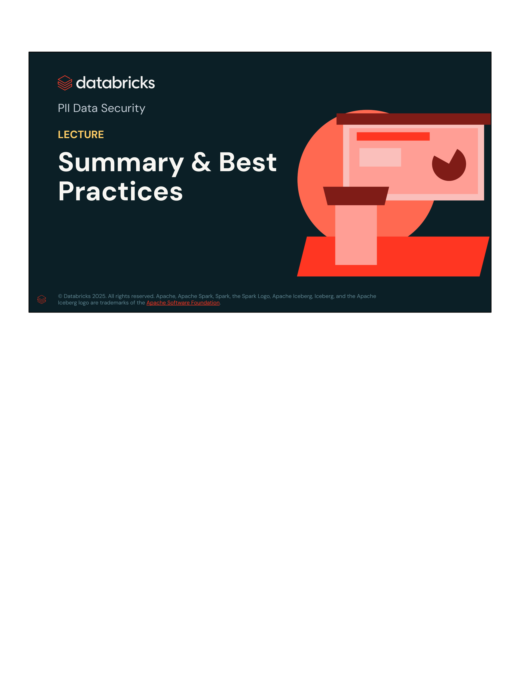
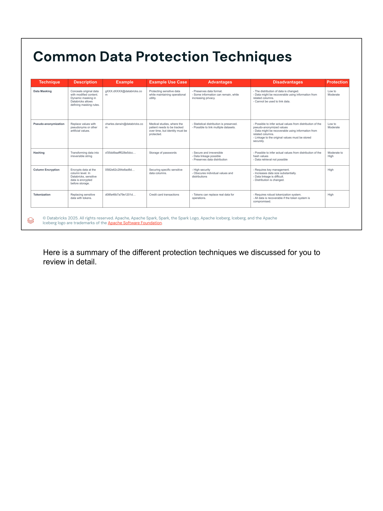
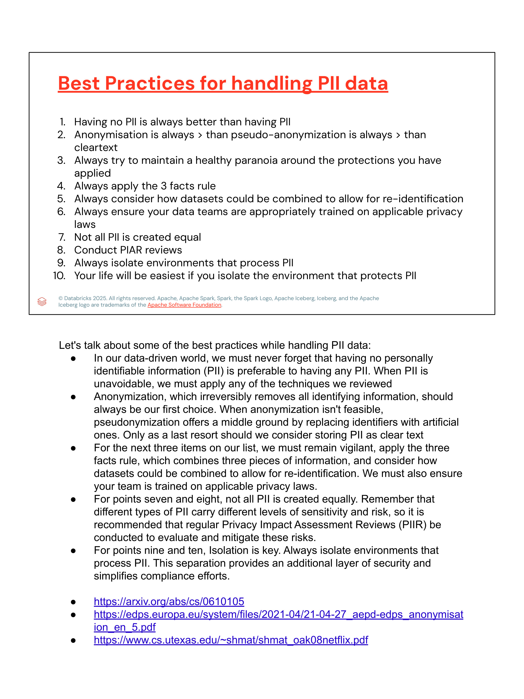
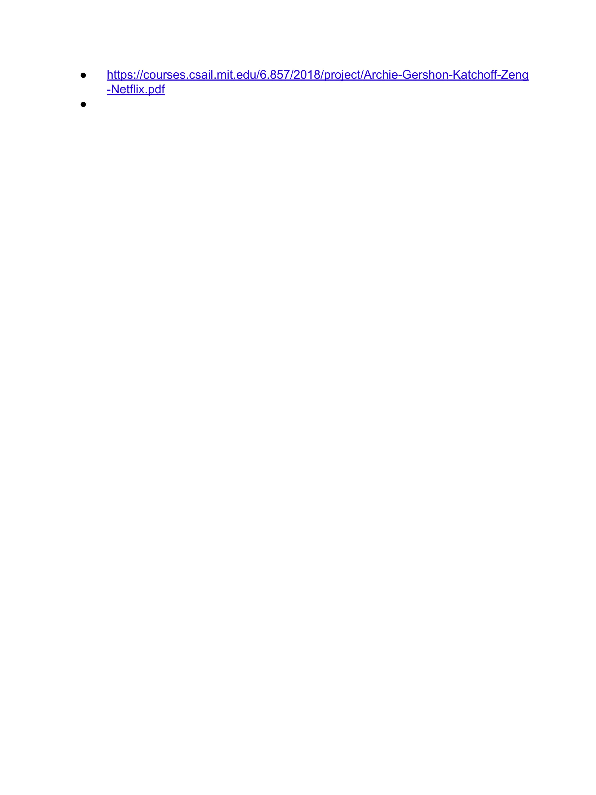

# Lección 14: Summary & Best Practices

**Curso:** Databricks Data Privacy  
**Sección:** PII Data Security  
**Formato:** Slides & Lecture Transcripts (4 Diapositivas)  
**Estado:** Completado 100%  

---

## 1. Visión General de la Lección y Objetivos

Esta lección sintetiza las técnicas de protección de datos examinadas a lo largo de la sección de seguridad de PII, comparando ventajas, desventajas, niveles de protección y casos de uso de cada método. Asimismo, establece el **Decálogo de Mejores Prácticas de Ingeniería para el Tratamiento de PII**, destacando el principio de mínima exposición, la regla de los tres hechos, la evaluación de impacto en privacidad (**PIAR**) y el aislamiento arquitectónico de entornos.

---

## 2. Diapositivas y Transcripciones Verbatim

### Slide 1: Portada

- **Título:** PII Data Security
- **Subtítulo:** LECTURE: Summary & Best Practices
- **Organización:** Databricks Academy

---

### Slide 2: Common Data Protection Techniques (Tabla Comparativa)

#### Matriz de Técnicas de Protección

| Técnica | Descripción | Ejemplo | Caso de Uso Típico | Ventajas | Desventajas | Nivel de Protección |
|---|---|---|---|---|---|---|
| **Data Masking** | Oculta el contenido original con datos modificados. El enmascaramiento dinámico en Databricks permite definir reglas de enmascaramiento (*Dynamic Masking Rules*). | `gXXX.dXXXX@databricks.com` | Proteger datos confidenciales manteniendo la utilidad operativa. | - Preserva el formato original de los datos. - Permite conservar cierta información aumentando la privacidad. | - Se altera la distribución estadística. - Los datos podrían reconstruirse usando información de columnas relacionadas. - No puede usarse para enlazar datos. | **Low to Moderate** |
| **Pseudo-anonymization** | Sustituye valores con seudónimos u otros valores artificiales. | `charles.darwin@databricks.com` | Estudios médicos donde se requiere rastrear al paciente a lo largo del tiempo sin exponer su identidad. | - Se preserva la distribución estadística. - Es posible unir (*link*) múltiples datasets. | - Es posible inferir valores reales analizando la distribución de valores seudonimizados. - Los datos podrían deducirse mediante correlación con columnas relacionadas. - La tabla de enlace a los valores originales debe almacenarse de forma ultra-segura. | **Low to Moderate** |
| **Hashing** | Transforma el dato en una cadena alfanumérica unidireccional e irreversible. | `cf35dd9aaff028e5dcc...` | Almacenamiento seguro de contraseñas o identificadores de cruce. | - Seguro e irreversible. - Permite vinculación (*data linkage* / joins). - Preserva la distribución de los datos. | - Posible inferir valores reales a partir de la distribución de los hashes (ataques de frecuencia). - La recuperación del dato original no es posible. | **Moderate to High** |
| **Column Encryption** | Cifra los datos a nivel de columna antes de almacenarlos en el storage. | `0582e62c284e8ad8d...` | Protección de columnas de alta criticidad (números de cuenta, tarjetas, historiales). | - Máxima seguridad criptográfica. - Oculta valores individuales y altera distribuciones para evitar inferencia. | - Requiere gestión robusta de claves (*Key Management* / KMS). - Incrementa sustancialmente el tamaño de los datos. - Los cruces relacionales (*data linkage*) se dificultan notablemente. | **High** |
| **Tokenization** | Reemplaza datos sensibles con tokens (claves que apuntan a un Token Vault seguro). | `d08fa46b7a79e1201d...` | Transacciones y almacenamiento de tarjetas de crédito (cumplimiento PCI-DSS). | - Los tokens pueden sustituir datos reales para operaciones y pipelines de negocio. | - Requiere un sistema de tokenización y bóveda robusto. - Todos los datos quedan expuestos si la bóveda de tokens se ve comprometida. | **High** |

#### Transcripción Oficial del Instructor (Verbatim)
> *"Here is a summary of the different protection techniques we discussed for you to review in detail."*

---

### Slide 3: Best Practices for Handling PII Data (Decálogo de Mejores Prácticas)

#### Los 10 Principios y Reglas Maestras
1. **Having no PII is always better than having PII:** La mejor estrategia para proteger datos sensibles es no almacenarlos si no aportan un valor indispensable al negocio.
2. **Anonymisation is always > than pseudo-anonymization is always > than cleartext:** Jerarquía estricta de mitigación: Anonimización > Seudonimización > Texto claro.
3. **Always try to maintain a healthy paranoia around the protections you have applied:** Nunca asumir que una técnica aislada es infalible frente a ataques de correlación.
4. **Always apply the 3 facts rule:** Tres datos no identificables por separado (ej. código postal, fecha de nacimiento, género) pueden identificar inequívocamente al 87% de la población.
5. **Always consider how datasets could be combined to allow for re-identification:** Evaluar el riesgo de unión (*linkage attacks*) con fuentes públicas o externas.
6. **Always ensure your data teams are appropriately trained on applicable privacy laws:** Capacitación continua del equipo de ingeniería en GDPR, CCPA, HIPAA, etc.
7. **Not all PII is created equal:** Clasificar la sensibilidad de los datos por capas de riesgo (datos identificadores directos vs indirectos vs datos altamente protegidos).
8. **Conduct PIAR reviews:** Ejecutar periódicamente revisiones de evaluación de impacto en la privacidad (*Privacy Impact Assessment Reviews*).
9. **Always isolate environments that process PII:** Aislar a nivel de red, almacenamiento y catálogos los entornos donde se procesa PII.
10. **Your life will be easiest if you isolate the environment that protects PII:** La arquitectura es drásticamente más gobernable si los componentes que protegen y des-identifican PII están confinados y auditados en un enclave seguro.

#### Transcripción Oficial del Instructor (Verbatim)
> *"Let's talk about some of the best practices while handling PII data:*
>
> *In our data-driven world, we must never forget that having no personally identifiable information (PII) is preferable to having any PII. When PII is unavoidable, we must apply any of the techniques we reviewed.*
>
> *Anonymization, which irreversibly removes all identifying information, should always be our first choice. When anonymization isn't feasible, pseudonymization offers a middle ground by replacing identifiers with artificial ones. Only as a last resort should we consider storing PII as clear text.*
>
> *For the next three items on our list, we must remain vigilant, apply the three facts rule, which combines three pieces of information, and consider how datasets could be combined to allow for re-identification. We must also ensure your team is trained on applicable privacy laws.*
>
> *For points seven and eight, not all PII is created equally. Remember that different types of PII carry different levels of sensitivity and risk, so it is recommended that regular Privacy Impact Assessment Reviews (PIAR) be conducted to evaluate and mitigate these risks.*
>
> *For points nine and ten, Isolation is key. Always isolate environments that process PII. This separation provides an additional layer of security and simplifies compliance efforts."*

---

### Slide 4: Referencias Fundacionales e Investigaciones Académicas

La lección referencia los siguientes estudios pioneros sobre des-anonimización y privacidad diferencial:

1. **Differential Privacy & k-Anonymity Foundations:**  
   [ArXiv CS/0610105: Work on Privacy and Data Linkage](https://arxiv.org/abs/cs/0610105)
2. **Directrices Europeas de Anonimización (EDPS / AEPD):**  
   [EDPS Guidelines on Anonymisation Techniques](https://edps.europa.eu/system/files/2021-04/21-04-27_aepd-edps_anonymisation_en_5.pdf)
3. **Estudio Canónico del Ataque al Netflix Prize Dataset (Narayanan & Shmatikov, Univ. of Texas at Austin):**  
   [Robust De-anonymization of Large Sparse Datasets](https://www.cs.utexas.edu/~shmat/shmat_oak08netflix.pdf)  
   *Demostró cómo un atacante con información auxiliar mínima sobre valoraciones de películas en IMDb pudo des-anonimizar a usuarios dentro de un dataset de 500,000 registros supuestamente anonimizado por Netflix.*
4. **Estudio MIT CSAIL sobre Des-anonimización de Datos Netflix:**  
   [MIT CSAIL 6.857 Research: De-anonymizing Netflix Data](https://courses.csail.mit.edu/6.857/2018/project/Archie-Gershon-Katchoff-Zeng-Netflix.pdf)
