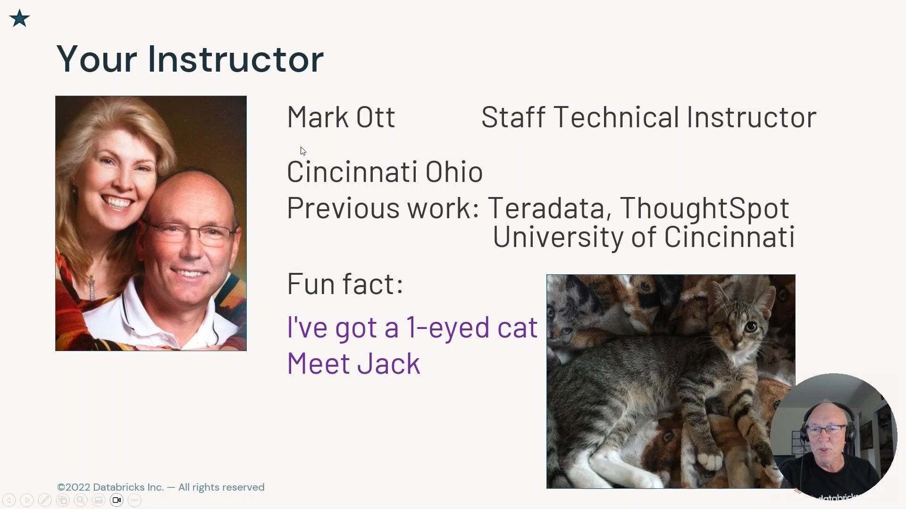
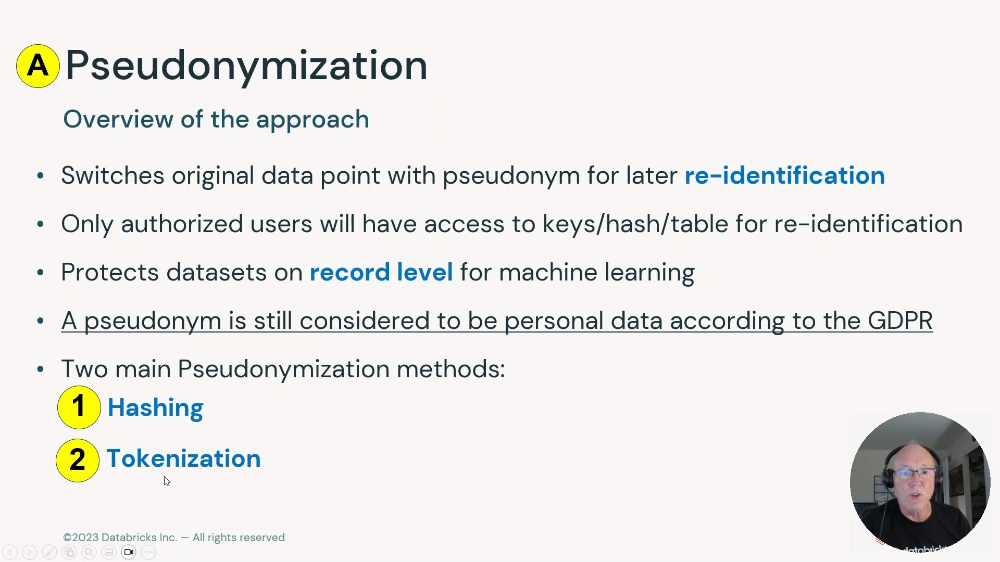
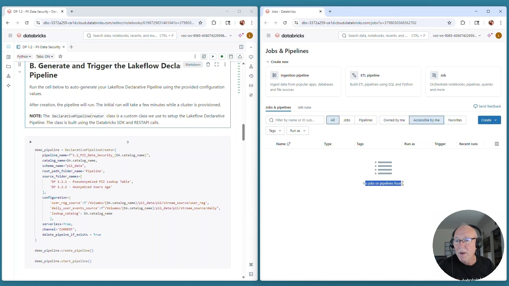
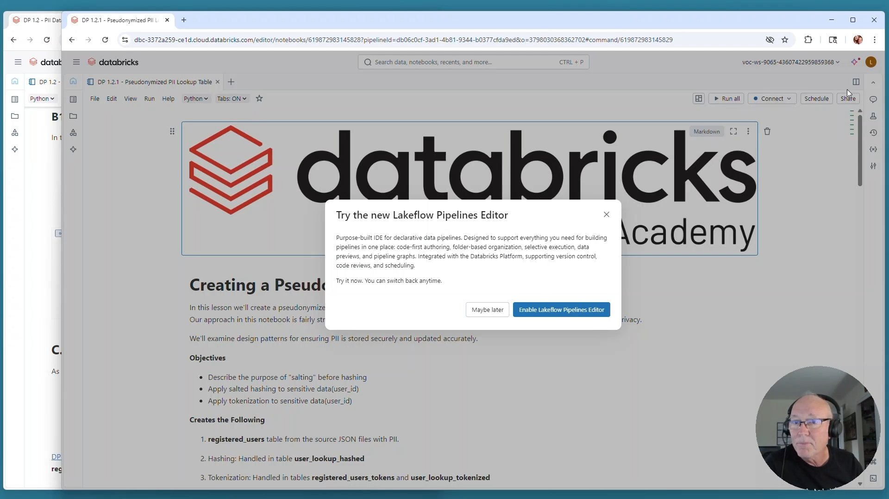
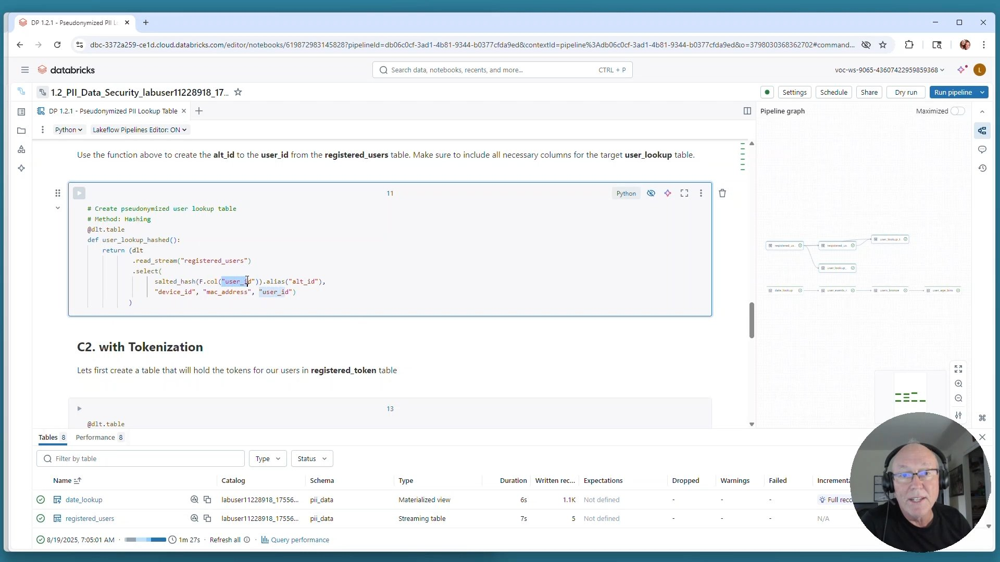
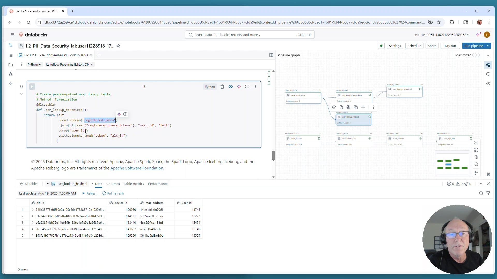
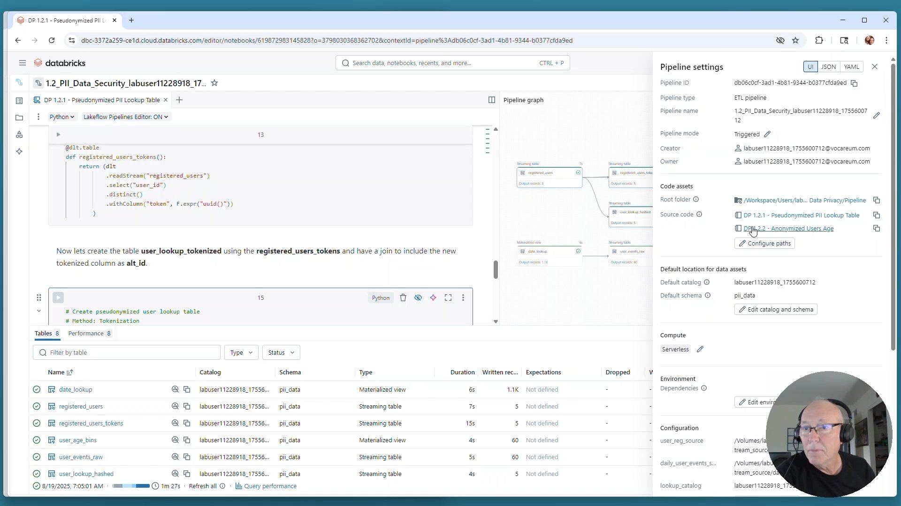
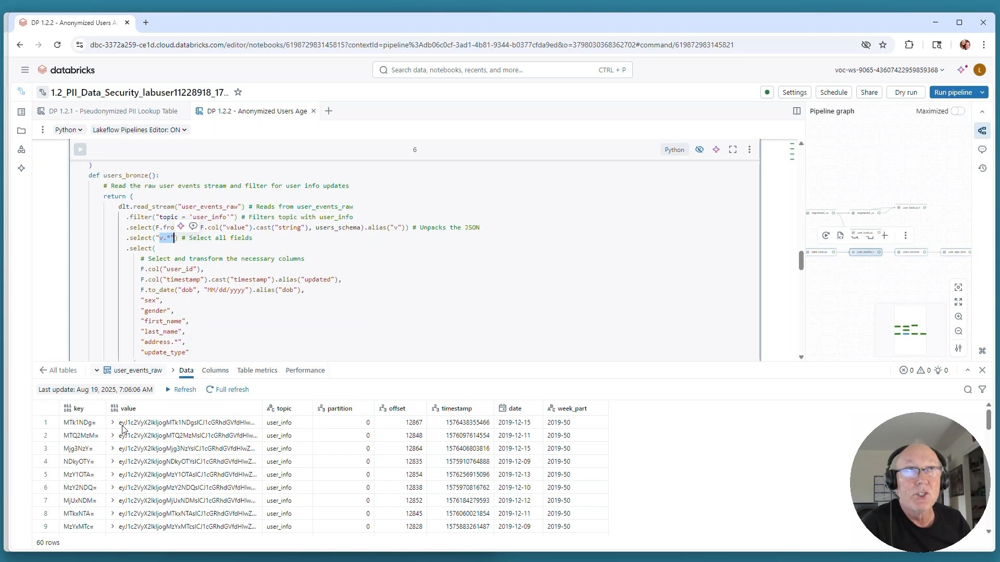
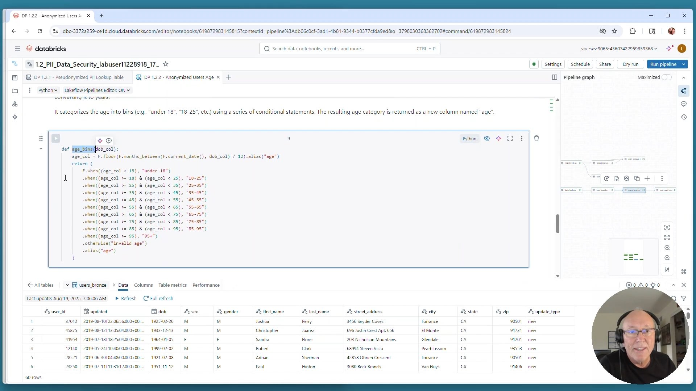
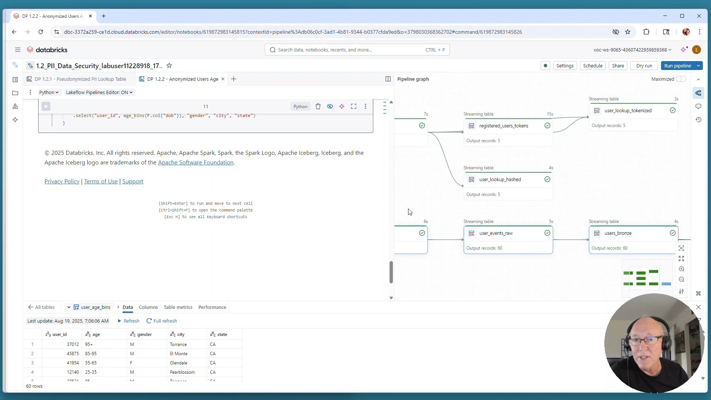

# Lección 15: Demo: PII Data Security (DP 1.2)

**Curso:** Databricks Data Privacy (ID: 3767)  
**Sección:** Section 3: PII Data Security  
**Lección:** Demo: PII Data Security (Lesson ID: 34609)  
**Notebooks del Pipeline:**
- Driver: `DP 1.2 - PII Data Security`
- Notebook 1: `DP 1.2.1 - Pseudonymized PII Lookup Table`
- Notebook 2: `DP 1.2.2 - Anonymized Users Age`
**Duración del Video:** 18 min 34 s (1,114 segundos)  
**Instructor:** Mark Ott (Staff Technical Instructor, Databricks)  
**Tecnología:** Lakeflow Declarative Pipelines / Delta Live Tables (DLT) con Serverless Compute  
**Estado:** Completado 100%  

---

## 1. Visión General del Laboratorio y Objetivos Técnicos

En este laboratorio práctico de demostración técnica, se implementa una arquitectura completa de ingeniería de datos para la protección de PII utilizando **Lakeflow Declarative Pipelines (DLT)**. 

Se resuelven de forma práctica los dos desafíos clave de cumplimiento:
1. **Seudonimización de Identificadores:** Reemplazo seguro de identificadores de usuario (`user_id`) mediante dos patrones:
   - **Hashing con Salting:** Criptografía unidireccional con una clave aleatoria (*salt*) almacenada de forma segura para prevenir ataques de tablas arcoíris (*rainbow tables*).
   - **Tokenización con Bóveda de Tokens (*Token Vault*):** Sustitución por UUIDs aleatorios mapeados en una tabla de tokens aislada.
2. **Anonimización por Generalización (Binning):** Transformación de fechas de nacimiento exactas (`dob`) en rangos etarios demográficos (*age bins*) y supresión de direcciones postales directas.



---

## 2. Fundamentos de Seudonimización en Pipelines



### Principios Demostrados:
- Sustituye puntos de datos originales por seudónimos para permitir la **re-identificación controlada** únicamente por usuarios autorizados con acceso a las claves/tablas de mapeo.
- Protege los datasets a **nivel de registro** (*record-level*) para entrenamiento de modelos de Machine Learning y uniones analíticas (`JOIN`).
- Bajo **GDPR**, los datos seudonimizados siguen clasificándose legalmente como datos personales.
- Dos métodos implementados en el pipeline:
  1. **Hashing** (con Salting criptográfico).
  2. **Tokenization** (con tabla de bóveda de tokens).

---

## 3. Despliegue Automatizado del Pipeline con Lakeflow

El laboratorio inicia en el notebook `DP 1.2 - PII Data Security`, donde se utiliza la clase SDK `DeclarativePipelineCreator` para configurar y aprovisionar el pipeline declarativo de Lakeflow sobre **Serverless Compute**:



```python
# Generación y activación automática del pipeline Lakeflow Declarative
demo_pipeline = DeclarativePipelineCreator(
    pipeline_name=f"1.2_PII_Data_Security_{DA.catalog_name}",
    catalog_name=DA.catalog_name,
    schema_name="pii_data",
    root_path_folder_name="Pipeline",
    source_folder_names=[
        "DP 1.2.1 - Pseudonymized PII Lookup Table",
        "DP 1.2.2 - Anonymized Users Age"
    ],
    configuration={
        "user_reg_source": f"/Volumes/{DA.catalog_name}/pii_data/pii/stream_source/user_reg",
        "daily_user_events_source": f"/Volumes/{DA.catalog_name}/pii_data/pii/stream_source/daily",
        "lookup_catalog": DA.catalog_name
    },
    serverless=True,
    channel="CURRENT",
    delete_pipeline_if_exists=True
)

demo_pipeline.create_pipeline()
demo_pipeline.start_pipeline()
```

---

## 4. Patrón 1: Seudonimización con Hashing y Salting (`DP 1.2.1`)



### 4.1 Definición de la Función de Hashing con Salting
Para evitar que atacantes usen diccionarios precalculados (*rainbow tables*) para revertir los hashes de IDs comunes, se combina el valor original con un valor pseudo-aleatorio secreto (*salt*):

```python
import pyspark.sql.functions as F
import dlt

# La función salted_hash concatena el user_id con un salt secreto y calcula SHA-256
def salted_hash(col):
    salt = spark.conf.get("pipeline.salt", "DATABRICKS_ACADEMY_SECURE_SALT_2026")
    return F.sha2(F.concat(col.cast("string"), F.lit(salt)), 256)
```

### 4.2 Tabla de Búsqueda Seudonimizada con Hashing (`user_lookup_hashed`)



```python
# Creación de tabla streaming de lookup seudonimizada mediante Hashing
# Método: Hashing
@dlt.table
def user_lookup_hashed():
    return (dlt
        .read_stream("registered_users")
        .select(
            salted_hash(F.col("user_id")).alias("alt_id"),
            "device_id",
            "mac_address",
            "user_id"
        )
    )
```

---

## 5. Patrón 2: Seudonimización con Tokenización (`DP 1.2.1`)

La tokenización desacopla completamente el valor original de cualquier derivación matemática, generando identificadores únicos universales (UUIDs) en una tabla protegida conocida como **Token Vault**.



### 5.1 Creación de la Bóveda de Tokens (`registered_users_tokens`)
```python
# Creación de la bóveda de tokens (Token Vault) para cada usuario único
@dlt.table
def registered_users_tokens():
    return (dlt
        .read_stream("registered_users")
        .select("user_id")
        .distinct()
        .withColumn("token", F.expr("uuid()"))
    )
```

### 5.2 Creación de la Tabla de Búsqueda Tokenizada (`user_lookup_tokenized`)
```python
# Creación de la tabla de búsqueda seudonimizada mediante Tokenización
# Método: Tokenization
@dlt.table
def user_lookup_tokenized():
    return (dlt
        .read_stream("registered_users")
        .join(dlt.read("registered_users_tokens"), "user_id", "left")
        .drop("user_id")
        .withColumnRenamed("token", "alt_id")
    )
```

### 5.3 Comparación de Resultados en el Grafo del Pipeline


- `user_lookup_hashed`: Mantiene el `alt_id` como un hash SHA-256 de 64 caracteres hexadecimales (ej. `745c35775cfdf69e9a190c26a173285712c1929c5...`).
- `user_lookup_tokenized`: Mantiene el `alt_id` como un UUID (ej. `d08fa46b-7a79-4e12-801d-...`), eliminando el campo original `user_id` de la proyección.

---

## 6. Patrón 3: Anonimización por Generalización y Binning (`DP 1.2.2`)

En el segundo sub-notebook (`DP 1.2.2 - Anonymized Users Age`), se reciben eventos crudos de usuario en streaming (`user_events_raw`), que contienen datos demográficos altamente identificables en JSON.



### 6.1 Ingestión y Desempaquetado Bronze (`users_bronze`)
```python
@dlt.table
def users_bronze():
    # Lee el stream de eventos crudos y filtra por actualizaciones de información de usuario
    return (dlt
        .read_stream("user_events_raw")
        .filter("topic = 'user_info'")
        .select(F.from_json(F.col("value").cast("string"), users_schema).alias("v"))
        .select("v.*")
        .select(
            F.col("user_id"),
            F.col("timestamp").cast("timestamp").alias("updated"),
            F.to_date("dob", "MM/dd/yyyy").alias("dob"),
            "sex",
            "gender",
            "first_name",
            "last_name",
            "address.*",
            "update_type"
        )
    )
```

### 6.2 Función de Agrupación por Rangos Etarios (`age_bins`)



```python
def age_bins(dob_col):
    # Calcula la edad en años completos a partir de la fecha de nacimiento
    age_col = F.floor(F.months_between(F.current_date(), dob_col) / 12).alias("age")
    return (
        F.when(age_col < 18, "under 18")
        .when((age_col >= 18) & (age_col < 25), "18-25")
        .when((age_col >= 25) & (age_col < 35), "25-35")
        .when((age_col >= 35) & (age_col < 45), "35-45")
        .when((age_col >= 45) & (age_col < 55), "45-55")
        .when((age_col >= 55) & (age_col < 65), "55-65")
        .when((age_col >= 65) & (age_col < 75), "65-75")
        .when((age_col >= 75) & (age_col < 85), "75-85")
        .when((age_col >= 85) & (age_col < 95), "85-95")
        .when(age_col >= 95, "95+")
        .otherwise("invalid age")
        .alias("age")
    )
```

### 6.3 Tabla Anonimizada Final (`user_age_bins`)



```python
@dlt.table
def user_age_bins():
    return (dlt
        .read_stream("users_bronze")
        .select(
            "user_id",
            age_bins(F.col("dob")),
            "gender",
            "city",
            "state"
        )
    )
```

#### Inspección del Dataset Anonimizado (`user_age_bins`):
| user_id | age | gender | city | state |
|---|---|---|---|---|
| 37012 | 95+ | M | Torrance | CA |
| 45875 | 85-95 | M | El Monte | CA |
| 41954 | 55-65 | F | Glendale | CA |
| 12140 | 25-35 | M | Pearblossom | CA |
| 28521 | 95+ | M | Torrance | CA |

**Conclusión de Privacidad:**  
Se suprimen totalmente los identificadores directos (`first_name`, `last_name`, `street_address`, `zip`) y la fecha de nacimiento precisa (`dob`) se transforma en una categoría agregada (`age`), impidiendo la re-identificación del individuo en reportes analíticos de consumo público o interdepartamental.
