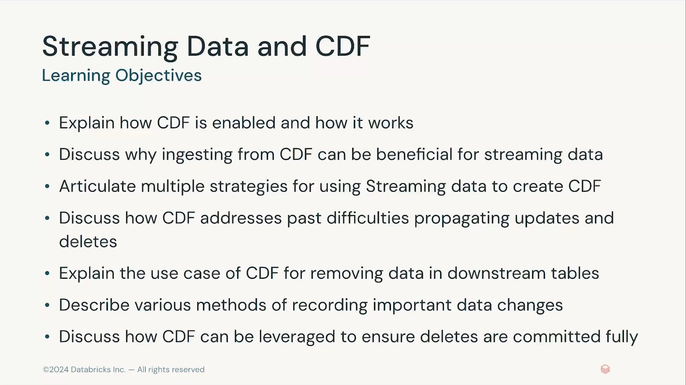
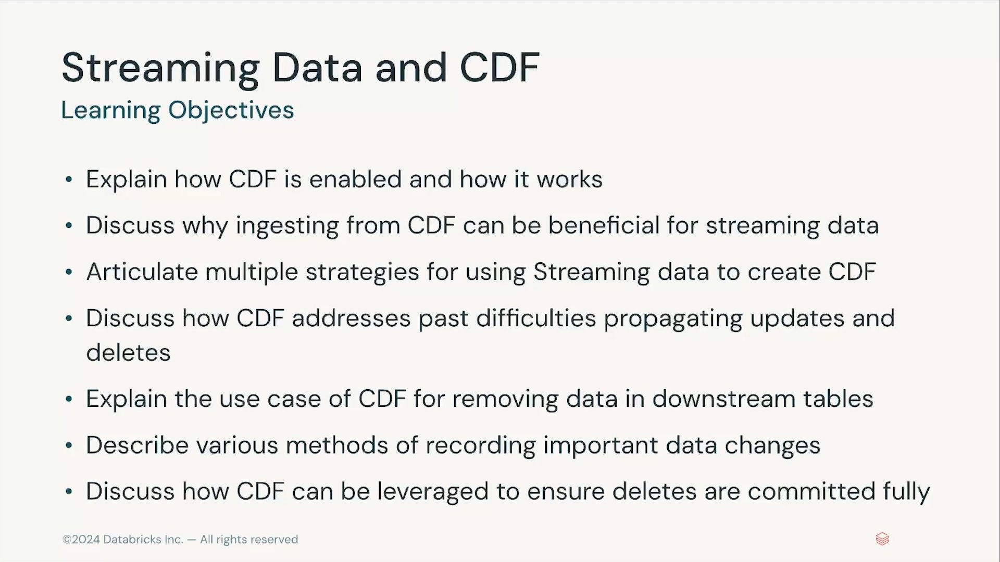

# Lección 16: Section Introduction – Streaming Data and CDF

**Curso:** Databricks Data Privacy (ID: 3767)  
**Sección:** Streaming Data and CDF (Sección 4)  
**Lección:** Section Introduction (Lesson ID: 34606)  
**Formato:** Video Conferencia (37.6 segundos)  
**Estado:** Completado 100%  
**Autor:** Databricks Academy  

---

## 1. Visión General de la Sección 4

La Sección 4 del curso se enfoca en el uso de **Streaming Data** y **Change Data Feed (CDF)** en Delta Lake para implementar arquitecturas de privacidad de datos robustas, reactivas y auditables.

En entornos analíticos y arquitecturas Lakehouse modernas (Medallion Architecture), los requisitos de privacidad como el **Derecho al Olvido (Right to be Forgotten - GDPR Art. 17)** y solicitudes de eliminación de datos de consumidores (**CCPA/CPRA Consumer Deletion Requests**) demandan que las operaciones de actualización (`UPDATE`), inserción (`INSERT`) y eliminación (`DELETE`) que ocurren en las capas Bronze/Silver se propaguen de manera eficiente, consistente y verificable hacia todas las tablas downstream (Gold, vistas materializadas y agregaciones analíticas).

Change Data Feed (CDF) de Delta Lake proporciona el mecanismo fundacional a nivel de almacenamiento y motor de ejecución para capturar automáticamente estos cambios fila por fila con metadatos de cambio (`_change_type`, `_commit_version`, `_commit_timestamp`), permitiendo a los pipelines de streaming procesar exclusivamente los registros modificados sin requerir recomputaciones completas (*full table scans* o reprocesamientos masivos).

---

## 2. Objetivos de Aprendizaje (*Learning Objectives*)

Al completar esta sección técnica, el ingeniero de datos estará capacitado para:

1. **Explicar cómo se habilita CDF y cómo opera internamente** (*Explain how CDF is enabled and how it works*):
   - Comprensión de las propiedades de tabla `delta.enableChangeDataFeed = true`.
   - Generación de archivos de cambio (`_change_data`) y lectura de operaciones directas en los archivos de datos Delta.
2. **Discutir por qué la ingesta desde CDF es beneficiosa para datos en streaming** (*Discuss why ingesting from CDF can be beneficial for streaming data*):
   - Procesamiento incremental de cambios a nivel de fila (*row-level CDC*).
   - Optimización de latencia y costo computacional en pipelines de streaming.
3. **Articular múltiples estrategias para usar datos en streaming en la creación de CDF** (*Articulate multiple strategies for using streaming data to create CDF*):
   - Ingesta continua con Auto Loader / Structured Streaming generando eventos que alimentan tablas habilitadas con CDF.
4. **Analizar cómo CDF resuelve dificultades históricas en la propagación de actualizaciones y eliminaciones** (*Discuss how CDF addresses past difficulties propagating updates and deletes*):
   - Superación de las limitaciones de Structured Streaming tradicional, el cual históricamente solo soportaba operaciones de solo anexado (*append-only*).
   - Manejo de mutaciones complejas (`UPDATE` y `DELETE`) a través de `readStream` con `readChangeFeed = true`.
5. **Explicar el caso de uso de CDF para la eliminación de datos en tablas downstream** (*Explain the use case of CDF for removing data in downstream tables*):
   - Detección de filas marcadas con `_change_type = 'delete'` o `_change_type = 'update_preimage'`.
   - Propagación automatizada de eliminaciones para cumplimiento normativo (GDPR / CCPA).
6. **Describir diversos métodos para registrar cambios de datos críticos** (*Describe various methods of recording important data changes*):
   - Tablas de auditoría histórica, pistas de trazabilidad y preservación de estados anteriores y posteriores.
7. **Discutir cómo se aprovecha CDF para garantizar que las eliminaciones se confirmen en su totalidad** (*Discuss how CDF can be leveraged to ensure deletes are committed fully*):
   - Verificación de consistencia transaccional y ejecución de `VACUUM` con retención para remoción física definitiva de archivos subyacentes.

---

## 3. Estructura de la Sección 4

La sección se divide en cuatro lecciones modulares de alta especialización:

1. **Section Introduction (Lección 16 - Lesson ID: 34606):** Encuadre de objetivos y motivación arquitectónica.
2. **Capturing Changed Data (Lección 17 - Lesson ID: 44505):** Fundamentos de Change Data Capture (CDC), activación y sintaxis de Delta Change Data Feed, metadatos enriquecidos (`_change_type`, pre-image, post-image) y patrones de consulta SQL/Python.
3. **Deleting Data in Databricks (Lección 18 - Lesson ID: 44506):** Técnicas de eliminación lógica vs. física, comandos `DELETE`, propagación en cascada mediante CDF, ejecución de `VACUUM` y auditoría de sanitización de almacenamiento en Unity Catalog.
4. **Demo: CDF Processing (Lección 19 - Lesson ID: 34608):** Laboratorio práctico guiado en notebook interactivo (`DP 1.3 - CDF Processing`), implementando Structured Streaming con CDF para propagar eliminaciones de PII a través de la arquitectura Medallion.
