# Lección 17: Capturing Changed Data

**Curso:** Databricks Data Privacy (ID: 3767)  
**Sección:** Streaming Data and CDF (Sección 4)  
**Lección:** Capturing Changed Data (Lesson ID: 44505)  
**Formato:** Slides & Lecture Transcripts (12 Diapositivas)  
**Estado:** Completado 100%  
**Autor:** Databricks Academy  

---

## 1. Visión General de la Lección y Objetivos

En esta lección técnica se examina a profundidad cómo **Delta Change Data Feed (CDF)** captura, procesa y entrega cambios de datos en tiempo real (streaming) y en lotes (batch), contrastándolo directamente con las arquitecturas tradicionales de **Change Data Capture (CDC)**.

Los objetivos clave cubiertos son:
1. Comprender la fricción fundamental entre las operaciones de mutación (`UPDATE`, `DELETE`) y el paradigma de procesamiento de solo anexado (*append-only*) en Spark Structured Streaming.
2. Analizar las soluciones de mitigación:
   - **Solución 1:** Ignorar cambios (`ignoreDeletes`, `skipChangeCommits`).
   - **Solución 2:** Habilitar y consumir Change Data Feed (CDF).
3. Conocer los beneficios y casos de uso arquitectónicos de CDF en la arquitectura Medallion.
4. Diferenciar las características clave entre CDF y CDC tradicional.
5. Desglosar el esquema de datos y metadatos generados por CDF (`_change_type`, `_commit_version`, `_commit_timestamp`, pre-image y post-image).
6. Entender los patrones de consumo en **Stream Mode** (micro-lotes continuos) vs. **Batch Mode** (ventanas temporales con marcas de agua / high watermarks).
7. Dominar la sintaxis de configuración SQL (`ALTER TABLE ... SET TBLPROPERTIES`) y la función de consulta `table_changes()`.

---

## 2. Diapositivas y Transcripciones Verbatim

### Slide 1: Portada
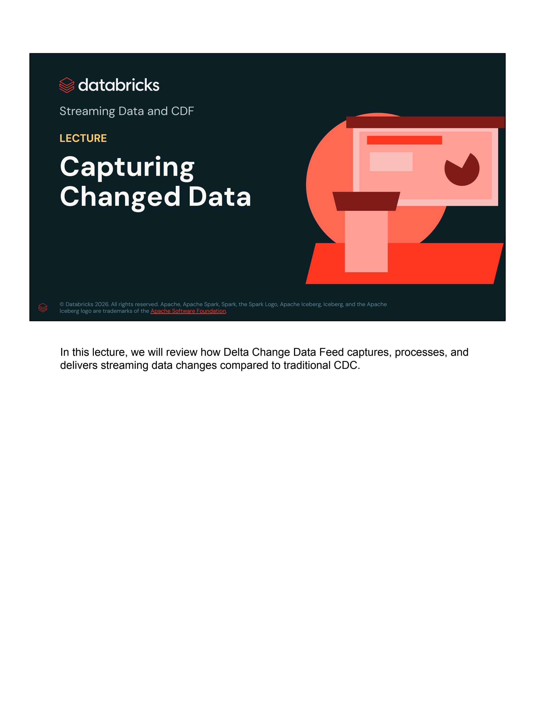

- **Organización:** Databricks Academy
- **Sección:** Streaming Data and CDF
- **Tipo de Lección:** LECTURE
- **Título:** Capturing Changed Data
- **Transcripción / Speaker Notes:**
  > *"In this lecture, we will review how Delta Change Data Feed captures, processes, and delivers streaming data changes compared to traditional CDC."*

---

### Slide 2: Streaming Data and Data Changes (Updates and Deletes in Streaming Data)
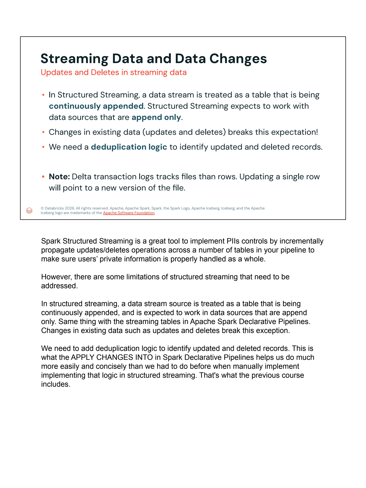

- **Puntos Clave de la Diapositiva:**
  - En **Structured Streaming**, un flujo de datos se trata conceptualmente como una tabla que se encuentra en continuo anexado (**continuously appended**). Structured Streaming espera trabajar exclusivamente con fuentes de datos de solo adición (**append only**).
  - Los cambios en datos preexistentes (actualizaciones `UPDATE` y eliminaciones `DELETE`) rompen esta suposición fundamental (*breaks this expectation*).
  - Se requiere lógica de desduplicación (**deduplication logic**) para identificar registros actualizados y eliminados.
  - **Nota técnica sobre Delta Lake:** El registro de transacciones de Delta Lake (*Delta transaction log*) rastrea archivos completos en lugar de filas individuales. Actualizar una sola fila da como resultado la escritura de una nueva versión del archivo Parquet subyacente.
- **Transcripción / Speaker Notes:**
  > *"Spark Structured Streaming is a great tool to implement PIIs controls by incrementally propagate updates/deletes operations across a number of tables in your pipeline to make sure users' private information is properly handled as a whole.*  
  > *However, there are some limitations of structured streaming that need to be addressed.*  
  > *In structured streaming, a data stream source is treated as a table that is being continuously appended, and is expected to work in data sources that are append only. Same thing with the streaming tables in Apache Spark Declarative Pipelines. Changes in existing data such as updates and deletes break this exception.*  
  > *We need to add deduplication logic to identify updated and deleted records. This is what the APPLY CHANGES INTO in Spark Declarative Pipelines helps us do much more easily and concisely than we had to do before when manually implement implementing that logic in structured streaming. That's what the previous course includes."*

---

### Slide 3: Solution 1: Ignore Changes (Prevent Re-processing by Ignoring Deletes, Updates and Overwrites)
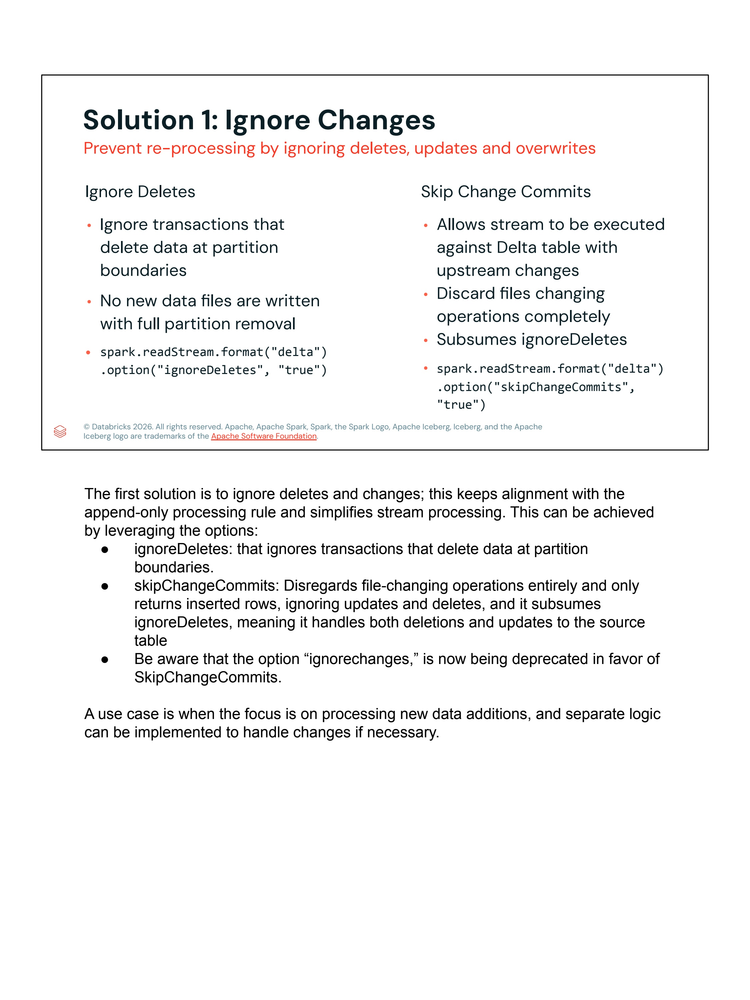

- **Opciones de Configuración para Ignorar Modificaciones:**
  1. **`ignoreDeletes`:**
     - Ignora transacciones que eliminan datos en los límites de partición (*partition boundaries*).
     - No se escriben nuevos archivos de datos cuando ocurre una remoción completa de partición.
     - Código PySpark:
       ```python
       spark.readStream.format("delta") \
           .option("ignoreDeletes", "true") \
           .load(path)
       ```
  2. **`skipChangeCommits`:**
     - Permite que el stream se ejecute contra una tabla Delta que contiene modificaciones upstream.
     - Descarta completamente las operaciones que modifican archivos (*Discard files changing operations completely*).
     - Subsume y reemplaza funcionalmente a `ignoreDeletes`.
     - Código PySpark:
       ```python
       spark.readStream.format("delta") \
           .option("skipChangeCommits", "true") \
           .load(path)
       ```
- **Transcripción / Speaker Notes:**
  > *"The first solution is to ignore deletes and changes; this keeps alignment with the append-only processing rule and simplifies stream processing. This can be achieved by leveraging the options:*  
  > *- **ignoreDeletes**: that ignores transactions that delete data at partition boundaries.*  
  > *- **skipChangeCommits**: Disregards file-changing operations entirely and only returns inserted rows, ignoring updates and deletes, and it subsumes ignoreDeletes, meaning it handles both deletions and updates to the source table.*  
  > *- Be aware that the option `ignoreChanges` is now being deprecated in favor of `skipChangeCommits`.*  
  > *A use case is when the focus is on processing new data additions, and separate logic can be implemented to handle changes if necessary."*

---

### Slide 4: Solution 2: Change Data Feeds (CDF) – Propagate Incremental Changes to Downstream Tables
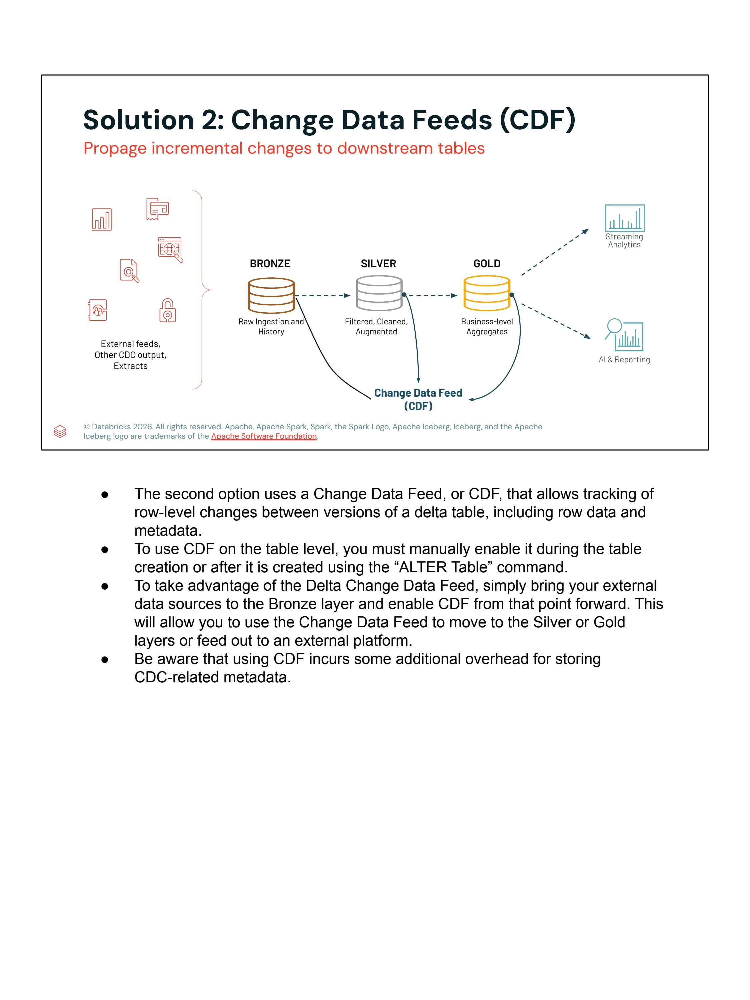

- **Flujo Arquitectónico:**
  - `External feeds, Other CDC output, Extracts` $\rightarrow$ **BRONZE** (Raw Ingestion and History) $\rightarrow$ **SILVER** (Filtered, Cleaned, Augmented) $\rightarrow$ **GOLD** (Business-level Aggregates) $\rightarrow$ Consumo por `Streaming Analytics` y `AI & Reporting`.
  - **Change Data Feed (CDF)** captura los cambios a nivel de fila directamente entre versiones de Delta y los propaga desde Bronze hacia Silver, Gold o plataformas externas.
- **Transcripción / Speaker Notes:**
  > *- The second option uses a Change Data Feed, or CDF, that allows tracking of row-level changes between versions of a delta table, including row data and metadata.*  
  > *- To use CDF on the table level, you must manually enable it during the table creation or after it is created using the `ALTER TABLE` command.*  
  > *- To take advantage of the Delta Change Data Feed, simply bring your external data sources to the Bronze layer and enable CDF from that point forward. This will allow you to use the Change Data Feed to move to the Silver or Gold layers or feed out to an external platform.*  
  > *- Be aware that using CDF incurs some additional overhead for storing CDC-related metadata.*

---

### Slide 5: What Delta Change Data Feed Does for You (Benefits and Use Cases of CDF)
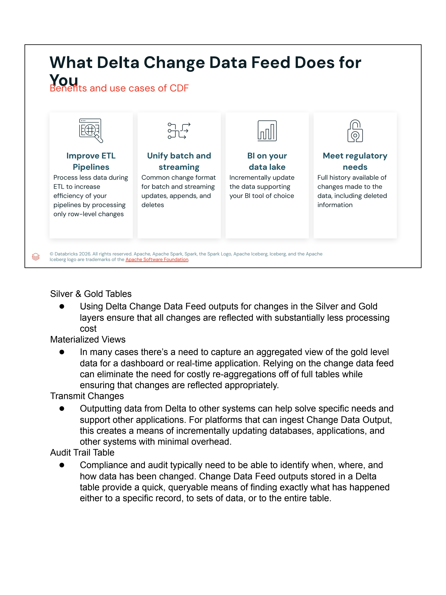

- **Cuatro Pilares Fundamentales:**
  1. **Improve ETL Pipelines:** Procesa menor volumen de datos durante ETL para aumentar drásticamente la eficiencia, procesando únicamente cambios a nivel de fila (*row-level changes*).
  2. **Unify Batch and Streaming:** Formato de cambio unificado común para procesamiento por lotes y streaming (actualizaciones, anexos y eliminaciones).
  3. **BI on Your Data Lake:** Actualiza incrementalmente los datos que alimentan las herramientas de Business Intelligence (BI) de su elección, eliminando la necesidad de costosos recálculos masivos de tablas completas.
  4. **Meet Regulatory Needs:** Historial completo y auditable de todos los cambios realizados en los datos, incluyendo información eliminada (vital para GDPR Art. 17 y auditorías de privacidad).
- **Transcripción / Speaker Notes:**
  > *- **Silver & Gold Tables:** Using Delta Change Data Feed outputs for changes in the Silver and Gold layers ensure that all changes are reflected with substantially less processing cost.*  
  > *- **Materialized Views:** In many cases there's a need to capture an aggregated view of the gold level data for a dashboard or real-time application. Relying on the change data feed can eliminate the need for costly re-aggregations off of full tables while ensuring that changes are reflected appropriately.*  
  > *- **Transmit Changes:** Outputting data from Delta to other systems can help solve specific needs and support other applications. For platforms that can ingest Change Data Output, this creates a means of incrementally updating databases, applications, and other systems with minimal overhead.*  
  > *- **Audit Trail Table:** Compliance and audit typically need to be able to identify when, where, and how data has been changed. Change Data Feed outputs stored in a Delta table provide a quick, queryable means of finding exactly what has happened either to a specific record, to sets of data, or to the entire table.*

---

### Slide 6: Comparison CDF vs CDC
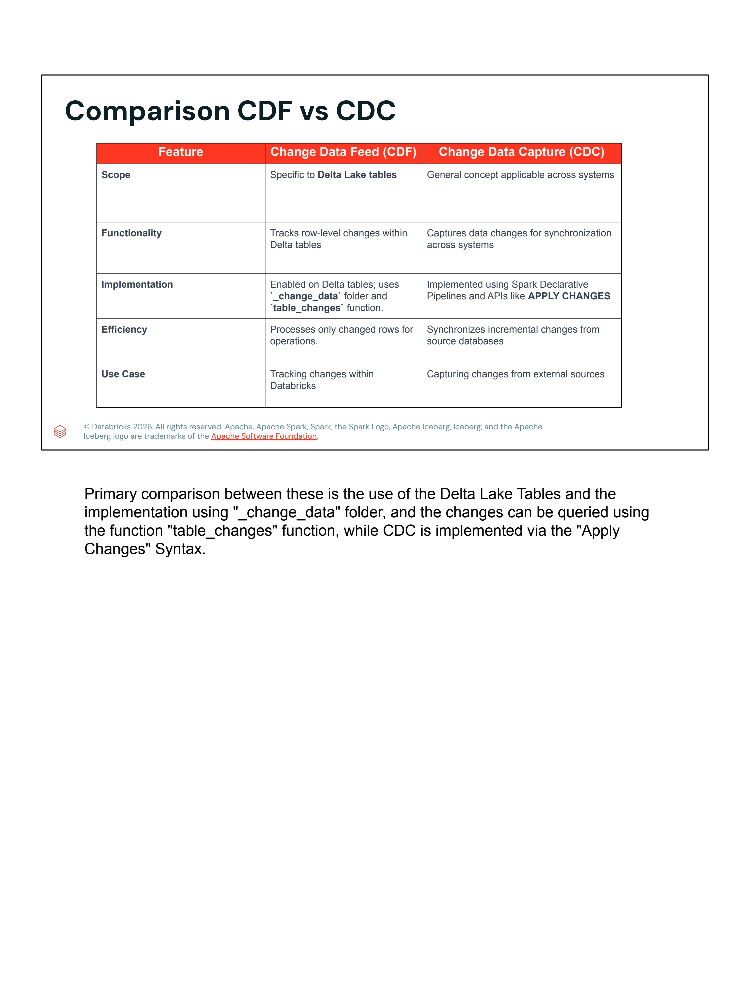

| Característica (*Feature*) | Change Data Feed (CDF) | Change Data Capture (CDC) |
|---|---|---|
| **Alcance (*Scope*)** | Específico para tablas **Delta Lake**. | Concepto arquitectónico general aplicable a través de múltiples sistemas de bases de datos. |
| **Funcionalidad (*Functionality*)** | Rastrea cambios a nivel de fila entre versiones dentro de tablas Delta. | Captura cambios en bases de datos operacionales para sincronización entre sistemas dispares. |
| **Implementación (*Implementation*)** | Habilitado en tablas Delta; utiliza la carpeta interna `_change_data` y la función SQL `table_changes()`. | Implementado mediante Spark Declarative Pipelines / Lakeflow y APIs especializadas como `APPLY CHANGES INTO`. |
| **Eficiencia (*Efficiency*)** | Procesa únicamente las filas modificadas para operaciones downstream. | Sincroniza cambios incrementales desde bases de datos fuente (OLTP). |
| **Caso de Uso (*Use Case*)** | Seguimiento y propagación de mutaciones internas dentro del ecosistema Databricks Lakehouse. | Captura e ingesta de mutaciones desde fuentes transaccionales externas. |

- **Transcripción / Speaker Notes:**
  > *"Primary comparison between these is the use of the Delta Lake Tables and the implementation using `_change_data` folder, and the changes can be queried using the function `table_changes` function, while CDC is implemented via the Apply Changes syntax."*

---

### Slide 7: How Does Delta CDF Work? (Sample CDF Data Schema)
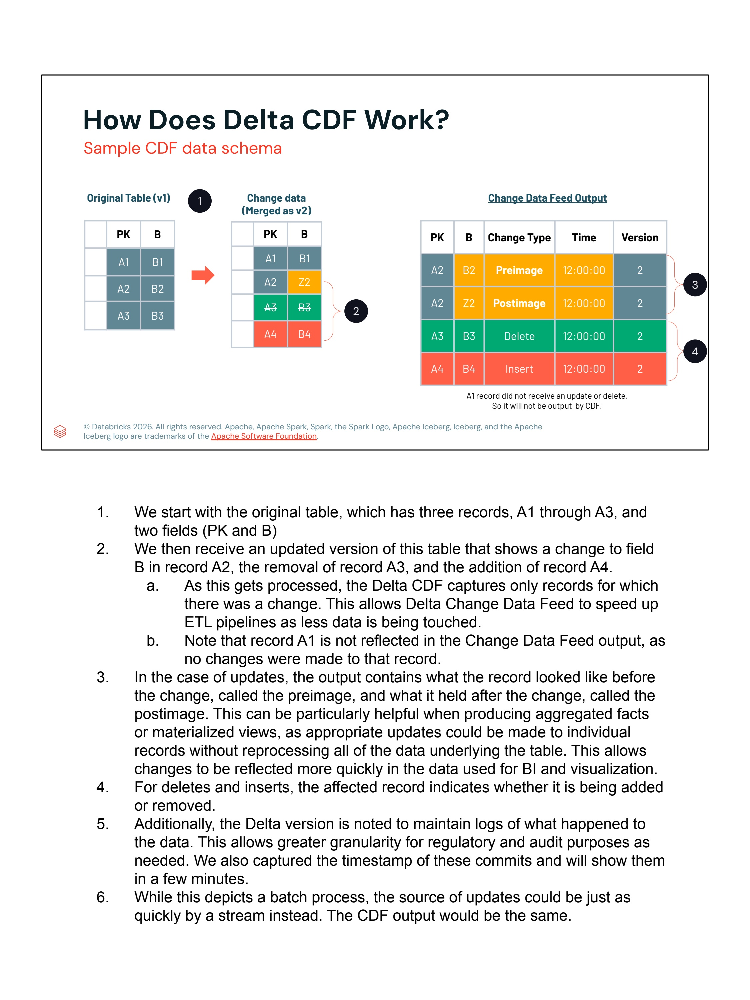

- **Mecánica Paso a Paso:**
  1. **Tabla Original (Versión 1):** Contiene 3 registros:
     - `A1 | B1`
     - `A2 | B2`
     - `A3 | B3`
  2. **Datos de Cambio aplicados (Fusionados como Versión 2):**
     - `A1`: Sin cambios.
     - `A2`: El campo `B` cambia a `Z2` (`UPDATE`).
     - `A3`: Se elimina (`DELETE`).
     - `A4`: Se inserta nuevo registro con valor `B4` (`INSERT`).
  3. **Salida generada por Change Data Feed (CDF Output):**

     | PK | B | Change Type (`_change_type`) | Time (`_commit_timestamp`) | Version (`_commit_version`) | Tipo de Imagen |
     |---|---|---|---|---|---|
     | `A2` | `B2` | `update_preimage` | `12:00:00` | 2 | Estado previo a la actualización |
     | `A2` | `Z2` | `update_postimage` | `12:00:00` | 2 | Estado posterior a la actualización |
     | `A3` | `B3` | `delete` | `12:00:00` | 2 | Fila eliminada |
     | `A4` | `B4` | `insert` | `12:00:00` | 2 | Fila nueva insertada |

     *(Nota: El registro `A1` no experimentó cambios, por lo tanto no aparece en la salida del CDF, ahorrando ancho de banda y cómputo).*
- **Transcripción / Speaker Notes:**
  > *1. We start with the original table, which has three records, A1 through A3, and two fields (PK and B).*  
  > *2. We then receive an updated version of this table that shows a change to field B in record A2, the removal of record A3, and the addition of record A4.*  
  > *   a. As this gets processed, the Delta CDF captures only records for which there was a change. This allows Delta Change Data Feed to speed up ETL pipelines as less data is being touched.*  
  > *   b. Note that record A1 is not reflected in the Change Data Feed output, as no changes were made to that record.*  
  > *3. In the case of updates, the output contains what the record looked like before the change, called the preimage, and what it held after the change, called the postimage. This can be particularly helpful when producing aggregated facts or materialized views, as appropriate updates could be made to individual records without reprocessing all of the data underlying the table. This allows changes to be reflected more quickly in the data used for BI and visualization.*  
  > *4. For deletes and inserts, the affected record indicates whether it is being added or removed.*  
  > *5. Additionally, the Delta version is noted to maintain logs of what happened to the data. This allows greater granularity for regulatory and audit purposes as needed. We also captured the timestamp of these commits and will show them in a few minutes.*  
  > *6. While this depicts a batch process, the source of updates could be just as quickly by a stream instead. The CDF output would be the same.*

---

### Slide 8: Consuming the Delta CDF (Stream-based vs. Batch-based Consumption)
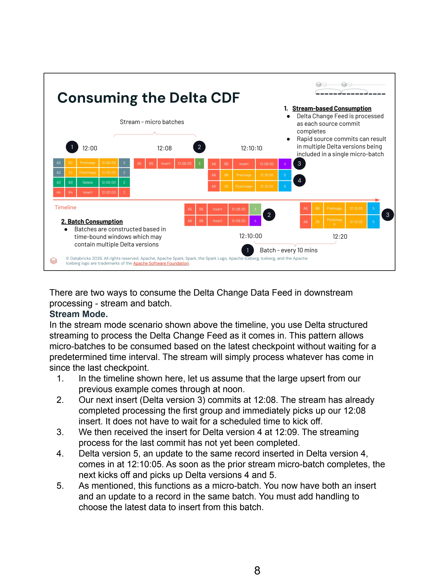

- **Dos Modelos de Consumo:**
  1. **Consumo Basado en Streaming (*Stream-based Consumption*):**
     - Delta Change Data Feed se procesa de forma continua a medida que se completa cada commit en la tabla fuente.
     - Si ocurren commits rápidos en la fuente, múltiples versiones de Delta pueden consolidarse dentro de un único micro-lote de streaming (*single micro-batch*).
  2. **Consumo Basado en Lotes (*Batch Consumption*):**
     - Los lotes se construyen en ventanas temporales acotadas (ej. ejecuciones programadas cada 10 minutos), las cuales pueden contener múltiples versiones transaccionales de Delta.
- **Transcripción / Speaker Notes:**
  > *"There are two ways to consume the Delta Change Data Feed in downstream processing - stream and batch.*  
  > *Stream Mode.*  
  > *In the stream mode scenario shown above the timeline, you use Delta structured streaming to process the Delta Change Feed as it comes in. This pattern allows micro-batches to be consumed based on the latest checkpoint without waiting for a predetermined time interval. The stream will simply process whatever has come in since the last checkpoint.*  
  > *1. In the timeline shown here, let us assume that the large upsert from our previous example comes through at noon.*  
  > *2. Our next insert (Delta version 3) commits at 12:08. The stream has already completed processing the first group and immediately picks up our 12:08 insert. It does not have to wait for a scheduled time to kick off.*  
  > *3. We then received the insert for Delta version 4 at 12:09. The streaming process for the last commit has not yet been completed.*  
  > *4. Delta version 5, an update to the same record inserted in Delta version 4, comes in at 12:10:05. As soon as the prior stream micro-batch completes, the next kicks off and picks up Delta versions 4 and 5.*  
  > *5. As mentioned, this functions as a micro-batch. You now have both an insert and an update to a record in the same batch. You must add handling to choose the latest data to insert from this batch."*

---

### Slide 9: Consuming the Delta CDF – Batch Mode Deep Dive
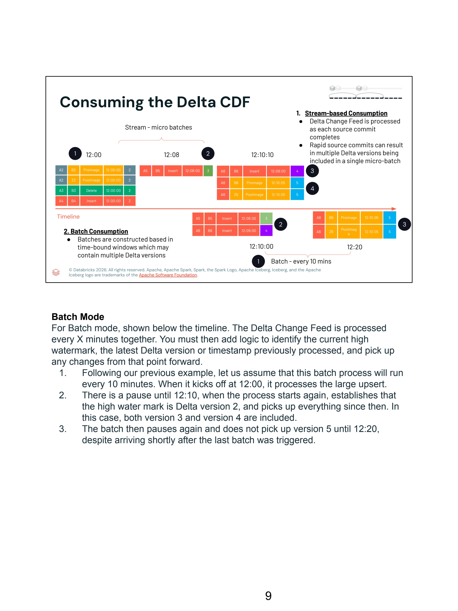

- **Lógica de Marca de Agua en Lotes (*High Watermark Logic*):**
  - Para procesamiento en lote, CDF se ejecuta en intervalos programados.
  - El pipeline debe gestionar el control de estado registrando la última versión o marca de tiempo procesada (*high watermark*).
- **Transcripción / Speaker Notes:**
  > *"Batch Mode.*  
  > *For Batch mode, shown below the timeline. The Delta Change Feed is processed every X minutes together. You must then add logic to identify the current high watermark, the latest Delta version or timestamp previously processed, and pick up any changes from that point forward.*  
  > *1. Following our previous example, let us assume that this batch process will run every 10 minutes. When it kicks off at 12:00, it processes the large upsert.*  
  > *2. There is a pause until 12:10, when the process starts again, establishes that the high water mark is Delta version 2, and picks up everything since then. In this case, both version 3 and version 4 are included.*  
  > *3. The batch then pauses again and does not pick up version 5 until 12:20, despite arriving shortly after the last batch was triggered."*

---

### Slide 10: CDF Configuration (Important Notes for CDF Configuration)
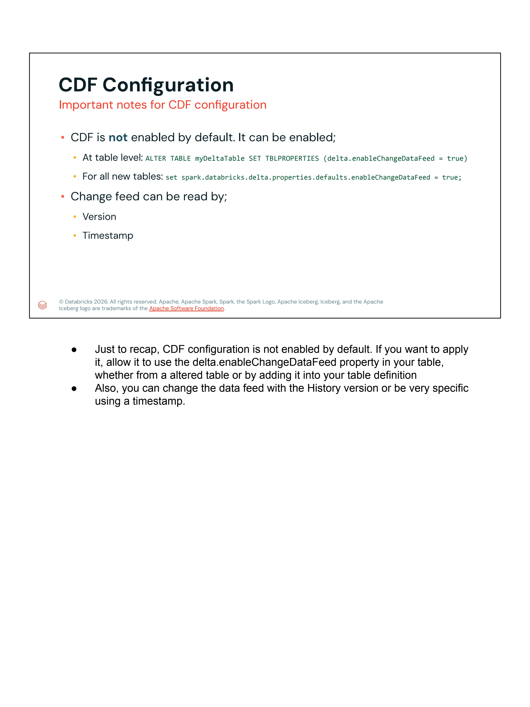

- **Directrices de Activación:**
  - CDF **NO** está habilitado de forma predeterminada (*not enabled by default*).
  - **Activación a nivel de tabla individual:**
    ```sql
    ALTER TABLE myDeltaTable 
    SET TBLPROPERTIES (delta.enableChangeDataFeed = true);
    ```
  - **Activación a nivel de sesión/cluster para todas las tablas nuevas:**
    ```sql
    SET spark.databricks.delta.properties.defaults.enableChangeDataFeed = true;
    ```
  - **Lectura del Change Feed:**
    - Por **Número de Versión** (`startingVersion`, `endingVersion`).
    - Por **Marca de Tiempo** (`startingTimestamp`, `endingTimestamp`).
- **Transcripción / Speaker Notes:**
  > *- Just to recap, CDF configuration is not enabled by default. If you want to apply it, allow it to use the `delta.enableChangeDataFeed` property in your table, whether from a altered table or by adding it into your table definition.*  
  > *- Also, you can change the data feed with the History version or be very specific using a timestamp.*

---

### Slide 11: Change Tables Function (Tracks Row-Level Changes Between Versions of a Delta Table)
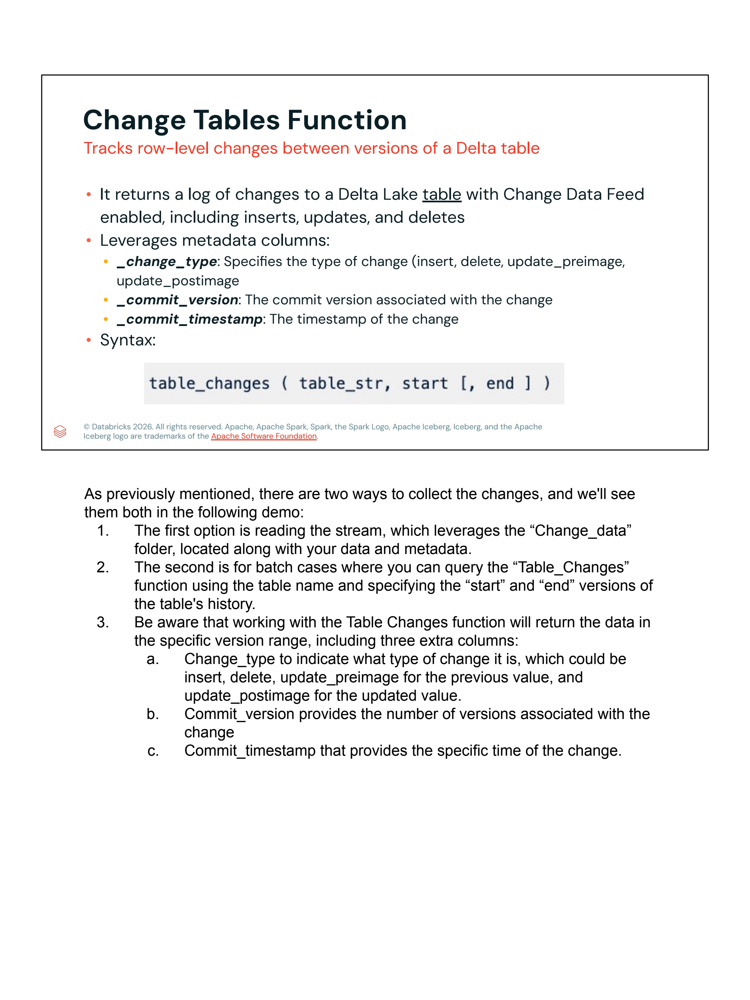

- **Propósito y Capacidades:**
  - Retorna un registro histórico y estructurado de todas las operaciones de modificación (`INSERT`, `UPDATE`, `DELETE`) ocurridas en una tabla Delta que tiene CDF habilitado.
  - Proporciona automáticamente tres columnas de metadatos del sistema:
    1. **`_change_type`:** Indica la naturaleza exacta del cambio:
       - `insert`
       - `delete`
       - `update_preimage`
       - `update_postimage`
    2. **`_commit_version`:** Número entero de la versión del log transaccional de Delta donde se confirmó la mutación.
    3. **`_commit_timestamp`:** Marca de tiempo precisa (UTC) en la que se confirmó la transacción.
  - **Sintaxis SQL:**
    ```sql
    table_changes( table_str, start [, end ] )
    ```
- **Transcripción / Speaker Notes:**
  > *As previously mentioned, there are two ways to collect the changes, and we'll see them both in the following demo:*  
  > *1. The first option is reading the stream, which leverages the `_change_data` folder, located along with your data and metadata.*  
  > *2. The second is for batch cases where you can query the `Table_Changes` function using the table name and specifying the "start" and "end" versions of the table's history.*  
  > *3. Be aware that working with the Table Changes function will return the data in the specific version range, including three extra columns:*  
  > *   a. `Change_type` to indicate what type of change it is, which could be insert, delete, update_preimage for the previous value, and update_postimage for the updated value.*  
  > *   b. `Commit_version` provides the number of versions associated with the change.*  
  > *   c. `Commit_timestamp` that provides the specific time of the change.*

---

### Slide 12: Conclusión de la Lección


- **Transcripción / Speaker Notes:**
  > *"Thank you for completing this lesson and continuing your journey to develop your skills with us."*

---

## 3. Síntesis Técnica y Matriz de Referencia Rápida para el Examen

### Comandos de Configuración y Lectura

```sql
-- 1. Habilitar CDF en tabla existente
ALTER TABLE silver_users SET TBLPROPERTIES (delta.enableChangeDataFeed = true);

-- 2. Crear tabla nueva con CDF habilitado
CREATE TABLE gold_user_metrics (
    user_id STRING,
    total_spend DOUBLE,
    last_active TIMESTAMP
)
TBLPROPERTIES (delta.enableChangeDataFeed = true);

-- 3. Consultar cambios en modo Batch por número de versión
SELECT * FROM table_changes('silver_users', 2, 5);

-- 4. Consultar cambios en modo Batch desde una versión hasta la más reciente
SELECT * FROM table_changes('silver_users', 2);

-- 5. Consultar cambios en modo Batch por Timestamp
SELECT * FROM table_changes('silver_users', '2026-09-01 00:00:00', '2026-09-30 12:00:00');
```

```python
# 6. Lectura en Streaming desde Change Data Feed en PySpark
cdf_stream_df = spark.readStream \
    .format("delta") \
    .option("readChangeFeed", "true") \
    .option("startingVersion", 2) \
    .table("silver_users")

# Filtrar únicamente eliminaciones para propagar borrados GDPR / CCPA
deletes_df = cdf_stream_df.filter("_change_type = 'delete'")
```
