# Lección 18: Deleting Data in Databricks

**Curso:** Databricks Data Privacy (ID: 3767)  
**Sección:** Streaming Data and CDF (Sección 4)  
**Lección:** Deleting Data in Databricks (Lesson ID: 44506)  
**Formato:** Slides & Lecture Transcripts (10 Diapositivas)  
**Estado:** Completado 100%  
**Autor:** Databricks Academy  

---

## 1. Visión General de la Lección y Objetivos

En esta lección técnica se aborda en detalle la gestión del ciclo de vida y eliminación de datos (**Data Deletion**) en Databricks y Delta Lake, con un enfoque prioritario en el cumplimiento normativo internacional de privacidad como **GDPR** (*General Data Protection Regulation - Right to Erasure / Right to be Forgotten*) y **CCPA** (*California Consumer Privacy Act*).

Se analizan los desafíos que plantea la inmutabilidad de los archivos Parquet subyacentes y el control de versiones en el Delta Transaction Log, explicando cómo utilizar **Change Data Feed (CDF)** para propagar eliminaciones hacia aguas abajo (*downstream*), cómo configurar y ejecutar purgas físicas mediante **VACUUM**, y las capacidades contrastadas de **DML en Streaming Tables** frente a **Materialized Views**.

### Objetivos Clave de Aprendizaje
1. **Regulaciones de Privacidad y Eliminación:** Comprender por qué las solicitudes de eliminación de información personal identificable (**PII**) requieren tuberías especializadas y segregadas de los pipelines ETL estándar.
2. **Propagación de Eliminaciones con CDF:** Emplear Change Data Feed para identificar y propagar eventos de eliminación (`_change_type = 'delete'`) a través de la arquitectura Medallion.
3. **Auditoría con Commit Messages:** Configurar metadatos arbitrarios en los commits del Delta Log para certificar legalmente el origen y propósito de las modificaciones o borrados de datos.
4. **Eliminación Lógica vs. Física:** Entender por qué un `DELETE` en SQL solo marca la versión lógica y cómo **VACUUM** elimina físicamente los archivos Parquet que contienen PII histórica.
5. **Políticas de Retención de CDF y VACUUM:** Configurar `retentionDurationCheck.enabled` y ejecutar `VACUUM` con `RETAIN 0 HOURS` de forma segura tras realizar una simulación con `DRY RUN`.
6. **Optimización por Particiones:** Reconocer los beneficios de costo y rendimiento al realizar eliminaciones en límites de partición (**partition boundaries**).
7. **Soporte DML en Streaming Tables vs. Materialized Views:** Dominar qué objetos admiten mutaciones directas (`INSERT`, `UPDATE`, `DELETE`, `MERGE`) y cuáles exigen operaciones de refresco (`REFRESH MATERIALIZED VIEW ... FULL`).

---

## 2. Diapositivas y Transcripciones Verbatim

### Slide 1: Portada
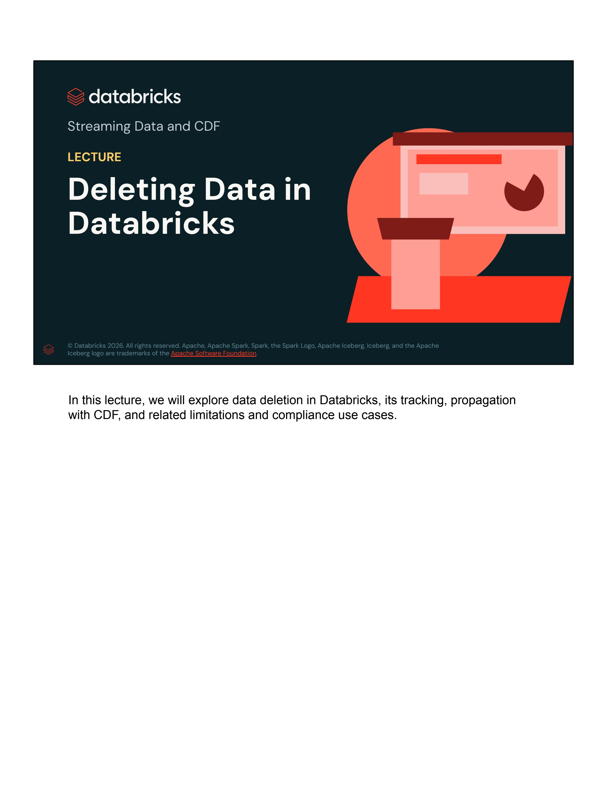

- **Organización:** Databricks Academy
- **Sección:** Streaming Data and CDF
- **Tipo de Lección:** LECTURE
- **Título:** Deleting Data in Databricks
- **Transcripción / Speaker Notes:**
  > *"In this lecture, we will explore data deletion in Databricks, its tracking, propagation with CDF, and related limitations and compliance use cases."*

---

### Slide 2: Data Deletion in Databricks (Data deletion needs special attention!)
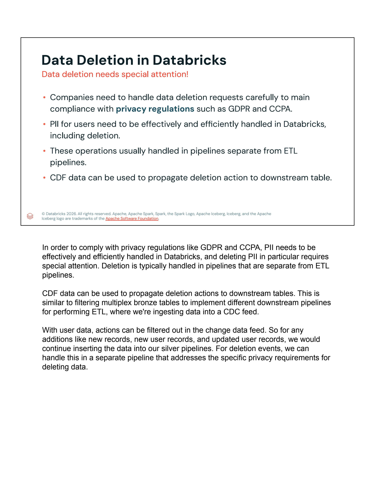

- **Puntos Clave de la Diapositiva:**
  - Las organizaciones deben gestionar las solicitudes de eliminación de datos con extremo rigor para mantener el cumplimiento de regulaciones de privacidad como **GDPR** y **CCPA**.
  - Los datos de usuarios con **PII** deben manejarse de manera efectiva y eficiente en Databricks, incluyendo los procesos de borrado.
  - Estas operaciones usualmente se ejecutan en **pipelines independientes y separados** de los pipelines ETL estándar.
  - Los datos del **Change Data Feed (CDF)** se pueden aprovechar para propagar las acciones de eliminación hacia las tablas aguas abajo (*downstream tables*).
- **Transcripción / Speaker Notes:**
  > *"In order to comply with privacy regulations like GDPR and CCPA, PII needs to be effectively and efficiently handled in Databricks, and deleting PII in particular requires special attention. Deletion is typically handled in pipelines that are separate from ETL pipelines.*  
  > *CDF data can be used to propagate deletion actions to downstream tables. This is similar to filtering multiplex bronze tables to implement different downstream pipelines for performing ETL, where we're ingesting data into a CDC feed.*  
  > *With user data, actions can be filtered out in the change data feed. So for any additions like new records, new user records, and updated user records, we would continue inserting the data into our silver pipelines. For deletion events, we can handle this in a separate pipeline that addresses the specific privacy requirements for deleting data."*

---

### Slide 3: Recording Important Data Changes (Using commit messages)
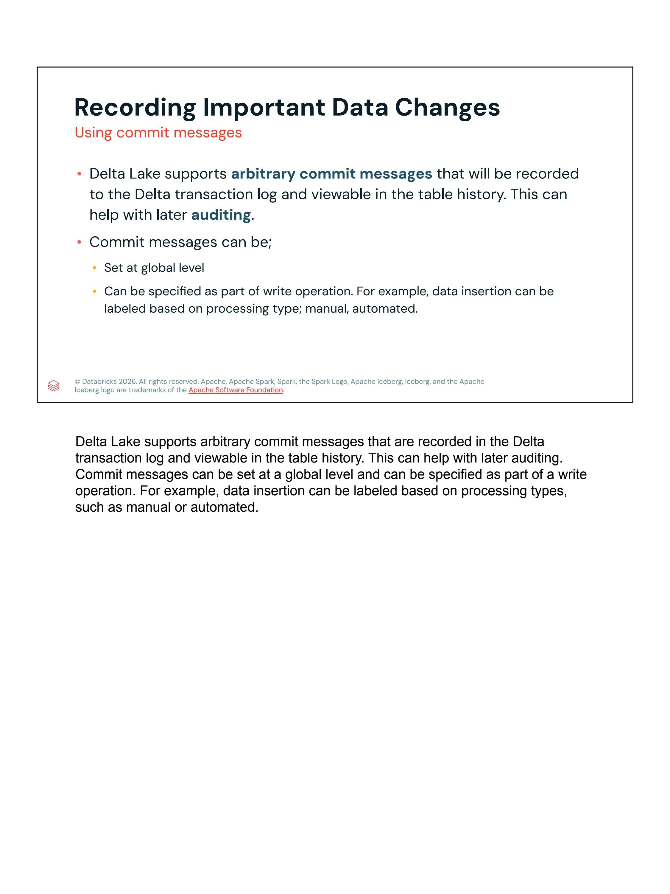

- **Puntos Clave de la Diapositiva:**
  - Delta Lake admite **mensajes de commit arbitrarios** (*arbitrary commit messages*) que quedan registrados en el **Delta Transaction Log** y son consultables a través del historial de la tabla (`DESCRIBE HISTORY`). Esto resulta fundamental para procesos de **auditoría** legal y regulatoria.
  - Los mensajes de confirmación pueden configurarse:
    - A nivel global de sesión de Spark.
    - Como parte explícita de una operación de escritura específica. Por ejemplo, etiquetando la inserción o modificación según el tipo de procesamiento: manual o automatizado.
- **Transcripción / Speaker Notes:**
  > *"Delta Lake supports arbitrary commit messages that are recorded in the Delta transaction log and viewable in the table history. This can help with later auditing. Commit messages can be set at a global level and can be specified as part of a write operation. For example, data insertion can be labeled based on processing types, such as manual or automated."*

---

### Slide 4: Propagating Data Deletion with CDF (How can CDF be used for propagating deletes?)
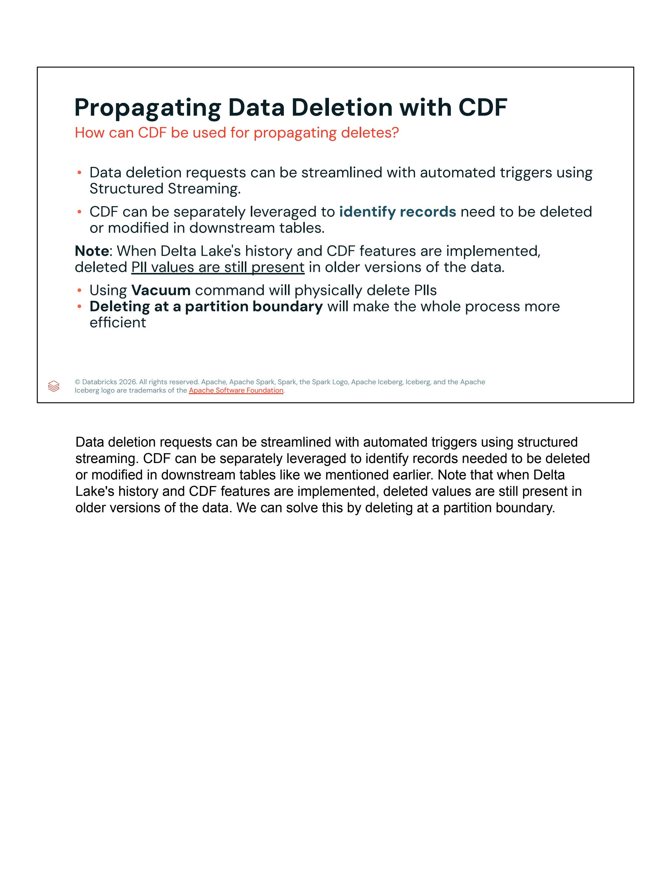

- **Puntos Clave de la Diapositiva:**
  - Las solicitudes de eliminación de datos pueden agilizarse mediante disparadores automatizados (*automated triggers*) usando **Structured Streaming**.
  - **CDF** puede utilizarse de forma segregada para **identificar los registros** que necesitan ser eliminados o modificados en las tablas aguas abajo.
  - **Nota Crítica de Cumplimiento:** Cuando se implementan el historial de Delta Lake y Change Data Feed, los valores de PII eliminados **continúan presentes en las versiones históricas** de los datos.
  - El uso del comando **VACUUM** es imprescindible para **eliminar físicamente** los archivos que contienen PII.
  - Ejecutar eliminaciones en un **límite de partición** (*partition boundary*) hace que todo el proceso sea significativamente más eficiente.
- **Transcripción / Speaker Notes:**
  > *"Data deletion requests can be streamlined with automated triggers using structured streaming. CDF can be separately leveraged to identify records needed to be deleted or modified in downstream tables like we mentioned earlier. Note that when Delta Lake's history and CDF features are implemented, deleted values are still present in older versions of the data. We can solve this by deleting at a partition boundary."*

---

### Slide 5: CDF Retention Policy (Important notes for CDF configuration)
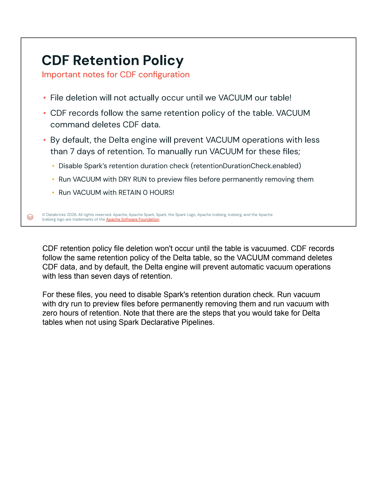

- **Puntos Clave de la Diapositiva:**
  - ¡La eliminación física de archivos **no ocurrirá realmente hasta que ejecutemos VACUUM** en nuestra tabla!
  - Los registros del CDF siguen la misma política de retención de la tabla Delta. El comando `VACUUM` elimina tanto los archivos de datos obsoletos como los datos del feed de cambios de versiones purgadas.
  - Por defecto, el motor Delta Lake previene operaciones de `VACUUM` con un periodo de retención menor a **7 días**. Para ejecutar manualmente `VACUUM` en estos archivos:
    1. Deshabilitar la verificación de duración de retención de Spark (`spark.databricks.delta.vacuum.retentionDurationCheck.enabled = false` o `retentionDurationCheck.enabled`).
    2. Ejecutar `VACUUM` con la cláusula `DRY RUN` para previsualizar los archivos antes de eliminarlos permanentemente.
    3. Ejecutar `VACUUM` con `RETAIN 0 HOURS` para purgar de inmediato los archivos obsoletos.
- **Transcripción / Speaker Notes:**
  > *"CDF retention policy file deletion won't occur until the table is vacuumed. CDF records follow the same retention policy of the Delta table, so the VACUUM command deletes CDF data, and by default, the Delta engine will prevent automatic vacuum operations with less than seven days of retention.*  
  > *For these files, you need to disable Spark's retention duration check. Run vacuum with dry run to preview files before permanently removing them and run vacuum with zero hours of retention. Note that there are the steps that you would take for Delta tables when not using Spark Declarative Pipelines."*

---

### Slide 6: Can I perform DML on a streaming Table? (i.e. GDPR)
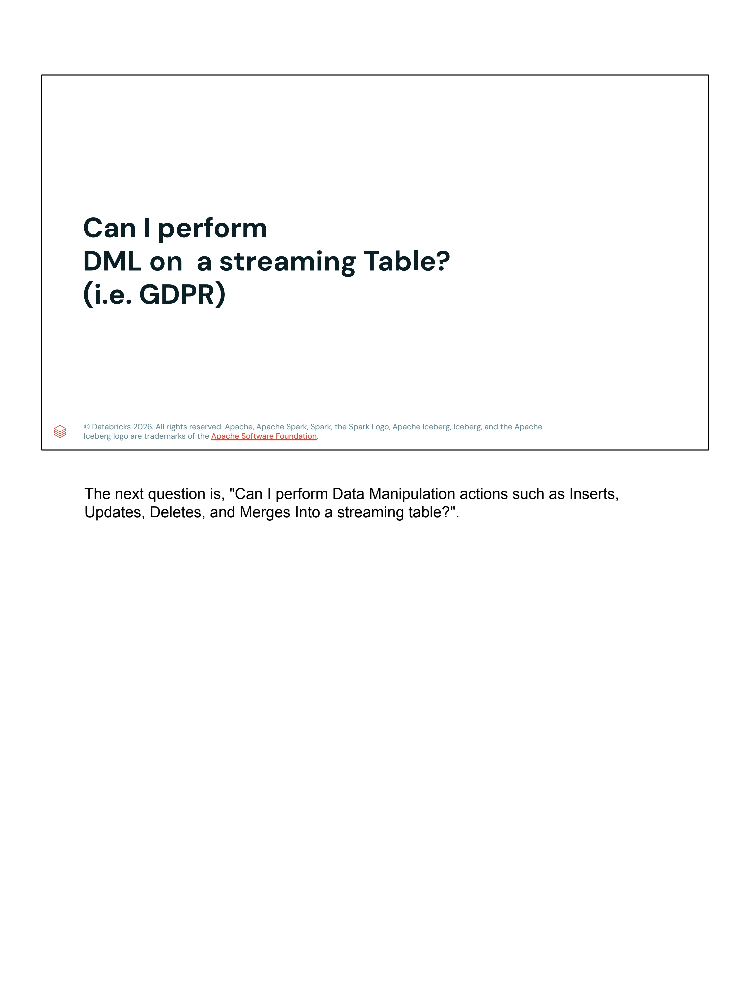

- **Pregunta Planteada:**
  - ¿Es posible ejecutar operaciones de manipulación de datos (DML: `INSERT`, `UPDATE`, `DELETE`, `MERGE`) en una **Streaming Table** para cumplir con normativas como GDPR?
- **Transcripción / Speaker Notes:**
  > *"The next question is, 'Can I perform Data Manipulation actions such as Inserts, Updates, Deletes, and Merges into a streaming table?'"*

---

### Slide 7: Example GDPR use case (Using streaming tables for ingestion and materialized views after)
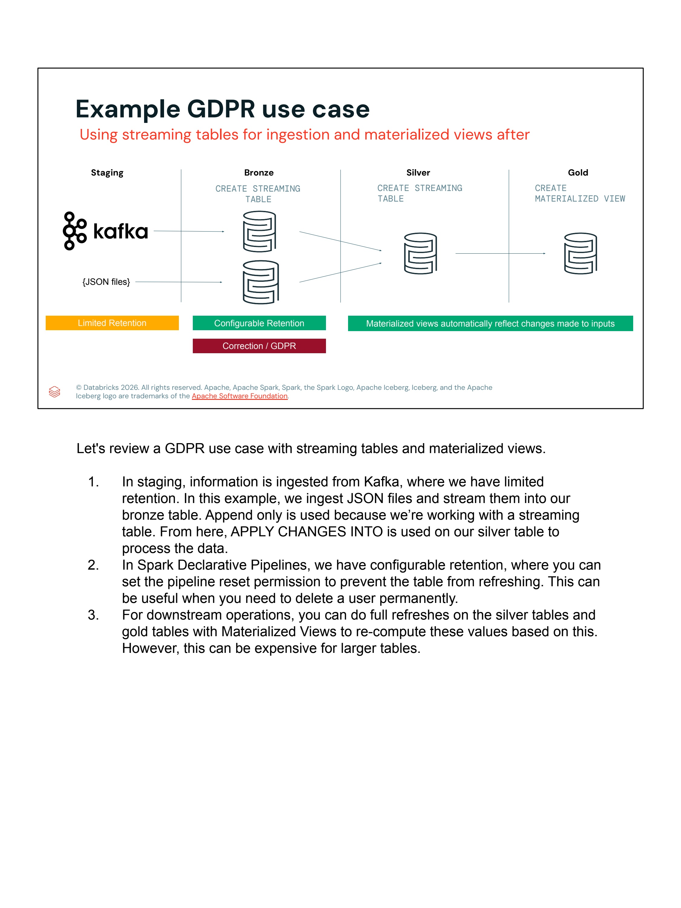

- **Arquitectura del Caso de Uso GDPR:**
  - **Staging:** Ingesta desde Kafka o archivos JSON con retención limitada (*Limited Retention*).
  - **Bronze:** `CREATE STREAMING TABLE` con retención configurable (*Configurable Retention*) y capacidad de corrección / GDPR (*Correction / GDPR*). Modo de ingesta append-only.
  - **Silver:** `CREATE STREAMING TABLE` donde se aplica `APPLY CHANGES INTO` para procesar el flujo CDC/CDF.
  - **Gold:** `CREATE MATERIALIZED VIEW` donde las vistas materializadas reflejan automáticamente los cambios de las entradas aguas arriba mediante refrescos.
- **Transcripción / Speaker Notes:**
  > *"Let's review a GDPR use case with streaming tables and materialized views.*  
  > *1. In staging, information is ingested from Kafka, where we have limited retention. In this example, we ingest JSON files and stream them into our bronze table. Append only is used because we're working with a streaming table. From here, APPLY CHANGES INTO is used on our silver table to process the data.*  
  > *2. In Spark Declarative Pipelines, we have configurable retention, where you can set the pipeline reset permission to prevent the table from refreshing. This can be useful when you need to delete a user permanently.*  
  > *3. For downstream operations, you can do full refreshes on the silver tables and gold tables with Materialized Views to re-compute these values based on this. However, this can be expensive for larger tables."*

---

### Slide 8: DML works on streaming tables only (Updates, deletes, inserts and merges on streaming tables)
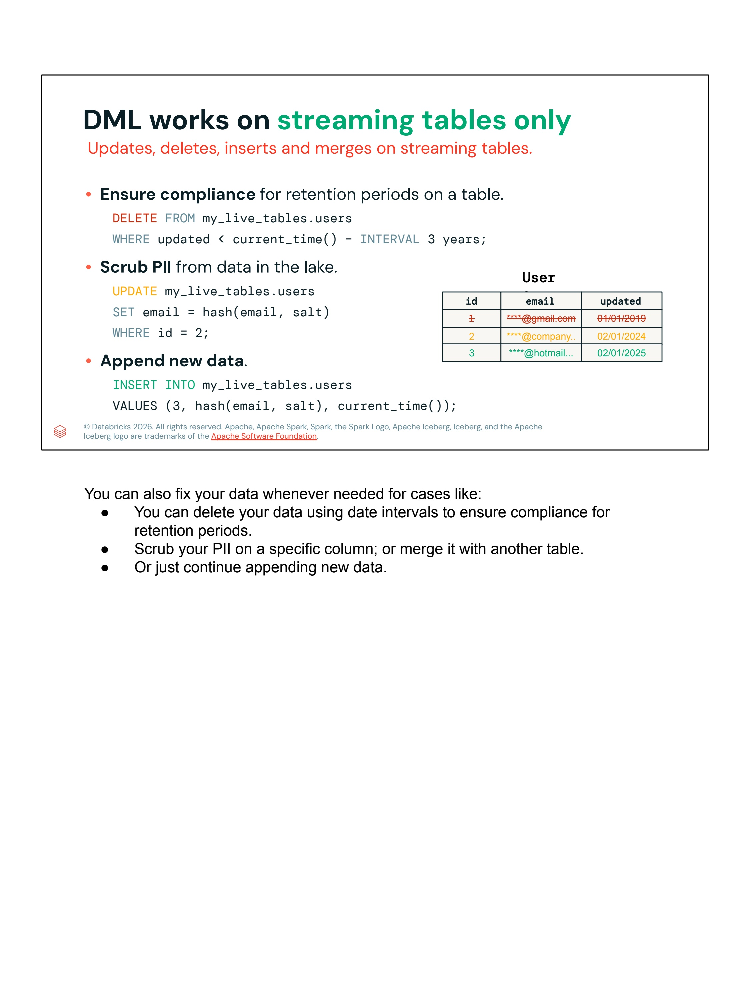

- **Capacidades DML en Streaming Tables:**
  - **Garantizar cumplimiento de periodos de retención en una tabla:**
    ```sql
    DELETE FROM my_live_tables.users
    WHERE updated < current_time() - INTERVAL 3 years;
    ```
  - **Depuración / anonimización de PII en el Data Lake:**
    ```sql
    UPDATE my_live_tables.users
    SET email = hash(email, salt)
    WHERE id = 2;
    ```
  - **Anexado de nuevos datos:**
    ```sql
    INSERT INTO my_live_tables.users
    VALUES (3, hash(email, salt), current_time());
    ```
- **Diagrama de Registros de Usuario:**
  | id | email | updated | Estado / Acción |
  |:---:|:---|:---:|:---|
  | ~~1~~ | `****@gmail.com` | `01/01/2019` | **Eliminado:** Antigüedad > 3 años |
  | `2` | `****@company..` | `02/01/2024` | **Actualizado:** PII cifrada/hasheada con sal |
  | `3` | `****@hotmail...` | `02/01/2025` | **Insertado:** Nuevo registro anonimizado |

- **Transcripción / Speaker Notes:**
  > *"You can also fix your data whenever needed for cases like:*  
  > *- You can delete your data using date intervals to ensure compliance for retention periods.*  
  > *- Scrub your PII on a specific column; or merge it with another table.*  
  > *- Or just continue appending new data."*

---

### Slide 9: Materialized Views don't support DML (MVs retain data's state from last refresh)
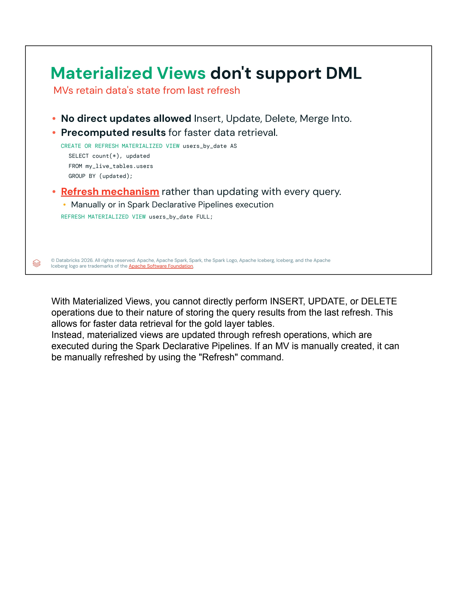

- **Puntos Clave de la Diapositiva:**
  - **No se permiten actualizaciones directas:** Las Vistas Materializadas no soportan `INSERT`, `UPDATE`, `DELETE` ni `MERGE INTO`.
  - **Resultados Precalculados:** Almacenan consultas precalculadas para optimizar la velocidad de lectura en capas agregadas (Gold).
    ```sql
    CREATE OR REFRESH MATERIALIZED VIEW users_by_date AS
    SELECT count(*), updated
    FROM my_live_tables.users
    GROUP BY (updated);
    ```
  - **Mecanismo de Refresco:** En lugar de mutarse fila por fila, las vistas materializadas se actualizan mediante operaciones de refresco:
    - De forma automatizada durante la ejecución del pipeline declarativo.
    - O manualmente ejecutando la instrucción de refresco completo:
      ```sql
      REFRESH MATERIALIZED VIEW users_by_date FULL;
      ```
- **Transcripción / Speaker Notes:**
  > *"With Materialized Views, you cannot directly perform INSERT, UPDATE, or DELETE operations due to their nature of storing the query results from the last refresh. This allows for faster data retrieval for the gold layer tables.*  
  > *Instead, materialized views are updated through refresh operations, which are executed during the Spark Declarative Pipelines. If an MV is manually created, it can be manually refreshed by using the "Refresh" command."*

---

### Slide 10: Conclusión de la Lección
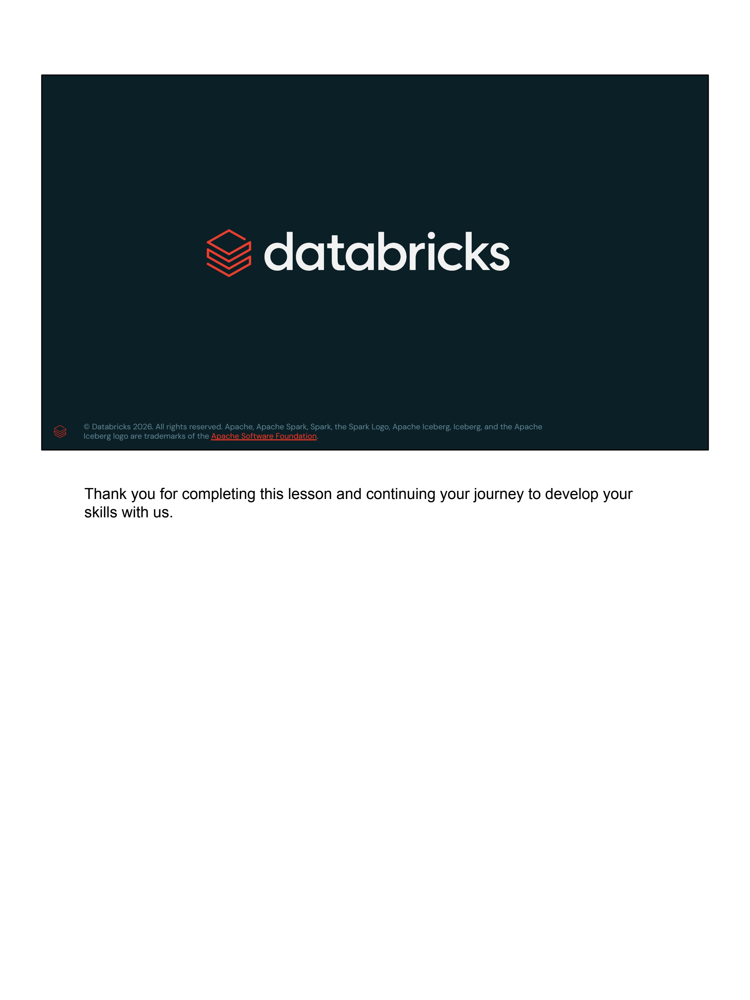

- **Transcripción / Speaker Notes:**
  > *"Thank you for completing this lesson and continuing your journey to develop your skills with us."*

---

## 3. Arquitectura Profunda y Conceptos Técnicos para el Examen

### 3.1. El Ciclo de Vida de Eliminación de Datos bajo GDPR / CCPA

En sistemas de almacenamiento basados en objetos en la nube (S3, ADLS Gen2, GCS) gestionados por Delta Lake, un comando SQL `DELETE` es una **operación puramente lógica**:
1. Delta Lake genera una nueva versión en el Transaction Log (`_delta_log/000000X.json`).
2. Los archivos Parquet que contenían las filas eliminadas son marcados como "tumbstones" (removidos de la versión activa de la tabla).
3. Si la eliminación no afectó al archivo completo, se reescribe un nuevo archivo Parquet excluyendo las filas borradas.
4. **Riesgo Legal / Cumplimiento:** Los archivos Parquet originales continúan existiendo físicamente en el almacenamiento de objetos para permitir el viaje en el tiempo (**Time Travel**). Cualquier usuario con permisos de lectura histórica podría reconstruir la PII eliminada.

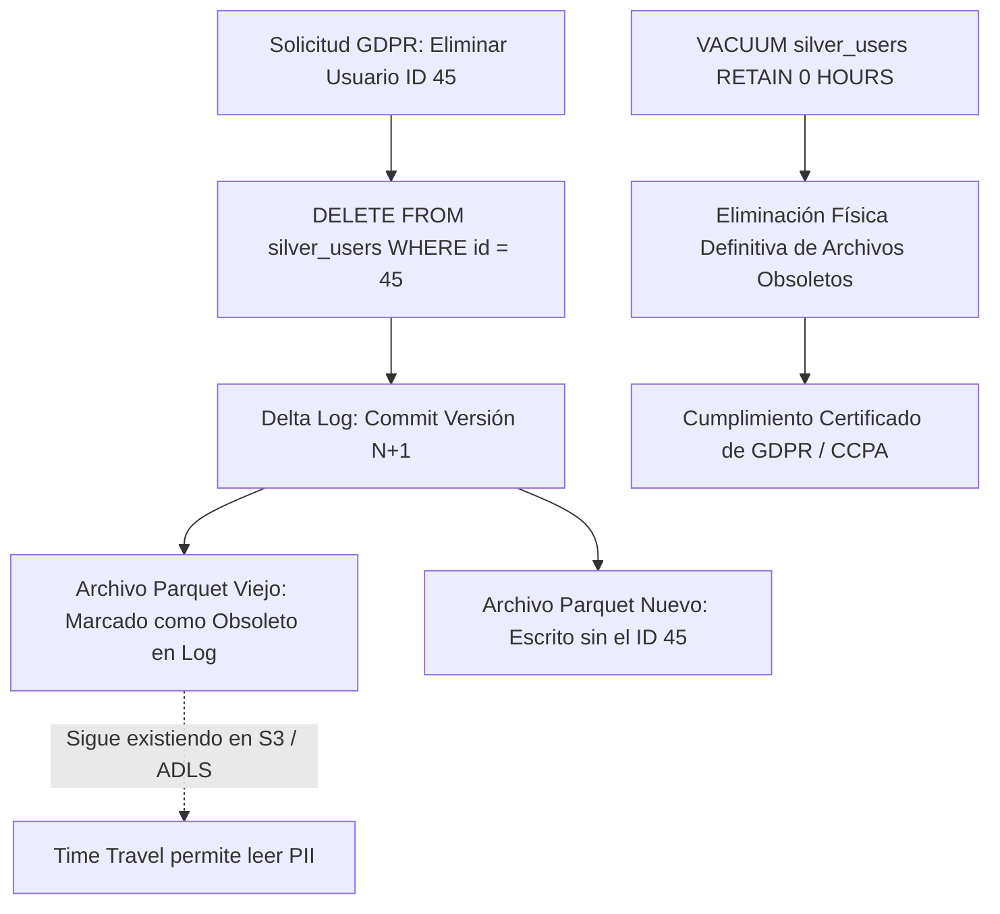

---

### 3.2. Propagación de Eliminaciones Mediante Change Data Feed (CDF)

Para propagar eliminaciones a través de la arquitectura Medallion sin reprocesar tablas completas, se segrega el flujo de consumo de CDF:

```sql
-- Consumo en micro-lotes de eventos de eliminación desde la tabla Bronze
SELECT 
    id,
    user_email,
    _change_type,
    _commit_version,
    _commit_timestamp
FROM table_changes('bronze_customers', 10)
WHERE _change_type = 'delete';
```

Al consumir este flujo con Structured Streaming o jobs programados, se puede ejecutar una operación en cascada (`MERGE` o `DELETE`) en las tablas Silver y Gold correspondientes.

---

### 3.3. Configuración Segura de VACUUM y Desactivación de Checks

Por defecto, Delta Lake protege a los usuarios de destruir accidentalmente snapshots requeridos por consultas concurrentes mediante un umbral de seguridad de **168 horas (7 días)**.

Para satisfacer requerimientos normativos que exigen borrado en plazos inmediatos:

```sql
-- 1. Deshabilitar la protección de duración mínima en la sesión de Spark
SET spark.databricks.delta.vacuum.retentionDurationCheck.enabled = false;

-- 2. Ejecutar simulación previa (DRY RUN) para auditar qué archivos se eliminarán
VACUUM bronze_customers RETAIN 0 HOURS DRY RUN;

-- 3. Ejecutar purga física irrevocable
VACUUM bronze_customers RETAIN 0 HOURS;
```

> [!WARNING]
> Ejecutar `VACUUM` con `RETAIN 0 HOURS` mientras existan transacciones concurrentes o lectores activos puede provocar fallos de lectura (`FileNotFoundException`) si los archivos requeridos son eliminados mientras una consulta está en ejecución. Asegúrese de programar estas tareas durante ventanas de mantenimiento o cuando no haya escrituras activas en la tabla.

---

### 3.4. Auditoría con Mensajes de Commit Personalizados

Delta Lake permite asociar metadatos descriptivos a cada commit de escritura. Esto permite a los auditores verificar exactamente cuándo y por qué se borraron datos sensibles:

#### En Spark SQL:
```sql
SET spark.databricks.delta.commitInfo.userMetadata = 'GDPR Right to Erasure - Ticket #SEC-9842';

DELETE FROM silver_users WHERE user_id = 99823;

RESET spark.databricks.delta.commitInfo.userMetadata;
```

#### En PySpark:
```python
(df.write
   .format("delta")
   .mode("append")
   .option("userMetadata", "Automated ingestion - GDPR scrubbed batch 42")
   .saveAsTable("silver_users"))
```

Al consultar el historial:
```sql
DESCRIBE HISTORY silver_users;
```
La columna `userMetadata` mostrará el valor configurado, permitiendo trazabilidad forense completa.

---

### 3.5. Comparativa Clave para Certificación: Streaming Tables vs. Materialized Views

| Característica | Streaming Tables (ST) | Materialized Views (MV) |
|---|---|---|
| **Definición SQL** | `CREATE STREAMING TABLE table_name` | `CREATE MATERIALIZED VIEW view_name` |
| **Soporte DML Directo** | **SÍ** (`INSERT`, `UPDATE`, `DELETE`, `MERGE`) | **NO** (No admite DML directo) |
| **Caso de Uso Principal** | Ingesta continua, streaming append-only, depuración puntual de PII | Agregaciones complejas, capas Gold, reportes de analítica |
| **Mecanismo de Actualización** | Ingesta incremental de streaming + DML ad-hoc | `REFRESH MATERIALIZED VIEW view_name FULL` o scheduled pipeline |
| **Impacto en GDPR** | Permite `DELETE` y `UPDATE` específicos por fila | Requiere recalcular la vista completa (`FULL REFRESH`) tras borrar en la fuente |
| **Costo Computacional de Borrado** | Bajo (reescribe solo los archivos Parquet afectados) | Puede ser alto si requiere refrescar agregados masivos |

---

## 4. Resumen de Puntos Clave para el Examen Professional Data Engineer

1. **GDPR / CCPA:** Exige tuberías independientes de eliminación de PII para evitar interferir con la lógica de negocio ETL continua.
2. **Delta Lake Soft Delete:** Un `DELETE` no borra los archivos físicos de disco de inmediato; permanecen accesibles vía Time Travel y CDF hasta que se ejecute `VACUUM`.
3. **VACUUM y Retención:** Para purgar archivos con menos de 7 días, se debe deshabilitar `retentionDurationCheck.enabled` y siempre realizar un `DRY RUN` antes de `RETAIN 0 HOURS`.
4. **Optimización por Partición:** Si las tablas están particionadas por fecha o región, eliminar datos a nivel de partición completa (`ALTER TABLE ... DROP PARTITION` o filtrando la columna de partición) es una operación de solo metadatos, evitando reescrituras de archivos Parquet.
5. **Streaming Tables admiten DML:** Las tablas de streaming admiten modificaciones de datos puntuales para cumplimiento normativo (ej. eliminar registros anteriores a un umbral de retención o anonimizar columnas de correo con `hash(email, salt)`).
6. **Materialized Views son de solo lectura directa:** No admiten sentencias DML; cualquier cambio en los datos fuente se propaga mediante un refresco (`REFRESH MATERIALIZED VIEW`).
