# Lección 19: Demo: Processing Records from CDF and Propagating Changes (DP 1.3)

**Curso:** Databricks Data Privacy (ID: 3767)  
**Sección:** Section 4: Streaming Data and Change Data Feed (CDF)  
**Lección:** Demo: Processing Records from CDF and Propagating Changes (Lesson ID: 34611 / 34608)  
**Notebook:** `DP 1.3 - Processing Records from CDF and Propagating Changes`  
**Duración del Video:** 20 min 50 s (1,250 segundos)  
**Instructor:** Mark Ott (Staff Technical Instructor, Databricks)  
**Tecnología:** Delta Lake Change Data Feed (CDF), Structured Streaming, Auto Loader (`cloudFiles`), `foreachBatch`, `MERGE INTO`, Time Travel y `VACUUM`  
**Estado:** Completado 100%  

---

## 1. Visión General del Laboratorio y Arquitectura

En este laboratorio técnico práctico, se implementa un pipeline completo de ingesta streaming, captura de cambios y propagación downstream de solicitudes de borrado (cumplimiento GDPR / CCPA "Right to be Forgotten") utilizando **Delta Lake Change Data Feed (CDF)** y **Structured Streaming**.

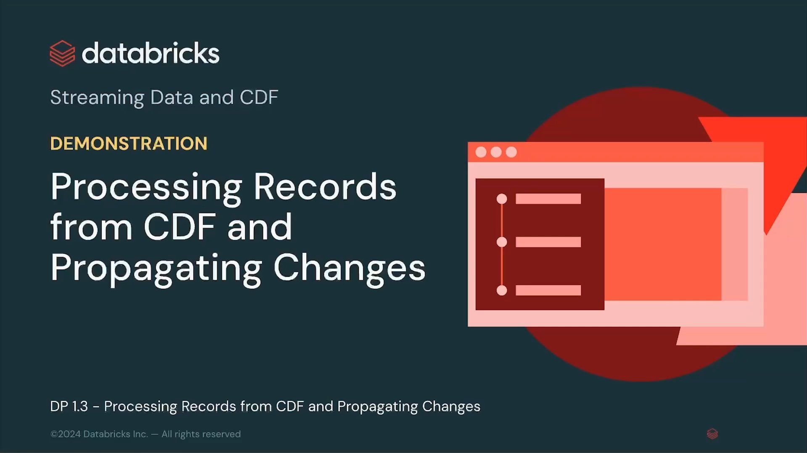

### Flujo de la Arquitectura del Pipeline:

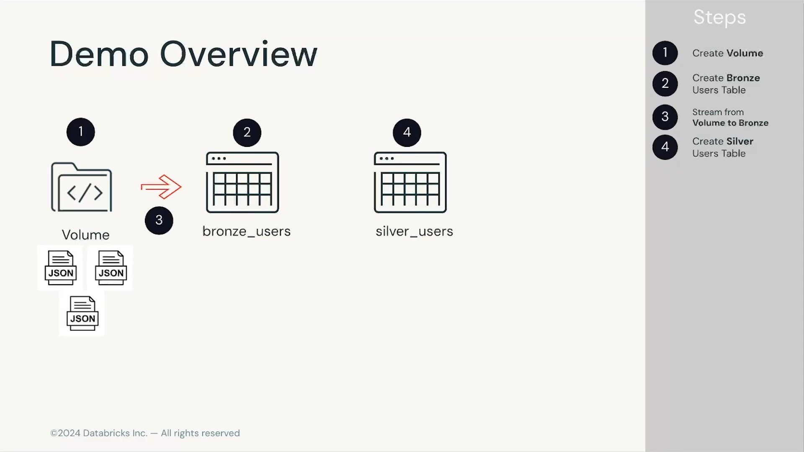

1. **Paso 1 — Ingesta Bronce (Auto Loader):** Ingesta continua de archivos JSON en streaming utilizando Auto Loader (`cloudFiles`) hacia la tabla Delta `bronze_users`.
2. **Paso 2 — Upsert a Plata con CDF Habilitado:** Se habilita Change Data Feed (`enableChangeDataFeed = true`) en la tabla `silver_users`. Se utiliza `foreachBatch` con `MERGE INTO` para insertar nuevos registros y actualizar los existentes basados en el identificador médico `mrn` (*Medical Record Number*).
3. **Paso 3 — Registro y Ejecución de Borrados:** Se procesan solicitudes de borrado desde `delete_requests`. Antes de aplicar el borrado en `silver_users`, se configura metadata personalizada de commit (`SET spark.databricks.delta.commitInfo.userMetadata = Deletes committed`) para auditar e identificar la versión exacta de borrado en el historial de Delta.
4. **Paso 4 — Propagación Downstream a Oro:** Se lee el flujo de cambios CDF de `silver_users` a partir de la versión del commit de borrado (`startingVersion`). Mediante `foreachBatch` y `trigger(availableNow=True)`, se propagan los borrados a la tabla agregada `gold_users`.
5. **Auditoría de Time Travel y Cumplimiento:** Se comprueba que, aunque la versión actual de `gold_users` no contiene los registros borrados, las versiones históricas anteriores (`VERSION AS OF 0`) aún exponen los datos PII, demostrando la necesidad imperativa de ejecutar `VACUUM` con retención reducida para cumplir legalmente con el borrado físico definitivo.

---

## 2. Configuración del Entorno y Preparación de Volúmenes

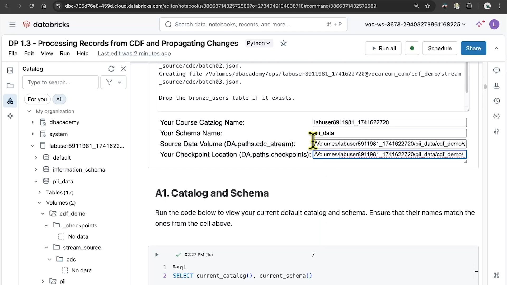

El laboratorio comienza ejecutando el script de inicialización del aula para crear el catálogo y esquema aislados del usuario (`pii_data`), y ubicar los archivos fuente en el volumen gestionado de Unity Catalog:

```python
# Cell A1: Configuración del aula y variables de ruta DA (Databricks Academy)
%run ./Includes/Classroom-Setup-01.3
```

Rutas aprovisionadas por la infraestructura:
- **Volumen de Entrada CDC:** `/Volumes/{DA.catalog_name}/pii_data/cdf_demo/stream_source/cdc`
- **Puntos de Control (Checkpoints):** `{DA.paths.checkpoints}`
- **Esquema de Base de Datos:** `{DA.catalog_name}.pii_data`

---

## 3. Sección B: Ingesta Streaming a Bronce con Auto Loader

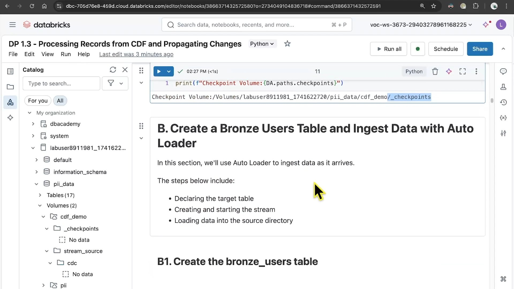

Se configura un flujo de `readStream` con Auto Loader (`format("cloudFiles")`) para procesar el lote inicial de usuarios en formato JSON:

```python
# Definición del flujo de Auto Loader hacia bronze_users
bronze_stream = (spark.readStream
    .format("cloudFiles")
    .option("cloudFiles.format", "json")
    .option("cloudFiles.schemaLocation", f"{DA.paths.checkpoints}/bronze_schema")
    .load(f"{DA.paths.stream_source}/cdc")
    .writeStream
    .format("delta")
    .outputMode("append")
    .option("checkpointLocation", f"{DA.paths.checkpoints}/bronze")
    .table("bronze_users"))
```

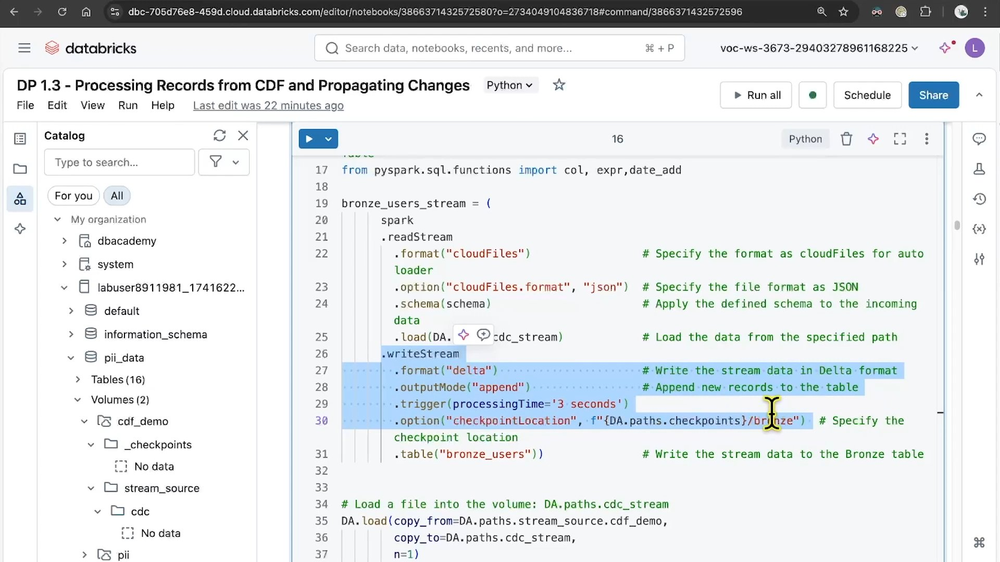

El lote inicial procesa **3,407 registros**, los cuales quedan persistidos en la tabla `bronze_users`.

---

## 4. Sección C: Habilitación de Change Data Feed (CDF)

Para que Delta Lake capture los cambios fila a fila con sus imágenes anteriores (*preimage*), posteriores (*postimage*), inserciones y borrados, se debe habilitar CDF en la tabla de nivel Plata.

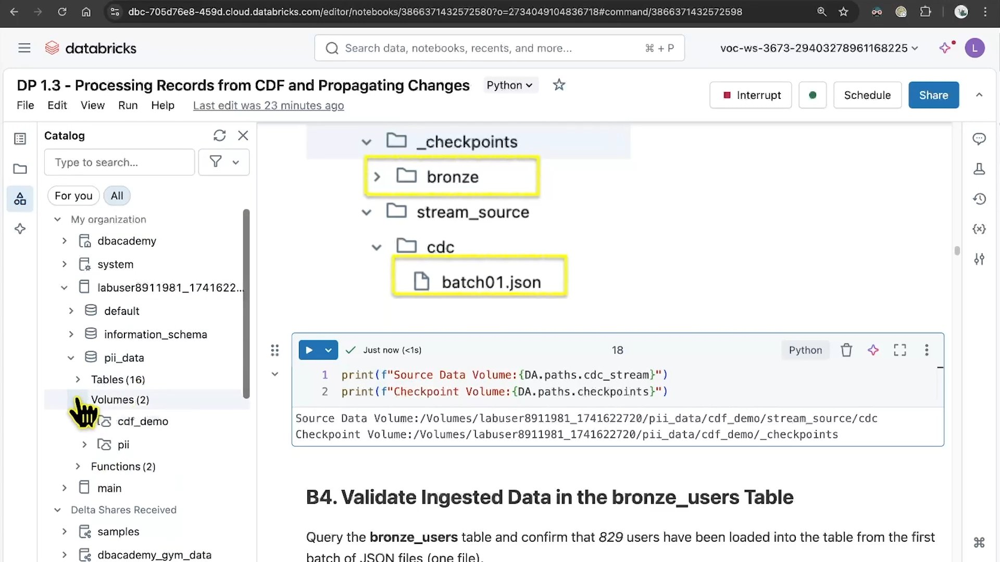

Se demuestra la habilitación a nivel global/sesión de Spark y a nivel de propiedades de tabla:

```python
# C1: Habilitar CDF globalmente por defecto para todas las nuevas tablas Delta creadas en la sesión
spark.conf.set("spark.databricks.delta.properties.defaults.enableChangeDataFeed", True)
```

O de forma específica mediante SQL DDL:

```sql
-- Alternativa DDL explícita por tabla
ALTER TABLE silver_users SET TBLPROPERTIES (delta.enableChangeDataFeed = true);
```

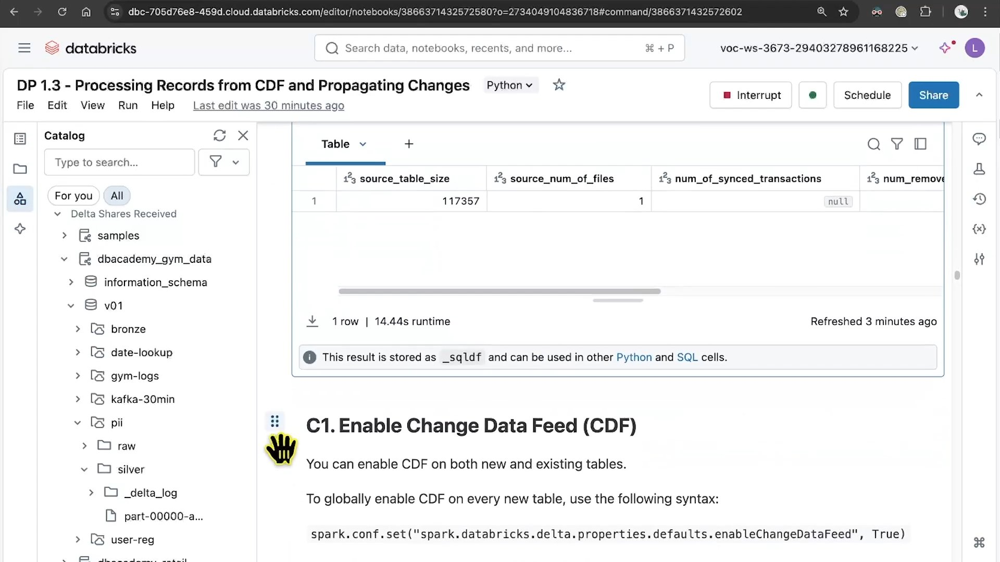

Se valida que la propiedad `delta.enableChangeDataFeed` esté activa verificando la metadata del catálogo y los detalles de la tabla.

---

## 5. Sección D: Upsert Streaming a Plata mediante `foreachBatch` y `MERGE INTO`

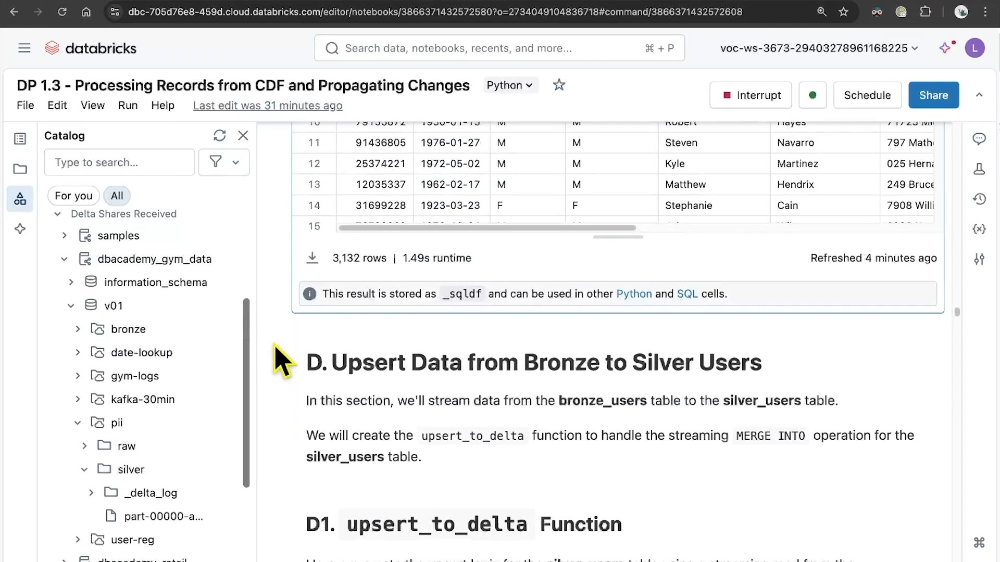

Dado que `silver_users` es una tabla de dimensiones que debe mantener el estado más reciente de cada usuario sin duplicados, no se puede realizar un simple `append`. Se implementa una función de micro-lote para ejecutar `MERGE INTO`:

```python
# Definición de la función de micro-lote para upsert
def upsert_to_delta(microBatchDF, batchId):
    microBatchDF.createOrReplaceTempView("updates")
    sql_query = """
        MERGE INTO silver_users s
        USING updates u
        ON s.mrn = u.mrn
        WHEN MATCHED AND u.action = 'delete' THEN DELETE
        WHEN MATCHED THEN UPDATE SET *
        WHEN NOT MATCHED THEN INSERT *
    """
    microBatchDF.sparkSession.sql(sql_query)
```

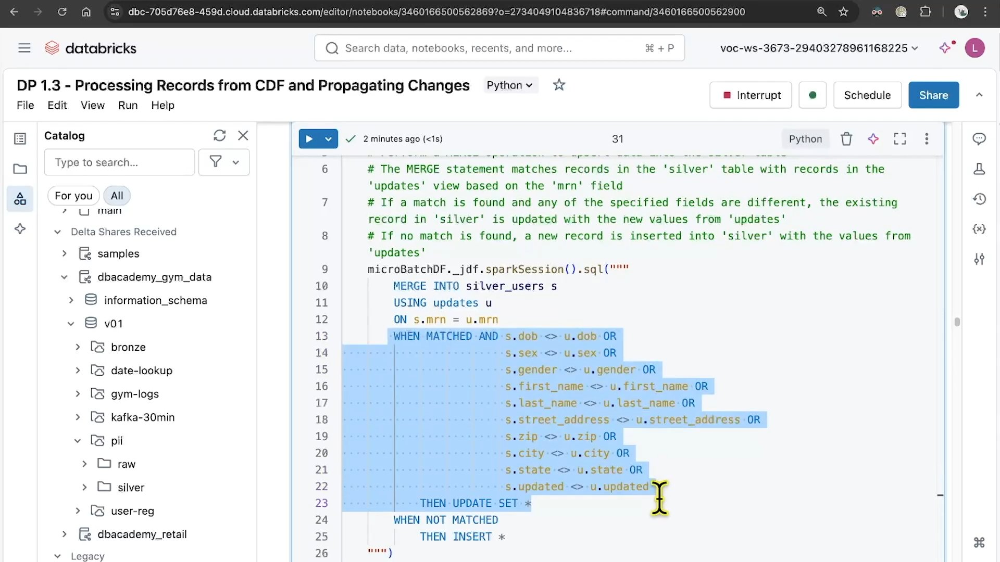

Se inicia la consulta de streaming sobre la tabla bronce para alimentar `silver_users`:

```python
# Iniciar el stream con foreachBatch hacia silver_users
silver_stream = (spark.readStream
    .table("bronze_users")
    .writeStream
    .foreachBatch(upsert_to_delta)
    .outputMode("update")
    .option("checkpointLocation", f"{DA.paths.checkpoints}/silver")
    .trigger(availableNow=True)
    .start())

silver_stream.awaitTermination()
```

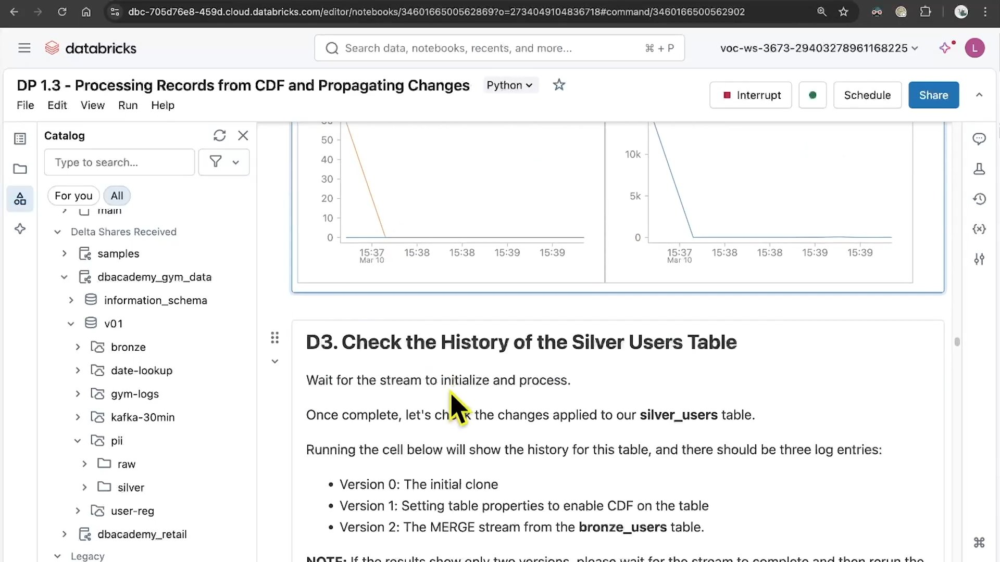
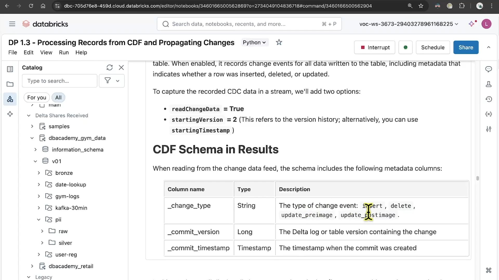

Al consultar `DESCRIBE HISTORY silver_users`, se observa:
- **Versión 0:** `CREATE TABLE`
- **Versión 1:** `STREAMING UPDATE` (ingesta inicial de los 3,407 registros)

---

## 6. Sección E: Ingesta de Lote 2 y Consulta de CDF (`table_changes`)

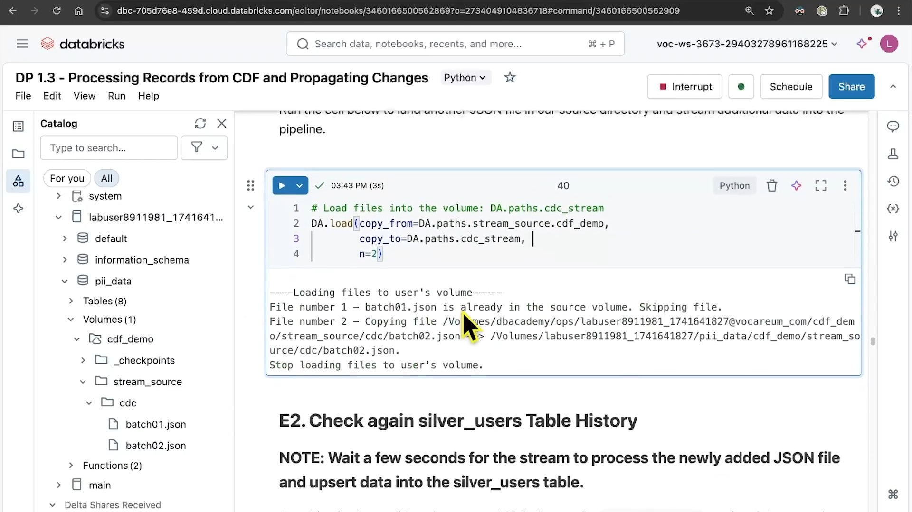
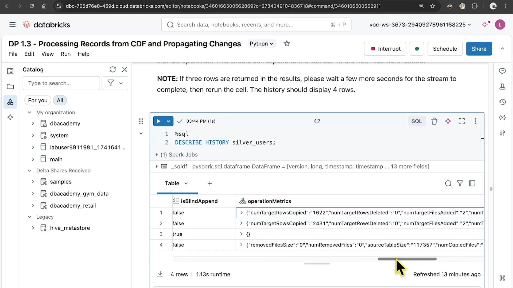

Se introduce un segundo lote de datos JSON con modificaciones (cambios de dirección, estado civil o teléfono) en 147 registros. El pipeline de bronce y plata procesa este lote, generando la **Versión 2** en `silver_users`.

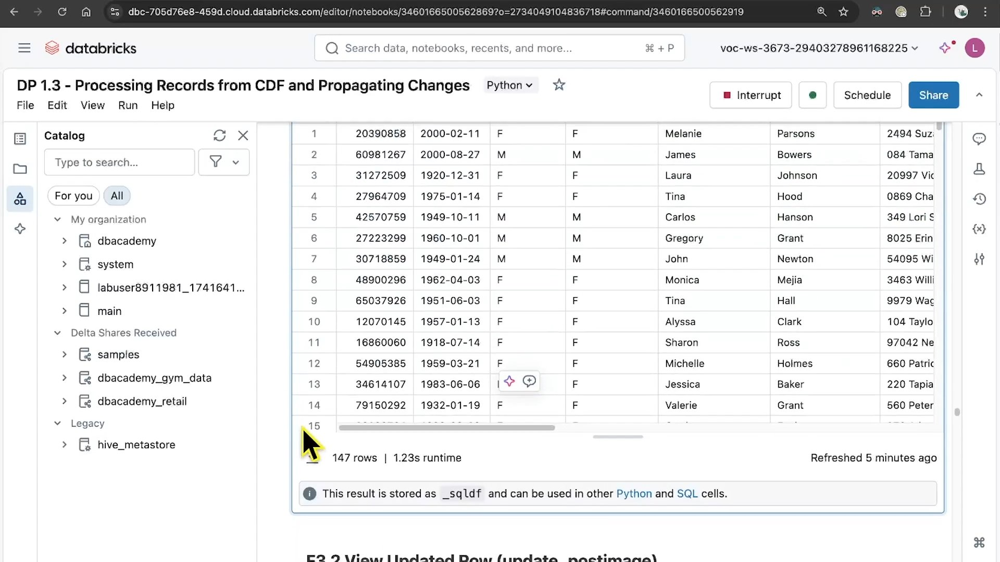

Se consulta el feed de cambios utilizando la función SQL nativa `table_changes`:

```sql
-- Consultar los cambios generados entre la versión 1 y la versión 2
SELECT 
    mrn,
    name,
    address,
    _change_type,
    _commit_version,
    _commit_timestamp
FROM table_changes('silver_users', 2)
WHERE _change_type IN ('update_preimage', 'update_postimage')
ORDER BY mrn, _commit_version;
```

### Columnas Especiales de CDF:
- `_change_type`:
  - `insert`: Fila nueva insertada.
  - `delete`: Fila eliminada.
  - `update_preimage`: Estado de la fila **antes** de la actualización.
  - `update_postimage`: Estado de la fila **después** de la actualización.
- `_commit_version`: Número de versión de la transacción en el Transaction Log.
- `_commit_timestamp`: Marca de tiempo UTC exacta del commit.

---

## 7. Sección G: Gestión y Propagación de Solicitudes de Borrado (GDPR)

En este escenario, clientes o pacientes ejercen su derecho al olvido / supresión de datos personales. Las solicitudes llegan a una tabla de control `delete_requests`.

### 7.1 Etiquetado de Metadata Personalizada en el Commit

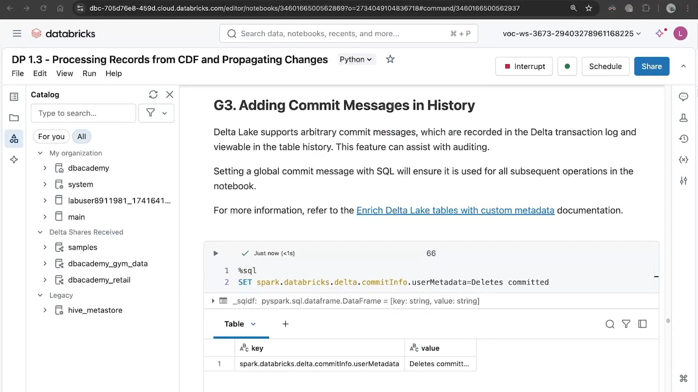
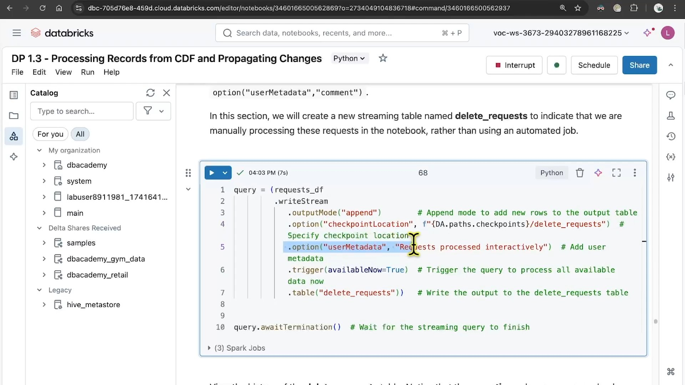

Antes de ejecutar los borrados en `silver_users`, se inyecta metadata descriptiva en la sesión para que quede registrada permanentemente en el Transaction Log:

```sql
-- Inyectar etiqueta de auditoría en la metadata del commit de Delta
SET spark.databricks.delta.commitInfo.userMetadata = Deletes committed;

-- Aplicar los borrados en la tabla Plata
DELETE FROM silver_users
WHERE mrn IN (SELECT mrn FROM delete_requests);
```

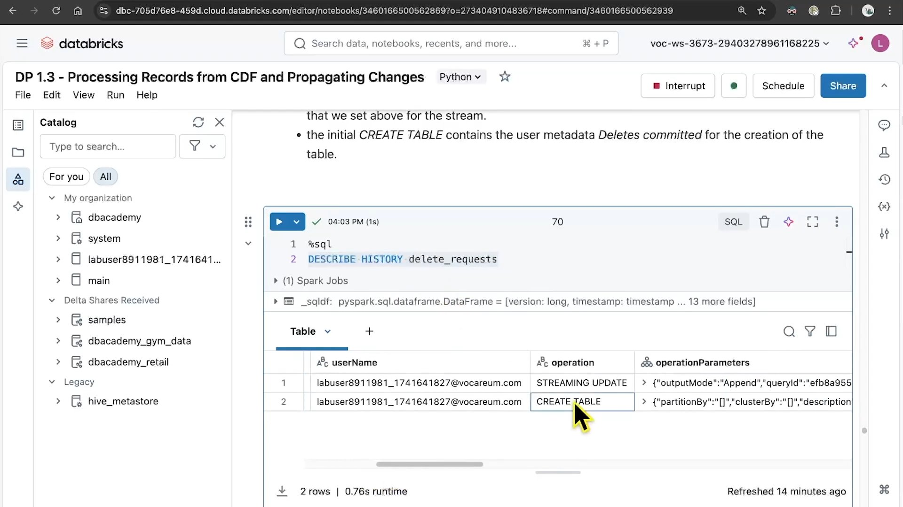

Al inspeccionar `DESCRIBE HISTORY silver_users`, la **Versión 4** refleja:
- `operation`: `DELETE`
- `userMetadata`: `Deletes committed`

### 7.2 Lectura Streaming de CDF a partir de la Versión de Borrado

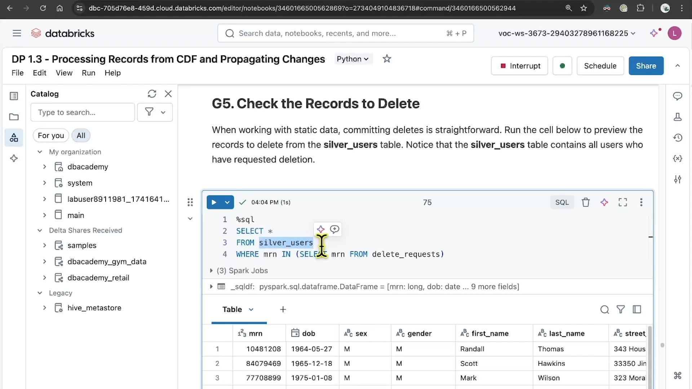
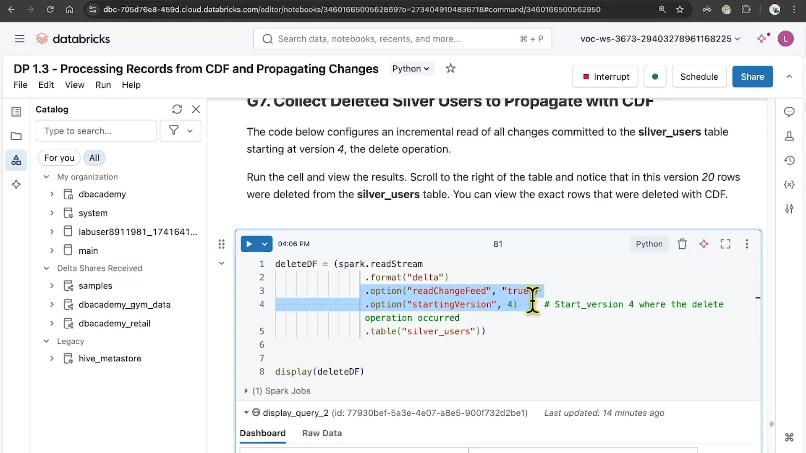

Para propagar exclusivamente las eliminaciones hacia la capa Oro sin reprocesar todo el histórico, se configura un `readStream` sobre CDF con `startingVersion`:

```python
# Lectura en streaming del feed de cambios desde la versión donde se aplicaron los borrados
deleteDF = (spark.readStream
    .format("delta")
    .option("readChangeFeed", "true")
    .option("startingVersion", 4)
    .table("silver_users"))
```

### 7.3 Propagación a Oro mediante `foreachBatch` y `trigger(availableNow=True)`

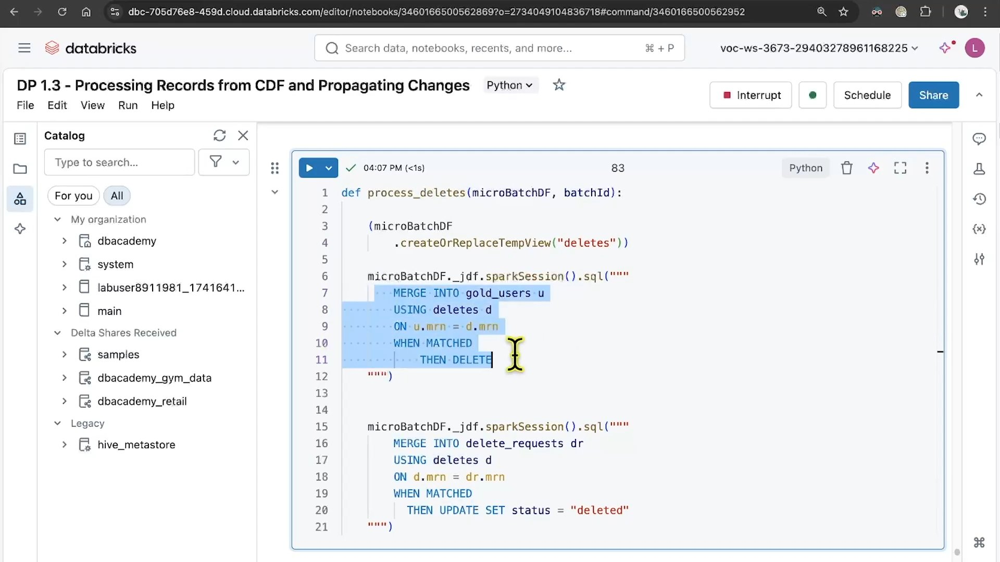
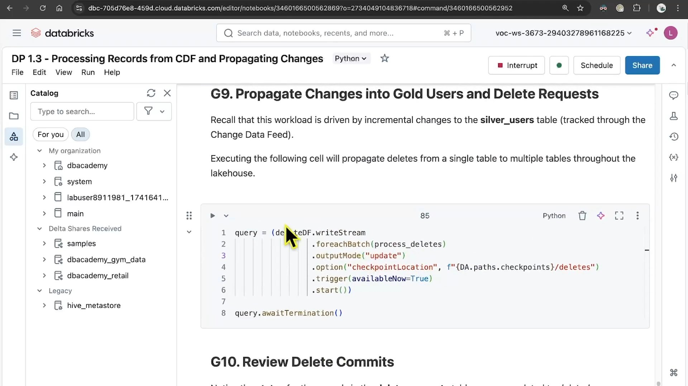
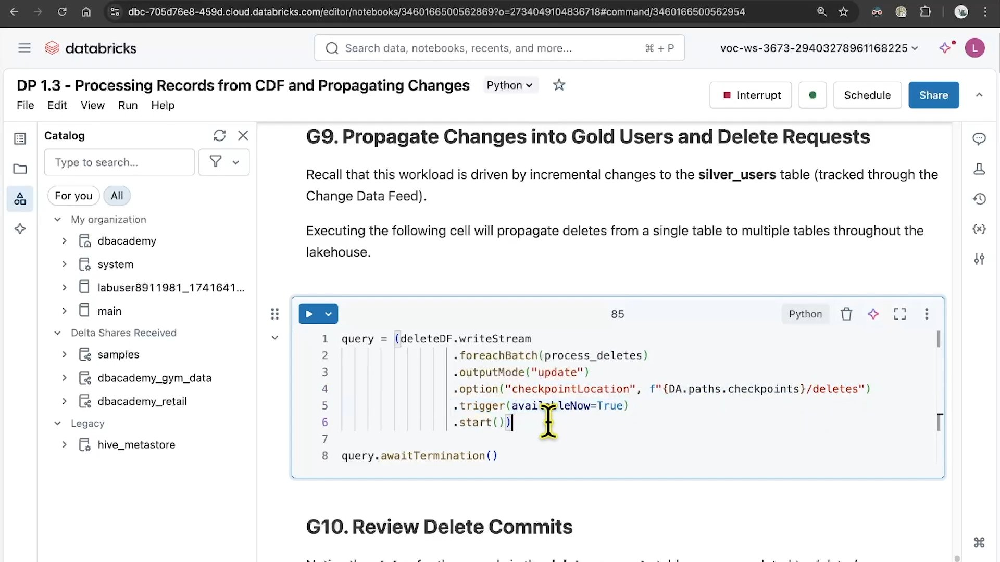

Se define la función `process_deletes` para filtrar los registros con `_change_type = 'delete'` y sincronizar la tabla `gold_users`:

```python
# Micro-lote de propagación de borrados a la capa Oro
def process_deletes(microBatchDF, batchId):
    # Filtrar únicamente los eventos de borrado
    deletes_only = microBatchDF.filter("_change_type = 'delete'")
    deletes_only.createOrReplaceTempView("deletes")
    
    sql_query = """
        MERGE INTO gold_users g
        USING deletes d
        ON g.mrn = d.mrn
        WHEN MATCHED THEN DELETE
    """
    microBatchDF.sparkSession.sql(sql_query)

# Ejecutar el stream incremental en modo batch con trigger availableNow
(deleteDF.writeStream
    .foreachBatch(process_deletes)
    .outputMode("update")
    .option("checkpointLocation", f"{DA.paths.checkpoints}/deletes")
    .trigger(availableNow=True)
    .start()
    .awaitTermination())
```

---

## 8. Verificación de Cumplimiento: Time Travel y `VACUUM`

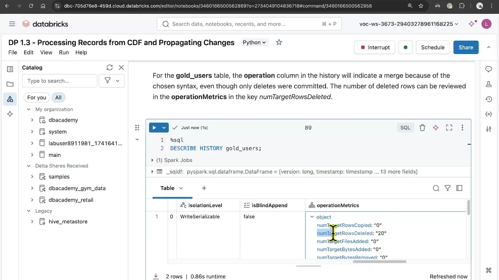

Tras ejecutar la propagación, la tabla actual `gold_users` refleja exactamente los registros activos, confirmando que los pacientes solicitantes han sido eliminados del estado presente.

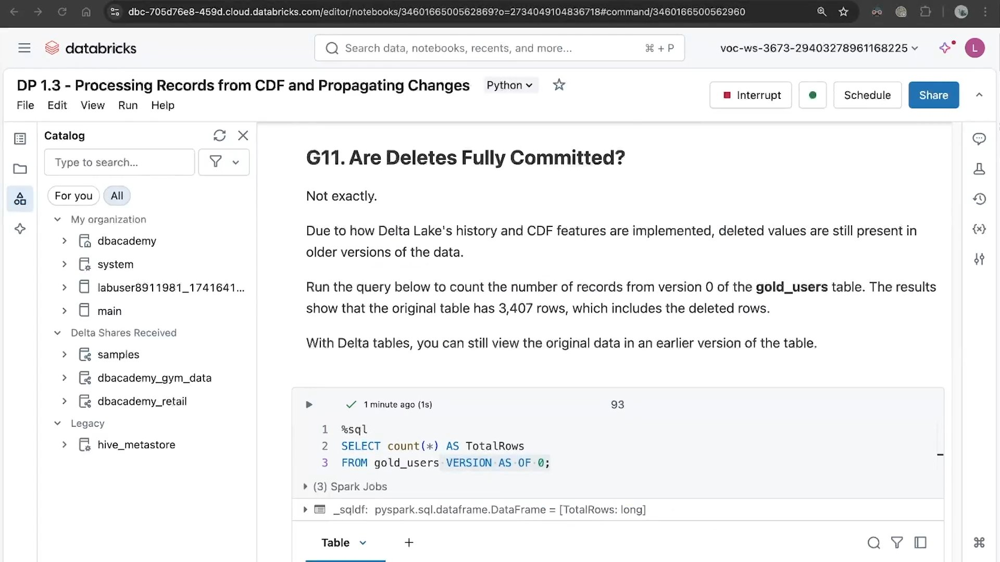
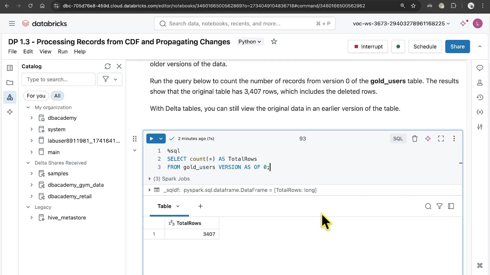

Sin embargo, al ejecutar una consulta de Time Travel sobre la versión inicial:

```sql
-- Consulta histórica sobre la versión original
SELECT count(*) 
FROM gold_users VERSION AS OF 0;
```

**Resultado:** Se obtienen nuevamente los **3,407 registros originales**, lo que demuestra que **los datos PII borrados siguen existiendo físicamente en los archivos Parquet del storage subyacente referenciados por versiones antiguas del Transaction Log**.

### Conclusión Técnica y Regulatoria:
1. `DELETE` o `MERGE` en Delta Lake es una operación lógica basada en aislamiento ACID; marca los archivos antiguos como eliminados en el log, pero no destruye físicamente el archivo Parquet.
2. Para cumplir con el "Derecho al Olvido":
   - Se debe ajustar la retención de la tabla (`ALTER TABLE gold_users SET TBLPROPERTIES (delta.deletedFileRetentionDuration = 'interval 0 hours');`).
   - Se debe ejecutar `VACUUM gold_users RETAIN 0 HOURS;` (con `spark.databricks.delta.vacuum.parallelDelete.enabled` y deshabilitando la comprobación de seguridad si se requiere purga inmediata).
   - Solo tras el `VACUUM`, los archivos que contienen el PII son eliminados físicamente del almacenamiento de objetos (S3 / ADLS / GCS).

---

## 9. Sección H: Finalización y Parada de Streams Activos

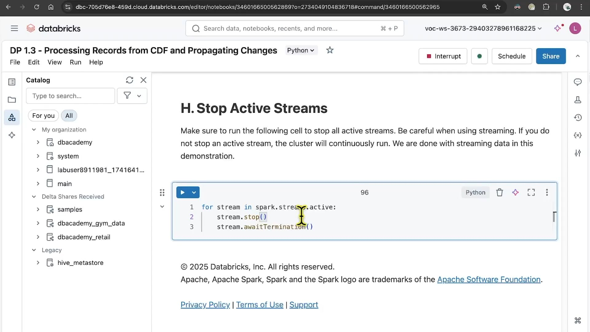

Como buena práctica en entornos de producción y pruebas de Databricks, se iteran y detienen todos los streams activos para liberar recursos de compute y cerrar los checkpoints:

```python
# Detener de manera ordenada todos los streams de Structured Streaming activos en la sesión
for stream in spark.streams.active:
    print(f"Stopping stream: {stream.name or stream.id}")
    stream.stop()
    stream.awaitTermination()
```

---

## 10. Resumen de Comandos y Sintaxis Clave

| Operación | Sintaxis / Código | Propósito |
|---|---|---|
| **Habilitar CDF (Global)** | `spark.conf.set("spark.databricks.delta.properties.defaults.enableChangeDataFeed", True)` | Activa CDF para todas las tablas nuevas |
| **Habilitar CDF (Tabla)** | `ALTER TABLE tbl SET TBLPROPERTIES (delta.enableChangeDataFeed = true)` | Activa CDF en una tabla existente |
| **Consultar CDF (SQL)** | `SELECT * FROM table_changes('tbl', startVersion, [endVersion])` | Inspecciona pre/post imágenes y tipo de cambio |
| **Leer CDF (Stream)** | `spark.readStream.format("delta").option("readChangeFeed", "true").option("startingVersion", v).table("tbl")` | Ingesta continua de cambios desde versión `v` |
| **Metadata de Auditoría** | `SET spark.databricks.delta.commitInfo.userMetadata = 'Mensaje'` | Agrega descripción en Transaction Log |
| **Propagar Borrados** | `MERGE INTO target USING deletes ON target.id = deletes.id WHEN MATCHED THEN DELETE` | Elimina registros correlacionados downstream |
| **Time Travel** | `SELECT * FROM tbl VERSION AS OF v` | Accede a estados anteriores de los datos |
| **Purga Física PII** | `VACUUM tbl RETAIN 0 HOURS` | Elimina archivos huérfanos del almacenamiento físico |
