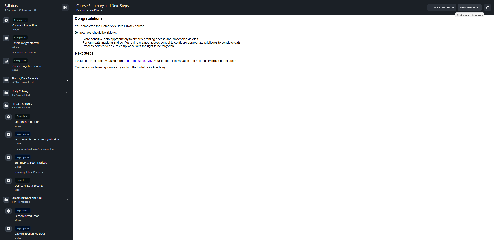

# Lección 20: Course Summary and Next Steps

**Curso:** Databricks Data Privacy (ID: 3767)  
**Sección:** Section 4: Streaming Data and Change Data Feed (CDF)  
**Lección:** Course Summary and Next Steps (Lesson ID: 34618)  
**Tipo de Contenido:** HTML Interactivo / Resumen Oficial del Curso  
**Estado:** Completado 100%  

---

## 1. Evidencia Visual de la Lección

---

## 2. Contenido Verbatim Oficial

### Congratulations!

> You completed the **Databricks Data Privacy** course.

### Competencias Clave Adquiridas

By now, you should be able to:
1. **Store sensitive data appropriately to simplify granting access and processing deletes.**  
   *(Almacenar datos sensibles apropiadamente para simplificar la concesión de acceso y el procesamiento de eliminaciones).*
2. **Perform data masking and configure fine grained access control to configure appropriate privileges to sensitive data.**  
   *(Realizar enmascaramiento de datos y configurar control de acceso granular —Row Filters y Column Masks— para otorgar privilegios apropiados sobre datos sensibles).*
3. **Process deletes to ensure compliance with the right to be forgotten.**  
   *(Procesar eliminaciones efectivas mediante Change Data Feed, MERGE y VACUUM para garantizar el cumplimiento normativo con el derecho al olvido —GDPR / CCPA—).*

---

## 3. Próximos Pasos Oficiales (Next Steps)

- **Encuesta de Calidad:** Evaluar el curso respondiendo la [encuesta breve de 1 minuto de Databricks](https://databricks.sjc1.qualtrics.com/jfe/form/SV_6zMiXNxAfa7IQjY?course_id=3767&course_title=Databricks%20Data%20Privacy).
- **Ruta de Aprendizaje:** Continuar el Data Engineer Learning Plan hacia la certificación **Databricks Certified Professional Data Engineer**.
